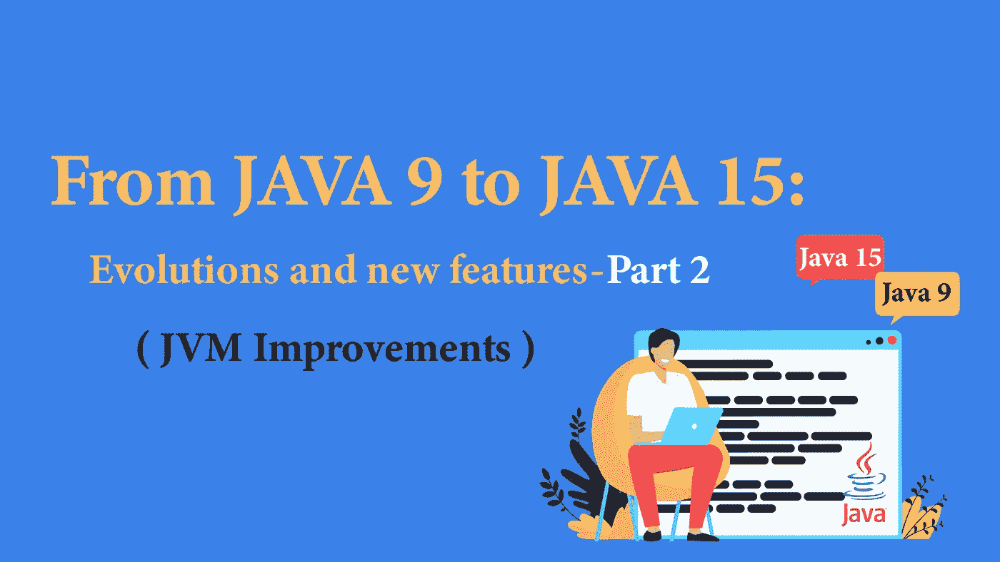
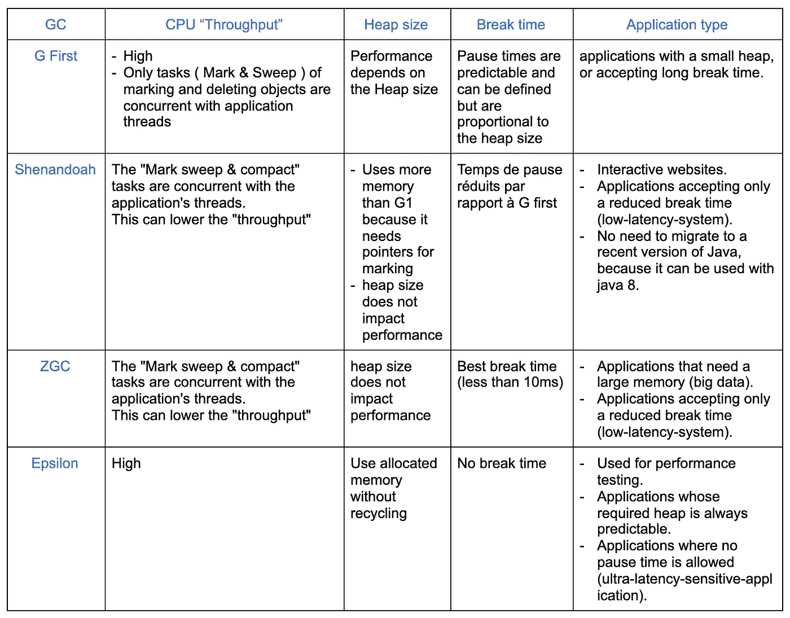

# 从 JAVA 9 到 JAVA 15:发展和新特性—第 2 部分

> 原文：<https://blog.devgenius.io/from-java-9-to-java-15-evolutions-and-new-features-part-2-7405530ab748?source=collection_archive---------12----------------------->

## 每个 Java 开发者都应该知道的 Java 版本进化链。

上一部分:[第一部分](/from-java-9-to-java-15-evolutions-and-new-features-part-1-c249947b7513)

在本文的[第一部分](/from-java-9-to-java-15-evolutions-and-new-features-part-1-c249947b7513)中，我们解释了该语言的技术发展和新特性。在第二部分中，我们将讨论对 JVM 的各种改进。

# 第 2 部分:JVM 改进

当我们遇到性能问题(一个应用程序需要很长时间才能启动，Java OutOfMemoryError 等错误)时，我们通常会想到代码(提高其质量、优化算法、选择正确的集合等)。)但我们往往忘记了“垃圾收集者”的选择。

在这一部分中，我们将关注 Java 最新版本带来的性能改进，特别是新的“垃圾收集器”和 Java 中的类存档。

## 1.垃圾收集工

在应用程序的生命周期中，它会创建许多对象，这些对象的生命周期根据它在程序中的角色而不同。

该寿命由“参考计数器”定义。引用计数器为零的对象是未使用的对象。

“垃圾收集器”可以识别并删除这些未使用的对象(或垃圾)。从历史上看，它将内存分为两个区域:存储最近对象的“年轻代”和存储长期对象的“年老代”。然后，根据诸如引用计数、“标记和清除”算法、“停止和复制”算法等算法来完成这些区域的释放(垃圾收集的收集或 GC)。

在文章的这一部分，我们将讨论自 **Java 9** 以来实现的新 GC(垃圾收集器)。

*   **ε空操作垃圾收集器**

由 **Java 11** 推出，Epsilon 是一个无操作(被动)GC。它只管理内存分配，但不允许清理未使用的对象。当应用程序分配的堆耗尽时，JVM 就会停止。

Epsilon 用于没有浪费的短期应用程序，或者当已知分配的内存(堆大小)对于当前应用程序来说足够大时。

它对于执行性能测试(测试新的 GC 算法、内存压力测试等)也很有用。).

*   **G1 垃圾第一**

Java 9 默认使用的“垃圾优先”垃圾收集器主要用于应用程序线程(如 CMS ),但它允许提供更短、更可预测的暂停时间。

事实上，它不是将堆分成两个大的区域，而是分成大小相等的小块。绘制了每批中使用的数据。当触发收集时，G1GC 将“首先”清除包含最多“废物”的批次，因此得名“第一”。

但是 G1 并不是在所有情况下都是最优的。事实上，如果它不能快速恢复未使用的内存，它会停止应用程序线程来执行完整的 GC。

有了 Java 10，在完全 GC 期间不再使用单线程，而是可以并行启动几个线程(并行完全 GC)

然后，您可以使用选项“-XX: ParallelGCThreads”自定义线程的数量

Java 12 对这个 GC 还有两个重要的改进:

G1 从定义收集所需的时间开始(“收集组”)。一旦开始，G1 应该不停地收集所有用过的物品。但是如果“集合”太大，可能需要很长时间。为了解决这个问题，在 Java 12 中，G1 将集合分为两个部分:强制部分和可选部分，只有在 GC 没有超过预期暂停时间的情况下才会执行。Java 12 还提供了第二个改进。G1 会自动将未使用的内存返回给操作系统(不仅仅是像旧版本的 Java 一样运行完全 GC 时)。在 Java 14 中，G1 通过使用“+UseNUMA”选项变得“支持 NUMA”(NUMA:没有统一的内存访问)

该特性主要针对具有多个插槽或大量内核的机器。

*   **ZGC(并发垃圾收集器)**

ZGC 是一个可扩展的低延迟 GC。事实上，它的暂停时间不超过 10 毫秒，与 G1 相比，它的应用程序减少率不到 15%。

当与 Java 11 一起启动时，ZGC 没有将内存归还给操作系统，即使它已经很长时间没有被使用了。 **Java 13** 提供了这一新功能。这对于内存占用是个问题的应用程序，或者在有多个活动应用程序的系统中非常有用。

ZGC 依靠颜色指针来存储关于标记和重新定位记忆的信息。它允许保存任何类型的信息，从而根据这些数据采取行动(这只有在 64 位处理器上才有可能)。

还需要注意的是，从 **Java 14** 开始，有“macOS”和“Windows”两种版本。

从 **Java 15** 开始，ZGC 现在是稳定的、高性能的、低延迟的和生产就绪的。

它可以与“Shenandoah”竞争，后者也是为大型堆应用程序设计的。

*   **Shenandoah(并发垃圾收集器)**

**Java 12** 推出“Shenandoah”(可以用 Java 8 配置)。

“雪兰多”减少了收集器的暂停时间。

事实上，它的任务(标记、释放内存、压缩)是在当前程序使用的应用程序线程的并发线程中执行的。

这在需要快速和可预测响应时间的应用中特别有用。还应该注意，堆的大小不影响暂停时间。

这个 GC 现在以标准模式提供给了 **Java 15** 。

*   **CMS 并发标记和清除**

在被 **Java 9** 弃用后，CMS 终于被 **Java 14** 移除。这个决定旨在减少 GC 代码库的维护工作量，并加速新算法的开发。

## 现有新 GC 的比较

要为 Java 应用程序选择最佳的 GC，应该考虑三个重要方面:

*   “堆”的大小:运行应用程序所需的内存大小
*   应用程序暂停时间:GC 执行其任务所需的时间(主要是整个 GC)。
*   “吞吐量”或应用程序吞吐量:Java 应用程序运行的速度(考虑执行 GC 任务所花费的时间和执行代码所花费的时间)。

## 2.存档系统

在 Java 中，为了执行给定类的“字节码”，JVM 执行一些准备步骤。事实上，根据类名，JVM 在磁盘上寻找它，加载它，检查它的“字节码”,然后把它放在内部数据结构中。

当启动应用程序(加载一百个类，甚至更多)或者第一次运行一个新特性时，这可能需要很长时间。

只要应用程序的 jar 没有改变，这些操作就没有用。事实上，每次启动应用程序时，JVM 都会执行相同的步骤，最终得到相同的结果。

Java 8 引入的 CDS 存档“类数据共享”的概念解决了这个问题。

*   **默认 CDS 档案**

CDS 的想法是创建一次 jar，将它们保存在一个档案中，并在将来应用程序启动时重用它们。

这个档案可以由并发运行的 JVM 实例共享。这节省了内存，否则会浪费在为每个 JVM 实例复制数据上。

要从默认 CDS 中获益，请遵循以下三个步骤:

*   创建一个课程列表，将它们放入档案:`—XX:DumpLoadedClassList`
*   创建一个档案:`—Xshare:dump`和`—XX:SharedArchiveFile`
*   与选项`-Xshare:on`和`—XX:SharedArchiveFile`一起使用

JDK 10 附带了一个需要存档的课程列表。因此，第一步可以从 **Java 10** 中跳过。JDK 类(默认 CD)的归档从 **Java 12** 自动应用。

*   **AppCDS:应用类数据共享**

“AppCDS”涉及应用程序类别的存档，而不仅仅是 JDK 的存档。

在 **Java 13** 之前，为应用程序类创建和使用档案必须遵循与 JDK 类相同的逻辑。

但是，在这个版本中，可以将前两个步骤结合起来，并在应用程序执行后对类进行动态归档(“动态 CDS”)。

通过添加`-XX:ArchiveClassesAtExit`选项，JVM 将保存应用程序的所有加载类，并将它们放在专用的归档文件中。

因此，归档类将包括默认 CDS 归档中不存在的应用程序类和库类。

“AppCDS”比默认的 CDS 归档提供了额外的引导时间和内存优势。

“Lambdas”表达式元数据从 **Java 15 添加到“AppCDS”档案中。**

## 3.紧凑字符串

在 **Java 9** 之前，字符串存储在一个 char 数组中，其中每个字符占用两个字节(1 个 char = 2 个字节)。

有了 **Java 9** ，字符串的实现有了变化。事实上，它们现在存储在一个字节数组中，每个字符只需要一个字节。

但这只有在它们与 ISO-8859–1 兼容的情况下才有可能，而事实往往如此。

否则，字符仍将存储在字节数组中，但每个字符需要两个字节。一个标志被添加到 String 类中以了解它的编码。

丁字裤的紧凑性使得存放丁字裤所需的尺寸减少了近 50%。字符串是内存使用的主要来源(25%的对象是字符串)。因此，这使得减少所使用的“堆”的大小成为可能(增加 5%到 15%)，从而提高 JVM 的性能。

Java 9 的实现变化并没有修改现有的公共接口或者创建新的 API。

## 4.Java 飞行记录器和 Java 任务控制

Java 飞行记录器(JFR)从正在运行的 Java 应用程序中收集诊断和分析数据。JFR 对正在运行的 Java 应用程序的影响很小。

Java 任务控制(JMC)用于分析 JFR 收集的数据。它以图形的形式显示它们，因此允许对它们进行详细的研究。

JFR 和 JMC 在 **Java 8** 中是商业特性，在 **Java 11** 中是开源的。使用这些工具，可以诊断运行时问题，如 GC 过载、内存泄漏等。

# 移除的模块和类

在 Java 的最新版本中，一些模块或 API 被弃用，甚至被删除。

事实上，贬值鼓励应用程序远离这些 API，从而避免增加对它们的依赖。Java 11 提供的“Jdeprscan”工具允许开发人员对他们的 jar 文件(或其他类文件聚合)进行静态分析，以识别不推荐使用的 API，从而为未来做好准备。可能迁移到新版本 Java 的进展。

Java 11 还引入了一个新工具“Jdep ”,它允许分析应用程序的依赖性，包括对内部 API 的依赖性。它还提供了使用什么作为替代品的建议。

以下是最新版本的 Java 删除的一些模块:

1.  **Java 11**

包含 Java EE 和 Corba 的模块在 **Java 9** 中被弃用，在 **Java 11** 中被移除:

*   java.xml.ws (JAX-WS，基于 xml 的 Web 服务的 Java API)
*   java.xml.bind (JAXB，xml 绑定的 java 架构)
*   java.activation (JAF，JavaBeans 激活框架)
*   java.xml.ws .批注
*   java.corba
*   java .事务(JTA)
*   java.se.ee(前面六个模块的聚合器模块)
*   JDK . XML . WS(JAX-WS 工具)
*   JDK . XML . bind(JAXB 工具)

2. **Java 14**

*   “并行清除”和“串行旧垃圾收集”这两种算法的组合已被否决(很少使用，但需要大量的维护工作)。
*   CMS 被移除并由 G1 取代。
*   开发人员用来打包和解包 jar 文件的“pack200”、“unpack200”和“Pack200 API”(在 java.util.jar 包中)。

3. **Java 15**

*   RMI(远程方法调用)激活机制已被弃用，并将在未来的版本中删除。
*   “Nashorn”脚本引擎和 JavaScript APIs，以及 JJS 工具都被删除。
*   删除了对“Solaris/SPARC”、“Solaris/x64”和“Linux/SPARC”端口的源代码和构建支持。这些端口在 JDK 14 中被标记为过时。

# 结论:从 Java 9 到 Java 15:

本文探讨了 Java 在过去几年中提供的新特性，以及新工具和性能改进，特别是垃圾收集器和类归档。

为了从这些技术创新和性能及安全性优化中获益，迁移到最新版本的 Java 似乎是必要的。要做到这一点，必须研究几个方面。

首先，正如本文最后一部分所解释的，JDK 中已经删除了几个模块(事实上，在 Java 的最新版本中，反对的态度要严肃得多)。在进行任何更改之前，必须研究对这些不推荐使用的模块或第三方库的依赖性。

此外，Java 版本中默认使用的“垃圾收集器”并不总是相同的。在进行任何迁移之前，您必须记住对应用程序进行性能研究。此外，Java 为开发人员提供了多种工具来促进和减轻这种变化，例如“Jdeprscan”和“Jdep ”,它们允许分析应用程序的依赖性，

“JLink”允许您打包和部署您真正需要的 JDK 的必要元素，“JEnv”便于管理几个 JDK 版本的安装，等等。

但是如何选择你的 Java 版本呢？为了能够跟上这种发布节奏并跟上最新的新闻，公司必须在免费、稳定和安全之间找到一个折中的办法。LTS 版本是免费的，也更稳定，但每三年提供一次，安全更新也是付费的。非 LTS 版本(每六个月发布一次)提供了更多的技术更新，以及性能和安全性的改进。然而，它们是新的，不太稳定，并且它们的功能，尤其是“预览”中的功能，可以被修改甚至删除。

然后，有必要根据“自由-稳定-安全”明确定义您的优先事项，并采取必要的保护措施(例如，不要在预览模式下使用功能)，并成立一个委员会负责监控和沟通这些版本，以开始更新您的 SDK。事实上，如果你不想重做你的应用程序库，这将是必须的。由你决定😜。

> *如果您喜欢，请点击👏所以其他人会在媒体上看到这个。*