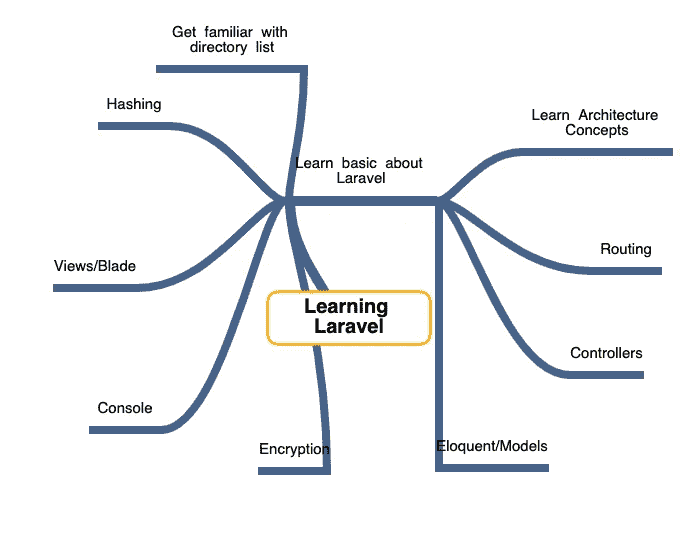

# 从初级到中级甚至更高级的开发人员。

> 原文：<https://blog.devgenius.io/from-junior-to-medior-developer-and-beyond-1b28ed790043?source=collection_archive---------47----------------------->

## 不要让任何事情阻碍你。

威廉·艾文在 [Unsplash](https://unsplash.com?utm_source=medium&utm_medium=referral) 上的照片

# 引导你自己

因为我们都知道每个人学习的方式完全不同，所以写一个一刀切的指导是没有用的。当你试图弄清楚你想去哪里以及如何到达那里的时候，这个指南会有一些选项供你考虑。

> 获得技能的主要障碍不是智力上的……而是情感上的。约什·考夫曼

## 了解流程

虽然没有明确的指南可以让你做得更好，但记住耐心是你旅途中的关键，这是一件好事。

## 开辟你的道路

在你专注于如何实现你的目标之前，写下你的个性特征、优点和缺点可能是一个不错的计划。

承认你的优势和劣势可以帮助你找到一条清晰的学习道路。这可能有点不实用，但如果你还没有尝试过，这可能会是一个惊喜。

## 画草图

你现在应该有一个你的性格特征、优点和缺点的列表，当你为你想要实现的目标制作思维导图时，你可以使用它。这张思维导图集中在你想学习或实现的事情上，甚至是你遇到的问题上。

思维导图的美妙之处在于它的结构不是线性的，而是像一棵分枝树。

## 规划出来

你应该把你想学或想实现的东西放在中间。当你这样做的时候，你要思考与主题相关的步骤。

当你完成时，你很可能有一个相当大的思维导图，但它不会立即帮助你。但是有了思维导图，你就可以找出你想把注意力集中在最小的步骤上的地方。

## 创建计划

有了思维导图，你就可以专注于弄清楚你想要如何实现这个目标。

我建议制定一个包含以下信息的计划:

*   明确的结果。
*   如何监控进度？
*   —甚至可能其他人如何跟进进度。
*   你将如何捕捉你所学到的东西。
*   如果你想这样，谁会让你负责？

# 培养持久的习惯

为了确保你制定的计划是有效的，这是一个好主意，确保你养成完成你开始的事情的习惯。就其本身而言，这似乎是显而易见的，但开发人员要努力完成众多辅助项目中的一个。

## 永远学习

我能给的最好的建议之一是，永远学习。这并不意味着你应该总是学习全新的东西，而是要不断提高你对现有技能的了解。

例如，你可以密切关注你所使用的框架或插件的发布。这将在新版本发布时对您有所帮助，因为您知道发布了什么。

## 总是在建造

因为你总是试图提高你的知识，所以把它和建筑材料结合起来是个好主意。这不一定是一个新的副业，而是一个你想要实现的目标。

# 感谢阅读

我希望这篇文章能帮助你建立起实现自己目标的方法。记住一条路和另一条路是一样的。耐心是实现自己目标的关键。

感谢您的阅读，祝您愉快。