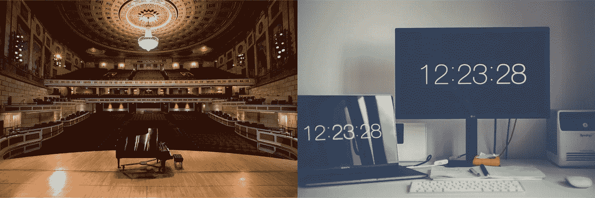
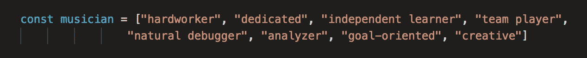

# 从表演者到程序员——为什么你应该雇佣音乐家

> 原文：<https://blog.devgenius.io/from-performer-to-programmer-why-you-should-hire-a-musician-275e46d26568?source=collection_archive---------20----------------------->

伊士曼柯达大厅|来自 Unsplash 的库存照片

古典音乐和软件工程——它们有什么共同点？

我是一个音乐人，我是一个全栈开发者。我最近从熨斗学校毕业，当我开始申请工程职位的过程中反思自己的道路时，我深入思考了这个问题。从表面上看，这似乎是两个非常不同的领域，但是**伟大的音乐家和伟大的程序员之间有很多重叠**。

如果你是一名音乐家，你可能听说过“任何人都可以学习演奏乐器”这句话如果你是一名程序员，你可能听说过“任何人都可以学习编码。”虽然这些观点在技术上是正确的，但它们非常具有误导性。每个人都有 ***潜力*** 来学习一种新的乐器或编写代码，但要在其中任何一项上取得成功都需要 ***时间和* *毅力*** ，而碰巧的是，在这两项上取得成功所需的个性特征和非技术技能是相同的。

那么你为什么要雇佣一个音乐家呢？他们带来了什么技能？

1.  职业道德
    音乐界都说，要达到精通需要 10000 小时的练习。一天一小时，需要 27 年以上！虽然 10，000 听起来可能是一个任意的数字，但底线是音乐家花费数千小时来完善他们的工艺。有了这种奉献精神，想象一下他们学习新的编码技能有多快。
2.  音乐家有数千小时的独自练习，是独立学习的专家。软件工程师知道，只有当你致力于成为一个终身学习者，你才能成功并保持相关性。老师和会议当然会指导音乐家和程序员的学习，但在这两个领域，在课堂之外继续学习的纪律是至关重要的，音乐家拥有这一点。
3.  自我评估的能力
    为了有效利用时间，音乐家必须学会自我评估。为了看到进步，设定目标并在过程中衡量进展是很重要的。事实上，一个音乐家练习的方式与*敏捷方法论*非常相似:计划、练习、测试、反馈、重复。随着音乐家的进步，他们学会了关注细微的细节，这是伟大音乐家和真正艺术家的区别。他们密切关注细节(思考语法)，通过尝试创造特定的声音(手指的微小移动，更少的空气，更强的清晰度)，他们是天生的调试者。
4.  虽然音乐家花很多时间独处，但演奏乐器最有意义的部分是一起创作音乐。管弦乐队经常被比作一个有机体——每个人都必须以一种团结的方式工作，以实现一个产品。在小型合奏中，这一点甚至更为重要:由于缺少指挥，音乐家们不仅要学会口头交流，还要学会用动作和表情来交流。他们必须不断地倾听，以理解他们在一篇文章中的角色，这直接转化为能够与其他程序员交流和合作。
5.  创造力
    最后但同样重要的是，音乐家天生就是有创造力的人。虽然编码通常不被认为是一种艺术形式，但它需要创造性的解决问题的技能来为困难的问题提供新的解决方案。音乐家可以跳出框框思考，并理解如何以无数种方式应用同样的技能。

总的来说，如果你正在寻找一个在特定技能上有深度的员工，要额外考虑有音乐背景的申请人；他们在**数年训练如何学习**将会得到十倍的回报。