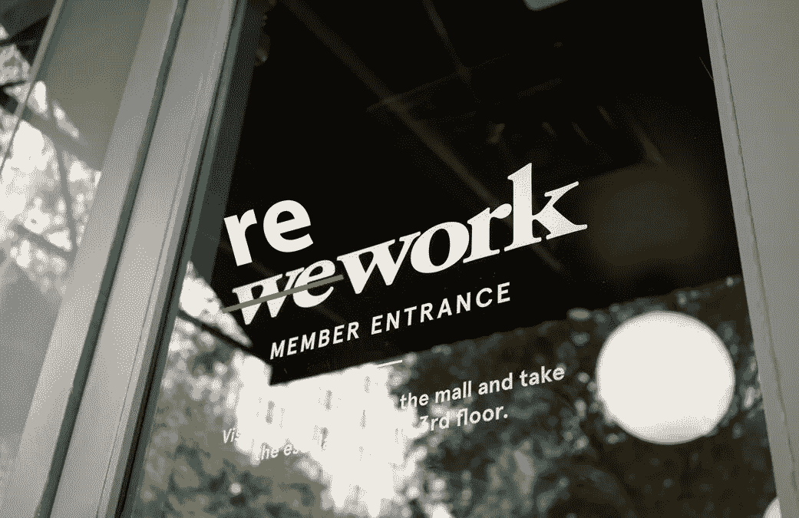

# 从工作到返工——分布式团队

> 原文：<https://blog.devgenius.io/from-wework-to-rework-distributed-teams-958534866625?source=collection_archive---------20----------------------->

*   “拒绝支持远程工作人员的公司可能会失去他们最优秀的员工，并失去未来最优秀的人才。”——夏羽·卡斯瑞尔。
*   “使用远程工作人员的一个秘密好处是，工作本身成为评判某人表现的标准。”——杰森·弗里德。
*   “当人们消除了通勤和其他经常出现在中央办公室的干扰时，生产率提高了 13%。”—斯坦福。
*   超过 80%的远程员工对自己的工作感到满意。
*   76%的千禧一代愿意减薪以获得更大的工作灵活性。
*   每月至少远程工作一次的人快乐和高效的可能性要高出 24%。
*   77%的人表示灵活的工作选择有助于他们更健康。
*   更少的面对面会议和更周到、全面和创造性的解决方案。

在新冠肺炎之前，大多数企业认为专注于规模、杠杆和集中化的战略是市场优势和持续利润增长的必要条件。疫情(以及与之相关的对抗病毒的措施)改变了旧的模式。

密切合作的人更容易受到流行病和细菌传播的影响，因为他们会生病，失去工作，商业收入和现金流下降。分销渠道失灵，迫使企业主解雇更多员工、推迟债务偿还或进入破产程序。政府收入。即税收下降，并危及公共服务，包括保健和教育。一旦开始，恶性循环就很难停止。

# 吸取的教训及其对今后工作的影响

当经济状况恢复正常时，旧策略回归的可能性很低。疫情的影响呼应了大萧条的破坏，并永远塑造了经历过它的几代人的生活。像我们的祖父母和父母一样，生活在今天的人被迫考虑他们的健康和经济在意外事件面前的脆弱性。

这种认识确保了社会和商业的方式将被不可逆转地改变:

*   普通民众将要求改善社会福利，扩大和改善医疗保健，保证收入，以及提高影响他们的政府和商业决策的透明度。[企业](https://www.wbpro.com/the-business-implications-of-covid-19-coronavirus-business-vs-virus/)——无论大小——都可能经历更多的监管和更高的税收。
*   看到自己的储蓄和退休账户减少，已经对雇主失去信心的工人，将迫切要求对工作场所有更多的控制权。许多人会转向自由职业来控制他们的时间和地点。其他人将组织起来，迫使雇主适应一个有社会距离和自我隔离规定的工作场所。
*   企业和政府将被迫放弃超额成本和固定资产。这家拥有 5000 名员工的单一用途制造工厂将通过加大自动化投资或外包来缩小规模。
*   管理工作将通过包含远程工作地点而经历分散化。在更低的成本和更高的灵活性之间找到平衡将会困扰公司董事会、政府官员和个别商业领袖多年。

# 分布式团队是一种新的规范

一些组织，由于其领导人的远见或来自劳动力的压力，目前在分散、协作的基础上工作。它们将远程员工和自由职业者与一套强大的通信工具、安全的网络和一套不断发展的人力资源政策和程序相结合。Distribute Consulting 的首席执行官 Laurel Farrer 表示，其他人正在认识到远程数字工作场所的不可避免性。“它从‘这是真的吗？’到‘它在这里。我们如何让这种情况持续下去？"

甚至在新冠肺炎病毒爆发之前，远程工作就已经很普遍了。根据 [Upwork 的一项研究](https://www.upwork.com/press/2018/02/28/future-workforce-report-2018/)，超过一半的公司正在雇佣远程员工，包括科技公司(谷歌和亚马逊)、医疗保险公司(联合健康集团和 Humana)和零售公司(Williams-Sonoma)。Upwork 的首席执行官夏羽·卡斯瑞尔声称，“拒绝支持远程工作人员的公司面临着失去最优秀人才和拒绝未来最优秀人才的风险。”

# 远程工作的好处

如果实施得当，雇佣远程员工不仅对我们所在的社区有利，对雇主和员工也有好处。更少的通勤里程有益于环境，减少烟雾，并节省道路和桥梁维护方面的社区开支。 [Aetna](https://www.virtualvocations.com/blog/telecommuting-survival/8-environmental-benefits-of-remote-work/) 报告称，他们的远程工作安排减少了 1.27 亿英里的驾驶里程和 530 万加仑的汽油，从而减少了近 47，000 吨的二氧化碳排放量。其他直接和间接的好处包括:

# 对雇主而言

分散的员工队伍可以帮助您雇佣和留住顶尖人才(不受地点限制)，提高多样性，消除员工评估中的偏见，并节省资金。已确定的益处包括

*   **扩大人才库**:雇主可以在世界上任何有足够互联网服务的地方招聘员工，无需办理政府签证和外来工人条例。
*   **员工流动率降低**:一份[斯坦福大学的报告](https://www.gsb.stanford.edu/insights/why-working-home-future-looking-technology)发现，允许远程工作的公司员工流动率降低了 25%。替换一名员工的估计成本[对于初级员工来说平均是年薪的 50%,中级员工是 125%,高级管理人员是 200%以上。](https://www.forbes.com/sites/billconerly/2018/08/12/companies-need-to-know-the-dollar-cost-of-employee-turnover/#74f72babd590)
*   **劳动力多元化**。《企业家》杂志认为远程工作的一个自然结果是性别、年龄和种族的多样化。
*   **开明管理**。《远程:不需要办公室》一书的作者杰森·弗里德声称:“使用远程办公人员的一个秘密好处是，工作本身成为了评判某人表现的标准。”。 管理者学会在缺乏命令和控制结构的情况下更巧妙地激励员工，关注结果而不是外表。
*   更高的生产率。斯坦福大学的研究发现，当人们消除了通勤和其他在中央办公室经常发生的干扰时，生产力提高了 13%。
*   员工士气更高。根据 Amerisleep 的一项研究，超过 80%的远程工作者对他们的工作感到满意，这个满意率高于普通美国人。
*   **更小的环境足迹**。在中心区域工作的员工越少，意味着办公空间越小，租金和税收也越低。人力资源管理协会(SHRM)估计一名现场工作人员每年的房地产成本为 10，000 美元。公用事业费用和其他支持服务费用也下降了。

# 对于员工/工人

比以往任何时候都多的人(96%)希望弹性工作安排，尽管该国略多于一半的工人有这种选择。远程工作特别受喜欢 WeWork 的千禧一代的欢迎，研究表明，这一代人中有 76%的人会为了更大的灵活性而减薪。分布式工作的好处包括

*   **消除/减少通勤时间**。美国工人平均每天花大约一个小时上下班。超过 330 万名员工单程至少要花费一个小时。这些时间完全是在车里度过的，没有考虑在办公室里因粗鲁的司机、交通堵塞和红灯带来的沮丧而花费的无效时间。
*   **降低住房成本**。许多美国城市的高房价迫使工人们在通勤距离最短的小住宅和通勤距离较长的更大、更舒适的住宅之间做出选择。分散的劳动力使员工可以住在他们想住的地方，而没有长途通勤的麻烦和成本。
*   **增加家庭时间**。每个人都有配偶、孩子、父母或朋友，他们喜欢与他们共度时光。每天一两个小时的额外灵活性可能是坐下来与我们的孩子共进晚餐和花时间通勤的区别。在紧急情况下或舞蹈表演时能够出现也是一个好处。
*   **改善身心健康**。每月至少远程工作一次的人快乐和高效的可能性要高出 24%。专业人士每天花在工作上的时间、精力和注意力最多。通过提供灵活的工作选择，公司向他们的员工发出信号，他们可以而且应该在健康和福利上投入更多的时间，这有助于减少疫情的心理影响。这可能就是为什么在美国心理健康中心进行的一项调查中，77%的人认为弹性工作制会让他们更健康。

给深思熟虑的人留出思考的时间。对于棘手问题的创意或解决方案，往往倾向于那些能够在挤满人的会议室里，按照人为的时间表，在头脑风暴会议期间迅速提供的人。这些类型的设置放大了那些说话最大声的人的声音，但许多有创造力和分析能力的人需要时间来处理信息，并提出他们最有创意的想法或解决问题的方法，有时这发生在走路、洗澡或独处的时候。

# 远程工作的障碍

尽管远程工作人员有其优势，但并不是所有公司的灵丹妙药。未能预见到不可避免的问题并做好准备可能会导致额外的成本、员工不满以及最终撤销决策。然而，在组织中不采用分布式工作文化的风险可能同样危险。当考虑过渡到使用远程工作人员时，考虑以下补救措施:

*   **训练不足**。跨时区协调—当两个团队同时在线时，安排会议或非正式对话可能会特别令人沮丧。[未来工作场所的创始合伙人珍妮·梅斯特](https://www.shrm.org/ResourcesAndTools/hr-topics/employee-relations/Pages/drawbacks-to-working-at-home-.aspx)声称，许多公司未能为他们的员工提供适合新的分布式环境的工具或培训。她指出，许多远程员工不知道如何召开电话会议或视频电话，而这对于协作来说是必不可少的。
*   **抵制在线会议:**许多聪明和有远见的组织正在用在 [Slack](https://slack.com/intl/en-in/enterprise) 或 Google Chat 上的帖子来代替会议，要求员工贡献他们的想法和解决方案。一些组织也在尝试用增强现实技术来开会。尽管这听起来可能是一个缓慢的过程，但在许多情况下，当人们能够思考问题并在自己的时间内提供解决方案时，会提供更快的解决方案。《哈佛商业评论》对各行各业的 182 名高级经理进行了一项调查:65%的人说会议让他们无法完成自己的工作。71%的人认为会议没有成效且效率低下。64%的人说会议是以牺牲深度思考为代价的。62%的人说会议错过了让团队更加团结的机会。
*   **主管阻力**。主管发现很难根据数据而不是直接联系进行管理。许多人认为直接监督对于保持生产力是必要的，并对远程工作环境中失去控制感到不满。 [Keystone Partners](https://www.keystonepartners.com/) 的管理合伙人[伊莱恩·瓦雷拉斯](https://www.forbes.com/sites/nigeldavies/2020/03/10/this-is-why-employers-are-still-denying-your-remote-working-requests/#7762de96bcd6)说:“许多经理发现很难管理远程员工，习惯于通过 facetime 和快速会议中的大量报告进行管理。他们通过知道你早到晚走来评估你的贡献。由于缺乏技能，他们选择不提供或不允许远程工作，甚至弹性工作时间。”
*   **通讯不畅。**一个有效的通信系统包括一个连接到多个平台(台式机)的安全的基于云的网络。平板电脑、手机)和集中式备份服务器。项目管理软件([周一](https://monday.com/lp/c/collab/team/?utm_medium=capterra&utm_campaign=capterracollaboration&utm_source=capterra)或 Asana)使远程工作人员能够使用集成办公软件(如微软 Office Online 或谷歌文档)轻松协作。随着工作在公司独特的业务流程中移动，定制软件应用程序可以扩展到包括员工之间的通信工具。
*   **安全风险增加。**在与非现场位置连接时，对数据加密、无线连接的安全性、可移动介质的使用以及设备和数据的潜在丢失或被盗的担忧是很自然的。根据 [2018 年的一项调查](https://www.ipass.com/wp-content/uploads/2018/03/iPass-Mobile-Security-Report-2018.pdf)，57%的首席信息官怀疑他们的移动工作人员受到了黑客攻击或安全问题的原因。在依赖远程工作人员之前，投资购买合格的 IT 安全专家的服务，以最大限度地降低不受欢迎的入侵者的风险。

**员工隔离。**员工的分布式网络中，隔离可能是个问题。孤立的员工会觉得他们没有得到他们需要的材料或信息，或者他们的成就没有得到认可。当大家不在同一个办公室时，建立融洽的关系可能会很困难，但结果是值得努力的。敬业、忠诚的员工队伍的关键是:( a)训练有素的主管，他们能够有效、定期地与团队互动;( b)鼓励沟通和互动的文化，以及在工作流程中指导员工的正确软件，验证他们的输入，减少员工的挫折感和错误，并确保他们在最少监督的情况下有效地履行职责。

# 最后的想法

每个组织和远程工作人员都需要时间、合适的软件和培训来适应和学习如何在分布式团队环境中共享和协作、有效沟通，以及跨越距离培养一致的文化。最有效的管理者不会试图让远程员工符合总部的文化，而是寻求发现并分享所有地点的成功实践。管理层必须拥抱“我们”，而不是“我们对他们”的文化。

毕竟，每个组织的员工都会时不时地远程工作。商务旅行将成员带到办公室之外，为了工作/生活的平衡，每个人偶尔都在家工作。拥抱结构和灵活性的公司最适合未知的未来。

**本文* [*文章*](https://www.linkedin.com/pulse/from-wework-rework-distributed-teams-jorge-campos/) *原载* [*豪尔赫·坎波斯*](https://www.linkedin.com/in/jorgecampos2/) *，高级软件顾问*[*WB pro*](https://www.wbpro.com/)[*。*](http://www.wbpro.com/)