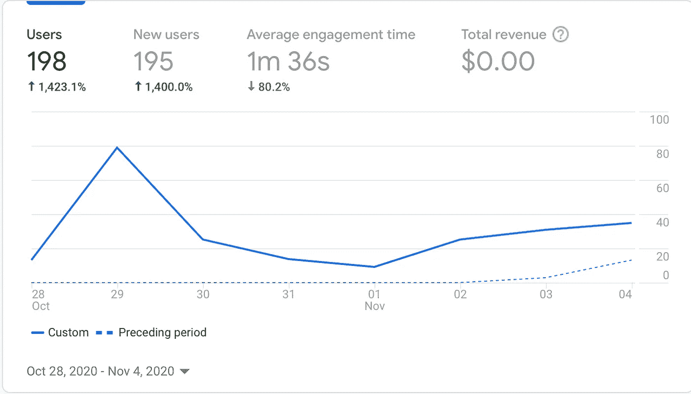
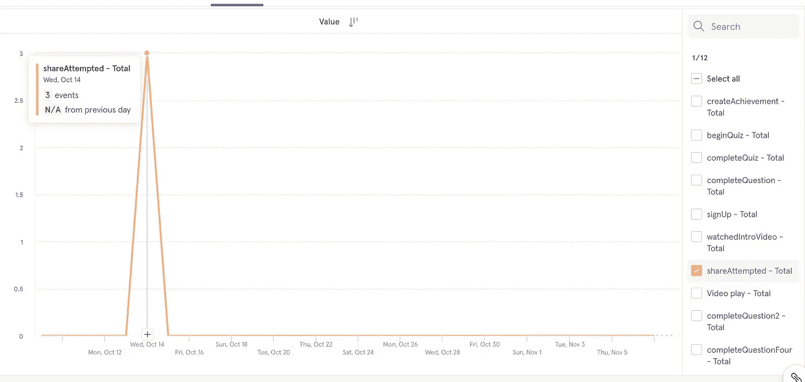
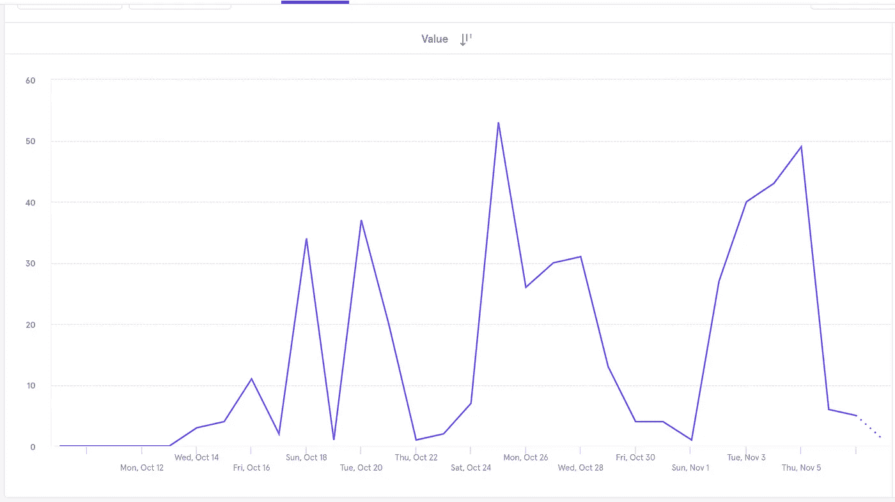
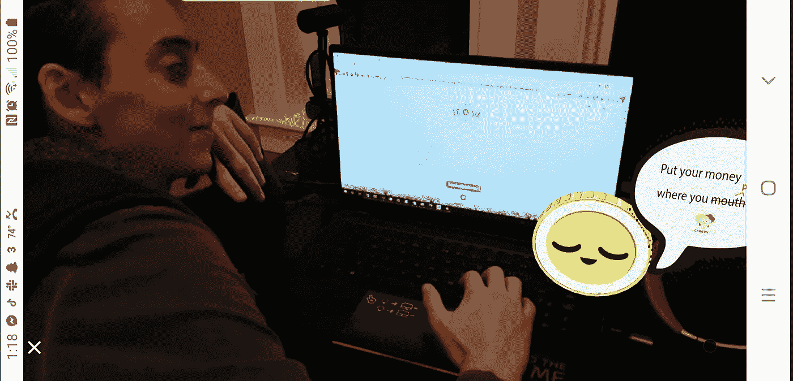

# 从零到一百:创业成长实验

> 原文：<https://blog.devgenius.io/from-zero-to-one-hundred-growth-experiments-for-carbon0-games-cea85b828cca?source=collection_archive---------9----------------------->

图片来自 Carbon0 Games 开幕式视频。图片来源:[https://youtu.be/jsZ-aOp5SwM](https://youtu.be/jsZ-aOp5SwM)

# 什么时候发射

“你能解释一下是怎么回事吗？”
作为一名软件工程师，这是你最害怕听到的一条短信——这条短信是我的经理发给我的，他是 [Carbon0 Game](https://playcarbon0.com) s 的首席技术官。时间是晚上 7 点 56 分，我们的 MVP 将在第二天早上发布。开始调试的时间…

暂且不考虑我在最后一刻赶着及时推出漏洞修复程序，Carbon0 MVP 一直是我迄今为止最好的软件产品之一——我以全栈工程师和产品经理的身份领导开发，并与其他三名开发人员([曹迈](https://www.makeschool.com/portfolio/cao-mai)、[亨利·卡尔德龙](https://www.makeschool.com/portfolio/henry-calderon)和[阿莱亚·奈特](https://www.makeschool.com/portfolio/aleia.knight))合作。我们花了 10 周的时间来构建，超过 30 万行代码(包括整合谷歌分析和 Mixpanel 所需的代码)。所以应该是成功的吧？

对吗？

## 虚荣与真实的衡量标准

不对！

我们该谈谈我作为产品开发人员学到的最难的一课了— *数据谎言*。我们推出 Carbon0 还不到两周，但事实证明，要获得我预期的吸引力，它的挑战性至少是我预期的 10 倍。

我对产品的想法、信念和希望都包含看不见的偏见，我写这篇博客的部分原因是解释为什么我们做出如此糟糕的假设，并且最初关注错误的事情— *虚荣度量。*

你可能会问，什么是虚荣心衡量标准？

为什么，我刚刚给你举了两个例子！

> “我们花了 10 周时间，用了 30 多万行代码来构建。”

你注意到上面陈述中的两个数字与产品的成功没有必然的联系吗？这听起来像是一个非常令人印象深刻的数字。

简而言之，一个**虚荣心指标**就是这样——然而，在创业公司的世界里，要将这些欺骗性的数字与我们真正想要关注的东西区分开来可能有点困难，后者是**真实的指标**(例如，确实表明你的产品正在获得牵引力的数字)。

**如何找到你的关键指标？**

你将如何筛选你所有的数据？查尔斯·德鲁维奥在 [Unsplash](https://unsplash.com/s/photos/business-meeting?utm_source=unsplash&utm_medium=referral&utm_content=creditCopyText) 上拍摄的照片

在产品开发中有很多数字要跟踪——老实说，我强烈反对在一些笨拙的统计学课程中学习所有这些数字。

帮助我认识到我们的产品团队需要关注的指标的是，在一天结束时认识到，**为了业务增长，一个产品只需要产生两种东西中的一种:**

1.  收入——您从向用户收费中获得的金额
2.  使用情况——用户数量，以及他们在应用上花费的时间

Carbon0 Games 目前是一款对所有人免费的应用。所以幸运的是，我们的团队使用这个框架来决定与使用相关的数字。在这篇博客的其余部分，我将特别关注下面两个之后的**，以及我们如何使用成长经验来增加它们:**

1.  该应用程序在脸书上被共享的次数
2.  Carbon0 用户取得的成就数量

也就是说，是时候进行一些生长实验了！

# 但是什么是成长实验呢？

定义了我的关键指标，并且产品已经上市，我知道我需要一种尽可能客观的方法来跟踪增长。这就是**成长实验**的用武之地。

顾名思义，增长实验就是这样——它是你测试不同途径寻找新用户的一种方式。一开始，我对如何接触客户有多种想法，我不确定如何优先考虑我们团队的营销工作。我发现这种方法帮助我找到了最好的方法，所以我们可以加倍努力！

## 如何设置生长实验

在每个生长实验中，基本上有四个变量需要定义，它们必须事先定义:

1.  **受众—** 你的目标用户是谁？
2.  **渠道—** 你会去哪里/用什么平台去获取这些新用户？
3.  **信息—** 您会向这些用户展示哪些他们感兴趣的内容？
4.  **指标—** 为了衡量实验的成功，您将测量什么？

我们已经定义了我想在我的成长实验中使用的指标。我对这两个指标进行了单独的增长实验，现在让我们来看一下！

# 增加脸书股票—增长实验 1

我想与你们分享的第一个实验，是关于增加我们产品的**病毒率**。

## 实验设置

*   我们决定锁定的目标受众是:对气候公正充满热情的高中生和大学生(18-26 岁)。
*   我们利用的**渠道**: Twitter、脸书、黑客新闻、产品搜索以及一些个人 DM 和 SMS 消息。
*   **消息:**对于我的私人关系，我决定只是随意地伸出手，请他们试用这个应用程序。至于其他的，我们想用类似于*的东西,“困在家里？没有时间去制造影响？我们为您和您的朋友提供了一种更简单的方式来产生影响。”*只是为了帮助表达年轻人想要有所作为的愿望。
*   如前所述,**指标**是该应用在脸书上被分享的**次。**

## 结果呢

实验将持续一周。我们的工程团队已经在网站上建了一个脸书分享按钮，所以用户可以尽可能方便地与他们的朋友分享我们的信息。一个星期以来，我努力在上述渠道推广我们的产品，我相信我们都准备好了。

我甚至有点乐观——我在这段时间检查了谷歌分析，从图表中可以清楚地看到我们正在获取流量:

另一个虚荣心衡量标准的例子:在发布一周内，Carbon0 的访客数量增加了 1400%！

当时，这个图表让我很兴奋。我们的用户从零增加到一百多！最重要的是，Carbon0 增加了 1400%的访客数量！多么快乐！

但正如你可能猜到的，这篇博文是关于我在成长工程中犯的错误。事后看来，上图最终是虚荣度量的另一个例子。相比之下，当我在实验结束后的第二天查看 Mixpanel 中等待我的图表，看看我们实际上赚了多少份额:

实验结束时，人们总共只尝试了 3 次在脸书网站上分享我们的应用程序

实验结束时，人们总共只尝试了 3 次在脸书上分享我们的应用。

## 关键外卖

看到 Mixpanel 的图表，我终于意识到，在病毒式传播之前，对我们来说，专注于产品开发可能更重要——为什么人们不分享的最好解释，很可能是因为他们自己一开始就不喜欢它。

作为一名开发人员，这个实验帮助我了解了生长实验是如何实际告知工程方向的。考虑到这一点，我们来看看我们在 Carbon0 做的另一个生长实验怎么样？

> “如果你的产品需要广告或销售人员来销售，这还不够好:技术主要是关于产品开发，而不是分销。” *—彼得·泰尔，*零比一 *(2014)*

# 增加玩家使用率—成长实验 2

我们的下一个实验旨在发现我们如何增加玩家使用该网站核心功能的数量——能够进行“任务”以减少他们的碳足迹。

## 实验设置

*   我们决定瞄准的**观众**:和以前一样。此外，在这个实验中，我们还决定追踪年轻人的父母，尤其是青少年时期的孩子。其中一位联合创始人想用这款应用来教她自己的孩子关于气候变化的知识，所以我们有预感可能会有更多的父母想做同样的事情。
*   我们使用的**通道**:与实验 1 相同。
*   **的信息:**这个信息和以前一样是给年轻人的。对于家长群体，我们决定使用以下文案:*“希望你能教育你的孩子有关气候变化的知识？我们很乐意向您展示我们的游戏！”*
*   如前所述,**指标**是完成一项碳任务的次数**。**

## 结果呢

这一次，Mixpanel 图更有趣了:

用户完成任务的数量在很大程度上有升有降——没有一致性。

虽然图表显示了明确的活动，但我认为它并没有告诉我们太多，原因有二:

1.  用户完成任务的数量在很大程度上有升有降——没有一致性。
2.  我们承认在数据收集方面犯了一个错误，因为我们忘记从在本地机器上测试应用程序的开发人员那里删除 Mixpanel 跟踪。因此，上图中的一些事件不是来自实际用户，而是 Carbon0 中的人(这显然使它比实际情况更好)。

## 关键外卖

乍一看，第二个实验在数量上也没有给我们带来多少好消息。然而，从我们得到的*定性*反馈来看，这个故事还是有一些希望的。

**做不可扩展的事情** 这一次，我努力让自己发送给人们的信息更加个性化。不再在社交媒体上进行无意识的抨击——例如，我联系了我家乡的父母、我上的高中的图书管理员，以及不同大学的人，我从高中就认识他们，我知道他们主修环境科学。

虽然花了更多的时间，但人们至少更容易接受我，我至少在大部分时间里能够收集到关于网站 UI/UX 的反馈。我们的团队现在将回去工作，迭代产品，并进行调整，以便我们可以在未来获得更好的牵引力。

**加倍关注有效的渠道** 第二个关键点与流量有关——脸书是我们迄今为止最容易接受的渠道，Carbon0 的联合创始人已经意识到了这一点。我们的成长经历帮助他们坚定了加倍努力向 [Carbon0 脸书页面](https://www.facebook.com/MyCarbon0)营销的决心。首席技术官甚至发起了一项社交媒体挑战，人们可以发布自己每天玩游戏的照片，就像这样:

图片来源:[https://www . Facebook . com/mycarbon 0/photos/a . 105309610979807/209707053873395/](https://www.facebook.com/MyCarbon0/photos/a.105309610979807/209707053873395/)

# 结论

给你介绍一下背景，我最初是作为一个眼界开阔、缺乏经验的项目经理加入这个项目的——在我加入的时候，Carbon0 组织*中没有人知道【Mixpanel 是什么，更不用说建立 KPI 并跟踪每周目标以确保牵引力得到改善了。我很快不得不从犹豫不决、谦逊的首相转变过来；并成为领导我们团队努力成为一个更加数据驱动、更加基于证据的工程组织的人。*

考虑到我在 Carbon0 犯下的错误，我曾多次问自己，辞职是否是个正确的想法。我经常问，“真的值得向前推进吗？”

对于这种情况，每个人可能都有自己的看法。我个人从希腊谚语中汲取了智慧，“当老人种植他们知道永远不会坐在树荫下的树木时，一个社会就会变得伟大。”虽然我们离我们想要的还差得很远，但我很感激至少对我们的产品有了真正的了解。是*进步。对我来说，创业牵引已经不再是一门艺术，而是一门科学——这也让我感到欣慰。*

> "当老年人种树时，他们知道他们永远也不会坐在树荫下，一个社会就会变得伟大。"—希腊谚语

最重要的是，我知道我们需要把注意力集中在我们实际能够控制的事情上——产品开发和与用户交流。气候变化不会很快消失，所以二氧化碳也不会！