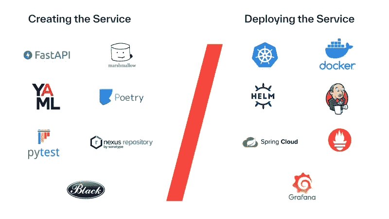

# 不到一天的时间从零到生产

> 原文：<https://blog.devgenius.io/from-zero-to-production-in-less-than-a-day-f4e16f628f15?source=collection_archive---------16----------------------->

在 Media Distillery，我们充分利用微服务范式。我们的每一款产品都由大量微服务提供支持，这些微服务提供的功能包括(语义)搜索、数据存储、仪表盘、EPG 校正、人脸识别、人脸聚类、文本识别、缩略图选择、主题检测、主题分割等等。

我们平台中的微服务可以分为两组:Java 服务和 Python 服务。后者满足了我们大部分的 ML 需求；也是本文的重点。我们将回顾如何创建一个新的 Python 服务，这样的服务看起来像什么，以及我们使用哪些工具和技术来创建和部署它。

# 一个普通的 Python 服务

在最简单的情况下，我们产品背后的管道被分成两个服务:一个 Java 服务和一个 Python 服务。前者负责集群、负载平衡、数据存储等等。后者托管相关的机器学习模型，负责通过模型传递输入(如图像或一段文本)以及输入和输出的预处理和后处理。Java 和 Python 服务通过简单的 HTTP REST API 进行通信。

由于这种设置，我们可以利用 Java 环境的成熟性和稳定性，同时给予 ML 方灵活性和自由度，以跟上快速变化和缓慢成熟的 Python 环境的发展。

# 工具工具工具！(和技术)

为了创建和维护 Python 服务，我们使用了大量开源工具。为了简单起见，我们将我们使用的工具分为两组:一方面，我们有用于创建服务的工具，另一方面，我们有用于将服务放到我们的平台上的工具。

# 创建服务

## FastAPI

对于我们的 HTTP REST 框架，我们使用 FastAPI。这个框架在最近几年越来越受欢迎，当我们在寻找替代品时，FastAPI 似乎是一个很好的替代品。引起我们注意的主要是框架的高性能，但整体特性集和设计理念也在我们的列表中得分很高。

FastAPI 是一个最佳的候选，但是我们还没有充分利用框架的异步方面。

## 棉花糖/花生糖

对于数据序列化和验证，我们多年来主要使用棉花糖，没有任何抱怨。事实证明，它不仅提高了我们服务的整体质量，还提高了我们的原型制作、评估和其他调查的质量。尽管它是一个很棒的图书馆，但我们最近一直在考虑转向 Pydantic。仅仅因为 FastAPI 支持开箱即用的 Pydantic 模型(而不是棉花糖)。

## YAML

出于配置目的，我们使用 YAML 文件。这并不太令人兴奋，但是它与另一个在部署阶段发挥作用的配置工具相关联。

## 诗意

与 FastAPI 类似，这个 setup.py 的替代品近年来越来越受欢迎。虽然 setup.py 和 setuptools 对我们来说工作得很好，但它们慢慢变得过时了，是时候让我们开始寻找一个新的依赖和包管理工具了。最后，我们选定了诗歌，我们发现诗歌非常容易使用，而且由于社区的活跃，它还在不断改进。

## Pytest

自然，我们也需要对代码进行单元测试。为此，我们使用 Pytest，它似乎是 Python 中单元测试的事实上的标准。

## 关系

因为我们需要构建大量的内部 Python 库，所以将它们存储在一个共享位置是非常合理的。为此，我们使用 Nexus，它提供了现成的 PyPI 存储库。它也用于 Maven 仓库，很好地与我们的 Java 和 Python 服务保持一致。

## 黑色

黑色是我们工具列表中最近的一个条目。过去我们没有使用代码格式化程序，但是对它们的需求一直在增长。最近发布了第一个稳定版本的 Black 正在慢慢成为 Python 代码格式化的标准。到目前为止，我们的第一印象很好，将来我们可能会更经常地使用它。

# 部署服务

## 库伯内特斯

我们所有的服务都作为容器部署到 Kubernetes 的本地安装中。主要是我们后端部门管理。

## 码头工人

为了创建可部署的容器，我们使用 Docker。对于 ML 服务的每个新版本，我们创建一个新的 docker 映像来公开 API。

## 舵

Helm 本质上是 Kubernetes 之上的一个层，用于简化服务的部署和管理。对于每个服务，除了封装服务的 Docker 映像之外，还需要创建一个新的 Helm“chart ”,它定义了 Docker 映像应该如何部署在 Kubernetes 上。

## 詹金斯

Jenkins 提供了一种自动化任意开发任务的方法。对于 ML 服务，我们定义了各种自动化管道来构建，例如，服务快照和发布新版本。这些管道不仅加快了我们的开发时间，还简化了不同团队和产品之间的协作。

## 春季云配置

如前所述，我们使用 YAML 文件进行配置。为了使服务易于配置，最好不要将它们的配置文件打包成 Docker 映像的一部分，而是将它们托管在一个单独的位置。为了实现这一点，我们使用 Spring Cloud Config，这是一个连接到托管我们所有配置文件的 Git 存储库的服务，使它们可以通过 HTTP REST API 轻松访问。

## 普罗米修斯

为了创建我们正在运行的服务的状态的可见性，我们需要公开该服务的度量并监控它们。为了达到这个目的，我们使用了普罗米修斯。在每个服务中使用 Prometheus 客户端创建和公开指标。这是通过一个单独的 Prometheus 服务器完成的，该服务器从所有客户端服务中提取这些指标。Prometheus 服务器也会根据这些指标配置警报。

## 格拉夫纳

Grafana 是普罗米修斯之上的一层，允许我们创建更好的普罗米修斯度量可视化仪表板。

# 把这一切联系在一起

所有这些工具都很棒，但最终，最重要的是它们如何形成一个成熟的服务。为了帮助实现这一目标，我们创建了一个服务模板。

## 我们的方法

在相当长的一段时间里，每当我们需要构建一些新的服务时，我们要么从头开始，要么复制一个现有的服务。虽然后者可能是一个节省时间的选择，但经常发生的情况是，一个给定的复制服务落后于当前的标准，转移到新的服务并产生更多的技术债务。此外，由于我们在多个团队中工作，每个团队负责采用不同标准的不同服务。这最终会导致团队之间更多的偏差，并从整体上降低我们服务的可维护性。

为了解决这些问题，我们创建了一个服务模板，改编自现有的 [FastAPI 模板](https://github.com/4OH4/kubernetes-fastapi)。本质上只不过是一个包含形成适当服务的文件结构的文件夹；使用正确的工具。如果我们想引入一些新工具，可以将它们添加到服务模板中，以确保所有新服务始终符合当前标准。

## 回馈社会

服务模板给了我们很大的帮助，加快了开发速度，提高了代码库的整体质量和一致性。

由于我们使用了许多开源工具，我们希望通过开源我们的服务模板来回馈社区。无论您是对直接使用该模板感兴趣，还是仅仅想了解更多关于产品级 Python 服务的信息，我们都希望该模板对您和我们一样有用。

服务模板可在 [Github](https://github.com/mediadistillery/ExampleTemplateService) 上获得。您可以简单地复制模板，调整命名并实现新的逻辑。

## 结束语

在本文中，我们回顾了用于 Python 服务的工具以及将它们联系在一起的服务模板。虽然它对我们来说非常有效，但我们一直在寻找如何进一步改进的方法。例如，服务模板不能追溯工作，这意味着对现有服务应用新标准仍然需要手动完成。

我们最近还着眼于提高我们的测试标准，例如纳入测试自动化工具，如 Tox 或 Nox。在 ML 方面，我们最近从像 NVIDIA Triton 这样的推理服务器的使用中受益匪浅，这可能会极大地影响我们的服务模板的外观。

总而言之，我们看到有几个方面需要进一步研究和改进，所以请关注我们关于技术改进和补充的出版物。

以下是工具 GitHub 页面的链接:

*   [FastAPI](https://github.com/tiangolo/fastapi)
*   [棉花糖](https://github.com/marshmallow-code/marshmallow)
*   [Pydantic](https://github.com/samuelcolvin/pydantic)
*   [Yaml](https://github.com/yaml/pyyaml)
*   [诗歌](https://github.com/python-poetry/poetry)
*   [Pytest](https://github.com/pytest-dev/pytest)
*   [联系](https://github.com/sonatype/nexus-public)
*   [黑色](https://github.com/psf/black)
*   [Kubernetes](https://github.com/kubernetes/kubernetes)
*   [码头工人](https://github.com/docker/cli)
*   [掌舵人](https://github.com/helm/helm)
*   詹金斯
*   春天的云
*   [普罗米修斯](https://github.com/prometheus/prometheus)
*   [格拉夫纳](https://github.com/grafana/grafana)
*   [示例 _ 模板 _ 服务](https://github.com/mediadistillery/ExampleTemplateService)
*   [原始服务模板](https://github.com/4OH4/kubernetes-fastapi)