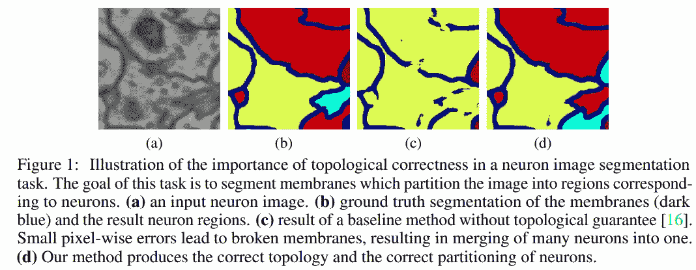
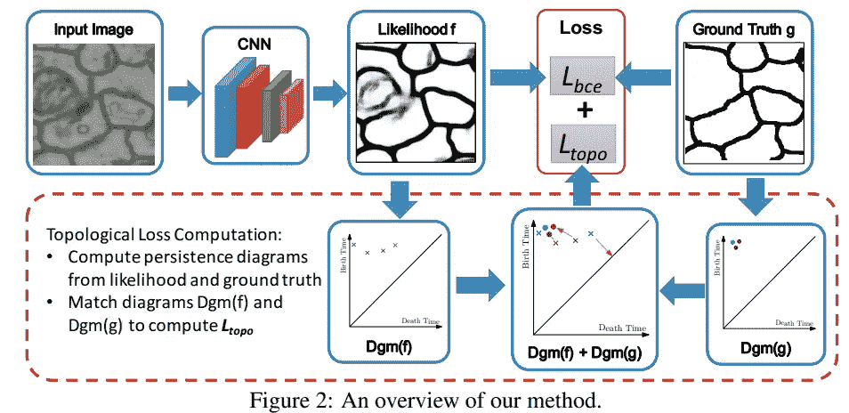
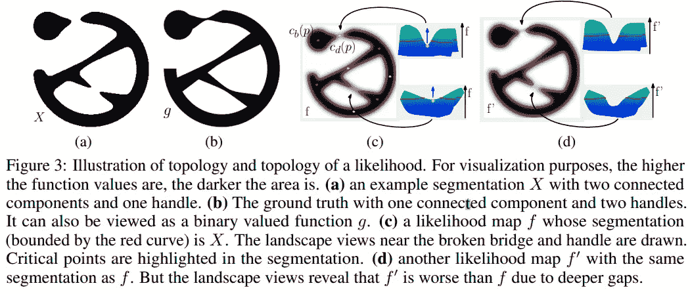
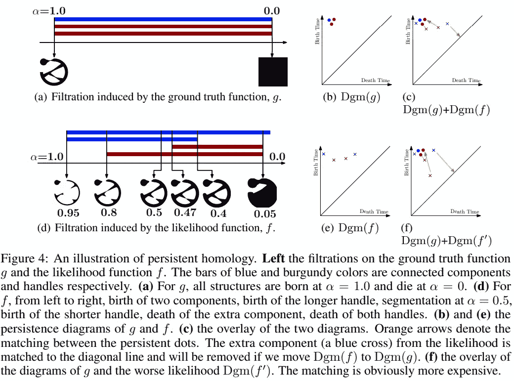
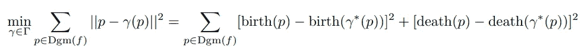
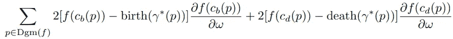
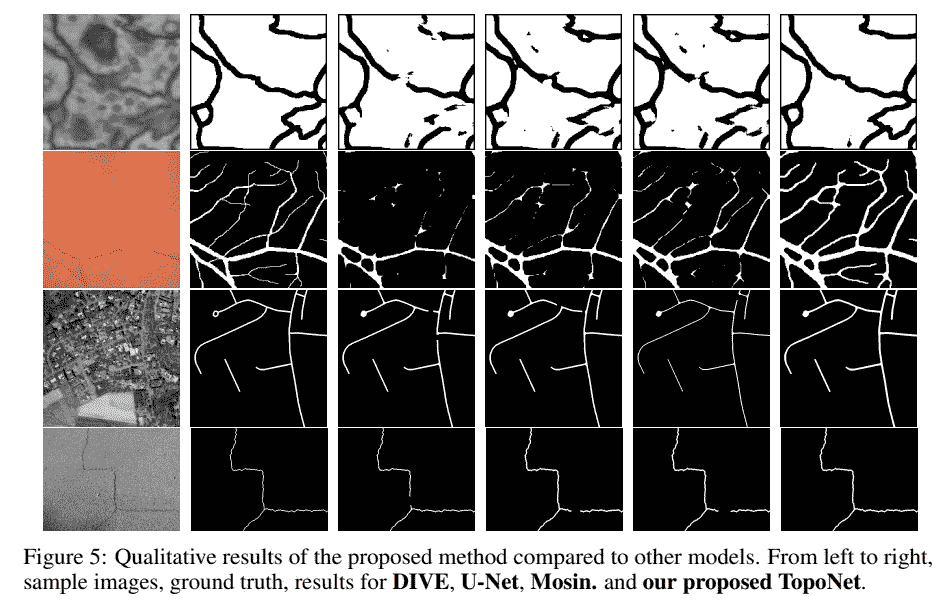
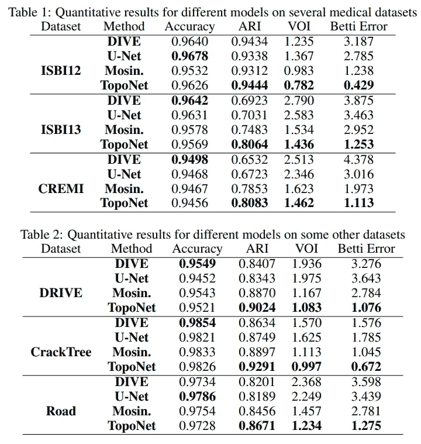

# 从零到拓扑(第三部分)

> 原文：<https://blog.devgenius.io/from-zero-to-topo-part-3-f2f7d735ace2?source=collection_archive---------15----------------------->

了解拓扑保持图像分割的旅程。

***动机***

我们继续这个话题的第三篇论文“[拓扑保持深度图像分割](https://arxiv.org/pdf/1906.05404.pdf)”。这篇论文发表在 NIPS 2019 大会上。正如我在以前的文章中提到的，最先进的分割算法仍然容易在精细结构上出错，例如小对象实例、具有多个连接组件的实例和细连接。因此，晓玲等人提出了 ***TopoNet*** ，一种新的深度分割方法，学习用正确的拓扑进行分割。具体而言，他们提出了一种拓扑损失，该拓扑损失强制分割结果具有与地面真相相同的拓扑，即具有相同的 Betti 数(连接的组件和句柄的数量)。但是，主要问题是 Betti 数是离散值。因此，他们需要对训练过程中预测和基础事实之间的拓扑相似性进行可区分的测量。据我所知，“ *TopoNet 是第一个保证拓扑正确性的端到端深度分割网络”。*

***方法***

他们的方法如上图所示。它是像素损失和拓扑损失的加权组合。让我们进入拓扑损失！

下面显示了一个例子。图 3(c)和 3(d)示出了具有相同分割的两个似然图 f 和 f ’,两者相对于地面实况 g 在拓扑上不同(图 3(b))。然而，f 是更优选的，因为它需要更少的努力来改变它，使得阈值分割 X 与 g 相同

为了有一个连续函数来捕捉不同似然图(网络的输出)之间的差异，作者建议使用持续同源理论。持续同调理论不是选择一个固定的阈值，而是从所有的阈值中捕捉所有可能的拓扑结构，并将所有这些信息以一种简洁的格式汇总起来，称为持续图。对于连续值函数 f，它的持续图 Dgm(f)包含二维平面上有限数量的点，称为持续点。每个持续点 p = (d，b) ∈ Dgm(f)对应于在时间/阈值 b 出生并在时间/阈值 d 死亡的拓扑结构。表示出生(p) = b 和死亡(p) = d。图 4(b)和 4(e)分别示出了 g 和 f 的图。代替比较离散的 Betti 数，他们可以使用来自持久性图的信息来比较可能性 f 和拓扑方面的基本事实 g。

对于持久性图 Dgm(f)和 Dgm(g ),他们找到两组点之间的最佳一一对应关系，并测量它们之间的总平方距离。设γ是 Dgm(f)和 Dgm(g)之间所有可能双射的集合。拓扑损失 Ltopo(f，g)为:

其中γ∫是两个不同点集之间的最佳匹配

直观地说，这种损失衡量了通过将所有点移向其匹配点来将 Dgm(f)图修改为 Dgm(g)图所需的最小工作量。如果一个点不能被匹配，他们将它匹配到对角线上的投影。

拓扑损失的梯度:

他们使用小块(65×65)而不是大块/整幅图像。原因是双重的。首先，拓扑信息的计算复杂度相对较高。持续同源的计算复杂度是 O(n ^ 3)，其中 n 是面片大小。第二，预测似然图和地面实况的持续图之间的匹配过程可能相当困难。

***实验***

**总结**

作者引入了一种新的由持续同调驱动的拓扑损失，并将其引入深度神经网络的端到端训练中。该方法特别适合于精细结构图像分割。定量和定性结果表明，提出的拓扑损失项有助于在拓扑相关度量方面实现更好的性能。所提出的拓扑损耗项是通用的，并且可以并入不同的架构中。然而，算法的复杂性仍然是昂贵的，因此他们仍然需要在批量图像上训练。

让我们开始新的旅程。