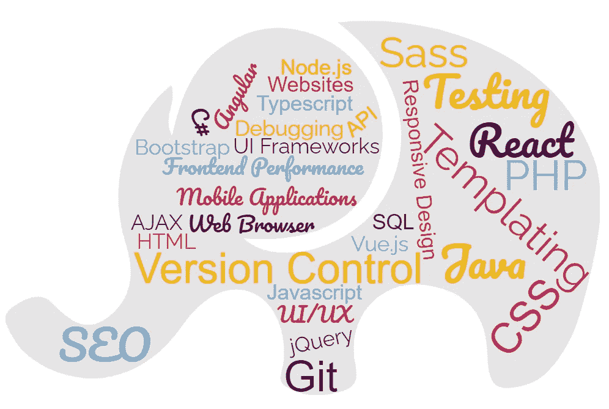
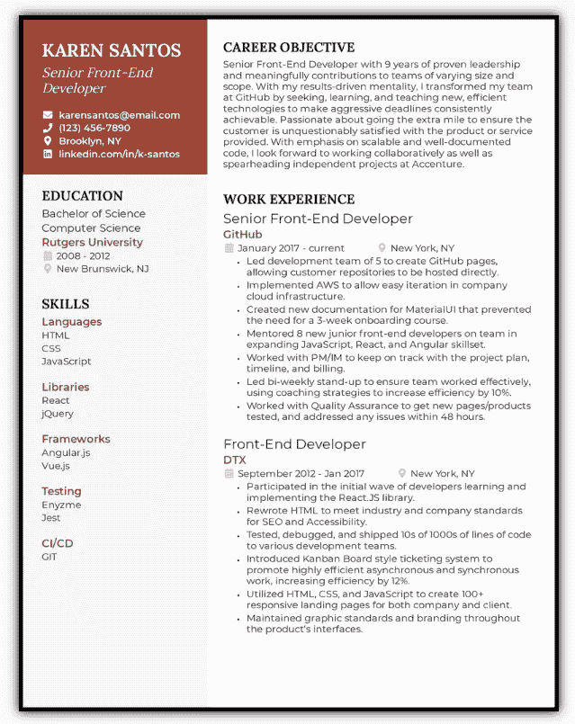
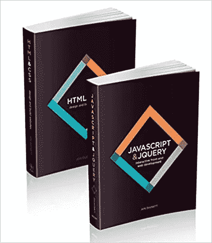
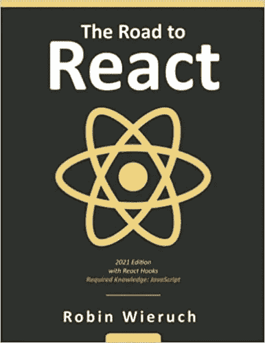
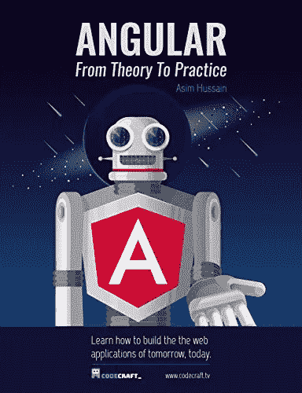
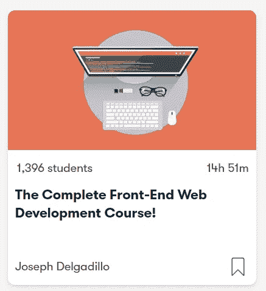
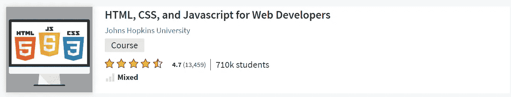
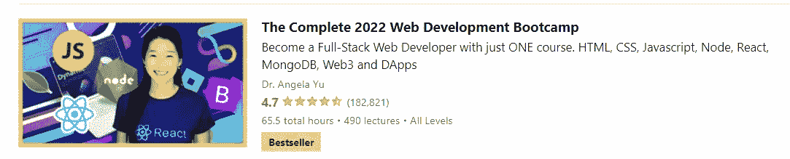

# 前端开发人员职业道路

> 原文：<https://blog.devgenius.io/frontend-developer-career-path-4318ea8fa256?source=collection_archive---------8----------------------->

## 我将带你了解成为一名前端开发人员所需要知道的一切。

前端开发人员职业道路

# 谁是前端开发人员？

前端开发人员是设计、开发和发布网站界面的专家。他们是我们每天在浏览器或基于移动设备的网站和应用程序上看到的东西的幕后策划者。他们通常与后端开发人员、图形设计人员和客户合作，将需求转化为界面。前端开发人员配备了大量的技术技能。最重要的是:

*   HTML/CSS/Javascript
*   前端库和框架
*   测试和调试工具
*   应用程序接口
*   数据库

前端开发人员通常参与 web 应用程序的整个生命周期，从实体模型准备好的那一刻开始，一直到网站的发布和维护。

# 你可以在招聘网站上使用一些关键词来找到相关的工作

*   前端开发人员
*   UI/UX 开发人员
*   全栈开发者
*   Web 开发人员
*   移动开发者
*   反应显影剂
*   角显影剂
*   Vue.js 开发者
*   Javascript 工程师
*   基于云的 Web 开发者

# 公司对前端开发人员的常见任务和期望

*   基于可用性开发功能性和吸引力的基于网络和移动的应用程序
*   创建工具来增强在任何浏览器中与站点的交互
*   查看 SEO 最佳实践
*   编写功能需求文档和规范
*   与设计师合作，如平面设计师，以确定网站的布局
*   测试网站的可用性并修复任何错误
*   优化应用以获得最高速度
*   创建高质量的模型和原型
*   会见客户，讨论他们的网站设计和要求
*   提供网站维护和改进
*   创建跨所有浏览器和平台一致的级联样式表(CSS)
*   构建可重用的代码和库以供将来使用
*   将音频、视频和图形整合到网站中

# 成为前端开发人员所需的技能

## 基础

*   超文本标记语言
*   半铸钢ˌ钢性铸铁(Cast Semi-Steel)
*   java 描述语言
*   调试工具
*   数据结构
*   算法
*   结构化查询语言
*   编程语言(PHP、Java、C#等)
*   用户界面/UX 设计
*   代码版本控制工具，比如 Git / Mercurial / SVN

## 先进的

*   HTML5
*   CSS3
*   Javascript 前端库(React，Angular，Vue 等。)
*   CSS 预处理平台，如 LESS 和 SASS
*   浏览器测试和调试
*   应用程序接口
*   高级 SQL
*   jQuery
*   引导程序
*   SEO 原则
*   响应式设计
*   异步请求处理、部分页面更新和 AJAX

## 推荐技能

*   HTML5/CSS3
*   反应
*   引导程序
*   服务器端编程语言（Professional Hypertext Preprocessor 的缩写）
*   创建交互式、快速动态网页应用的网页开发技术
*   jQuery
*   响应式设计
*   节点. js

# 推荐认证

*   [IBM 全栈云开发者专业证书](https://www.coursera.org/professional-certificates/ibm-full-stack-cloud-developer)
*   [W3Schools 前端认证](https://courses.w3schools.com/browse/certifications/courses/front-end-certification-exam)
*   [React W3Schools 认证](https://courses.w3schools.com/browse/certifications/courses/react-certification-exam)

# 前端开发人员简历示例

前端开发人员简历示例。来源: [beamjobs](https://www.beamjobs.com/resumes/front-end-developer-resume-samples)

# 推荐书籍

[**# 1——HTML、CSS、JavaScript 和 jQuery 集合**](https://www.amazon.com/Web-Design-HTML-JavaScript-jQuery/dp/1118907442/ref=sr_1_4?crid=3GNR0OFOTL4WR&keywords=javascript&qid=1649748654&sprefix=javascript%2Caps%2C144&sr=8-4) 的网页设计

> 这两本书集结合了标题 *HTML & CSS:设计和构建网站*和 *JavaScript & jQuery:交互式前端开发*。这两本书为那些想在学习 JavaScript 和 jQuery 之前掌握 HTML 和 CSS 的人提供了一个理想的平台。
> 
> *HTML & CSS* 涵盖了结构、文本、链接、图像、表格、表单、有用的选项、用 CSS 添加样式、字体、颜色、框中思维、样式列表和表格、布局、网格，甚至 SEO、Google analytics、ftp 和 HTML5。 *JavaScript & jQuery* 通过使用图表、信息图和照片的清晰简单的可视化方法，对这两种技术进行了很好的综合介绍。

[**# 2——React 之路:你掌握平实而务实 React.js**](https://www.amazon.com/Road-learn-React-pragmatic-React-js/dp/172004399X/ref=sr_1_1?crid=PF7ECPJZLJ1L&keywords=react&qid=1649748539&sprefix=react+%2Caps%2C152&sr=8-1)

> 在“React 之路”中，您将了解 React.js 与钩子的所有基础知识，同时逐步构建一个成熟的 React 应用程序。当您创建 React 应用程序时，每一章都将向您介绍 React 的一个新的关键特性。然而，不仅仅是基础:这本书深入到相关的主题(例如，使用类型脚本、测试、性能优化)和高级特性实现，如客户端和服务器端搜索。在本书的结尾，您将拥有一个完全可用的 React 应用程序。

[**#3 — Angular:从理论到实践:使用 Google 的 Angular web 框架构建未来的 web 应用**](https://www.amazon.com/Angular-Practice-applications-tomorrow-framework-ebook/dp/B01N9S0CZN/ref=sr_1_12?crid=1LTD3J2EPWJB8&keywords=angular&qid=1649748558&sprefix=angular%2Caps%2C148&sr=8-12)

> 读完这本书，你会对 Typescript & ES6 Javascript、组件&绑定、指令、依赖注入&服务、Angular 模块&引导你的 Angular 应用、SPAs &路由、Angular CLI、表单、RXJs 的反应式编程、HTTP 和单元测试有很好的理解。

# 推荐课程

[**#1 —完整的前端 Web 开发课程(Skillshare)**](https://www.skillshare.com/classes/The-Complete-Front-End-Web-Development-Course/1118700097?via=search-layout-grid)

> 本课程涵盖了 HTML、层叠样式表(CSS)、JavaScript 编程、jQuery JavaScript 库和引导框架的 Web 开发基础知识。它还涵盖了最流行的 web 开发框架，并将帮助您开始成为全栈 web 开发人员！

[**# 2——面向 Web 开发者的 HTML、CSS、Javascript(Coursera)**](https://www.coursera.org/learn/html-css-javascript-for-web-developers)

> 在本课程中，您将学习每个网页编码人员都需要知道的基本工具。您将从头开始学习如何用 HTML 和 CSS 实现现代网页。然后，您将进一步学习如何对我们的页面进行编码，使其组件根据用户屏幕的大小自动重新排列和调整大小。你将能够编写一个网页，它在手机上和在台式电脑上一样有用。

[**# 3—2022 年网络开发训练营(Udemy)**](https://www.udemy.com/course/the-complete-web-development-bootcamp/)

> 这个综合课程涵盖了大量的工具和技术，包括:前端 Web 开发、 **HTML** 5、 **CSS** 3、 **Bootstrap** 4、 **Javascript** ES6、DOM 操纵、 **jQuery、** Bash 命令行、Git、 **GitHub** 和版本控制、 **Node** 。js，**快递**。js，EJS，REST，**API，**数据库，SQL， **MongoDB，**mongose，认证，Firebase， **React** 。js、React Hooks、Web 设计、GitHub 页面部署、Heroku 和 MongoDB Atlas、互联网计算机上的 Web3 开发、区块链技术、令牌合约开发、NFT 造币、买卖逻辑。

# 其他有用的资源

🤖 [React 文档](https://reactjs.org/docs/getting-started.html)

🦄[角度文件](https://angular.io/docs)

🐉 [Vue.js 文档](https://vuejs.org/v2/guide/)

🐶 [W3Schools 教程](https://www.w3schools.com/)

如果 *你喜欢这些内容并且觉得很慷慨，请考虑通过向我的 ETH 钱包捐款来支持我:*

***0x 1779 c 21 f 79d 3 f1 e 63960990818 b5 BF 03 e 89 CBF Fe***

如果 *以后有兴趣看我的类似帖子，请考虑与我的* [***推荐链接***](https://ehsan-yazdanparast.medium.com/membership) *一起加入 medium。如果你注册使用我的链接，我会赚一小笔佣金，你可以无限制地访问所有媒体作者的内容。这样你就在平台上支持我和你其他喜欢的作家了。谢了。*

 [## 搜索引擎优化(SEO)专家职业道路

### 我将带你了解成为一名 SEO 专家所需的一切。

medium.com](https://medium.com/geekculture/search-engine-optimization-seo-specialist-career-path-bab4fd3a6e78)  [## 商业智能(BI)分析师职业道路

### 我将带您了解成为商业智能(BI)分析师所需的所有知识

blog.devgenius.io](/business-intelligence-bi-analyst-career-path-464272d3a2ea)