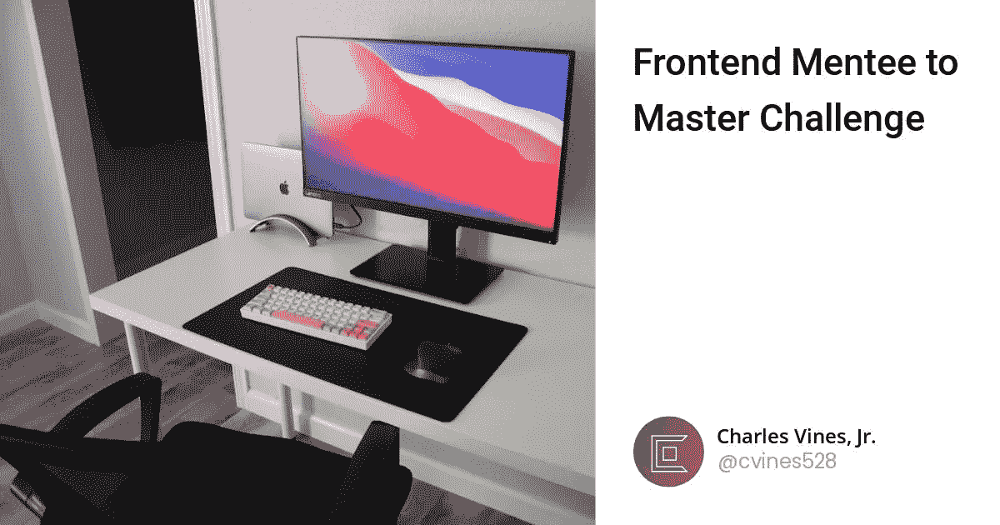

# 前端学员到大师的挑战

> 原文：<https://blog.devgenius.io/frontend-mentee-to-master-challenge-4ed383b4e7d2?source=collection_archive---------1----------------------->

# 教程炼狱烂透了

每个初学编码的人都会在某个时候遇到这个障碍。通常你已经学过一些你想学的特定语言的课程。你快速浏览课程，感觉自己可以编写世界上任何东西。你的教练让它看起来很简单。他或她输入几行文字，不到 45 分钟就能完成一个功能齐全的网络应用程序。在我们编码之后，我们有足够的信心去做我们自己的东西。我们打开空白文本编辑器，当我们看到潜在可能性的空洞时，我们的大脑一片空白。我们甚至不知道从哪里开始。也许你在设置 html 的时候花了点功夫，但是没有什么真正的收获。试图将适当的 npm 包安装到新项目中会让你感到沮丧。你如何着手设计？为什么我的 css 不听我的！？！？

这些问题中的一个或多个突然出现在你的脑海中，现在你感觉不那么自信了。然后你开始怀疑你是否真的学到了什么。也许你需要再去做一遍教程？或者也许我应该做这个你听别人说过的教程？这里开始了炼狱教程的螺旋。如果你不小心，这段旅程可能会成为一个相当长的路障。

# 我们怎么出去

摆脱教程炼狱的唯一方法是扔掉教程，做真正的项目，自己想出真正的解决方案。当你在学习大量的语法和概念的同时，却在阅读一个又一个教程时，问题就来了。你遇到了麻烦，因为你不能把这些概念转化成真正的创意，因为你在使用教程时从来不需要这么做。你正在经历一个已经解决的问题。虽然看到自己成为一名开发人员的过程是很棒的，但你必须学会如何解决这些问题，而不是从一个已经解决的问题中重复答案。

既然我们已经解决了这个问题，我很确定你已经知道答案了，下一步就是弄清楚我们要做什么。这就是前端导师的用武之地。

# 教程炼狱粉碎机

[Frontend Mentor](https://www.frontendmentor.io) 是一个完全免费的网站(也有专属项目的高级会员)。它主持一堆不同难度的不同项目。您可以选择一个项目，对其进行处理，并将其提交给 frontend mentor，以将您的解决方案与预期的最终产品进行比较，您还可以接收来自社区的反馈。因为我想利用建立一个项目库来展示，我需要尽可能多的实践，所以我决定给自己一个挑战

# 从学员到大师

我要做的是通过前端导师的图书馆，完成他们提供的每一个免费挑战。在完成每一个项目的同时，我还会发布一篇关于我所做的每个项目的小文章。你可以用它来了解我在项目创建过程中的思维过程，以及我为什么做出这样的决定。您也可以利用这个机会来检查我的代码并给我反馈，同时将您的解决方案与我自己的进行比较，看看您是否看到可以改进的地方或您认为我可以改进的地方。我希望这个挑战成为每个参与者的学习经历。

# 项目链接

下面我将链接每个完成的项目博客帖子。我希望这个项目列表能帮助激励你在成为更好的开发人员的旅程中接受自己的挑战。

1.  [订单汇总组件](https://www.frontendmentor.io/challenges/order-summary-component-QlPmajDUj)

*最初发表于*[T5【https://datboibecoding.com】](https://datboibecoding.com/frontend-mentee-to-master-challenge)*。*