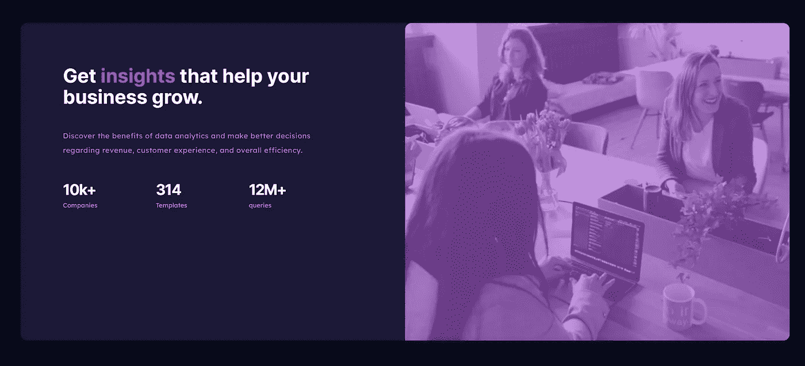

# 前端学员到主项目#2:统计预览卡组件

> 原文：<https://blog.devgenius.io/frontend-mentee-to-master-project-2-stats-preview-card-component-8bc4a5898837?source=collection_archive---------6----------------------->

创建于 2021 年 8 月 30 日

# 项目介绍



统计预览卡项目

[挑战页面](https://www.frontendmentor.io/challenges/stats-preview-card-component-8JqbgoU62)

[Github](https://github.com/cvines528/stats-preview-card-solution)

[直播项目](https://cvines528.github.io/stats-preview-card-solution/)

第二个项目将与上一个项目非常相似。再次，我将使用 TailwindCSS，我将使用大量的网格，让布局工作的方式，我们想要的。然而，这一次我想确保我使用的是移动优先开发。这是另外一件事，就像建立我们的大纲，这将使整个过程变得容易得多。我们不必担心在造型结束时试图疯狂改变响应定位。如果我们在风格阶段注意到这一点，我们将花费更少的时间来修补，这有助于我们更快地完成我们的项目。

始终确保你在寻找可以预防潜在问题的方法。一开始可能会很难，但随着经验的增加，你将能够更快地识别项目中潜在的问题领域，并做出相应的调整。

# 学习成果

# 使用的库

这个项目我又要用顺风了。再次，这可能是过度杀戮，我想在接下来的几个初学者项目中，我会做一切香草只是为了确保我保持我真正的 CSS 技能敏锐。当我们谈到 javascript 时，情况也是如此。随着项目变得越来越大，我肯定会将这些库和框架添加到我的项目中，但现在我们想确保我们真正理解代码发生了什么。

# 使用的技术

这是另一个展示我的网格技能的项目。我从前一个项目花了 3-4 个小时，到这个项目在一个小时内完成了所有的样式和 html。所以很明显我已经掌握了窍门。但是就像我在上一节指出的，我将离开顺风社，所以我们会看看这是否会增加我下一个项目的时间。

# 如何设置 TailwindCSS

如果你查看顺风文档，你会看到一个很长的使用 npm 包设置顺风的指导方法。这对于我们将来要做的更大的项目来说非常好，但是今天我们将使用顺风 CDN。

```
<html>
<head>
    <title>Stats Preview</title>
    <link *href*="https://unpkg.com/tailwindcss@^2/dist/tailwind.min.css" *rel*="stylesheet">
    <link *rel*="stylesheet" *href*="style.css">
</head>
<body>

</body>
</html>
```

这是连接到 TailwindCSS 的最简单的方法，但我们不会总是使用这种方法。如果我们想要进行定制，如果我们正在进行一个更大的项目，这将是一个天赐良机，而不是用重复的类来塞满我们的代码，或者在样式表中写入不必要的样式，那么我们需要在我们的项目中安装所有的 tailwind。

如果你没有使用 Tailwind CSS，我已经为我在这个挑战过程中使用的不同库创建了一个不同项目设置的列表。因此，如果你想用另一个框架或库来练习，请查看列表，看看我是否写了一篇关于这个特定设置的文章。

# 创作过程

我有一个创建项目的方法，这样我就可以预测在项目的后期我可能需要的东西。这也让大脑转动，弄清楚什么是重要的东西，需要进入这个项目，以便它可以出货。

这个过程看起来有点像这样。

1.  HTML 布局
2.  全局样式
3.  风格和响应度
4.  逻辑
5.  折射镜
6.  部署

# HTML 布局

就像我在上一个项目中说的。这是我们为成功做准备的地方。这个项目的布局非常简单。唯一棘手的是组件左侧的状态。

```
<div *id*="project-container" *class*="flex items-center justify-center h-screen">
    <div *id*="card-container" >
      <div *id*="card-layout">
        <div *id*="left-side ">
          <div *id*="left-side-content-container">
            <div *id*="insight-title">
              <h1 >Get insights</span> that help your business grow.</h1>
            </div>
            <div *id*="description-container" >
              <p>Discover the benefits of data analytics and make better decisions regarding revenue, customer experience, and overall efficiency.</p>
            </div>
            <div *id*="stats-container" >
              <div *id*="companies" >
                <h2>10k+</h2>
                <h3>Companies</h3>
              </div>
              <div *id*="templates" >
                <h2>314</h2>
                <h3>Templates</h3>
              </div>
              <div *id*="queries" >
                <h2>12M+</h2>
                <h3>queries</h3>
              </div>
            </div>
          </div>
        </div>

        <div *id*="right-side" >
          <div *id*="img-container" >
            
          </div>
        </div>
      </div>
    </div>
  </div>
```

我们从整个项目的容器开始。这个容器帮助我将卡组件居中。在项目容器中，我们然后使用 flex 类设置我们需要将卡组件居中的类。

```
<div *id*="project-container" *class*="flex items-center justify-center h-screen">

 </div>
```

我花了比我愿意承认的更长的时间来得到这个和第一个项目，但我确实找到了一个名为 [Tailwind Toolbox](https://www.tailwindtoolbox.com/components/centered-page) 的网站，他们向我提供了代码，所以我需要做的只是复制和粘贴。

下一步是设置卡片容器，这样我们就可以控制整张卡片而不会意外破坏里面的内容。然后，我设置了一个布局容器，它将负责分割我们在设计中看到的信息和图像。在这个容器中，我们将把信息分成两部分。应该大致是这样的。

```
<div *id*="project-container" *class*="flex items-center justify-center h-screen">
	<div *id*="card-container" >
		<div *id*="card-layout">
			<div *id*="left-side">

			</div>

			<div *id*="right-side">

			</div>
		</div>
	</div>
 </div>
```

既然我们已经正确设置了容器，现在我们可以开始填充将进入 stat 组件每一侧的内容。左侧应该看起来像这样。

```
<div *id*="left-side ">
          <div *id*="left-side-content-container">
            <div *id*="insight-title">
              <h1 >Get insights</span> that help your business grow.</h1>
            </div>
            <div *id*="description-container" >
              <p>Discover the benefits of data analytics and make better decisions regarding revenue, customer experience, and overall efficiency.</p>
            </div>
            <div *id*="stats-container" >
              <div *id*="companies" >
                <h2>10k+</h2>
                <h3>Companies</h3>
              </div>
              <div *id*="templates" >
                <h2>314</h2>
                <h3>Templates</h3>
              </div>
              <div *id*="queries" >
                <h2>12M+</h2>
                <h3>queries</h3>
              </div>
            </div>
          </div>
        </div>
```

我在卡片的每个部分都包装了一个容器，以便更容易地管理每行文本的填充。我们在右边做同样的事情。

```
<div *id*="right-side" >
	<div *id*="img-container" >
		
	</div>
</div>
```

# 全局样式

随着布局的设置和我们喜欢的结构，现在是时候为项目设置全局样式了。我总是做的第一件事是正确设置字体。我们将使用两种不同的字体。我们将使用的字体是国际字体和 T2 字体。

接下来，我在样式表的顶部导入我们的字体

```
@import url('https://fonts.googleapis.com/css2?family=Red+Hat+Display:[[email protected]](https://datboibecoding.com/cdn-cgi/l/email-protection);700;900&display=swap');
```

在我导入字体后，这里是我立即设置的所有样式。

```
body {
    background-color: hsl(233, 47%, 7%);
    color: hsl(0, 0%, 100%);
    font-size: 16px
}

h1, h2 {
    font-family: 'Inter', sans-serif;
}
h2{
    font-size: 28px;
    font-weight: 700;
}

h3, p {
    font-family: 'Lexend Deca', sans-serif;  
}

h3 {
    font-size: 12px;
    color: hsla(0, 0%, 100%, 0.6);
}

#card-container {
    background-color: hsl(244, 38%, 16%)
}
#right-side {
    background: hsl(277, 64%, 61%);
    overflow: hidden;
}
#img-container {
    object-fit: cover;
   opacity: 0.4;
}
```

所以我尽我最大的努力去得到字体家族，字体大小，和一些字体颜色的设置。此外，由于背景是非常简单的，没有任何背景图像，我想我现在也将设置它。

# 风格和响应度

现在我们已经设置了全局样式，是时候使用 tailwind 来完成我们的项目了。在查看代码时，我想指出，我采用了移动优先的方法来设置我的类。Tailwind 有一些工具可以让响应变得非常简单。我是如何做到的，我首先把所有东西都设计成可以移动的样子。在我完成了这些之后，你可以在类中为特定的屏幕宽度设置应该改变的样式。例如，如果我只希望桌面上的某个布局更大，我会这样设置类。

```
<div id="left-side-content-container" class="py-10 md:p-20 text-center text-left">
```

注意到 md 了吗？

这就是我们如何设置参数，而不必像在[的第一个项目](/frontend-mentor-challenge-project-1-order-summary-confirmation-w-tailwindcss-ec576fb2d4e6)中那样设置冗长的媒体查询。这是完成的代码。

```
<div id="project-container" class="flex items-center justify-center h-screen">
    <div *id*="card-container" *class*="w-10/12 md:w-10/12 rounded-xl">
      <div *id*="card-layout" *class*="flex flex-col-reverse  justify-center md:grid grid-cols-2">
        <div *id*="left-side " *class*="order-2 md:order-1 pr-10">
          <div *id*="left-side-content-container" *class*="py-10 md:p-20 text-center text-left">
            <div *id*="insight-title">
              <h1 *class*="text-2xl md:text-4xl font-bold">Get <span *class*="text-purple-600">insights</span> that help your business grow.</h1>
            </div>
            <div *id*="description-container" *class*="md:pr-10">
              <p *class*="text-sm py-10 tracking-wide text-gray-400 leading-loose">Discover the benefits of data analytics and make better decisions regarding revenue, customer experience, and overall efficiency.</p>
            </div>
            <div *id*="stats-container" *class*="grid grid-cols-1 md:grid-cols-3">
              <div *id*="companies" *class*="py-5 md:py-0">
                <h2 *class*="tracking-tighter">10k+</h2>
                <h3>Companies</h3>
              </div>
              <div *id*="templates" *class*="py-5 md:py-0">
                <h2 *class*="tracking-tighter">314</h2>
                <h3>Templates</h3>
              </div>
              <div *id*="queries" *class*="py-5 md:py-0">
                <h2 *class*="tracking-tighter">12M+</h2>
                <h3>queries</h3>
              </div>
            </div>
          </div>
        </div>

        <div *id*="right-side" *class*="rounded-t-xl md:rounded-r-xl order-1 order-2">
          <div *id*="img-container" >
            
          </div>
        </div>
      </div>
    </div>
  </div>
```

# 部署

既然我们已经完成了这个美丽的项目，现在是时候向世界展示我们的创造了。确保你正在为 github 推进你正在做的所有项目。您必须有一个 github 帐户，以提交您的项目到前端导师和接收反馈。

# 关闭

我们现在已经完成了我们的统计预览项目。两个倒下了。还差 43 个！

*原载于*[*https://datboibecoding.com*](https://datboibecoding.com/frontend-mentee-to-master-project-2-stats-preview-card-component)*。*