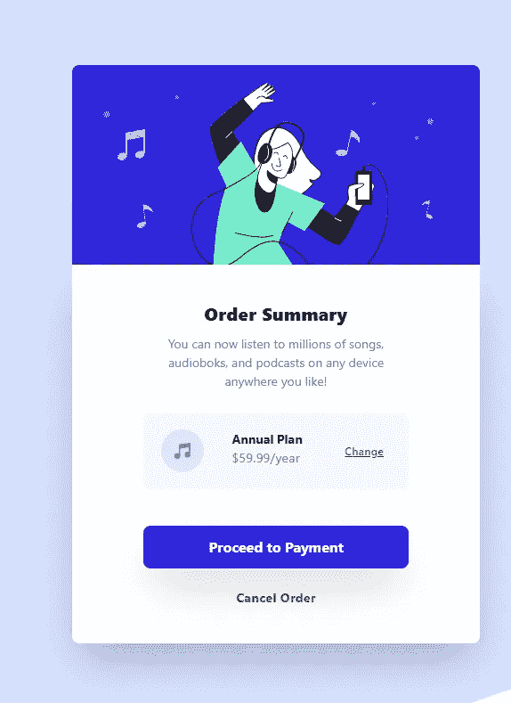

# 前端导师挑战项目#1:订单汇总确认，带 TailwindCSS

> 原文：<https://blog.devgenius.io/frontend-mentor-challenge-project-1-order-summary-confirmation-w-tailwindcss-ec576fb2d4e6?source=collection_archive---------5----------------------->



[挑战页面](https://www.frontendmentor.io/challenges/order-summary-component-QlPmajDUj)

[Github](https://github.com/cvines528/order-summary-solution/blob/main/index.html)

[直播现场](https://cvines528.github.io/order-summary-solution/)

我将从事的第一个项目是第一个新手级别的项目订单汇总确认页面。这个项目很容易，但将真正挑战你的 CSS 定位技能。

# 学习成果

# 使用的库

我在这个项目中使用了 TailwindCSS 库。就我个人而言，在完成这个项目后，我觉得用在这样一个简单的项目上有点大材小用。但是我想利用这个机会来熟悉这个库，因为我会经常使用它来加速更大项目的设计过程。因此，构建这样的小组件会让我熟悉遍历文档，并积累我在 tailwind 中使用的 CSS 类方面的知识。

# 使用的技术

在这个项目中，我学到了很多关于网格的知识。我理解其背后的原理，但我真正学到的是如何正确地包含我想要操作的元素，以及我需要理解什么样的样式层次结构才能正确地使列符合正确的容器元素。

其次，我学会了如何正确设置我的全局风格。我了解到，我在项目设置中解决的细节越多，构建项目的过程就越容易，因为你不用翻阅设计，也不用笨手笨脚地试图弄清楚哪个字体配哪个标题，使用什么样的字体颜色等。

不要让这个项目的简单性欺骗了你。如果你的 CSS 和定位技能不扎实，这个项目肯定会拓展你。但是战斗到底，从中获得一堆知识！

# 如何设置 TailwindCSS

如果你查看顺风文档，你会看到一个很长的使用 npm 包设置顺风的指导方法。这对于我们将来要做的更大的项目来说非常好，但是今天我们将使用顺风 CDN。

```
<html>
<head>
    <title>Order Summary</title>
    <link *href*="https://unpkg.com/tailwindcss@^2/dist/tailwind.min.css" *rel*="stylesheet">
    <link *rel*="stylesheet" *href*="style.css">
</head>
<body>

</body>
</html>
```

这是连接到 TailwindCSS 的最简单的方法，但我们不会总是使用这种方法。如果我们想要进行定制，如果我们正在进行一个更大的项目，这将是一个天赐良机，而不是用重复的类来塞满我们的代码，或者在样式表中写入不必要的样式，那么我们需要在我们的项目中安装 tailwind。

如果你没有使用 Tailwind CSS，我已经为我在这个挑战过程中使用的不同库创建了一个不同项目设置的列表。因此，如果你想用另一个框架或库来练习，请查看列表，看看我是否写了一篇关于这个特定设置的文章。

# 创作过程

我有一个创建项目的方法，这样我就可以预测在项目的后期我可能需要的东西。这也让大脑转动，弄清楚什么是重要的东西，需要进入这个项目，以便它可以出货。

这个过程看起来有点像这样。

1.  HTML 布局
2.  全局样式
3.  风格和响应度
4.  逻辑
5.  折射镜
6.  部署

# HTML 布局

第一步是构建项目。这是这个过程的一个重要部分。这会让你的项目建设变得轻而易举，或者让你痛苦几个小时。这是我为这个项目设置的 html。

```
<body>
    <div *id*="container">
        <div *id*="summary-card-container">
            <div *id*="hero-container">
                <div *id*="hero-image">
                    
                </div>
            </div>
            <div *id*="order-summary-info-container">
                <div *id*="order-summary-title">
                    <h1>Order Summary</h1>
                </div>
                <div *id*="order-summary-description">
                    <p>You can now listen to millions of songs, audiobooks, and podcasts on any device anywhere you like!</p>
                </div>
                <div *id*="plan-purchase-container">
                    <div *id*="product-icon">
                        
                    </div>
                    <div *id*="plan-description">
                        <h2>Annual Plan</h2>
                        <p>$59.99/year</p>
                    </div>
                    <div *id*="product-change">
                        <a *href*="#">Change</a>
                    </div>
                </div>
                <div *id*="proceed-payment-container">
                    <button>Proceed to Payment</button>
                </div>
                <div *id*="cancel-order">
                    <a *href*="#">Cancel Order</a>
                </div>
            </div>
        </div>
    </div>
</body>
```

有时候我觉得自己好像变得非常快乐。但是根据我的经验，设置合适的容器对网格定位很有帮助。它有助于确保您以正确的方式操作正确的元素。我非常视觉化，所以把每个元素想象成盒子，每个盒子里面都有一组由父元素控制的盒子。并且层级循环继续。这就像 html 多元宇宙。但是如果你在我的方法中看到一个错误，请让我知道是否有一种方法可以更进一步折射。

# 全局样式

创建此订单摘要的下一步是设置所有常用的样式(如果您购买了专业会员资格，您将获得设计文件)。首先，我们将设置排版。我们将在整个项目中使用 Red Hat Display 字体系列，因此请务必将其添加到您的项目中。字体是谷歌字体，可以在这里找到。我们需要的字体粗细是 500、700 和 900。

接下来，我在样式表的顶部导入我们的字体

```
@import url('https://fonts.googleapis.com/css2?family=Red+Hat+Display:wght@500;700;900&display=swap');
```

导入字体后，我会添加媒体查询，因为桌面视图和移动视图之间只有一个主要区别，那就是背景图像的变化。其他一切都将使用顺风设置。

```
@media only screen and (max-width: 375px) {
    #container {
        background-image: url("/images/pattern-background-mobile.svg");
        background-repeat:no-repeat;
    }
}

#container {
    background-image: url("/images/pattern-background-desktop.svg");
    background-repeat:no-repeat;
}
```

现在，我们可以将所有常见的 CSS 样式设置为全局样式。我主要关注的是这个项目的大部分是什么，我试图在这里处理基本的风格。对于这个项目，我将设置字体家族，字体粗细，字体大小和颜色。

```
* {
    font-family: 'Red Hat Display', sans-serif;
    font-weight: 500;
    font-size: 16px;
    color: gray;
}
```

同样，由于这是一个如此简单的项目，我将填写一些更常见的风格，只是为了让它的方式，所以我们可以将我们的注意力集中在定位的大部分。以下是我现在设定的剩余的风格变化。这些可能会随着项目的进展而改变，但是现在我们应该完成所有的全局样式。

```
h1, h2 {
    color: black;
}

h1 {
    font-weight: 900;
}

h2 {
    font-weight: 700;
}
#product-change a {
    text-decoration: underline;
    font-size: 14px;
    color: hsl(245, 75%, 52%);
    font-weight: 700;
}
button {
    color: white;
}
```

# 风格和响应度

现在我们开始举重。这是我们将使用 Tailwind CSS 来放置所有东西的地方。让我们的项目看起来更接近设计。首先，我们需要确定项目的中心。首先，我们需要拉伸我们的原始容器，以便我们的背景能够正确显示。

```
#container { background-image: url("/images/pattern-background-desktop.svg"); background-repeat:no-repeat; background-position: center; background-size: cover; height: 100vh; }
```

请确保也将这些更改添加到介质查询中

```
@media only screen and (max-width: 375px) { #container { background-image: url("/images/pattern-background-mobile.svg"); background-repeat:no-repeat; background-position: center; background-size: cover; } }
```

现在，我们可以将 html 类添加到我们的容器中，使我们的摘要卡居中。

```
<div *id*="container" *class*="h-screen grid grid-cols-1 md:grid-cols-3 tracking-wide">
        <div *id*="summary-card-container">
            <div *id*="hero-container">
                <div *id*="hero-image">
                    
                </div>
            </div>
```

我们终于将卡片居中，现在我们终于可以开始处理摘要卡片中的内容了。首先，我们将得到布局设置，并开始工作的英雄形象。我们将首先根据卡片的布局调整尺寸。我们通过向#summary-card-container 添加几个类来实现这一点。

```
<div id="summary-card-container" class="h-full col-start-2 py-20 place-self-center items-center md: py-3 px-3">
```

这将使所有内容正确居中，同时添加一些填充，以便间距与设计相似。接下来，我们将英雄图像扩展到元素的整个宽度，然后为了看起来更整洁，将角变圆。我还将修改订单标题的字体大小，让标题更加引人注意。

```
<div id="order-summary-info-container" class="grid grid-cols-1 justify-items-center px-20 py-10 bg-white rounded-b-lg  shadow-2xl">
                <div *id*="order-summary-title">
                    <h1 *class*="text-xl">Order Summary</h1>
                </div>
```

接下来，我们将继续往下看订单摘要描述。这里不需要做太多的工作，除了放置适当的填充，文本居中，也许还可以添加一些字母间距。

```
<div *id*="order-summary-description">
  <p *class*="text-center pt-2 pb-6 tracking-normal">You can now   listen to millions of songs,<br> audiobooks, and podcasts on any device<br> anywhere you like!</p>
</div>
```

接下来是计划购买部分。我们在这里想要做的是把这个部分当作它自己的容器。因此，我们需要将容器设置为网格，并为容器中的每个元素创建 3 列。

```
<div id="plan-purchase-container" class="grid grid-cols-3 rounded-lg mb-10">
```

因为我在 tailwind 文档中找不到匹配我们需要的背景颜色，所以我在 CSS 中添加了自定义背景颜色。

```
#plan-purchase-container {
    background-color: hsl(225, 100%, 98%);
}
```

在 plan-purchase 容器中，我们将为每个元素添加适当的填充。我们也将增加信头的间距和价格的大小。最后，我们将更改链接置于中心位置。以便它与其余元素均匀地对齐。

```
<div id="plan-purchase-container" class="grid grid-cols-3 rounded-lg mb-10">
  <div *id*="product-icon">
    
   </div>

    <div *id*="plan-description" *class*="py-5 pr-5">
       <h2 *class*="md:text-sm tracking-normal text-xs">Annual Plan</h2>
       <p *class*="md:text-sm text-gray-600 text-xs">$59.99/year</p>
     </div>

     <div *id*="product-change" *class*="grid place-content-center">
        <a *href*="#">Change</a>
      </div>
     </div>
```

我们要做的最后一件事是添加我们的风格变化到底部的大按钮。我们需要添加适当的填充文本和一些框阴影来添加弹出按钮。我们还将在样式表的背景上添加适当的颜色。

```
<div *id*="proceed-payment-container" *class*="w-full ">

  <button *class*="rounded-lg mb-5 p-3 px-6 w-full shadow-2xl">Proceed to Payment</button>

</div>
```

现在我们添加 CSS

```
#product-change a {
    text-decoration: underline;
    font-size: 14px;
    color: hsl(245, 75%, 52%);
    font-weight: 700;
}
button {
    background-color: hsl(245, 75%, 52%);
}
```

在我们关闭这个项目之前，我们需要确保将悬停效果添加到我们的样式表中，这样用户就可以知道他们何时与我们的链接和按钮进行交互。

```
button:hover {
    background-color: hsl(224, 23%, 55%);
}
#product-change a:hover {
    text-decoration: none;
    color:hsl(224, 23%, 55%);
}
```

# 部署

既然我们已经完成了这个美丽的项目，现在是时候向世界展示我们的创造了。确保你正在为 Github 推进你正在做的所有项目。你必须有一个 [Github](https://github.com/) 账户来提交你的项目给 frontend mentor 并接收反馈。

# 关闭

现在，我们的订单汇总项目终于完成了。我们现在已经完成了 44 个项目中的一个(在撰写本文时)。拍拍自己的背，给自己买一盒果汁。享受完成某事的感觉，让我们准备好在下周的文章中再做一次。

*最初发表于*[*【https://devdojo.com】*](https://devdojo.com/cvines528/frontend-mentor-challenge-project-1-order-summary-confirmation-w-tailwindcss)*。*