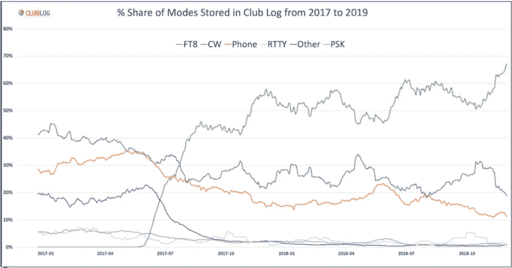
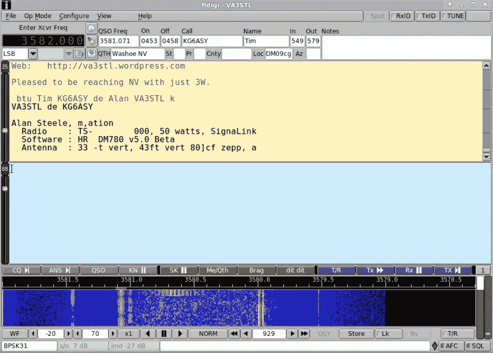
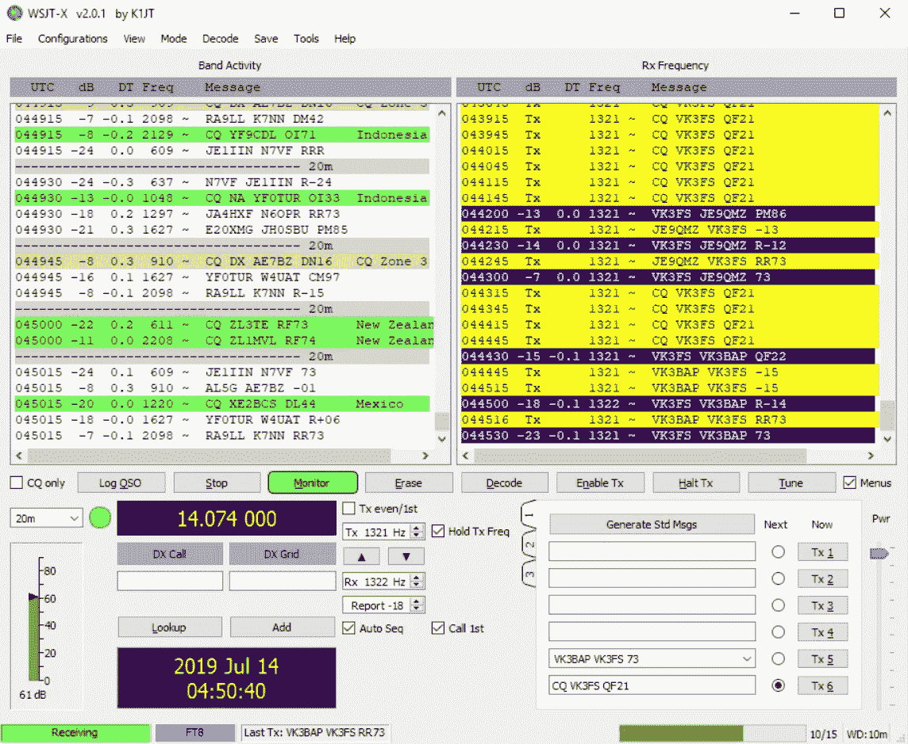
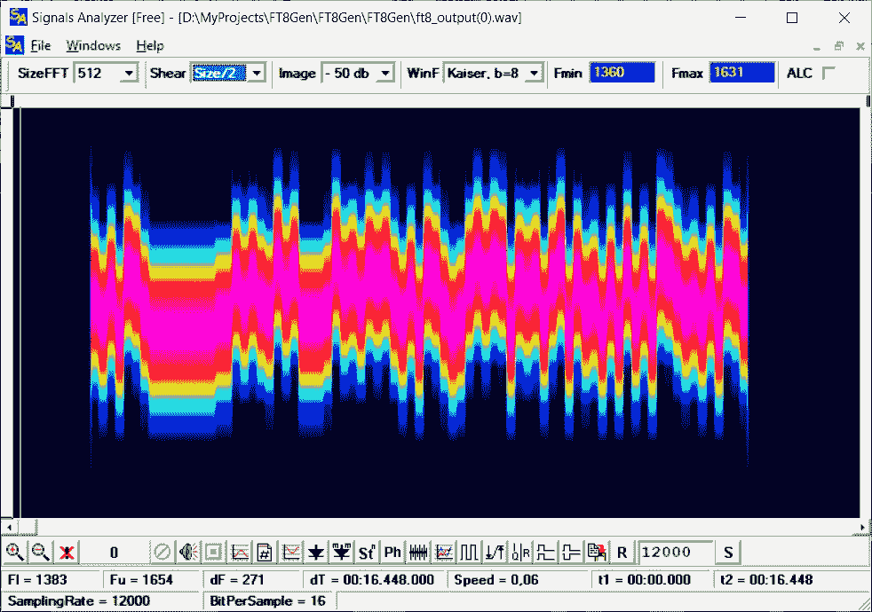

# FT8 数字无线电协议——它是如何工作的？

> 原文：<https://blog.devgenius.io/ft8-digital-radio-protocol-how-does-it-work-745bceae11f0?source=collection_archive---------4----------------------->

几乎每个对业余无线电和电信有点兴趣的人都听说过 [FT8](https://physics.princeton.edu/pulsar/K1JT/wsjtx.html) 数字通信协议。这种业余无线电数字模式出现在 2017 年，从那以后它的受欢迎程度只增不减。



【图片来源:[*www.qsl.net/w1dyj/FT8%20for%20web.pdf*](https://www.qsl.net/w1dyj/FT8%20for%20web.pdf)

许多业余无线电爱好者正在使用数字模式，只把他们的收发器连接到电脑上，但他们中的大多数人完全不知道它是如何工作的。让我们试着弄清楚。

起初，只是一个有趣的事实。这篇文章最早是发给德国《sent 业余爱好者》杂志的。很快我得到了一个回复，他们已经有足够多的关于 FT8 的文章，还有一个他们的文档截图，上面有“在婆罗洲的 DXpedition 中使用 FT8”这样的文章。我反对我的文章不是关于 FT8 的*使用，而是关于它的*内部结构*，答案是“这个理论不会帮助读者更有效地使用 FT8”。很难否认这一点，但我希望不仅是无线电操作员，还有工程师对这些东西的工作原理感兴趣。*

让我们开始吧。

# 历史

当然，在个人电脑在家庭中大量出现之前，可能没有业余无线电爱好者会考虑传输和解码数字数据。自 90 年代以来，数字模式越来越受欢迎。在这种情况下，个人电脑产生一个信号(通常是 RTTY 或 PSK)，运营商与通信使用一种文字聊天。



*图片来源:*[*https://www . amateur radio . com/over-2000-miles-on-80m-with-the-莺/*](https://www.amateurradio.com/over-2000-miles-on-80m-with-the-warbler/) *(2010)*

我们必须说，从技术上讲，这些数字模式是简单的，用户输入的字符几乎没有经过任何复杂的处理就被播放了。奇怪的是，这也有它的优势——操作员自己必须找到正确的频率，用耳朵评估信号质量，在屏幕上看到解码的字符，键入答案，等等。

但是计算机处理能力长大了，终于，我们这篇文章的主人公出现了——数字模式 **FT8** 。FT8 这个名字代表*弗兰克和泰勒，8-FSK 调制*。史蒂文·弗兰克教授和诺贝尔奖得主、天体物理学家约瑟夫·泰勒创造了一个迷人而高效的数据传输协议。

FT8 功能:

*   消息长度为 15s，通过固定时隙传输消息，使得解码更加容易。
*   消息长度为 77 位+ 12 位 CRC。
*   纠错 FEC LDPC(174，87)。
*   调频 8-FSK，音调空间为 6.25Hz
*   带宽为 50Hz。利用这一带宽，许多电台可以并行解码。
*   解码极限为-20dB。
*   工作自动化的可选可能性。

总的来说，作者们在创建一个几乎完全自动化的通信工具方面做得非常完美，一方面，它可以更有效地传输信息，另一方面，将“火腿广播精神”扼杀在萌芽状态。没有比倾听收音机的噪音和时尚，接收来自大洋彼岸的微弱信号更用心的了。只有一个 PC 屏幕，剩下的就是算法和数学了。

FT8 模式下的 WSJT-X 应用程序屏幕截图如下所示:



*来源:*[*【3fs.net.au/ft8-digital-amateur-radio】*](https://www.google.com/url?q=https://3fs.net.au/ft8-digital-amateur-radio/&sa=D&ust=1594549264699000&usg=AOvVaw1zV2Rhqa1j-pjMgBWA8uPk)

就我个人而言，我并不真正理解几乎完全自动的无线电通信的乐趣，但 FT8 很受欢迎，所以人们使用它。让我们更详细地看看这是如何工作的。

# 比特编码

考虑一个实际的例子——短语 **CQ DL1ABC JO62** 的传输。这里 CQ 是呼叫代码，DL1ABC 是呼号，JO62 是网格定位器。

第一步，用更短的代码替换常见的缩写，例如， **CQ** 得到一个 **02h** 代码。业余无线电呼号有严格定义的字母和数字格式，这也允许我们以更紧凑的形式记录它们。

```
const char A0[] = **" 0123456789ABCDEFGHIJKLMNOPQRSTUVWXYZ+-./?"**;
const char A1[] = **" 0123456789ABCDEFGHIJKLMNOPQRSTUVWXYZ"**;
const char A2[] = **"0123456789ABCDEFGHIJKLMNOPQRSTUVWXYZ"**;
const char A3[] = **"0123456789"**;

// Check for standard callsign
int i0, i1, i2, i3, i4, i5;
if ((i0 = char_index(A1, c6[0])) >= 0 && (i1 = char_index(A2, c6[1])) >= 0 &&
    (i2 = char_index(A3, c6[2])) >= 0 && (i3 = char_index(A4, c6[3])) >= 0 &&
    (i4 = char_index(A4, c6[4])) >= 0 && (i5 = char_index(A4, c6[5])) >= 0) {
        // This is a standard callsign
        int32_t n28 = i0;
        n28 = n28 * 36 + i1;
        n28 = n28 * 10 + i2;
        n28 = n28 * 27 + i3;
        n28 = n28 * 27 + i4;
        n28 = n28 * 27 + i5;
        return NTOKENS + MAX22 + n28;
}
```

来源:[github.com/kgoba/ft8_lib](https://www.google.com/url?q=https://github.com/kgoba/ft8_lib&sa=D&ust=1594549264703000&usg=AOvVaw1SMiMgeD9Q8BNb1e88n4dB)

用索引替换字符的想法在这里很重要，这在使用小字典时很有效。因此，呼号 **DL1ABC** 将被写成**06 29 17 3B**——我们使用 4 个字节而不是 6 个字节。

类似地， **JO62** grid-locator 被写成一个 2 字节的数字 **44 FE** —与标准 ASCII 字符串相比，节省了 50%的数据大小。所有这些都是必要的，因为最大消息长度是 77 位(不仅是预定义的符号，当然，任意文本甚至遥测也可以在类似的限制下传输)。选择 77 位的消息长度作为传输时间(大约 13 秒，不是很快)和信息容量之间的折衷——消息可以更长，但是传输时间也应该增加。

因此，我们的“CQ DL1ABC JO62”消息将被转换为数据块 **00 00 00 23 44 4A 11 91 3F 88** 。还将添加一个 14 位 CRC。

下一步是将 91 位的消息转换成 174 位长的所谓 LDPC(低密度奇偶校验)码——这种冗余用于纠正传输过程中的错误。在这一步，消息被转换成**00 00 00 23 44 4A 11 91 3F 8B 57 7E CF 78 77 39 55 DE 36 EF 01 48**数据块。

# 频率编码

在这个步骤中，我们将信息转换成不同频率的音调序列。我们知道，我们最多有 8 个音调(调制类型是 FSK-8)。还添加了用于同步的特殊数据(7x7 Costas 阵列)，它需要正确的信号解码。最后，在转换之后，我们得到一个形式为**31406520 00000001 04531130 52105775 34623140 65267442 47514714 36372416 64750133 3140652**的序列，其中每个数字代表一个从 0 到 7 的音调数。

音调之间的频移为 6.25Hz，音调持续时间为 0.16 秒。有了上面所示的序列，我们可以轻松地生成 WAV 文件，或者在自主信标的情况下直接控制频率合成器。

我们的消息生成的信号的频谱看起来像这样:



该信号几乎“按原样”被传输到空中，并且解码的反向过程在接收器侧被激活。

# 结论

正如我们所见，FT8 是一个非常有趣的协议。这是位优化、数学和可用性的巧妙结合。所有这些结合在一起，使 FT8 如此受欢迎。WSJT-X 源代码是用 Fortran 编写的，理解它们并不那么简单。一个 C++版本的编码器可以在[http://github.com/kgoba/ft8_lib](https://www.google.com/url?q=http://github.com/kgoba/ft8_lib&sa=D&ust=1594549264706000&usg=AOvVaw2Afvu1-ZwRh0gQ8wjnantT)页面查看，以上代码片段摘自其中。

从心理学的角度来说，FT8 模式分析起来也很有意思。与 PSK31 或 RTTY 相比，此模式允许以更低的信噪比进行通信。良好的灵敏度允许将 FT8 与紧凑型天线甚至阳台天线配合使用。另一方面，过程的几乎完全自动化无疑降低了操作员技能的作用。尽管如此，根据统计，人们肯定喜欢使用 FT8。因此，看到业余无线电数字模式的未来发展是很有趣的。

# 附录

[https://physics.princeton.edu/pulsar/K1JT/wsjtx.html](https://physics.princeton.edu/pulsar/K1JT/wsjtx.html)—WSJT 全平台下载
[https://physics.princeton.edu/pulsar/K1JT/devel.html](https://www.google.com/url?q=https://physics.princeton.edu/pulsar/K1JT/devel.html&sa=D&ust=1594549264707000&usg=AOvVaw07uHpB70wqNUJyUZCtS2Pc)—WSJT-X 源代码
[https://github.com/kgoba/ft8_lib](https://www.google.com/url?q=https://github.com/kgoba/ft8_lib&sa=D&ust=1594549264707000&usg=AOvVaw01ezJkGn-2PS7NMsVnPnzQ)—FT8 编码器
[http://la arc . weebly . com/uploads/7/3/2/9/73292865/ft 8 syncv 8 . pdf](https://www.google.com/url?q=http://laarc.weebly.com/uploads/7/3/2/9/73292865/ft8syncv8.pdf&sa=D&ust=1594549264707000&usg=AOvVaw19nBbKQrJmTd4FF0jwJIGR)—在 FT8 中同步
[https://en.wikipedia.org/wiki/Low-density_parity-check_code](https://www.google.com/url?q=https://en.wikipedia.org/wiki/Low-density_parity-check_code&sa=D&ust=1594549264708000&usg=AOvVaw0IJLGln0LK6h6Tl8yjsele)—LDPC 代码