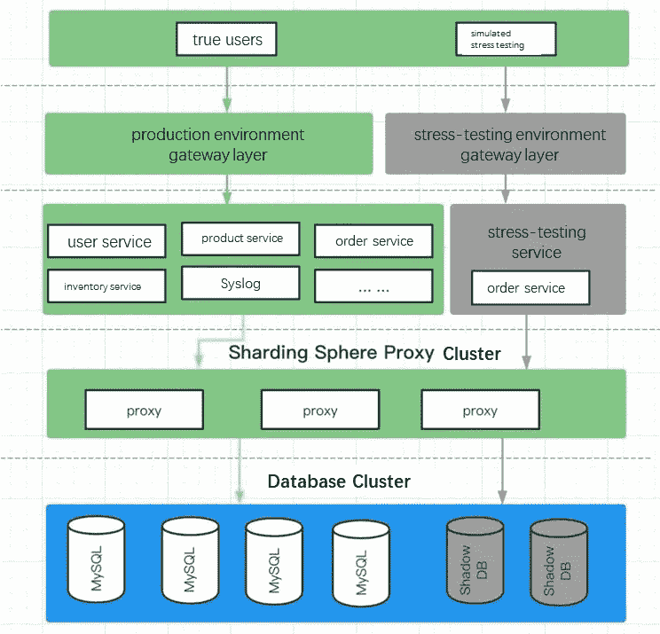
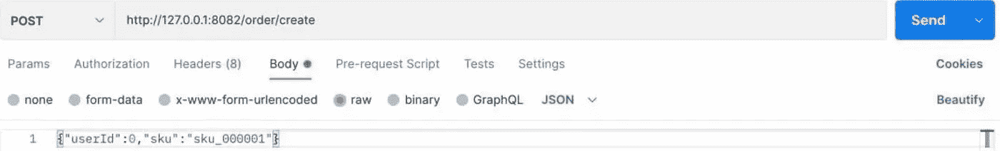
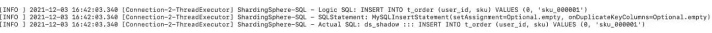
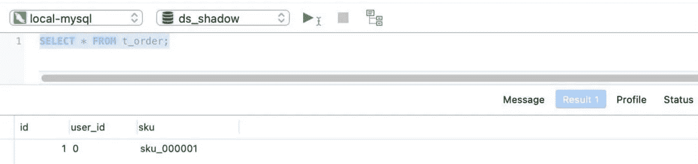
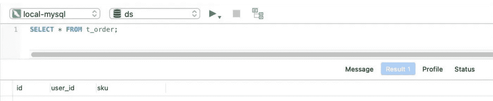

# 生产数据库的全链接在线压力测试:Apache ShardingSphere 影子数据库功能升级

> 原文：<https://blog.devgenius.io/full-link-online-stress-testing-for-production-database-apache-shardingsphere-shadow-database-84f7cba56f99?source=collection_archive---------7----------------------->

# 什么是全链路压力测试？

随着互联网行业的快速发展，处理大量数据的企业也在快速扩张。

可以预见，不断变化的客户需求会对整个系统的稳定性产生重大影响。例如，在线食品交付平台在中午和晚上接收大部分客户订单。网上购物狂欢和限时促销也是很好的例子。

所有业务都由一系列业务系统提供服务，这些系统分布在不同的机器上。“数据规划”不仅能确保系统的稳定性，还能节省成本，这是技术团队面临的一些主要问题。

为了从特定的机器上精确地获得正确的服务，压力测试应该在生产环境中进行。这样可以保证环境和数据的真实性，显著提高“数据规划”的精度。

# 影子数据库和全链路压力测试

对在线业务系统进行压力测试显然是有风险的。例如，可能会出现数据损坏或性能问题。

想象一下，如果客户发现他们的订单丢失或弹出一个未付款的订单，这将如何影响客户体验？

全链路在线压力测试意味着大量复杂的工作，需要微服务和中间件之间的合作。 [Apache ShardingSphere](https://shardingsphere.apache.org) 专注于全链路压力测试中的数据库级解决方案。

借助 ShardingSphere 强大的 SQL 解析能力，Apache ShardingSphere 发布了影子数据库压力测试功能，通过执行 SQL 来确定影子数据库，并通过影子算法的灵活配置来满足复杂业务场景下的在线压力测试需求。通过将压力测试流量路由到影子数据库，将正常在线流量路由到生产数据库，压力测试数据将被隔离，数据损坏问题将得到解决。

# 影子数据库功能升级

影子数据库功能最初是在 4.1.0 版本中通过添加逻辑影子列实现的。通过解析、执行、路由和重写 SQL，Apache ShardingSphere 删除了影子列和列值。在此过程中，用户不需要进行任何设置或操作。他们只需要相应地修改 SQL，添加影子字段和相应的配置。

## 添加影子列时会出现两个棘手问题:

1.  在进行压力测试之前，用户需要根据实际业务需求修改测试相关的 SQL。
2.  SQL 修改会增加实现损害，降低压力测试结果的准确性。在 ShardingSphere 社区讨论之后，我们决定升级影子数据库功能。Apache ShardingSphere 4.1.1 GA 影子数据库 API 具有相对简单的功能。是否打开影子数据库由 logicColumn 的相应值决定。

```
rules:
- !SHADOW
 column: # shadow field nam
 shadowMappings:
 ds: shadow_ds # production data source name list: shadow database name list
```

5.0.0 GA 升级后的影子数据库 API 更加强大。用户可以通过“启用”属性确定是否启用影子数据库功能。可配置的影子表可以通过表格的方式确定需要进行压力测试的内容，并支持多种影子算法。比如列值匹配算法，正则表达式匹配，SQL 注释匹配算法。

```
rules:
- !SHADOW
  enable: true # shadow databasepn-off switch. Optional value: true/false, default false
  dataSources:
    shadowDataSource:
      sourceDataSourceName: ds # productionDataSourceName
      shadowDataSourceName: shadow_ds # shadowDataSourceName
  tables:
    <shadow-table-name>:
      dataSourceNames: shadowDataSource # #NameListOfShadowDataSourcesRelatedtoShadowDatabases (separate multiple values with ",")
      shadowAlgorithmNames: 
        - <shadow-algorithm-name> # #NameListOfShadowAlgorithmsRelatedtoShadowDatabases
  shadowAlgorithms:
    <shadow-algorithm-name>:
      type: # shadowAlgorithmType
      props: 
        xxx: xxx # shadowAlgorithmAttributeConfiguration
```

# 实践中的影子数据库

在线全链路压力测试图:



## 准备压力测试环境:

假设一个电子商务网站需要对一个订单进行在线压力测试(演示如何使用独立部署)。假设压力测试表`t_order`是一个订单表，测试用户 ID 为 0。

测试用户订单生成的数据在 ds_shadow 影子数据库上执行，生产数据在 ds 生产数据库上执行。

**准备测试环境:**

1.  从[下载页面](https://shardingsphere.apache.org/document/5.0.0/en/downloads/)下载 ShardingSphere-Proxy 5.0.0 GA，安装配置详情请参考[sharding sphere-Proxy-Quick-Start](https://shardingsphere.apache.org/document/current/en/quick-start/shardingsphere-proxy-quick-start/)。
2.  在上面提到的假设压力测试场景中配置 ShardingSphere-Proxy:

**server.yaml**

```
rules:
  - !AUTHORITY
    users:
      - root@%:root
      - sharding@:sharding
    provider:
      type: NATIVE
  - !TRANSACTION
    defaultType: XA
    providerType: Atomikosprops:
  max-connections-size-per-query: 1
  executor-size: 16  # Infinite by default.
  proxy-frontend-flush-threshold: 128  # The default value is 128.
  proxy-opentracing-enabled: false
  proxy-hint-enabled: false
  sql-show: true
  check-table-metadata-enabled: false
  lock-wait-timeout-milliseconds: 50000 # The maximum time to wait for a lock
  show-process-list-enabled: false
    # Proxy backend query fetch size. A larger value may increase the memory usage of ShardingSphere Proxy.
    # The default value is -1, which means set the minimum value for different JDBC drivers.
  proxy-backend-query-fetch-size: -1
  check-duplicate-table-enabled: false
  sql-comment-parse-enabled: true
  proxy-frontend-executor-size: 0 # Proxy frontend executor size. The default value is 0, which means let Netty decide.
    # Available options of proxy backend executor suitable: OLAP(default), OLTP. The OLTP option may reduce time cost of writing packets to client, but it may increase the latency of SQL execution
    # if client connections are more than proxy-frontend-netty-executor-size, especially executing slow SQL.
  proxy-backend-executor-suitable: OLAP
```

**config-shadow.yaml**

```
schemaName: shadow_poc_databasedataSources:
  ds:
    url: jdbc:mysql://127.0.0.1:3306/ds?serverTimezone=UTC&useSSL=false
    username: root
    password:
    connectionTimeoutMilliseconds: 30000
    idleTimeoutMilliseconds: 60000
    maxLifetimeMilliseconds: 1800000
    maxPoolSize: 50
    minPoolSize: 1
  ds_shadow:
    url: jdbc:mysql://127.0.0.1:3306/ds_shadow?serverTimezone=UTC&useSSL=false
    username: root
    password:
    connectionTimeoutMilliseconds: 30000
    idleTimeoutMilliseconds: 60000
    maxLifetimeMilliseconds: 1800000
    maxPoolSize: 50
    minPoolSize: 1rules:
- !SHADOW
  enable: true
  dataSources:
    shadowDataSource:
      sourceDataSourceName: ds
      shadowDataSourceName: ds_shadow tables:
    t_order:
      dataSourceNames:
        - shadowDataSource
      shadowAlgorithmNames:
        - user-id-insert-match-algorithm
        - simple-note-algorithm shadowAlgorithms:
    user-id-insert-match-algorithm:
      type: COLUMN_REGEX_MATCH
      props:
        operation: insert
        column: user_id
        regex: "[0]"
    simple-note-algorithm:
      type: SIMPLE_NOTE
      props:
        foo: bar
```

3.订单服务

这里不讨论订单相关的业务。以最简单的请求获取和订单表插入为例，订单表结构如下:

*   订单表结构

```
CREATE TABLE `t_order` (
    `id` INT(11) AUTO_INCREMENT COMMENT 'Order ID',
    `user_id` VARCHAR(32) NOT NULL COMMENT 'User ID',
    `sku` VARCHAR(32) NOT NULL COMMENT 'Product ordered sku',
    PRIMARY KEY (`id`)
)ENGINE = InnoDB COMMENT = 'order table';
```

## 压力测试过程模拟

*   使用`postman`模拟测试用户创建的订单，如下所示:



*   路由到影子数据库并在其中执行的 SQL 执行器可以在 ShardingSphere-Proxy 执行日志中看到:



## 验证压力测试结果:

*   影子数据库`ds_shadow`执行查询语句`SELECT * FROM t_order;`

查询结果:



*   生产数据库 ds 执行查询语句`SELECT * FROM t_order;`查询结果:



从测试用户订单创建中生成的数据将被发送到影子数据库。对于更复杂的配置，请参考 [ShardingSphere 官方文档](https://shardingsphere.apache.org/document/5.0.0/cn/features/shadow/)中的影子数据库压力测试。

## 全链路在线压力测试的完整解决方案—cyborflow

如简介中所述，全链路在线压力测试是一项复杂的任务，需要微服务和中间件之间的协作，以满足不同流量和压力测试标签传输的需求。

另外，测试服务应该是无状态的，并且可以立即使用。[由 Apache ShardingSphere、Apache APISIX 和 Apache SkyWalking 共同维护的 cyborflow](https://github.com/SphereEx/CyborgFlow)，提供开箱即用(OoTB)的解决方案，在你的在线系统中运行负载测试。

[Apache APISIX](https://apisix.apache.org) 负责在网关层对测试数据做标签，而 [Apache SkyWalking](https://skywalking.apache.org) 负责通过整个调度链路进行传输，最后 Apache ShardingSphere-Proxy 会隔离数据并将测试数据路由到影子数据库。

CyborgFlow 的 0.1.0 版本已经[发布，可供下载。](https://github.com/SphereEx/CyborgFlow/releases)

# Apache ShardingSphere 开源项目链接:

[ShardingSphere Github](https://github.com/apache/shardingsphere)

[ShardingSphere Twitter](https://twitter.com/ShardingSphere)

[切割球松弛通道](https://join.slack.com/t/apacheshardingsphere/shared_invite/zt-sbdde7ie-SjDqo9%7EI4rYcR18bq0SYTg)

[投稿指南](https://shardingsphere.apache.org/community/cn/contribute/)

**作者**

后洋

> *SphereEx 中间件开发者，Apache ShardingSphere 贡献者。*
> 
> 目前，他专注于 ShadowDB 和全链路压力测试的设计和开发。

