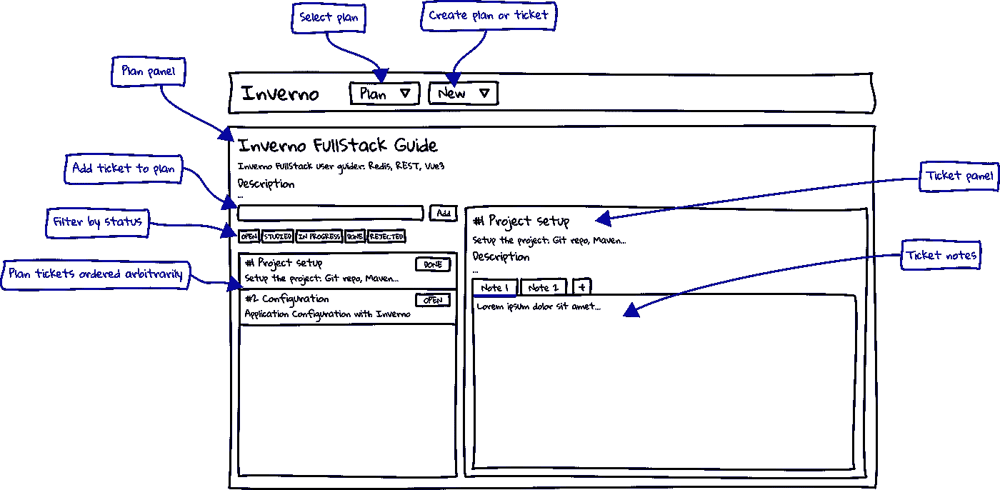
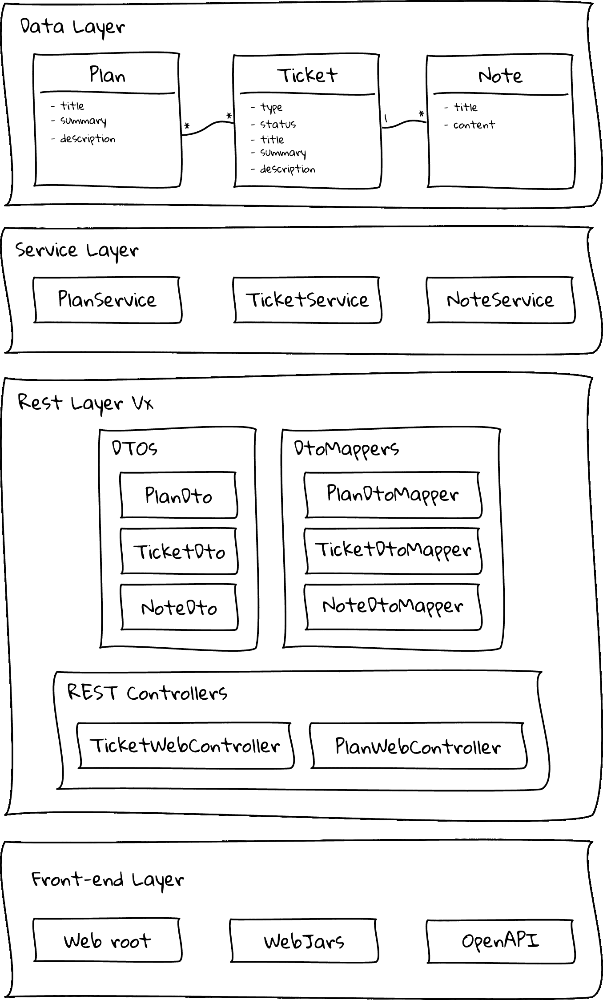
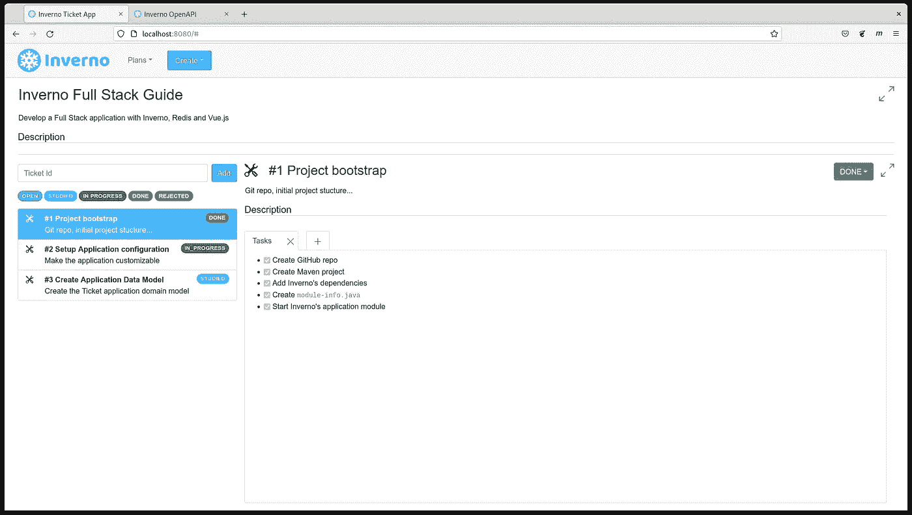
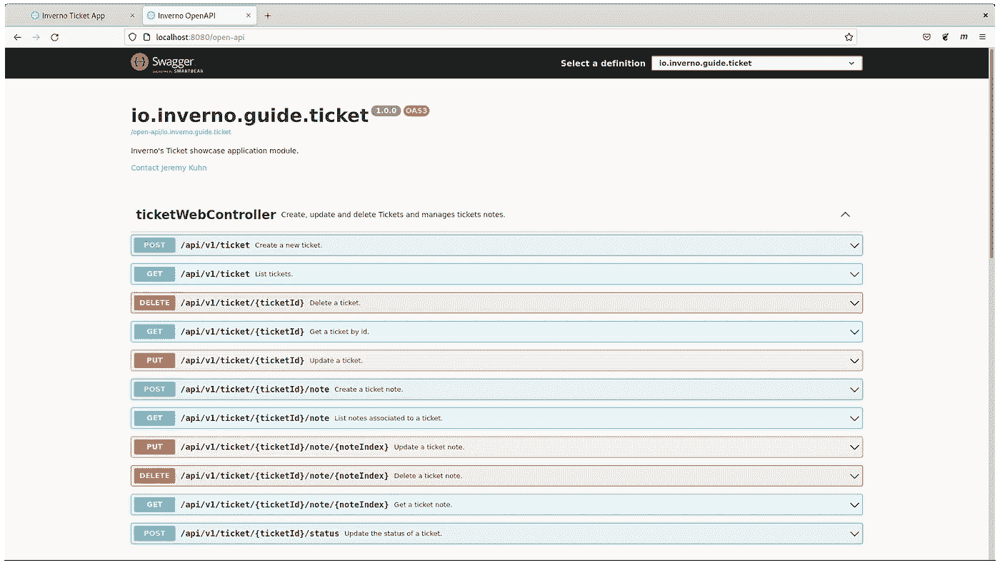

# 使用 Inverno 进行全栈应用开发

> 原文：<https://blog.devgenius.io/full-stack-application-development-with-inverno-3cffc61680e0?source=collection_archive---------12----------------------->

基于 Inverno 框架的全栈应用

我最近发布了一个[用户指南](https://inverno.io/docs/redis-vue3-fullstack/html/index.html)，解释了如何使用 [Inverno 框架](https://inverno.io)创建一个全栈应用，并将其部署到一个容器映像注册中心，这样它就可以很容易地部署在云平台上。这是在最近向框架中添加了数据访问客户端模块之后。我只是想证明，Inverno 框架现在非常适合开发覆盖整个堆栈的高效生产就绪型应用程序。

事实上，Inverno 框架现在提供了足够的特性来构建专业应用程序，包括:

*   模块化的编译时 IoC/DI，有助于开发高度模块化的应用程序，同时以较低的运行时占用空间提供高性能和快速启动
*   各级反应式编程
*   一个高性能的 HTTP 服务器，可以通过 HTTP/2 提供静态和动态资源
*   一个 Web 模块，通过自动生成 OpenAPI 规范来高效开发 REST 服务
*   数据访问客户端模块，包括 RDBMS 和 Redis 客户端
*   高级配置功能
*   构建工具，将优化的应用程序映像打包并发布到容器注册中心，以便轻松部署到云平台

最终，结果超出了我的预期，该框架在开发的所有阶段都做了令人惊叹的工作，产生了一个清晰、组织良好、简洁和完全反应式的代码，简单地完成了工作。

在本文中，我将尝试总结使用 [Inverno 框架](https://inverno.io)、 [Redis](https://redis.io) 和 [Vue.js](https://v3.vuejs.org/) 创建和部署全栈应用程序的各个步骤。目标是给你主要的方向，所以你可以提出自己的意见，如果你想更深入，请看看完整的[用户指南](https://inverno.io/docs/redis-vue3-fullstack/html/index.html)，它提供了一步一步的详细解释。该应用的完整代码也可以在 [GitHub](https://github.com/inverno-io/inverno-apps/tree/1.0.0/inverno-ticket) 中找到。

# 门票申请

我们将要构建的应用程序是一个简单的任务或票证管理系统，它允许将票证分组和组织到计划中，其中一个票证有一个状态和一个或多个注释。由于一张图片胜过千言万语，下面的线框显示了应用程序最终可能的样子:

Inverno 票证应用线框

该架构是使用 Redis 作为数据存储的典型全栈应用程序的架构，其中一个服务层用于访问数据存储，一个 REST 层用于将这些服务暴露给前端，该前端包含一个使用 [Bootstrap](https://getbootstrap.com/) 和 [Vue.js](https://v3.vuejs.org/) 构建的单页面应用程序。

所有静态资源，包括外部前端库，都将由应用程序提供服务。另外，REST API 的 [OpenAPI](https://www.openapis.org/) 规范会自动生成，并在一个 [SwaggerUI](https://swagger.io/tools/swagger-ui/) 中公开。

应用程序将最终打包并发布到本地 [Docker](https://www.docker.com/) 寄存器，并使用 [Docker Compose](https://docs.docker.com/compose/) 运行。

# 启动项目

首先要做的是创建一个 Inverno 应用程序模块项目，它是一个常规的 Maven Java 项目设置，具有 Inverno 框架依赖性，并且包括一个 Inverno 模块描述符和一个应用程序入口点，因为这是一个应用程序，以便引导应用程序模块。

ticket 应用程序是一个完整的应用程序，它需要配置、日志、访问 Redis 数据存储和一个 HTTP 服务器来公开 REST 服务，并为静态资源和 WebJars 提供服务。Maven 项目描述符应该声明以下依赖项:

pom.xml

我们现在可以通过定义一个用`@io.inverno.core.annotation.Module`注释的 Java 模块描述符来设置 Inverno 应用程序模块，使其成为一个支持 IoC/DI 的 Inverno 模块。模块内使用的依赖关系必须按照 [Java 平台模块系统](https://en.wikipedia.org/wiki/Java_Platform_Module_System)的定义明确声明。

src/main/java/模块信息. Java

上面的代码实际上是我们生成一个提供全功能 HTTP 服务器和 Redis 客户端的 Inverno 模块类所需的全部内容。让我们定义应用程序入口点并启动应用程序模块:

src/main/Java/io/inverno/guide/ticket/app . Java

构建 Inverno 框架是为了提供自由和控制，控制模块如何在一个模块中组成，以及暴露什么特性。应用程序模块目前是不可配置的，我们必须明确地公开应用程序的哪些部分是可配置的。我们使用 Boot、Web 和 Redis 客户端模块，它们都公开了配置 beans。然后，我们必须创建一个配置 bean，再次公开它们以使这些配置可访问，既然我们已经在这里，让我们也定义一个配置属性，以便能够配置 Web 根文件夹的位置:

src/main/Java/io/inverno/guide/ticket/app configuration . Java

现在可以通过编程注入应用程序配置，但是我们可能更喜欢从配置源加载配置。为此，我们必须定义一个套接字 bean，并在启动模块时使用它来注入我们选择的配置源:

src/main/Java/io/inverno/guide/ticket/app . Java

Inverno 提供了几个配置源实现，您可以根据需要使用，但是您也可以提供自己的实现。`BootstrapConfigurationSource`实现特别适合引导应用程序，因为它以特定的顺序扫描几个本地源来解析配置属性:命令行参数、系统属性、环境变量和不同位置的配置文件。

应用程序现在是可配置的，例如，我们可以在启动应用程序时指定 HTTP 服务器的端口。

在命令行上:

在嵌入模块的配置文件中:

src/main/resources/configuration . cprops

# 创建后端服务

我们现在已经准备好开发票务应用程序，从后端服务开始。该应用遵循典型的[多层架构](https://en.wikipedia.org/wiki/Multitier_architecture)，可概括为以下草图:

Inverno 票证应用程序架构

**数据层**非常基本，由作为 JSON 序列化/反序列化到 Redis 数据存储中的 POJOs 组成，下面是`Plan`数据模型的样子:

src/main/Java/io/inverno/guide/ticket/internal/model/plan . Java

请注意我们是如何定义计划和票据之间的关系的，Inverno 是完全反应式的，在这里使用`Flux<Ticket>`允许延迟加载与计划相关联的票据。

**服务层**包含用于管理 Redis 数据存储中的计划、票据和笔记的服务，下面是`PlanService`的样子:

src/main/Java/io/inverno/guide/ticket/internal/service/planservice . Java

正如您所看到的，引导模块中提供的全局 Jackson 对象映射器、Redis 客户端模块中提供的 Redis 客户端和票证服务被注入到构造函数中，因为它们是必需的依赖项。

在`savePlan()`方法中，我们使用 Redis 客户端来创建或更新计划。如你所见，使用简洁流畅的语法，一切都是被动的。

**REST 层**包含 dto 以及相应的映射器和 Web 控制器，它们定义了将服务层公开为 REST 端点的 Web 路由。这一层中的所有组件也是版本化的，并遵循微服务最佳实践，允许应用数据模型独立于公共 REST API 发展。

在这个非常简单的应用程序中，dto 或多或少是应用程序数据模型的一对一映射。我们有两个 Web 控制器:公开计划资源的计划 Web 控制器和公开票据资源和相关票据资源的票据 Web 控制器。下面是`TicketWebController`的样子:

src/main/Java/io/inverno/guide/ticket/internal/rest/v1/ticket web controller . Java

票证 Web 控制器中定义的所有 Web 路由都是相对于根路径`/api/v1/ticket`的。它依靠服务层访问 Redis 数据存储中的数据，并依靠 DTO 映射器将数据与 dto 相互转换。请求和响应主体根据消费和生产的媒体类型自动序列化/反序列化。正如您在`createPlan()` route handler 方法中看到的，一切都是被动的，语法也是简洁流畅的。您还可以注意到`201`状态是如何用响应中的`location`头设置的，路径构建器是您可以实现 REST 服务的众多特性之一。Inverno Web 编译器插件还根据 Web 控制器的 JavaDoc 注释自动生成 [OpenAPI](https://www.openapis.org/) 规范。

# 创建前端

票证应用程序 UI 资源放在前面配置的 Web 根文件夹中。Web UI 包含一个用 [Bootstrap](https://getbootstrap.com/) 和 [Vue.js](https://v3.vuejs.org/) 开发的单页应用程序。除了 Web UI 资源之外，还需要几个打包成 WebJars 的外部 UI 库，它们必须由 HTTP 服务器和生成的 OpenAPI 规范提供服务。

在引导项目时，我们已经声明了所有必需的依赖项，现在我们必须配置 Inverno Web 路由器来服务这些静态资源。这可以使用 Web 路由配置器轻松完成:

src/main/Java/io/inverno/guide/ticket/internal/staticwebroutesconfigurer . Java

Inverno Web 模块提供了内置的配置器和路由处理程序来完成这项任务。欢迎页面(应用程序的入口点)映射到 HTTP 服务器的根路径，Web 根文件夹映射到`/static/`路径，类路径或模块路径中的 Webjars 资源映射到`/webjars/[WEBJAR_NAME]/`(版本自动解析)，最后，OpenAPI routes 配置器定义 Web 路由`/open-api`，将 REST API 规范公开为 YAML 或 Swagger UI。

# 构建并部署到云

到目前为止，我们使用了 Inverno Maven 插件来运行应用程序，现在我们将使用它来创建应用程序的优化自包含映像，并自动将其部署到本地 Docker 注册表。

为了生成和部署生产映像，我们必须专门配置插件:

pom.xml

在上面的配置中，我们为内存和 GC 配置设置了几个 VM 选项，向一些模块开放了一些包，以避免与尚未迁移到 Java 模块的依赖项相关的运行时错误，并添加了 Netty 的本机传输模块，以便使用本机传输来获得更好的性能。还声明了一个卷，它将应用程序日志保存在容器之外。

我们现在可以构建一个应用程序映像，它将自动部署到本地 Docker 注册表:

现在，如果我们想在云平台上运行应用程序，例如使用 Docker compose，我们可以创建一个包括应用程序映像和 Redis 数据存储的部署描述符:

docker-compose.yml

使用上面的`docker-compose.yml`文件，我们最终可以运行完整的应用程序:

在`[http://localhost:8080](http://localhost:8080:)` [:](http://localhost:8080:) 应该可以访问应用程序 UI

Inverno 票证应用程序 UI

REST API 规范已经在编译时自动生成，应该可以在`[http://localhost:8080/open-api](http://localhost:8080/open-api:)` [:](http://localhost:8080/open-api:) 访问

Inverno 票证应用程序 REST API

Inverno ticket 应用程序的完整代码可以在 [GitHub](https://github.com/inverno-io/inverno-apps/tree/1.0.0/inverno-ticket) 中找到。如果您想更深入地了解，请查看完整的[全栈应用用户指南](https://inverno.io/docs/redis-vue3-fullstack/html/index.html)，其中提供了每一步的详细解释。

# 减去

渐渐地， [Inverno framework](https://inverno.io) 正在向一个专业的 Java 应用程序开发框架发展，现在可以用来开发连接到 RDBMS 和 Redis 数据存储的全栈应用程序，公开 REST API，并在完全可配置的同时提供静态 Web 资源。

编译时 IoC/DI 和反应式编程与非阻塞 I/O 的结合允许创建具有低运行时占用空间的高性能和高效的应用程序，这些应用程序可以快速启动，并利用有限的硬件资源吸收非常高的吞吐量。如果我们添加可以生成优化的应用程序映像并将其直接部署到容器注册表中的 Inverno 构建工具，我们将获得一个完美的 Java 应用程序框架，用于开发值得考虑的现代云应用程序。