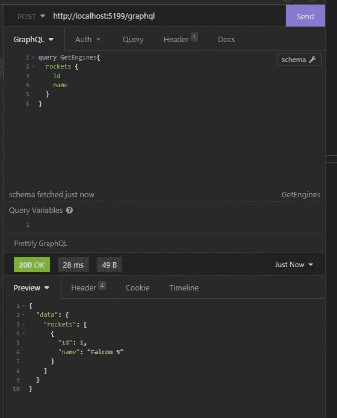

# 全栈反应和。NET 与 GraphQL

> 原文：<https://blog.devgenius.io/full-stack-react-and-net-with-graphql-a1bd615c05a0?source=collection_archive---------3----------------------->

互联网上总是有关于 net 和 HotChocolate 或 Apollo client with React 的教程，但从来没有两者都有。这有几个原因，也许团队不是全栈的，或者根本没有必要这样做，因为技术是分开工作的。这都是真的，但是是时候有个由头到尾了。这将是关于微前端和微应用的不同文章的序言。

# 演出的明星

本教程将有最少的**来让堆栈工作。这个教程的结果就是[这里的*这里的*](https://github.com/enoch3712/GraphQLNetApollo) **。****

## *GraphQL*

*文章的中心是 Graphql，我发现了一个很好的引用:*

> *[GraphQL 是一种用于 API 的查询语言，也是一种使用现有数据完成这些查询的运行时。](https://graphql.org/)*

## ***数据库(后端)***

*这里的数据库无关紧要，它是不可知的，只要有它的驱动程序。我将在内存 中使用 [**。**](https://entityframeworkcore.com/providers-inmemory)*

## *EF 核心(后端)*

*NET 生态系统中的 go-to ORM 将被用作我们实体的供应商。您也可以使用列表或任何 IEnumerable。*

## *热巧克力(后端)*

> *这是微软的一个开源 GraphQL 服务器。NET 平台，符合最新的 GraphQL 2021 年 10 月 spec +草案，这使得热巧克力兼容所有 graph QL 兼容的客户端，如草莓摇一摇，中继，阿波罗客户端，以及各种其他客户端和工具。*

*对，就是这样。为您的 API 提供强大的 GraphQL 功能。我就不多延伸了，大家都用。*

## *GraphQL 代码生成器(codegen)*

*这是一个来自 [the-guild](https://www.the-guild.dev/) 的[开源](https://github.com/dotansimha/graphql-code-generator)项目，它基于后端模式生成模板代码来使用已经创建的查询。我敢打赌，这是一款非常棒的软件，很多人都没有使用它，或者没有充分发挥它的潜力。*

## ***阿波罗客户端***

*Apollo 是 GraphQL 各方面的市场领导者。在这种情况下，我们唯一需要的是包 **"@apollo/client"** ，它将执行请求并缓存我们的对象。*

*另一种方法是使用 React Query 和 GraphQL 请求客户端。*

***React/NextJS***

*这适用于任何 React 风格，所以如果想使用 NextJS 或任何其他风格都没问题。*

# *后端*

*为后端搭建舞台总是以同样的方式开始:*

**

*ASP。带控制器的 NET Core 启动模板*

## *模型*

*没有博客文章用例，我们可以做得更好:*

**

*实体领域模型*

## *EF 核心环境*

*首先，您需要以下软件包:*

**

*必需的 EF 核心 NuGet 包*

*我将使用内存，你很可能会使用任何其他驱动程序。让我们来看一下背景:*

**

*带有一些种子的上下文*

*现在我们可以将其注册为服务:*

**

*内存上下文注册*

## *GraphQL 集成*

*一般来说，关于依赖注入、对象类型和模式的使用，我将尽可能保持简单。所以 NuGets:*

**

*热巧克力果仁*

*热巧克力在很多工具中包含优秀的支持，EF Core 或者 Voyager 就是其中的两个。让我们创建一个简单的查询文件来公开我们的实体:*

**

*基本查询示例*

*任何服务都可以被注入到查询中，只要用属性**【服务】注册。**在我们的例子中，我们需要 IQueryable 来公开我们的实体，它将用 GraphQL 的其余选项来修饰。为了举例，我们在这里加上“*”*:*

**

*基于注释*

*代码优先的通常更适合更大的项目，但是让我们保持简单，把实体作为一个聚合根。我们现在唯一需要的是将查询添加到启动中:*

**

*启动时添加 GraphQL 服务器*

*我们现在可以添加 Voyager，这样我们就可以看到 GraphQL 模式中实体之间的关系。*

> *> dotnet 添加包 GraphQL。航海家*

*这不是热巧克力，但是你可以用那个。然后你只需要把下面的那行代码添加到 app 之前的 *program.cs* 。Run() *:**

**

*运行程序，转到“/graphql-voyager”并查看结果:*

**

*航海家号交互图*

**

*失眠*

*另外，让我们打开 CORS，这样我们就可以在前端测试时不会出现任何问题:*

**

*后端添加了 Cors 策略*

# *前端*

*我将使用[创建一个新的 React 应用](https://create-react-app.dev/docs/adding-typescript/)。此外，将 Typescript 放在那里:*

> **>*yarn create react-app my-app—模板打字稿*

*这是基本模板，它将获得其余的工具，如 Apollo 客户端。*

> *>纱线添加图表 ql*
> 
> *>纱线添加@阿波罗/客户端*
> 
> *> yarn add @graphql-codegen/cli*
> 
> **>纱加*[*@ graph QL*](http://twitter.com/graphql)*-codegen/typescript*[*@ graph QL*](http://twitter.com/graphql)*-codegen/CLI*[*@ graph QL*](http://twitter.com/graphql)*-codegen/typescript-operations*[*@ graph QL*](http://twitter.com/graphql)*-codegen/typescript-react**

*本教程需要所有这些命令。更多可以在[这里](https://www.graphql-code-generator.com/docs/getting-started/installation)和[这里](https://www.youtube.com/watch?v=PYDGjTufGsk&ab_channel=JamieBarton)找到。现在，在我们做任何事情之前，我们需要用以下命令创建 codegen 配置:*

> *>纱线图 ql-codegen init*

*然后查看以下配置:*

**

*Peek React 应用*

**

*我们的 GraphQL 端点*

**

*生成模板时要读取哪些文件*

*这个很重要。我们告诉 codegen 在生成模板代码时检查要查看的文件。*

****

*生成的代码将存放到的文件*

**

*配置的其余部分*

*之后不要忘记运行 **npm 安装**或**纱线**。这将创建用于创建 GraphQL 请求代码的 codegen 文件。*

**

*代码文件*

*现在让我们把上面的查询放到一个文件中:*

**

*GraphQL 查询*

*我们剩下要做的唯一一件事就是用 **codegen:** 生成代码*

*>纱线运行代码*

**

*运行命令和结果*

*如果一切顺利，您应该会得到下面的结果:*

**

*结果文件*

*这将是一个很大的文件，包含了从类型到钩子的所有内容，我们将在我们的组件中使用它。*

**

*生成的挂钩*

*好吧，让我们做些漂亮的事情。当然，我不会编码，因为我有幸拥有终极懒惰男孩工具——open ai Codex。*

**

*OpenAI Codex 生成的代码*

*好了，我们可以走了！嗯，差不多！让我们将 ApolloProvider 添加到我们的应用程序中:*

**

*使阿波罗应用程序工作的基本配置*

*让我们看看结果:*

**

*是的，它确实有效！这可以在将来用作模板，因为它是一个准系统模板。希望你喜欢它，再次，代码是[这里](https://github.com/enoch3712/GraphQLNetApollo):)。*