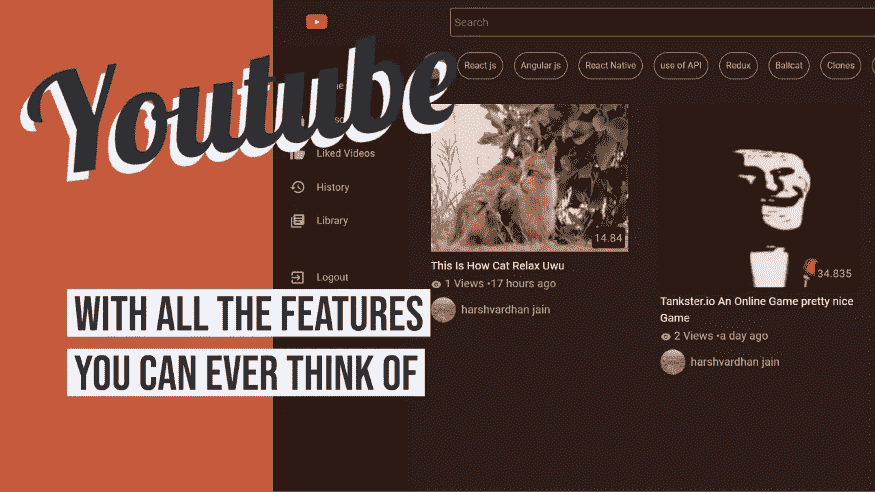
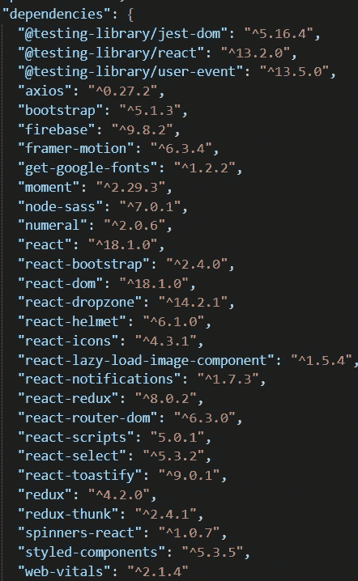
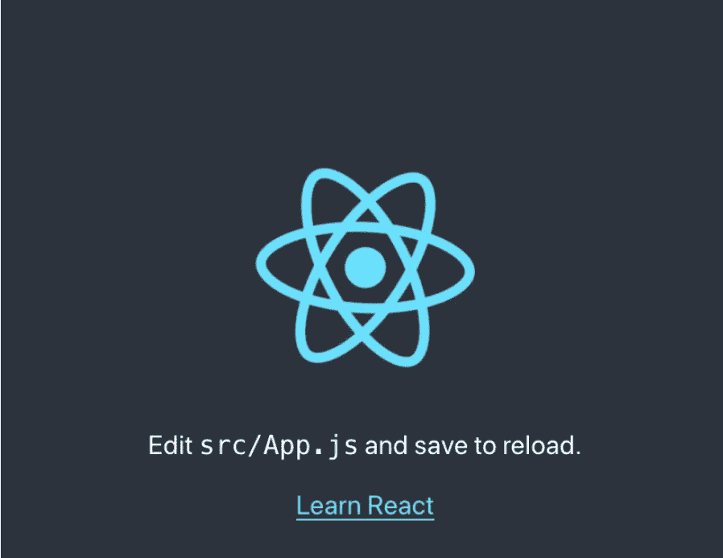
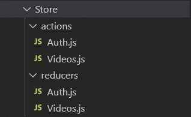
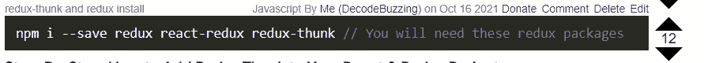
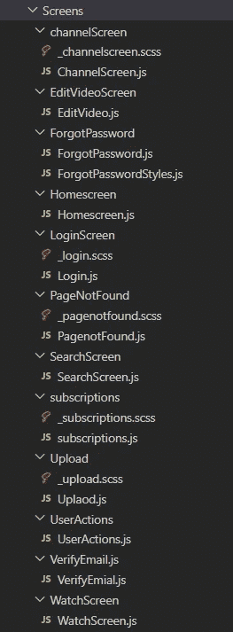
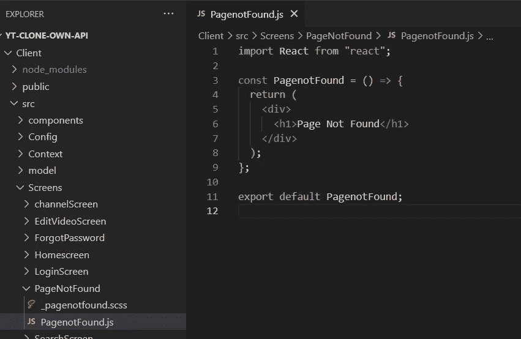

# 使用 Firebase、FFmpeg 和 React 克隆功能齐全的 Youtube 第 2 部分]

> 原文：<https://blog.devgenius.io/fully-functional-youtube-clone-using-firebase-ffmpeg-and-react-part-2-9cde7979150d?source=collection_archive---------6----------------------->

一个 youtube 的精确克隆，从查看计数到使用 Firebase、FFmpeg 和 React 订阅所有内容(没有 Youtube Api)的所有功能



youtube 克隆

# 注意

这个项目将在 5 个部分显示*因为这是一个大项目，在一篇文章中解释所有的事情会很棘手，我也不想让这篇文章长 1 小时🙂🙂。还有，这篇文章**并不适合*完全*的初学者。**只要有一点关于 react 的知识，你应该能坚持下去:)，这不会很难，我会尽力解释所有的事情；)*

# *GitHub 代码*

*Github 代码已经上传[这里](https://github.com/harsh317/Youtube-CLone-ReactJs)！你可以去看看！*

*[](https://github.com/harsh317/Youtube-CLone-ReactJs) [## GitHub-harsh 317/Youtube-CLone-react js:Youtube 的精确克隆，具有来自…

### youtube 的一个精确的克隆，具有从查看计数到订阅所有内容的所有功能(没有 Youtube Api)…

github.com](https://github.com/harsh317/Youtube-CLone-ReactJs) 

在这一部分，我们将创建 app 的框架，从添加 redux 到添加所有带有虚拟数据的屏幕，最后添加 routes。


现在我们可以开始了。话虽如此，我们还是开始吧！！* 

# *我们需要的所有包裹*

**

*我们需要的节点包*

*这些都是我们将需要的软件包，我们也将逐步安装它们，但你可以把这个截图作为参考:)*

# *创建基本应用程序并开始使用*

*好了，让我们快点开始吧！只需创建一个新的 react 应用程序并首先运行它*

```
*npx create-react-app my-app
cd my-app
npm start*
```

*嗯，我们现在有起点了:)*

**

# *向我们的应用添加 Redux*

*在应用程序的`src`文件夹中，只需创建一个“Store”文件夹，然后再创建 2 个文件夹*

1.  *行动*
2.  *还原剂*

*类似于下面的文件:*

**

*还原文件*

## *1.我们的“视频”减少器*

*这些将是我们的`videos.js`减速器的初始状态*

*视频缩减器*

## *1.我们的“授权”减少器*

*这些将是我们的`Auth.js`减速器的初始状态*

*Auth.js 减速器*

*现在只需使用以下命令安装 redux😳😳😳*

**

*太懒了 ikikik*

## *编辑 App.js 并完成 Redux(暂时)*

*在上面的屏幕中，我们也导入了一些屏幕*对吗？*那么，让我们创建这些屏幕，并向其中添加一些虚拟数据！*

# *创建虚拟屏幕*

*因此，在 src 文件夹中创建一个*“屏幕文件夹*”，并在其中创建包含以下文件的文件夹。*

**

*屏幕*

*可以看到 come SASS 文件(`.scss`)文件。如果你没有听说过 sass，这里有一些来自 [w3schools](https://www.w3schools.com/sass/sass_intro.php) 的基本信息*

> ***Sass** 代表**S**yn 战术上**A**we some**S**style**S**sheet*
> 
> *Sass 是 CSS 的扩展*
> 
> *Sass 是一个 CSS 预处理器*
> 
> *Sass 完全兼容 CSS 的所有版本*
> 
> *Sass 减少了 CSS 的重复，因此节省了时间*
> 
> *萨斯由汉普顿·卡特林设计，由娜塔莉·韦岑鲍姆于 2006 年研发*
> 
> *Sass 可以免费下载和使用*

*这并不复杂，但我会试着在我们编码时解释 sass 文件:)*

# *添加一些基本的虚拟数据*

*现在只需添加一些基本的虚拟数据到所有的屏幕*中，如下图所示。我们将在开始实现各种功能时编辑代码**

## *基本 Js 文件*

*只需在所有屏幕上添加一些基本代码。**记住更改组件名称并按文件导出***

*例如，我将这段基本代码添加到我的页面未找到屏幕中*

**

*找不到页面屏幕示例*

*你对所有的屏幕做同样的事情。*暂时将 sass 文件留空**

## *基本 sass 文件*

**暂时让 sass 文件为空。我们会逐渐填满它**

# *添加路线*

*现在是添加所有路线的时候了。我们已经准备好了屏幕，并添加了一些基本数据。为什么不创造一些路线呢？此外，通过添加路线，我们只是在创建应用程序的框架。*

**

*因此，我们在应用程序中添加了路线！现在我想我会用它来结束这一部分。在下一部分中，我们将向 firebase 添加几个来自`ProtectedRoute`的特性，并进一步使用一个上下文 API:)*

*我希望你喜欢这一部分，我很快会带着另一部分回来！到那时为止*

*在那之前保持安全，保持健康*

***谢谢***