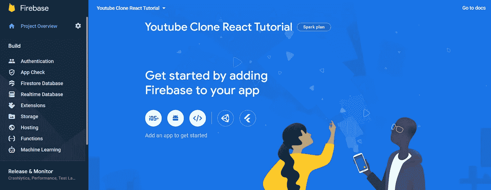
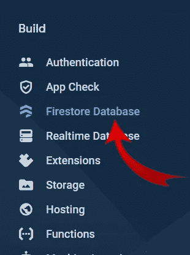
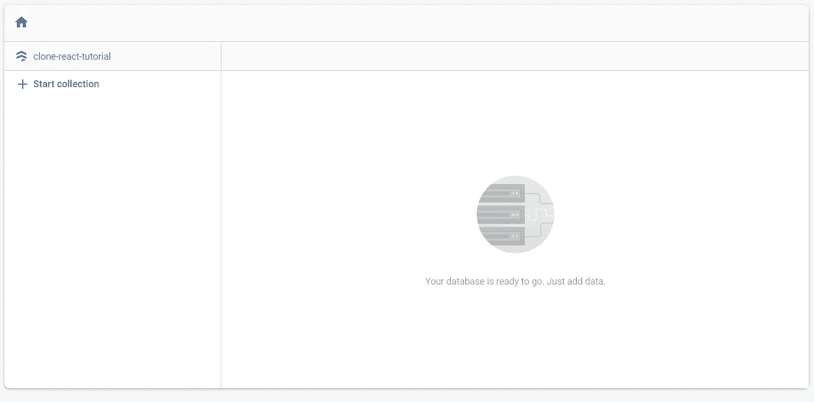
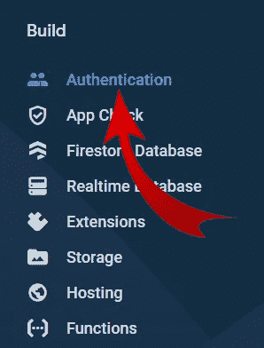
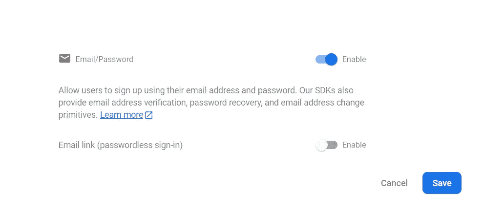
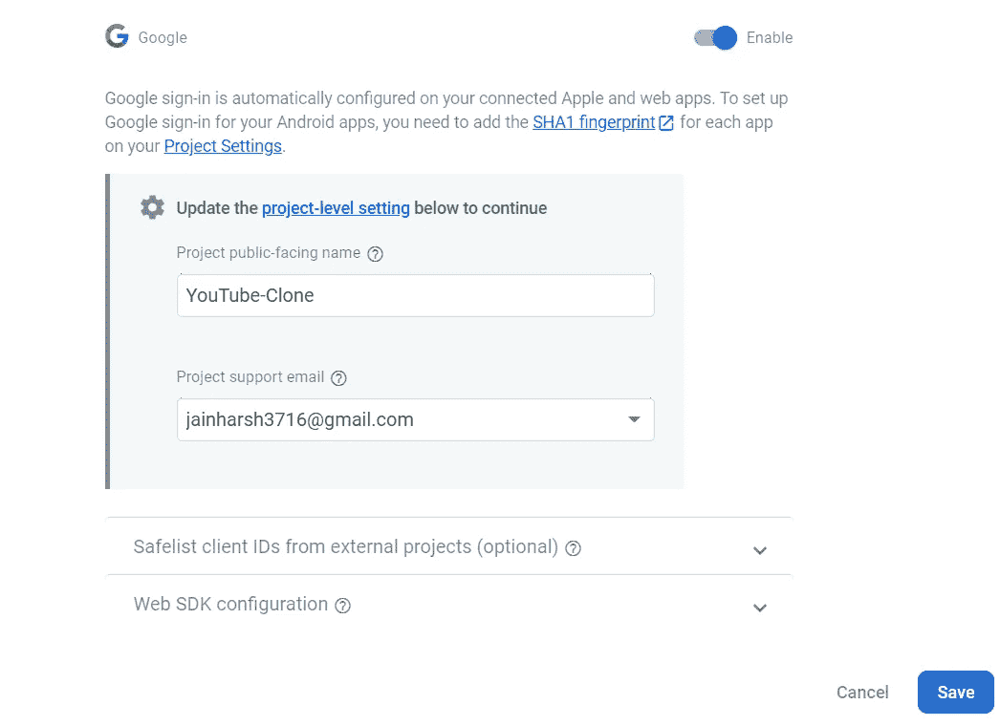
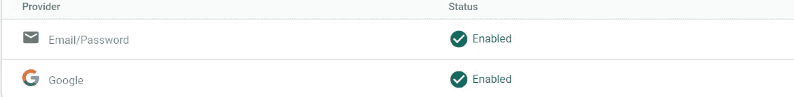
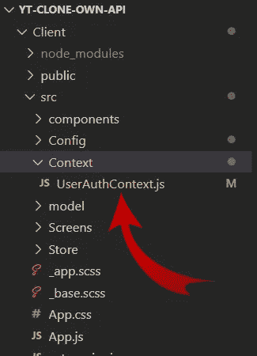
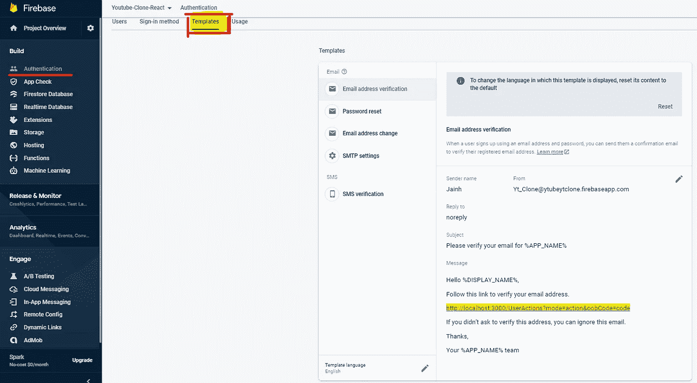
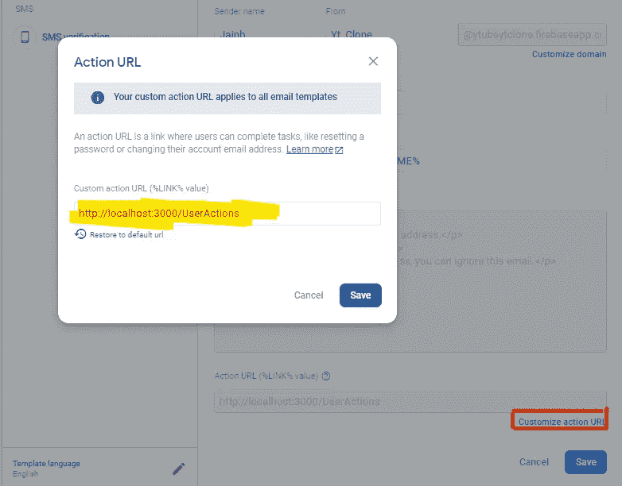

# 使用 Firebase、FFmpeg 和 React 克隆功能齐全的 Youtube 第 3 部分]

> 原文：<https://blog.devgenius.io/fully-functional-youtube-clone-using-firebase-ffmpeg-and-react-part-3-960073336ec4?source=collection_archive---------6----------------------->

一个 youtube 的精确克隆，从查看计数到使用 Firebase、FFmpeg 和 React 订阅所有内容(没有 Youtube Api)的所有功能


YouTube-克隆

# 注意:

以下是该项目的不同部分:

*   [第一部分](https://medium.com/geekculture/fully-functional-youtube-clone-using-firebase-ffmpeg-and-react-1aac96e72123) —项目介绍及特点说明
*   [第二部分](/fully-functional-youtube-clone-using-firebase-ffmpeg-and-react-part-2-9cde7979150d) —从添加 redux 到添加所有带有虚拟数据的屏幕，最后添加路线，创建应用的框架
*   [第 3 部分](https://decodebuzzing.medium.com/fully-functional-youtube-clone-using-firebase-ffmpeg-and-react-part-3-960073336ec4) —将 Firebase 添加到我们的应用程序中，创建上下文 Api，完成从 web 的认证登录(**本文**)

我会随着我们的继续更新订单:)

# Github 代码

再次为新观众，Github 代码已经上传[这里](https://github.com/harsh317/Youtube-CLone-ReactJs)！你可以去看看！

[](https://github.com/harsh317/Youtube-CLone-ReactJs) [## GitHub-harsh 317/Youtube-CLone-react js:Youtube 的精确克隆，具有来自…

### youtube 的一个精确的克隆，具有从查看计数到订阅所有内容的所有功能(没有 Youtube Api)…

github.com](https://github.com/harsh317/Youtube-CLone-ReactJs) 

# 我们要去哪里

因此在这一部分中，首先让我们将 firebase 添加到我们的应用程序中，然后我们可以创建 firebase 上下文 API。我们将实现 firebase 的整个认证系统，并完成我们的上下文文件。*话虽如此，我们还是开始吧！！*

# 创建和初始化 Firebase 项目并配置基本身份验证功能

首先，快速进入 [Firebase 控制台](https://console.firebase.google.com/)并点击添加项目/创建项目。给出项目名称→接受条件→禁用/启用 Google Analytics →创建项目



您应该会看到类似这样的内容

## 启用 FireStore 数据库

现在让我们为我们的应用程序启用 firestore 数据库。点击 Firestore 数据库或直接进入此[链接](https://console.firebase.google.com/u/0/project/_/firestore)



接下来，在右侧点击“*创建数据库*”→为您的云 Firestore 安全规则选择一个启动模式(现在我将点击*测试模式*)→为您的数据库选择一个[位置](https://firebase.google.com/docs/firestore/locations#types)→*启用*

## 测试模式

> 有利于开始使用移动和 web 客户端库，但允许任何人读取和覆盖您的数据。测试后，**请务必查看** [**保护您的数据**](https://firebase.google.com/docs/firestore/quickstart#secure_your_data) **部分。** [https://firebase.google.com/](https://firebase.google.com/)

这样，我们的 firebase 应该看起来像这样，带有默认的测试规则，我们将在后面更改:



## 启用身份验证

现在，类似地，点击侧边栏中的认证选项卡或直接转到此[链接](https://console.firebase.google.com/u/0/project/_/authentication)



证明

点击“*开始使用*”，您将看到“*通过添加您的第一个登录方法开始使用 Firebase Auth*”屏幕。让我们添加我们需要的提供者

## 添加电子邮件/密码提供者

只需点击电子邮件/密码提供者，然后点击*电子邮件/密码复选框*并点击*保存按钮*



## 添加 Google 提供商

然后只需添加一个新的提供商，并在额外的提供商，列点击“谷歌”提供商。此外，点击*谷歌* *复选框*并更改随后的设置。最后，点击“保存”按钮



当您启用以下两种状态时，我们就可以开始了！



有了这个 ig，我们就完成了 Firebase 的设置。现在，让我们构建上下文 API。:)

# 为基本认证功能创建 Firebase 上下文 API

如果你不了解上下文 API，我建议你多了解一下。以下是来自[文档](https://reactjs.org/docs/context.html)的更多基本含义

> 上下文提供了一种在组件之间共享这些值的方法，而不必显式地在树的每一层传递一个属性。Context 旨在共享可以被视为 React 组件树的“全局”数据，例如当前经过身份验证的用户、主题或首选语言

所以，让我们继续前进，不要再浪费时间了。在 Src 文件夹中，创建一个“ *Context* ”文件夹，用一个可能比我更好的文件名创建 Context 文件；— ;



UserAuthContext 文件

## 具有基本登录功能的基本 UserAuthContext 文件

是的，我们已经为简单和基本的功能准备好了基本的上下文文件，如注册/登录(使用电子邮件密码)，当用户注册时创建 Firestore 用户等。上面的代码是相当自明的 ig

# 除了基本功能之外，为我们的认证系统添加更多功能

因此，让我们继续我的添加功能，如电子邮件验证，密码重置等。为此，在认证部分的*中，点击模板选项卡*或直接转到此[链接](https://console.firebase.google.com/u/0/project/ytubeytclone/authentication/emails)

## 电子邮件地址验证

现在，让我们在侧边栏的所有 3 件事情上工作。首先，我们有电子邮件地址验证的事情。就像在⬇️⬇️⬇️下面



现在，点击编辑按钮，并改变你想要的东西。比如“发件人姓名”和“发件人”设置。在消息部分，你看到这奇怪的一行了吗？

```
[http://localhost:3000/UserActions?mode=action&oobCode=code](http://localhost:3000/UserActions?mode=action&oobCode=code)
```

对于所有的用户管理操作，如更新用户的电子邮件地址和重置用户的密码，我们发送一封电子邮件到用户的电子邮件 duh。*因此，默认情况下，用户管理邮件链接到默认的动作处理程序*，它是一个网页，托管在您项目的 Firebase 托管域中的一个 URL 上。Firebase 在生成用户管理电子邮件时，向您的操作处理程序 URL 添加了几个查询参数。例如:

```
[https://example.com/usermgmt?**mode=resetPassword**&**oobCode=ABC123**&**apiKey=AIzaSy**...&**lang=fr**](https://example.com/usermgmt?mode=resetPassword&oobCode=ABC123&apiKey=AIzaSy...&lang=fr)
```

更多信息，你可以在这里阅读[⬇️:)](https://firebase.google.com/docs/auth/custom-email-handler)

 [## 创建自定义电子邮件操作处理程序| Firebase 文档

### 一些用户管理操作，如更新用户的电子邮件地址和重置用户的密码，会导致电子邮件…

firebase.google.com](https://firebase.google.com/docs/auth/custom-email-handler) 

因此，让我们更改默认的操作处理程序。没那么难；).在底部，您将能够看到一个带有“ *Customize action URL* ”的文本，并在其中输入以下值。

```
[http://localhost:3000/UserActions](http://localhost:3000/UserActions)
```



如果你现在感到困惑，不要担心，当我们开始实现这些特性时，你会变得更加清晰；))

## 密码重置和电子邮件地址更改设置

在这些设置中没有更多的事情要做。只是改变你想要的文本等，但 idk 我们没有更多的事情要做了。

哦哦，整个部分都很长，看起来可能有点无聊，但是 nvm 我们已经完成了，现在我们可以关闭这个网站了，❤️❤️😳

# 具有所有登录功能的完整 UserAuthContext 文件

现在让我们完成我们的 UserAuthContext 文件。这将是完整的文件。这并不复杂，只需要通过 1-2 行代码和一些设置，我们就可以运行功能了

至此，我们也完成了我们的上下文 API 文件！不错:000000。嗯，今天的文章有点长，但不要担心，我们有一些输出:)

现在，在下一部分中，我们将使用所有屏幕来完成身份认证系统。我们进展缓慢，但我们很快就能看到一些成果。我敢打赌。

我希望你喜欢这一部分，我会很快带着另一部分回来！到那时为止

在那之前保持安全，保持健康

**谢谢**