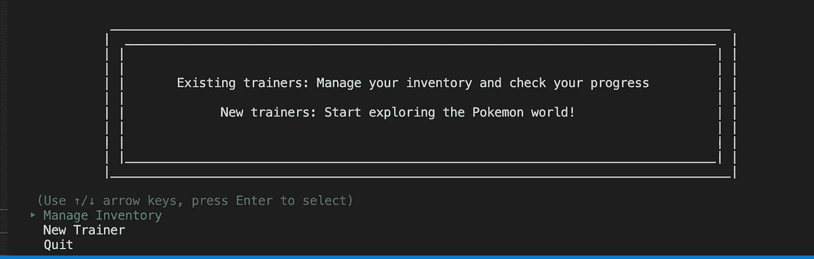
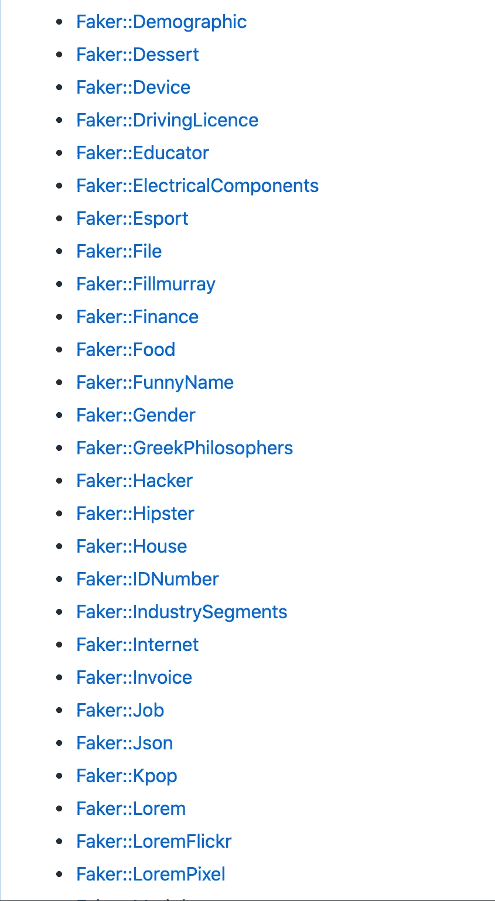

# 有趣(且有用)的工具，让您的第一个 CLI 应用程序更加强大

> 原文：<https://blog.devgenius.io/fun-and-useful-tools-to-empower-your-first-cli-app-e15f69911161?source=collection_archive---------21----------------------->

迄今为止，参与 Mod 1 项目是 Flatiron 最具挑战性的经历。我们必须积累我们所学的一切，并制作一个真正的项目——Ruby CLI 应用程序。听起来很可怕——实际上*是*可怕！—但是我和我的好搭档完全明白了。

当然，技术部分是最难的。然而，对我来说最讨厌的部分是打开了大量的谷歌 Chrome 标签和大量的 gem Readme。忙乱地寻找我此刻迫切需要的那个标签的过程让我的焦虑达到了顶点。

所以，为了节省你们的时间和挫败感(我知道，你们已经受够了！)我决定写一篇简短的博客，介绍一些有趣而有用的宝石和工具，你可能会在创建第一个 Ruby CLI 应用程序时用到它们。别忘了查看底部的*来源*部分！

**1。TTY**

长话短说:TTY 是一个从用户那里获得输入并以简洁的方式显示信息的工具。这是有史以来最节省时间的方法:不用再把自己埋在令人困惑的 if-else 语句中，现在你有了让恼人的部分变得简单和实际愉快的法宝。

出于我们项目的目的，我发现 [TTY::Prompt](https://github.com/piotrmurach/tty-prompt) 特别强大。只需一点努力——你的命令行看起来比以前更漂亮了！您可以创建多项选择，是/否等等！这就是我和我的搭档的介绍。

**2。骗子**

这是另一个了不起的省时方法！这是一种生成不同类型的虚假数据的工具。

当您只需要创建几个示例实例来运行 *binding.pry* 并确保一切正常运行时，这没什么大不了的。但是如果我们需要十个虚构的实例呢？如果我们需要 110 个呢？呃，这整件事越来越无聊了。

但是不要害怕！强大的 Faker 宝石来了！

当我们需要一些真实的测试数据时，Faker 非常方便。正如自述文件所言(再次检查*来源！在您进行开发时，这个 gem 会让您的数据库中填充不止一个或两个记录。你可以生成名字，地址，电影和书籍中的角色，电视节目…一切！这里只是一个随机的提示。*

**3。着色**

这就是我发现这颗宝石时的感受！

我知道你在想什么:Mod 1 不是玩幻想和——好吧，让我们公平地玩——不那么重要的宝石的合适时机。但是相信我，你不会花太多时间去弄清楚它是如何工作的——结果你每秒钟得到 100%的价值！只是检查一下。

是的，我们惊人的项目是关于神奇宝贝的！

**4。如何为 CLI 应用程序创建 gif 文件**

让我告诉你:我是老派动画的忠实粉丝！它看起来很简单(有时很难看)，但这些随机(歇斯底里地)移动的点和线总是让我感到柔软和怀旧。我的合作伙伴也有同样的感觉，这就是为什么我们在项目中加入了一些简单的动画。

我们彻底搜索了网页，找到了一个非常清楚的说明。只需阅读[如何在 CLI 应用程序中制作动画](https://medium.com/@yisroelm/how-to-make-animations-in-a-cli-app-f228d925244c)并制作自己的动画！但我必须警告你:ASCII 艺术是棘手的，尤其是当它有太多微小的细节时。不要让你紧张的生活变得更艰难，选择简单而又相当大的东西。否则，你会得到一堆疯狂的点。

我希望我的小建议对你有用！

大家来一个无痛的 Ruby CLI app 项目吧！:)

**来源:**

*   [TTY 自述](https://github.com/piotrmurach/tty)
*   [关于使用 TTY 的更多说明](https://ttytoolkit.org/)
*   [Faker 自述](https://github.com/faker-ruby/faker/tree/master)
*   [彩色自述文件](https://github.com/fazibear/colorize)
*   [安装最新版本的 Colorize](https://rubygems.org/gems/colorize/versions/0.8.1)
*   [gif 分割器](https://picasion.com/split-animated-gif/)
*   [ASCII 转换器](https://www.text-image.com/convert/ascii.html)
*   [ASCII 艺术档案](https://www.asciiart.eu/)
*   如何在 CLI 应用程序中制作动画