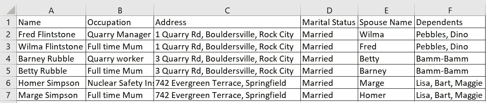

# 有趣的测试数据有助于发现 bug

> 原文：<https://blog.devgenius.io/fun-test-data-helps-find-bugs-c8abf8a27536?source=collection_archive---------37----------------------->

当我与其他使用“测试”这个词的变体作为测试数据的测试人员一起工作时，我总是感到惊讶。首先，在测试软件的时候，让你的创造性方面得到一些乐趣的机会是有限的——利用任何出现的机会！第二，当你的输入和输出看起来都一样时，你怎么能验证它们呢？最后，这些虫子可能会很搞笑！

这里有几个例子可以说明如何在测试中运用创造力:

按主题对用户进行分组——为了确保我可以很容易地看到不匹配的信息，我将我的测试用户按主题进行分组，将该主题应用于每个领域，并在同一主题内创建相关用户。例如

姓名:弗雷德·燧石族

职业:采石场经理

地址:岩石城博尔德斯维尔采石场路 1 号。

我会加上威尔玛·燧石族，巴尼·粗石族和贝蒂·粗石族。另一个团体主题可能是辛普森一家，所以你会有荷马·辛普森，住在斯普林菲尔德常青露台 742 号。玛吉、丽莎、巴特和玛吉……然后我会请当地肥皂剧《肖特兰街》的人来。你明白了。

我还将创建燧石族、辛普森、肖特兰和 St 相关的新闻文章和文件名。然后，当我作为这些用户之一实际测试时，很容易识别我是否看到了其他人的数据。

权限漏洞:巴尼不会想到会看到标题“达夫啤酒生产枯竭！”或是罗帕塔医生写的医疗报告。

数据库配置问题:在数据库中，我不希望看到荷马住在采石场路，嫁给了巴特。

当你找到并记录下这些错误时，就会产生有趣的错误描述“我以威尔玛(家庭主妇)的身份登录，但我的个人资料描述说我在一家核电站工作”

有时就像对你的相关组使用相同的首字母一样简单。彼得·派珀住在宾夕法尼亚州普莱蒂斯维尔的佩珀科恩大街，他可能是一名管道工，和他的妻子帕特丽夏，孩子帕姆和帕特在一起。在这种情况下，兔子罗杰不应该看到关于“困惑的熊猫”的新闻文章或最新疫情的文件。

就在上周，我提交了一份车辆保险表格(在测试环境中),因为“快怒先生”不知道提交的文件实际上仍被发送给了客户。拥有一个有幽默感的客户总是好的。但关键是，创建一个充满逻辑链接的实际测试配置文件，确实有助于识别不正确的配置和权限漏洞，并且很少比“测试”花费更长的时间。