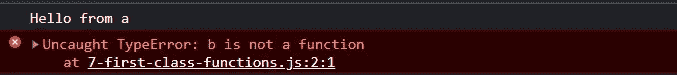

# Javascript 中的函数术语

> 原文：<https://blog.devgenius.io/function-buzzwords-in-javascript-af24c3488a75?source=collection_archive---------9----------------------->

由[克里斯托弗·高尔](https://unsplash.com/@cgower?utm_source=medium&utm_medium=referral)在 [Unsplash](https://unsplash.com?utm_source=medium&utm_medium=referral) 上拍摄的照片

有这么多的文章和资料来源，你可以从中学习和清除你的理论和对任何事情的疑虑。但是，我仍然看到相当多的人对这些与函数相关的基本术语感到困惑。我认为了解这些与函数相关的术语以及它们的含义是很重要的，因为当你阅读某本书或一篇博客文章，或者试图理解一个随机的人对你在 Stackoverflow 上的问题给出的解释时，它们会在你的脑海中描绘出一个更好的心智模型。

# 什么是函数语句和函数表达式？

在大多数编程语言中，声明一个函数的最通用的方法叫做**函数语句，也称为函数声明。**

在 Javascript 中，函数可以赋给变量。这种声明函数的语法被称为**函数表达式。**

# **函数语句和函数表达式的区别**

**函数语句**和**函数表达式**的主要区别主要基于**提升**。JavaScript 中的函数表达式是不吊的，不像函数语句。在创建函数表达式之前，不能使用它们。

考虑下面的示例脚本，我们尝试在声明之前调用函数语句`a`和函数表达式`b`。

示例脚本

当代码执行时，浏览器控制台显示以下内容:

调用函数语句`a`正常工作，在控制台上打印`Hello from a`。在调用函数表达式时，`b`给出了一个`TypeError`，暗示`b`不是函数。

但是为什么呢？**函数语句** `a`和**函数表达式** `b`的核心不都是函数吗？

要理解这个奇怪的 Javascript 原理，我们必须知道 Javascript 是如何工作的。在这里描述和阐述。

准确地说，Javascript 代码分两个阶段执行，即内存分配和代码执行阶段。在内存分配阶段，代码中存在的所有变量都用`undefined` **的值初始化。**

在声明之前，试着在控制台上打印出`b`的值，我们会在屏幕上看到`undefined`。让我们将示例脚本中第 2 行的函数调用改为`console.log`语句，以查看`b`的值:

当代码执行时，浏览器按照预期输出`undefined`作为`b`的值:

在代码执行阶段，当 Javascript 引擎遇到示例脚本的第 8 行时，值`undefined`被替换。在那一刻，`undefined`被代码中分配给`b`的实际值所取代，在我们的例子中是函数`c`。

在内存分配阶段，函数表达式`b` 表现为用`var`声明的典型 Javascript 变量。在内存分配阶段，所有变量都用`undefined`初始化，这同样适用于函数表达式`b`。

因此，当代码执行阶段发生并且遇到我们的示例脚本的**行 8** 时，变量`b`在那个瞬间变成了**函数表达式。**

# **什么是匿名函数？**

没有定义名字的函数称为**匿名函数**。定义匿名函数的语法:

这里要注意的是，如果我们不把匿名函数放在括号内，`()`我们将会以一个语法错误结束。`()`使匿名函数成为函数表达式。

无括号声明的匿名函数:

浏览器上的错误实际上是逻辑错误:

根据 ECMAScript 规范，函数语句应该总是有一个名称。声明不带括号的匿名函数，会使 Javascript 将其解析为常规函数语句，为此必须为函数添加一个名称。

但是，对于匿名函数，这是一种无效的语法来声明它们。

匿名函数主要在函数作为值时使用。也就是说，我们将一个函数赋给一个变量，以创建一个函数表达式，如下所示:

这是一个完全有效的语法，我们不会在控制台上看到任何错误。

# **命名函数表达式**

一个**命名的函数表达式**顾名思义也是函数表达式。事实上，在上面我们识别和解释函数表达式的部分，我们实际上在代码中使用了一个名为的函数表达式**作为例子。**

如果分配给变量的函数有一个名字，它就变成一个更具体的**命名函数表达式**。