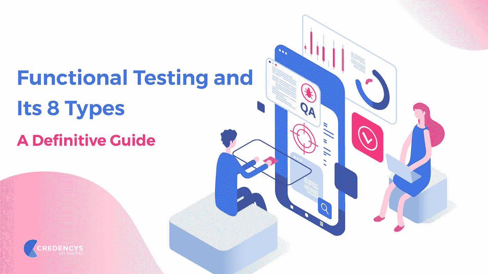

# 功能测试

> 原文：<https://blog.devgenius.io/functional-testing-8429aceee949?source=collection_archive---------43----------------------->

什么？为什么？怎么会？什么时候？

[自由股票](https://unsplash.com/@freestocks?utm_source=medium&utm_medium=referral)在 [Unsplash](https://unsplash.com?utm_source=medium&utm_medium=referral) 上的照片

当测试人员想要测试产品的功能缺陷时，通常会问这些问题。

**那么，什么是功能测试呢？**

正如我们在以前的博客中所提到的，它是一种软件测试，根据客户的业务分析师或简而言之业务分析师设定的功能需求/规范来验证软件系统。

然后，你会问为什么要做功能测试？

现在想一想，深入思考一下。

如果关机按钮不起作用，你会购买 Android 手机吗？或者，你会购买 Wi-Fi 无法连接任何网络的 iOS 手机吗？

通常，移动应用程序、web 软件、web 应用程序，甚至桌面软件中的功能缺陷都很小，但可能会让客户损失大量用户。测试人员进行功能测试，因为它总是验证系统已经为发布做好了准备。功能测试以一种有用的方式定义了您的工作系统。

在功能测试中，测试人员必须验证应用程序，以查看客户的所有指定要求(无论是 SRS(系统要求规范)还是 BRS(业务要求规范)中提到的要求)是否已被纳入。功能测试总是关注客户需求，而其他测试总是关注客户期望。

好吧，我们现在知道你什么时候做测试了？

这是一个棘手的问题，但我可以为你简化它。作为测试人员，你将被分配到环境、SIT(系统集成测试)或 UAT(用户验收测试)中。因此，从那里，你可以知道什么时候你将测试移动应用程序，网站等的功能测试。

*注意:关于测试环境的进一步解释将在下一篇博客“SIT vs. UAT”中给出*

最后，现在我们到了最能描述博客的地方，因为在这里你将能够知道你将如何做好你的工作？

那么，如何进行功能测试呢？你测试什么？

*测试时需要遵循一些步骤(按排列顺序)*

*   确定需要测试的产品功能，包括测试主要功能、错误情况、信息、可用性测试等，无论产品是否用户友好
*   根据需求规格为要测试的功能创建输入数据([测试用例](https://www.blogger.com/blog/post/edit/2162707874189440797/8581668194870297073#))
*   从测试用例中，可以确定被测功能的输出
*   执行测试用例
*   比较执行测试用例后的实际输出和预期输出(根据需求规格确定)

*很明显，你想知道在功能测试中你到底测试什么*

*   **主线功能** —测试产品的主要功能
*   **基本可用性**——检查用户是否可以毫无困难地自由浏览屏幕
*   **可访问性** —为用户检查系统的可访问性
*   **错误条件** —使用测试技术检查错误条件，检查是否显示合适的错误信息

图像的信用凭证

如果您正在寻找我们的服务，请点击下面的网站:

[StackedQA 网站](https://www.stackedqa.com/)

查看我们的社交媒体:

[脸书](https://www.facebook.com/StackedQA)，[推特](https://twitter.com/stackedqa)， [Instagram](https://instagram.com/stackedqa) ，& [领英](https://www.linkedin.com/company/stackedqa)