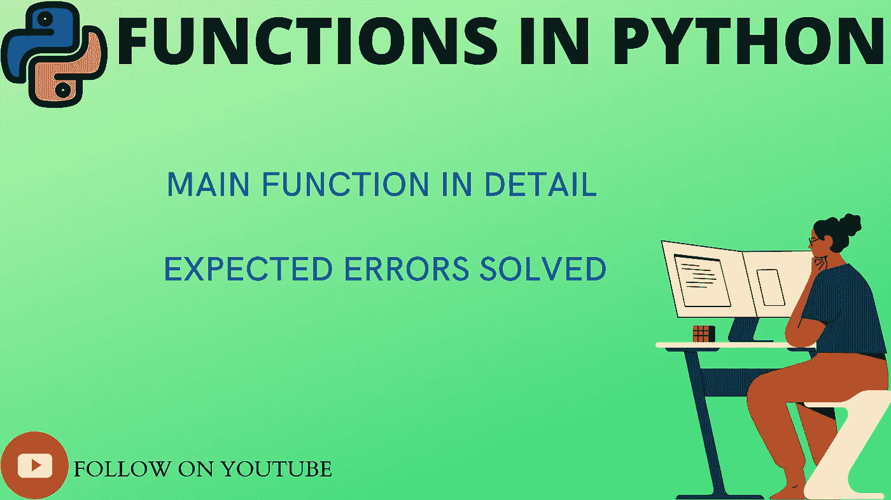
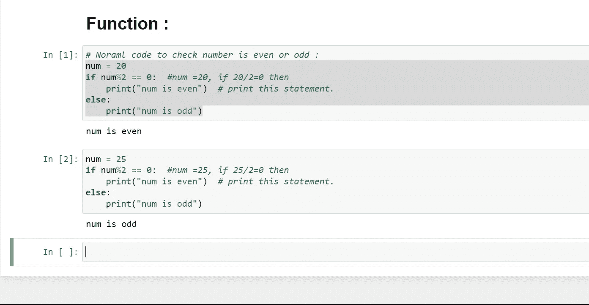
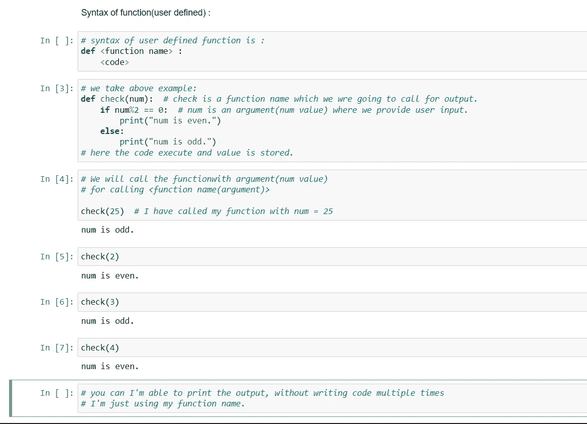
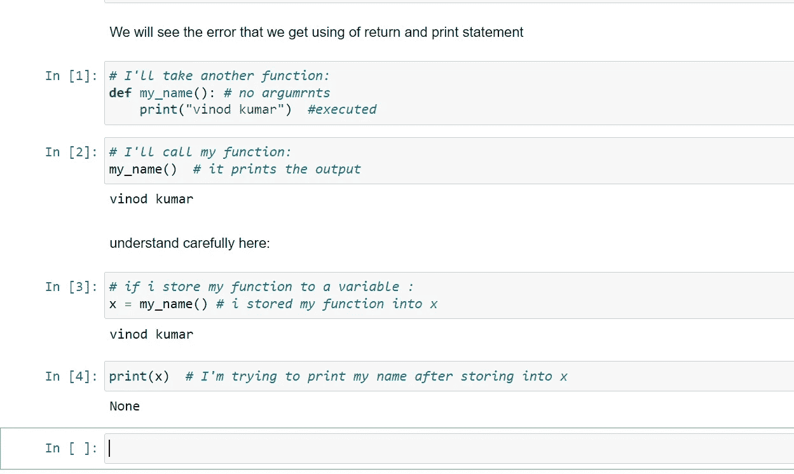
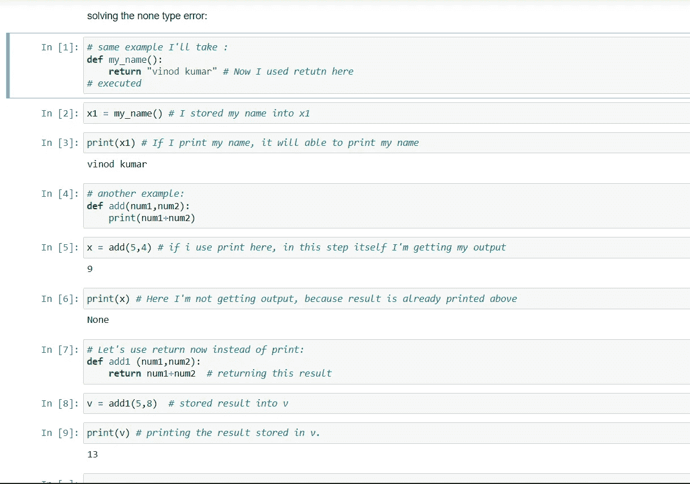
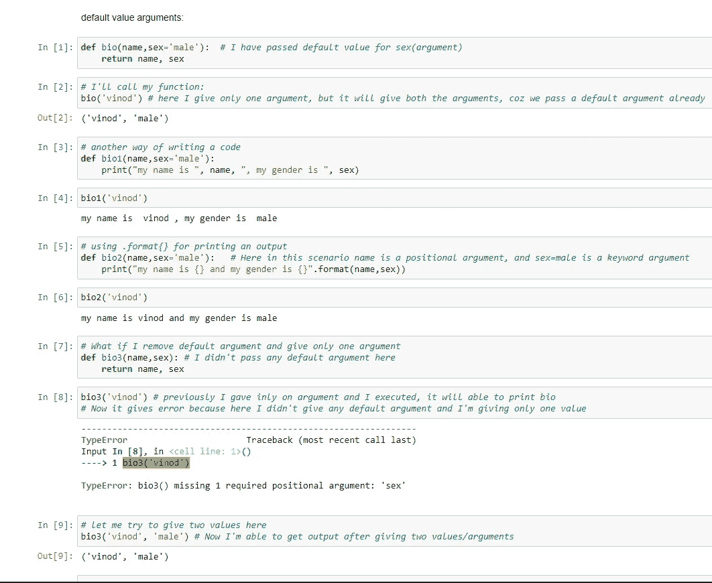
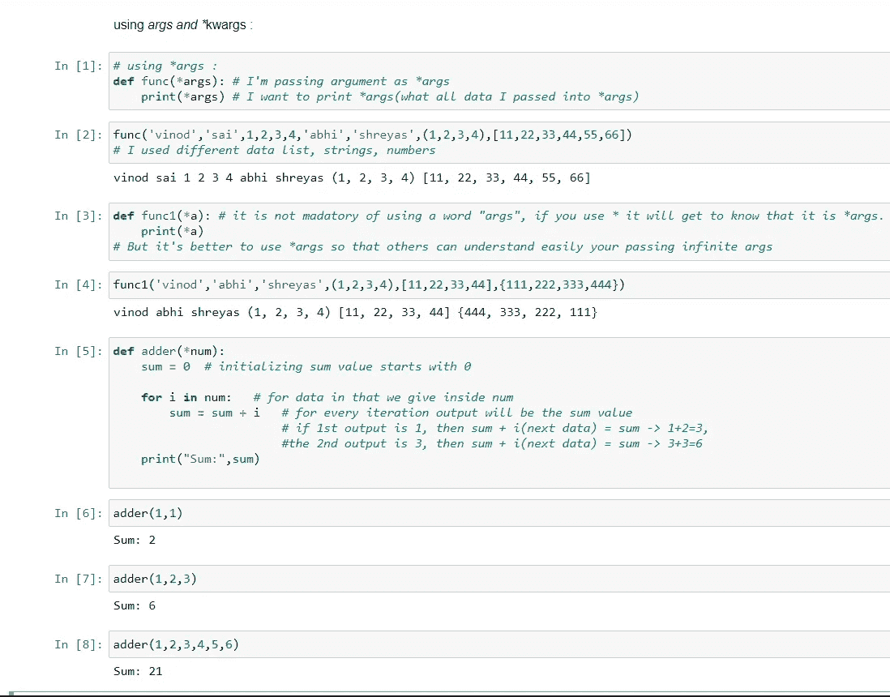
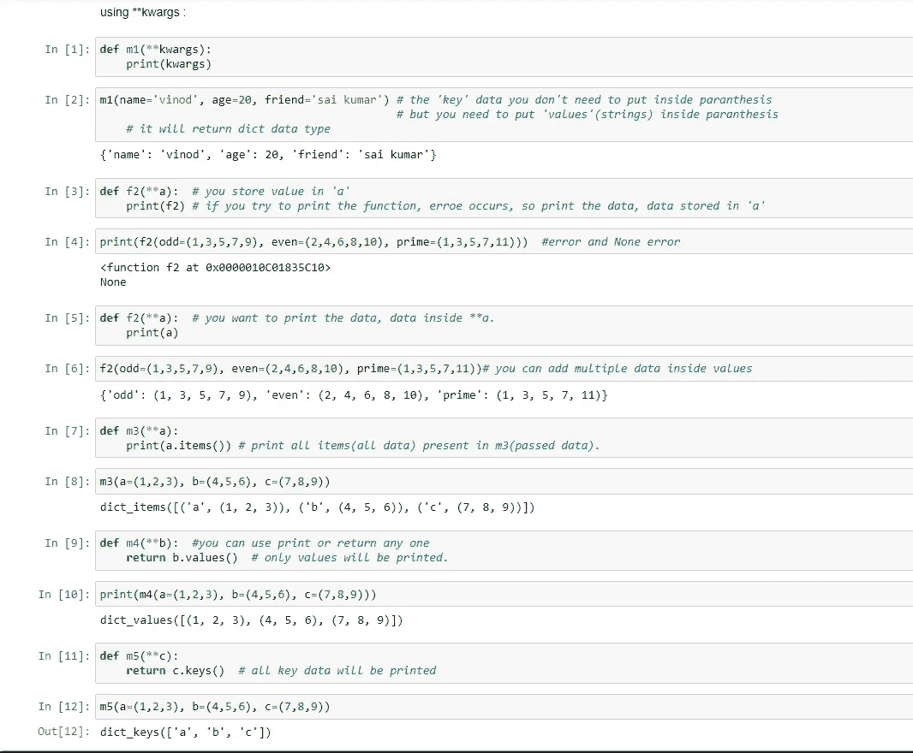
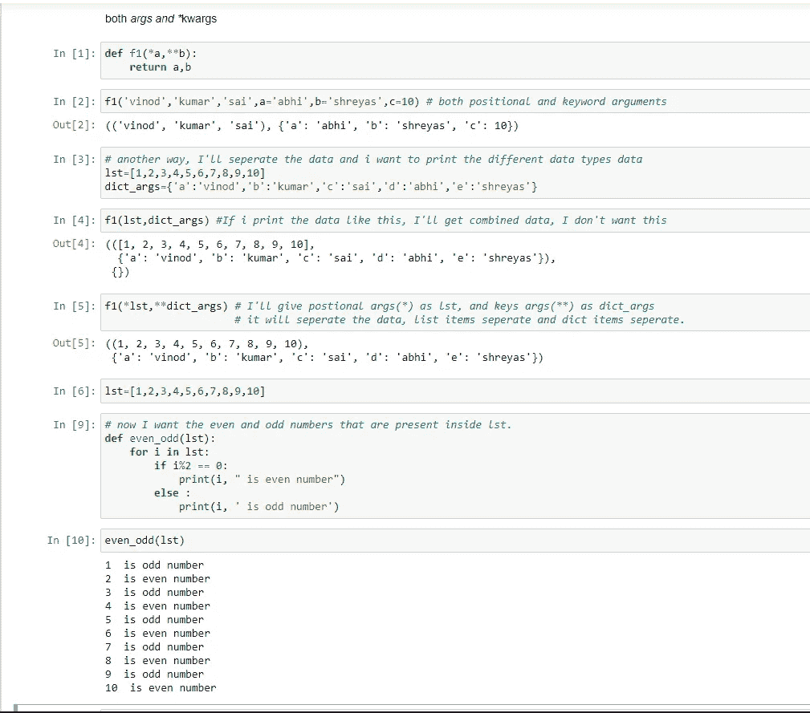

# PYTHON 中的函数和类型

> 原文：<https://blog.devgenius.io/functions-and-types-in-python-ebca0b6c33cb?source=collection_archive---------6----------------------->

大家好，之前我们在 python 中讨论过数据集，视频上传到了我的 YouTube 频道，我已经清楚深入地解释过了。

视频链接是→[https://youtu.be/Xi3lG_KrR08](https://youtu.be/Xi3lG_KrR08)

现在我们将继续我们的主题，PYTHON 中的函数和类型。

那么，我们会看到什么是函数？

函数是**一段代码，只有在被调用**时才会运行。你可以将被称为**参数**的数据传递给一个函数。函数可以返回数据作为结果。

简而言之，参数是赋予任何函数或方法调用的东西，而函数或方法代码通过参数名来引用参数。

**功能类型:**

python 中主要有两种类型的函数。

**01。内置函数。**

**02。用户定义的函数。**

现在我们将讨论关于函数的类型:

# 01.内置函数:

内置函数是已经用 python 编写或定义的函数。我们只需要记住内置函数的名称和函数中使用的参数。因为这些函数已经被定义，所以我们不需要定义这些函数。下面是 Python 的一些内置函数。

截至目前，最新版本的 Python 3.8 已经有 **69** 个内置函数。

我就讲几个内置函数。

1.  **打印()** →打印对账单。
2.  **列表[]** →退货列表。
3.  **tuple()** →返回元组。
4.  **集()** →退货集。
5.  **字典{}** →返回字典。
6.  **str()** →返回字符串对象/值。
7.  **type()** →返回对象的类型。
8.  **min()** →返回序列中的最小值。
9.  **max()** →返回序列中的最大值。
10.  **len(** ) →返回对象的长度。

像这样的内置函数在 python 中有很多。

我们之前已经看到了一些内置函数，所以我不会深入探讨。我们会看到另一种类型。

# 02.用户定义的函数:

**我们定义自己完成某个特定任务的函数**称为自定义函数。

首先让我们看一个编写简单代码的普通例子。然后我们用函数。

上面的例子是我们如何正常地编写代码，如果必须用不同的数字做同样的事情，你必须重新编写完整的代码，并给不同的数字做操作。这是一个漫长的过程。

为了解决这个问题，我们有一个叫做函数的概念。

我们会看到一个使用函数的例子，在这之前我想讲一个关键字“def”。

所以“def”这个词的意思是定义，用在函数名之前来定义函数。

在函数内部，我们传递一个参数，这样我们可以很容易地调用函数，所以不需要一次又一次地写代码。

示例:

在上面的例子中，当调用函数时，你应该给出 num 值，否则你会得到一个“缺少必需的位置参数”的错误。所以如果你在创建函数的时候给了一个参数，那么在调用的时候你必须提供一个参数。

因此，现在我们将返回或打印输出时可能出现的一些错误。

在上面的例子中，当创建函数时，我们试图打印输出。当调用一个函数时，它会打印出我们给定的输出。没关系。

当我们再次存储我们的结果(x= <function>)时，我们试图再次打印相同的内容，它将给出一个 none 类型的错误。</function>

这个错误是因为我们在创建函数时没有返回任何值，我们只是打印输出。

事情是这样的:

Print() →它只是打印输出。

return →而不是打印，它会返回你的输出(它会保留值，但不会打印)。

让我们试着解决这个问题:

让我们来看一个默认参数的例子:这意味着您正在传递参数的默认值，而您不需要再次提供参数。

在上面的例子中，我提到了位置参数和关键字参数。上面我举了一个例子 bio(name，sex='male ')，其中 name 是一个位置参数，sex='male '是一个关键字参数，因为 sex='male '的格式是 key:value。name 是一个参数，我们没有用值来初始化，我们在调用函数的时候给了一个值。

我们有另一种类型的函数，称为:

# (*args)和(**kwargs):

**(*args)** →表示参数/非关键字参数。

**(**kwargs)** →表示关键词论据。

使用这些函数的目的是，就像当我们不知道要传递给函数的参数的数量时，我们使用这些*args 和**kwrags 来表示无限数量的参数。

**什么是*args？**

Python 有*args，**允许我们将可变数量的非关键字参数传递给函数**。在函数中，我们应该在参数名(args)前使用星号*来传递可变长度的参数。

当我们创建函数时，它对我们非常有用:

例如，我们希望创建一个乘法函数，它可以接受任意数量的参数，并且能够将它们相乘。可以使用*args 来完成。

**再一个就是** kwargs，什么是**kwargs？**

Python 有**kwargs，**允许我们向函数**传递可变数量的关键字参数。在函数中，我们应该在参数名(kwargs)前使用双星号**来传递可变长度的参数。

现在我们看到 args 和 kwargs:

您可以使用这些 args 和 kwargs 执行不同的操作。因此，当您不知道要在函数内部传递的参数个数时，可以使用这些 args 和 kwargs。

如果你不明白这个 args 和 kwargs，我会推荐你看我的 YouTube 视频(链接在文章下面)，我已经解释清楚了。

伙计们，今天的话题到此结束。我们将在 python 中遇到另一个主题，直到那时练习好。你是专家，你能做到。

爱你们所有人。

如果我在某个地方犯了拼写错误，对不起，请忽略，并尝试通过谷歌搜索自己，它会帮助你。

谢谢你。

*******************************************************************

我希望你明白这些简单的概念。所以我打算用一种简单的方式写一个关于 python 的每一个概念的博客，在这里你可以轻松地学习。

*所以请继续支持我们，感谢所有读过这篇完整博客的人。*

*请喜欢并关注本账号。*

***全爱无恨。***

***我们有一个 YouTube 频道，我们在那里上传关于编程相关的话题，你可以通过订阅我们的频道来支持。***

[***https://www.youtube.com/channel/UChiEiQ2E3_DUGYDG340si-A***](https://www.youtube.com/channel/UChiEiQ2E3_DUGYDG340si-A)

***这是我们的 YouTube 频道链接，请订阅。***

*本文概念及作者:*

***赛库马尔和维诺德库马尔。***

*******************************************************************