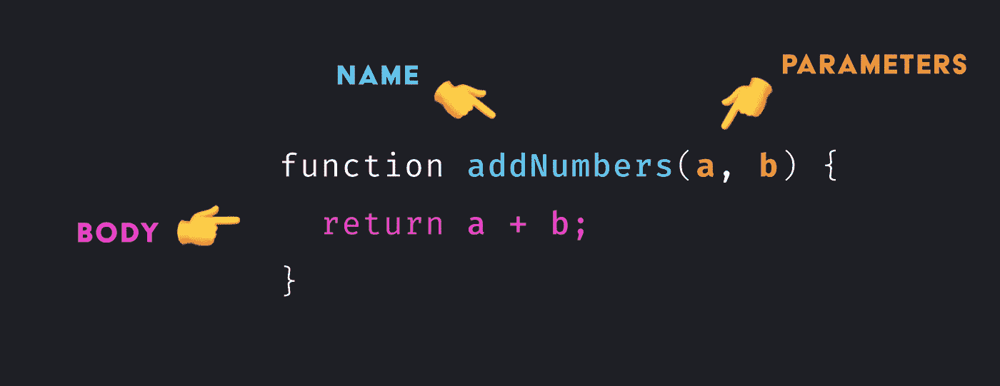

# Javascript 中的函数(声明、箭头、IFFE 和回调)

> 原文：<https://blog.devgenius.io/functions-in-javascript-declaration-arrow-iffe-y-callbacks-f22ad2ea5085?source=collection_archive---------7----------------------->


关于 Javascript 中函数的介绍性文章，带有示例和描述的一般分析。

# 介绍

在 Javascript 中，函数是语言最强大的特性之一。这是由于它们的多功能性和它们可以处理的大量案例。了解函数的行为将有助于我们更好地理解语言的功能。

# Javascript 中的函数

Javascript 中的函数是一个对象，因此，它们可以很好地赋给变量，作为参数传递给其他函数，它们可以调用自己，还有其他的通用性。强调依赖于分配将是将被采用的行为。

javascript 中的一个基本函数由以下基本元素组成:

1.  **名称:**代表函数的名称。
2.  **参数:**是一个函数可以接收的输入值。这些值具有本地范围。
3.  **体**:功能的逻辑和实现。
4.  **返回**:函数结果输出。



# 功能类型

在 javascript 中，定义一个函数有多种方法，这突出了多年来越来越多的功能被添加进来。

以下是在 Javascript 中使用函数的不同方式:

*   功能声明。
*   函数表达式。
*   IFFE。
*   箭头功能。
*   回调函数。

接下来，我们将回顾每种形式的定义和示例。

## 功能声明

使用保留字 **function** 后跟一个名称来创建函数 by declaration。所有这些函数默认返回**未定义的**，除非返回值被明确指出。关于这些函数需要注意的一点是，上下文将在它们被调用时定义。

这些函数广泛用于一般的上下文和代码重用。

```
function greeting(name) {
  return `Hello ${nombre}`;
}
console.log(greeting("Victor")); // Hello Victor
```

## 函数表达式

表达式函数，顾名思义，就是表达式。表达式可以完美地存储在变量中以获得它们的引用。关于这些函数需要注意的是，不需要输入你的名字，它们被认为是匿名函数。

这些函数广泛用于**回调**和元素隔离。

```
const sum = function (value1, value2) {
  return value1 + value2;
}
console.log(sum(5, 5)); // 10
```

## IFFE

这是一个在声明时自动调用的函数。这个函数突出显示了在被调用的时候，它们以后将不再可访问。为了创建它，我们必须将它放在分组操作符“ **( )** ”中，然后执行它，这将允许在 Javascript 引擎中直接解释。

这些函数广泛地与模块模式结合使用，以声明只在模块模式中可见的私有变量或函数。

```
(function () {
  let name = 'Victor';
  console.log(`Hello ${name}`);
})();
// Hello Victor
```

## 箭头功能

2015 年 **ES6** 特性中引入的功能。箭头函数允许使用简短的语法来编写函数表达式。请注意，箭头函数是匿名函数，没有针对**参数**、**超级**的挂钩，以及类似于**产生**的特性。

这些函数被广泛应用于一般环境中，甚至取代了传统的**函数声明**，这要归功于它们简短的语法以及从其作用域中去除了复杂性。

```
// Standard
const greeting = (name) => {  
  return `Hello ${name}`; 
}

// Shortcut
const greeting = (name) => `Hello ${name}`;

console.log(greeting("Foo")); // Hello Foo
```

## 回调函数

回调函数是作为参数传递给另一个函数的函数。这个函数将在以后被调用。

这些函数广泛用于继续执行已经完成某些操作的代码。强调这些函数是处理异步流最常用的方法之一。

```
const printAndCall = (name, callback) => {
  console.log(`Print ${name}...`);
  callback(name);
}

const call = (name) => {
  console.log(`Call ${name}...`);
};

printAndCall('Victor', call);
// Print Victor...
// Call Victor...
```

javascript 核心和回调函数是语言的基础部分。该语言的许多功能都由这些函数支持，例如浏览器中的事件处理程序。

```
const button = document.getElementById('button');

button.addEventListener('click', () => {
  alert('click');
});
```

# Javascript 中的资源函数

*   G [指南一般功能](https://developer.mozilla.org/en-US/docs/Web/JavaScript/Guide/Functions)
*   [声明函数指南](https://developer.mozilla.org/en-US/docs/Web/JavaScript/Reference/Statements/function)
*   [表达式函数指南](https://developer.mozilla.org/en-US/docs/Web/JavaScript/Reference/Operators/function)
*   [IFFE 功能指南](https://developer.mozilla.org/en-US/docs/Glossary/IIFE)
*   [箭头功能指南](https://developer.mozilla.org/en-US/docs/Web/JavaScript/Reference/Functions/Arrow_functions)
*   [复试指南](https://developer.mozilla.org/en-US/docs/Glossary/Callback_function)

# 结局

在这篇文章中，我们探索了在 Javascript 中生成函数的不同方法，重要的是知道何时使用这些方法，因为它们都有不同的目的。建议尝试每一种方法，以便充分了解它们在不同情况下的优缺点。

感谢你远道而来，如果你觉得这很有用，别忘了鼓掌👏。订阅以接收更多内容🔔。

如果你需要额外的帮助，请联系我🤠。

*   ✉️ [**给我发邮件**](mailto:dcortes.net@gmail.com)
*   🤝 [**在 LinkedIn 上联系我**](https://www.linkedin.com/in/dcortesnet/)
*   📮 [**在推特上联系我**](https://twitter.com/dcortes_net)

非常感谢您的阅读，我感谢您的时间。