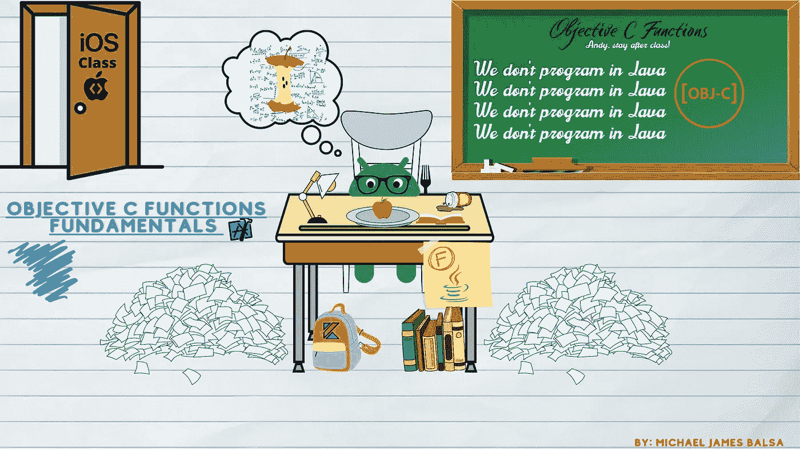
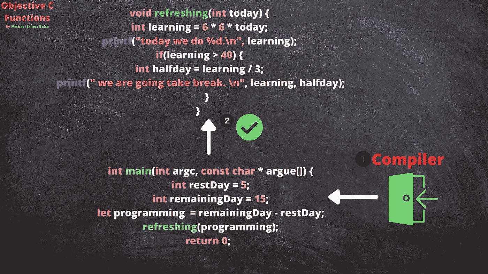
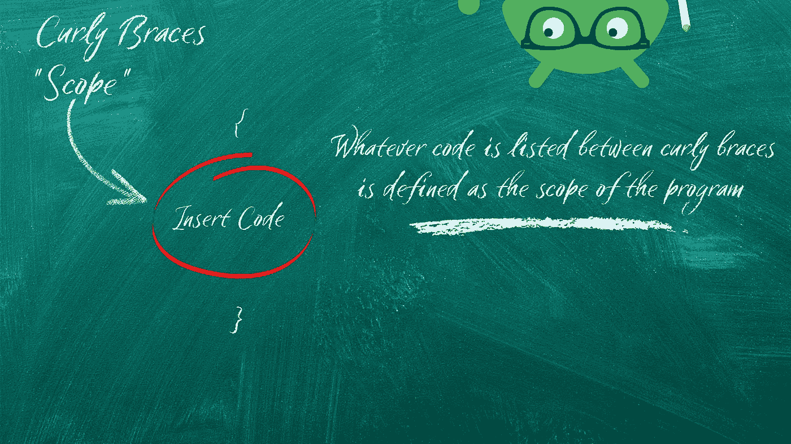

# 目标 C 中的职能

> 原文：<https://blog.devgenius.io/functions-in-objective-c-1282145253f2?source=collection_archive---------9----------------------->

> IOS 开发的目标 C 函数

> 除了 IOS 开发之外，我们还不断嵌入新的深奥语言 Swift。但是客观的 C 编程语言呢，函数如何与旧的强大的语言操作呢？

# 我们将讨论以下主题。

*   **目标 C 功能**
*   **初始化主函数**
*   **范围**
*   **代码分解**

# **目标 C 功能**

Objective C 是一种在整个 app store 的许多 IOS 应用程序中仍在使用和维护的语言。根据研究和统计，他们估计 31%的 Objective C 开发者来自 Jet Brains 统计分析。Objective C 是理解 IOS 开发的基础，因为它的原始语言是为 IOS 应用程序和软件开发的。

编程中的函数是短而复杂的块代码，在软件开发中生成和执行它需要较少的时间。今天我们将简要讨论 Objective C 编程语言中的函数以及如何理解

# **初始化主函数**

我们会想到的 Init 主函数是程序的入口。objective C 编译器会在程序执行时首先寻找 main 函数，让程序成功完成。如果您注意到在创建函数或方法时没有初始化 main 函数，就会出现编译器错误。编译器执行任何函数或代码库都需要初始 main 函数的声明。

示例显示了 init 用于函数声明的 main 方法

# 范围

你曾经阅读过任何一本书，并明确地专注于某个特定的章节或段落吗？有点像你专注于特定部分的范围。这将涉及到我们在 objective C 或任何其他编程语言中常见的任何类型的函数的花括号。

# **代码分解**

Swift 编程语言，如果作为你的第一个 IOS 语言，你可能会在阅读下面的代码块时感到有点困惑。让我们利用在本文中学到的知识，分解这个函数来理解这里发生了什么。首先，编译器将验证 init main 函数是否出现在程序中。在这个例子中，“init michael”将是我们程序的主要函数和入口。

程序现在将获得我们的顶层函数“刷新”中参数的总和。当计算出参数后，我们转向刷新函数并开始执行我们的程序。记住，把每件事分解成小块来完全理解它是很简单的；与 Swift 不同，在 Swift 中声明函数时没有 int main 函数。所以最好记得声明 int main 函数，让程序在 Objective C 中编译执行。

请参考目标 C 函数的代码示例

# 结论

今天我们对 IOS 开发的目标 C 函数做了一个简单的了解。与 Swift 编程语言相比，Objective C 有很多不同之处，需要大量的练习和重复。Objective C 是一种古老的编程语言，但苹果商店中的许多代码库仍然需要它。我们最好完全理解目标 C 语言并扩展我们的知识容量。编码快乐！

 [## 迈克尔·巴尔萨-技术作家-机器学习| LinkedIn

### 经验丰富的数据专家，负责监督维护美国的飞机数据和信息管理…

www.linkedin.com](https://www.linkedin.com/in/michael-balsa-9474431b0/) 

# 参考

 [## swift & Objective-C 2019-2019 年开发者生态系统状况信息图

### 只有编写或使用单元测试的受访者回答了这个问题。该图表仅显示了…

www.jetbrains.com](https://www.jetbrains.com/lp/devecosystem-2019/swift-objc/)