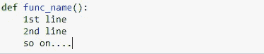
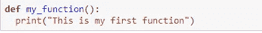
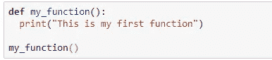
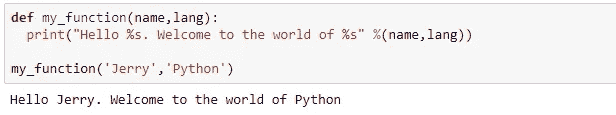
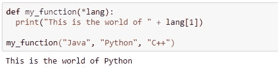
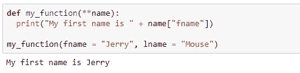
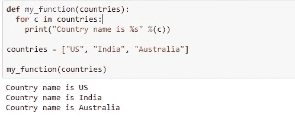
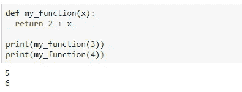
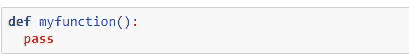

# Python 中的函数

> 原文：<https://blog.devgenius.io/functions-in-python-8c6dfbbaaef0?source=collection_archive---------7----------------------->

## 如何用 Python 写函数

由[沙哈达特拉赫曼](https://unsplash.com/@hishahadat?utm_source=medium&utm_medium=referral)在 [Unsplash](https://unsplash.com?utm_source=medium&utm_medium=referral) 上拍摄的照片

在本教程中，我们将了解如何用 python 编写函数。

## 什么是功能？

函数是代码块(或代码行),它允许我们对代码进行排序，使其更具可读性，并重用它。我们可以将称为参数的数据传递给函数。此外，函数可以返回数据作为结果。

## 创建函数

函数的语法:

定义函数

正如我们所看到的，函数是使用' ***def'*** 关键字后跟函数名来定义的。

例如:

## 如何调用函数:

在上面的例子中， *my_function* 是我们已经创建的函数的名称。那我们怎么称呼它呢？

要调用一个函数，只需使用函数名后跟():

## 带参数的函数:

我们可以将信息或变量(称为参数)传递给函数。这些参数需要在函数名后面的括号内指定。我们可以根据需要添加任意数量的参数，用逗号(，)分隔。让我们看一个例子来理解这一点:

在上面的例子中，my_function 是函数的名称，它有两个参数- *name 和 lang* ，定义在*括号()内。*

请注意，调用函数时必须使用正确数量的参数，也就是说，如果函数需要 2 个参数，我们必须使用 2 个参数来调用函数，不能多，也不能少。

## 使用任意参数，函数带有*args:

*任意参数*在 Python 中简称为 **args* 。

如果我们不确定有多少参数将被传递到我们的函数中，在函数定义中的参数前添加一个`*`。

## 使用任意关键字参数，**kwargs:

短语*关键字参数*在 Python 中被缩写为 *kwargs* 。

如果我们不确定有多少关键字参数将被传递到我们的函数中，在函数定义中的参数前添加两个星号:`**`。

通过这种方式，该函数将接收一个参数的*字典*，并可以相应地访问这些条目:

## 将列表作为参数传递:

我们可以向函数发送任何类型的参数(字符串、数字、列表、字典等)。)，它将被视为函数内部的相同数据类型。如果我们将一个列表作为参数发送，当它到达函数时也将被视为一个列表:

## 函数中的返回值:

我们使用 use***return***语句让函数返回值。

## 通行证声明:

函数不能为空，但是如果由于某种原因函数定义没有内容，则放入 *pass* 语句以避免出错。

## 结论

在本教程中，我们学习了如何在 python 中编写和使用函数。