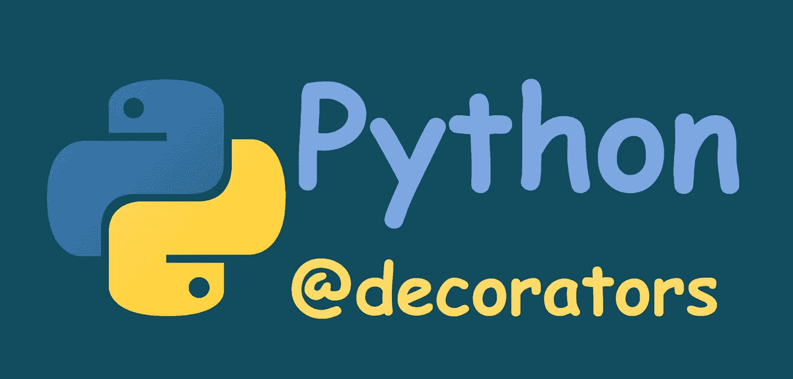

# Python Decorators 的基础和*args & **kwargs 的重要性

> 原文：<https://blog.devgenius.io/fundamental-of-python-decorators-and-importance-of-args-kwargs-d36288c2058?source=collection_archive---------2----------------------->

## 了解 Python decorators 的基础知识，并学习如何使用*args & **kwargs 创建通用的 decorator。



作者图片

装饰器允许我们在 Python 函数中添加更多的功能。它被称为**元编程**，因为程序的一部分在编译时向程序的另一部分添加了一些东西。

> 装饰器是 Python 中的一种设计模式，它允许用户向现有对象添加新功能，而无需修改其结构。装饰器通常在你想要装饰的函数定义之前被调用。
> 
> — [Datacamp 对装饰者的](https://www.datacamp.com/community/tutorials/decorators-python)定义。

装饰器用在函数的顶部，以@符号开始。下面是使用装饰器的基本结构:

```
@decorator_name
def function_name():
    ...
```

对 decorators 的理解很大程度上依赖于 python 中函数的一些特性。Python 中的函数是**一等公民**。这意味着…

*   我们可以传递一个函数作为另一个函数的参数。
*   将函数赋给变量。
*   从另一个函数返回一个函数。换句话说，函数是**的高阶**。

这些是在深入装饰者之前需要理解的基本概念。先说说他们吧。

# 作为另一个函数的参数的函数

让我们创建一个函数，并将其作为另一个函数的参数传递。

**输出:**

```
False
```

`even_or_odd()`函数检查一个数字是偶数还是奇数。我们将这个函数作为函数`call_function()`的参数传递。

# 将函数赋给变量

让我们像这样稍微修改一下代码…

输出:

```
False
```

这里我们将`call_function()`赋给了变量`result`。

# 高阶函数

当一个函数可以返回另一个函数或者可以从另一个函数返回时，我们称这个函数为高阶函数。让我们来看一个例子。

这段代码将在控制台中打印`Hello everyone!`。这里函数`say_hello()`返回函数`hello()`，从`say_hello()`返回`hello()`。所以都是高阶函数。

# 创建装饰器

现在我们已经理解了所有的先决条件，让我们创建我们自己的装饰器。

输出:

```
***************
Hello everyone!
***************
```

看看 `hello_decorator()`是如何改变`hello()`功能的。只需将`@hello_decorator`放在`hello()`函数之前，我们就可以向该函数添加额外的功能。

我们也可以这样写:

这也会给我们同样的结果。所以我们可以看到，decorators 主要是在利用我们之前讨论过的函数的特性。功能是一等公民，它们是更高级的。

现在我们有了一个装饰器，可以根据需要在任意多的函数中使用。假设我们有另一个功能`bye()`，我们想像以前一样装饰。我们只需要这样做:

```
@hello_decorator
def bye()"
    print("Bye everyone!")
```

# 用参数修饰函数

如果我们想给一个带参数的函数添加一些功能，我们必须创建可以用参数装饰函数的装饰器。假设我们有一个函数，它把一个数作为参数，然后把它乘以 2。我们想要创建一个装饰器来告诉我们这个数字是奇数还是偶数。

**输出:**

```
The number was even
20
```

为了修饰接收参数的`multiply_by_two()`，我们必须将参数传递给`wrapper_func()`函数。

# 用多个参数装饰函数

现在问题来了，如果一个函数接受不止一个参数，我们必须把它们一个接一个地传递给包装函数吗？还是有更高效的方法？这个问题会把我们引向**通用装饰者**的概念。我们也会明白`*args` & `*kwargs`能为我们做什么。

# 通用装饰器—使用*args & **kwargs

我们将编写一个接受三个数字作为参数的函数，并打印它们的和值。我们还将创建一个装饰器来显示数字。我们可以这样写代码。

输出:

```
The numbers were 1, 2 and 3
Sum: 6
```

但是有更好的方法。让我想想…

这也会给我们同样的结果。如果我们有另一个函数来打印 5 个数的和，`@display_decorator`也将会处理这个函数。

输出:

```
The numbers were (1, 2, 3, 4, 5)
Sum: 15
```

所以，使用`*args` & `**kwargs`使`displey_decorator()`成为一个通用的装饰器。

在 Python 中，我们有两种类型的参数，**位置参数，**和**关键字参数**。`*args`和`**kwargs`分别从我们的函数中收集所有的位置参数和关键字参数，并将它们存储在`args`和`kwargs`变量中。`add_five_numbers()`函数有五个位置参数。`*args`将它们存储在一个名为`args`的变量中。这就是为什么我们能够通过写`print(f’The numbers were {args}’)`来打印它们。

现在让我们看一个带有关键字参数的例子。

输出:

```
Keyword arguments are: {‘n1’: ‘100’, ‘n2’: ‘200’}
This function has two numbers as keyword arguments.
```

注意，如果我们在定义`num()`时传递了关键字参数，那么它们将不会被存储，我们也不能打印它们。

# 总结

借助`*args` & `**kwargs`装修工成为通用目的。这样，如果我们在不同的函数中需要相同类型的装饰器，我们可以只写一个装饰器。所以我们可以这样概括装饰者的结构—

```
def decorator_name(function):
    def wrapper_function(*args, **kwargs):
        # Put what the decorator will do here.......
        function(*args, **kwargs)
    return wrapper_function@decorator_name
def function_name(arg1, arg2, arg3……)
```

在 Python 中，创建我们自己的装饰器是一个非常强大的概念。也有许多内置的装饰器。像`@classmethod`、`@staticmethod`、`@property`、`@login_required`等等很多。这些内置的装饰器是 Python 语言的一部分。因此，我们可以使用它们在代码中添加许多重要的特性，而无需从头开始实现它们。

希望这对你有帮助。感谢阅读。

# 一些有用的资源

*   [装饰者——Python 101](https://python101.pythonlibrary.org/chapter25_decorators.html)
*   [Python-data camp 中的装饰者](https://www.datacamp.com/community/tutorials/decorators-python)
*   [@classmethod 和@staticmethod —堆栈滥用](https://stackabuse.com/pythons-classmethod-and-staticmethod-explained/)
*   [Python 装饰者入门——真正的 Python](https://realpython.com/primer-on-python-decorators/)

如果你喜欢阅读这样的文章，考虑成为一个媒体成员。这样你就可以无限制地访问媒体上的所有故事。如果你使用我下面的推荐链接注册，我将从你每月 5 美元的费用中赚取一小笔佣金。这样你就可以支持我这个作家了。

[](https://fahadulshadhin.medium.com/membership) [## 通过我的推荐链接加入 Medium-Fahadul shad hin

### 作为一个媒体会员，你的会员费的一部分会给你阅读的作家，你可以完全接触到每一个故事…

fahadulshadhin.medium.com](https://fahadulshadhin.medium.com/membership)