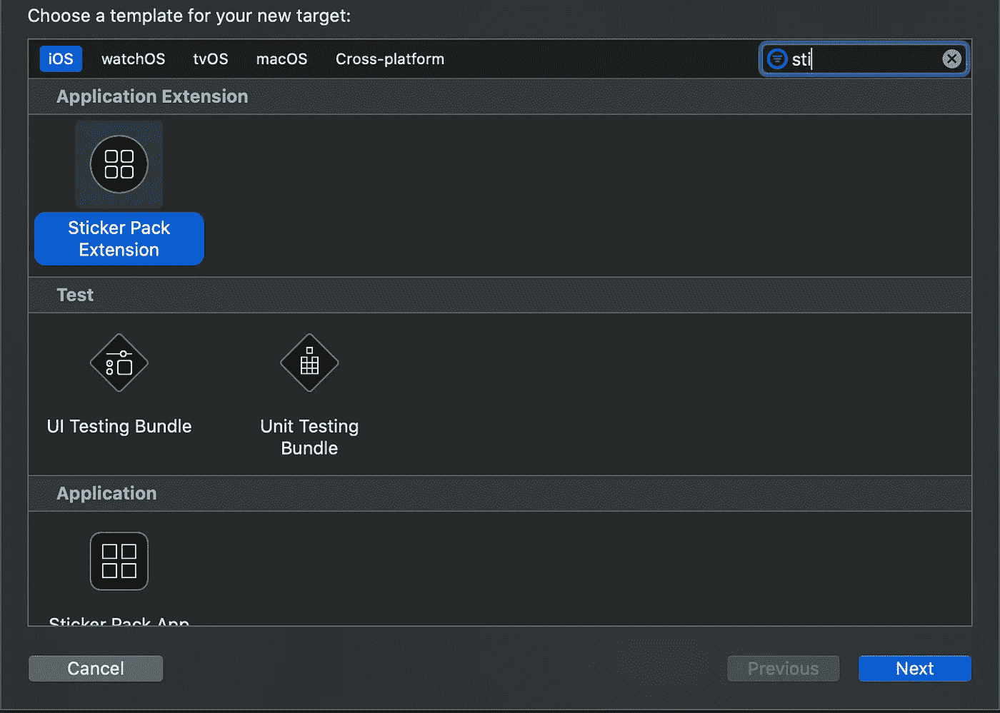

# Swift 的基础知识和惊人发现(结尾奖金)

> 原文：<https://blog.devgenius.io/fundamentals-and-surprising-discoveries-in-swift-bonus-at-the-end-9f103933723b?source=collection_archive---------15----------------------->

在我之前的帖子中，[我的 SwiftUI 天从这里开始](https://medium.com/@jonathangiardino/my-100-days-of-swiftui-begin-here-ed5b24b51c60) [，](https://dev.to/jonathan_gardn/my-100-days-of-swiftui-begin-here-3mcf),***)我解释了让我开始这个博客系列的过程，这是旅程的第一集，请上车！

# **变量、简单数据类型和字符串插值**

当经历真正基本的基础概念是简单的，但像经常发生的那样，一个人最终会发现一些令人惊讶的细节。事实正是如此。

例如，我已经知道了多行字符串，但是我不知道的是带有三个双引号的开始和结束必须在它们自己的行上

```
var str = """
This goes
over multiple
lines
"""
```

另一个例子是，为了更好的可读性，我们可以用下划线分割大整数。这真是莫名其妙！😅

只有我觉得这很酷吗？

```
var billion = 1_000_000_000
```

# **复杂类型**

来自 Javascript 背景的我很容易理解数组、集合和元组，但是我发现了一个我不知道的有趣的新特性。

当创建一个空集合时，我们可以使用下面非常常见的语法:

```
//Empty Dictionary
var person = [String: String]()//Empty Array
var age = [Int]()
```

但这在创建集合时是不可能的，我们需要使用尖括号:

```
var random = Set<String>()
```

有趣的事实是，如果我们愿意，我们可以在任何地方使用尖括号，在字典和数组中也是如此，也许这看起来很好，并且具有一致性，你不这样认为吗？

```
var person = Dictionary<String, String>()
var age = Array<Int>()
var random = Set<String>()
```

# *如承诺的一点点* ***奖金*** *这可能不算什么，但对我来说发现这一点真是太酷了！*

在浏览**# 100 daysofswittui**的同时，我正在上罗伯特·佩特拉什([@罗伯特·彼得拉斯](http://twitter.com/RobertPetras))教授的另一门关于 [Udemy](https://www.udemy.com/course/swiftui-masterclass-course-ios-development-with-swift/) 的课程，目的是为了好玩，并学习一些添加到我的新的和第一个 ios 应用程序中的小技巧。

在一个部分的结尾，Robert 解释了如何创建自定义贴纸来发送信息，我真的对它的简单性感到兴奋。

你需要做的就是进入 Xcode 的根文件夹，在左下方的常规面板中点击“项目”侧边栏中的加号按钮。

在这里，您可以键入贴纸并选择“贴纸包扩展”，单击下一步并创建新的贴纸文件夹。



Swift 中的贴纸包扩展

很简单，在创建的文件夹中:

-导航到。xcassets 文件夹
-添加正确的图标大小，将显示在 Messages 应用程序中，作为在应用程序图标内附加贴纸的选项
-在贴纸包文件夹内添加贴纸图像
-构建您的应用程序，当打开 Messages 应用程序时，在选项中附加您的新贴纸包将会出现！

我比第一次用 Javascript 创建表单时更加兴奋😂

任何反馈，评论或建议都非常感谢，事实上，这是鼓励。

我们连线吧！
网站:[jonathangiardino.com](https://jonathangiardino.com)
推特: [@jonathan_gardn](http://twitter.com/jonathan_gardn)
Dev 社区: [@jonathan_gardn](https://dev.to/jonathan_gardn)