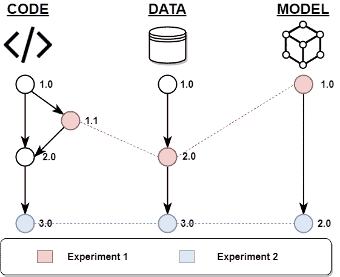
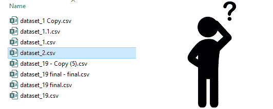
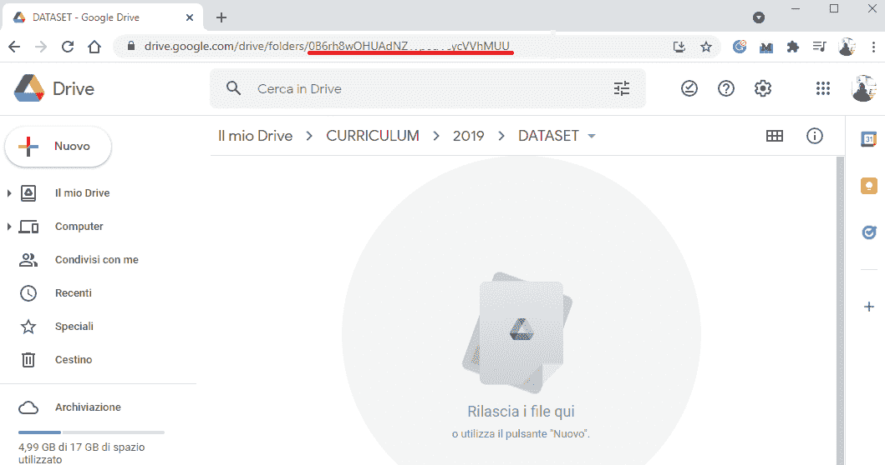

# 您必须了解的数据版本控制基础知识

> 原文：<https://blog.devgenius.io/fundamentals-of-data-versioning-you-must-know-647a12102635?source=collection_archive---------5----------------------->

## 数据版本化在机器学习项目中的应用。


弗兰基·查马基在 [Unsplash](https://unsplash.com/s/photos/data?utm_source=unsplash&utm_medium=referral&utm_content=creditCopyText) 上拍摄的照片

从根本上说，改变数据集的每一种可能的方式和我们处理数据集的方式(自然包括改变我们的代码)都代表一种“实验”，我们希望跟踪我们所做的每一个“实验”。我们需要管理用于**训练**，**验证**，和**测试** ML 模型的数据版本以及 ML 模型本身。

[数据版本化](https://lakefs.io/data-versioning/)是指通过特定的版本号记录数据演变的特定时刻。机器学习中的这一过程是有价值的，因为回滚到将我们带到特定模型创建的特定情况的必要性不能被夸大。

简而言之，为了能够将我们的项目重新构建到一个特定的时间点，我们必须维护三个对象的记录:代码**、数据**和模型**。**



*数据版本链接*

以上是两个数据版本或实验的直观表示。

我们机器学习项目的一个具体实验是用红色或蓝色的虚线来表示的，这些虚线连接了数据版本和在特定时间将我们带到特定模型的代码。该模型必须与用于调整它的[超参数](https://machinelearningmastery.com/difference-between-a-parameter-and-a-hyperparameter/)一起进行版本控制，因为您可能想要跟踪哪个配置是最合适的。

虽然通过像 [Git](https://en.wikipedia.org/wiki/Git) 或 [SVN](https://it.wikipedia.org/wiki/Subversion) 这样的软件可以很容易地对代码进行版本控制和处理，但它们更适合文本文件，并且不能很好地处理可能是多种格式的机器学习数据。

此外，当受版本控制的文件容量很大(千兆字节、兆兆字节甚至千兆字节)时，版本控制会产生问题。这是因为 Git repo 包含每个文件的完整历史，频繁更改这些文件的结果是需要很长时间来克隆并使用大量磁盘空间的 repo。

一种解决方案是使用名为 [Git LFS](https://git-lfs.github.com/) (大文件存储)的 Git 扩展来处理特定文件。这是一个次优的解决方案，因为文件有大小限制:最大 4GB。

第二种选择是通过在文件名末尾添加版本号或单词来管理版本，而不编辑数据的以前版本。如果除了你之外没有人在做这个项目，这是一个可以接受的解决方案。在一个协作环境中，每个人都可以访问相同的数据，并可以编辑它和创建新的数据集，直接的结果将是一片混乱。



*数据集混乱*

此外，将巨大的文件和代码存储在一起仍然是一个糟糕的做法，原因很明显——性能下降。我们不想下载项目历史中使用的每个数据集；我们只需要一个特定的数据集(如前所述，这个数据集可能足够大)。

这就是为什么我们需要把这些文件存储在其他地方。这是所有用于机器学习项目的**特定版本控制工具所基于的基本机制。**

方法非常简单:通过一个版本化的、简单的、基于文本的元数据文件将软件代码与数据集和模型联系起来。简而言之，这就像用存储在其他地方的特定数据集或模型的 URL 对文本文件进行版本控制。

让我们在 [DVC](https://dvc.org/) 中看看这个方法的例子，这是机器学习数据版本化最流行和简单的工具之一。

在[安装 DVC](https://dvc.org/doc/install) 之后，打开 git 存储库中的提示符并运行命令:

```
***dvc add <file_name>***
```

这里，<file_name>是数据集文件的名称。这个命令告诉 Git 忽略文件(将文件添加到。gitignore)并将其放入 DVC 缓存中。它还创建了一个名为<file_name>的文件。dvc，也就是我之前提到的关键元数据文件。在这个文本文件中，您会发现一个通过 md5 散列到 [DVC 缓存](https://dvc.org/doc/user-guide/project-structure/internal-files#structure-of-the-cache-directory)的链接。</file_name></file_name>

```
***outs:******- md5: a304afb96060aad90176268345e10355******path: data.xml***
```

到目前为止，该文件仍在本地计算机中。我们需要为 DVC 建立一个远程连接。DVC 与几家远程存储提供商合作。在本教程中，我将在 Google Drive 中设置它，因为大多数人已经有了 Google 帐户。

在您的 Google Drive 帐户中创建一个新文件夹。



复制浏览器选项卡中 URL 的最后一部分，并将其粘贴到以下命令中:

```
***dvc remote add -d storage gdrive://<id_of_your_gdrive_folder>***
```

这将在。dvc 目录，链接到远程数据存储器和以下内容:

```
***[core]
  remote = storage
['remote "storage"']
  url = gdrive://0b6 ….***
```

此时，您可以运行:

```
***dvc push***
```

最后，身份认证成功后，数据集将被推送到远程存储。参考在线[视频](https://www.youtube.com/watch?v=kLKBcPonMYw)获得进一步的解释和 DVC 的完整实践教程。

**对于在任何协作环境中工作的任何人来说，数据版本化都是必须知道的事情**。在这篇文章中，我谈到了机器学习项目的数据版本化的基础。

我们还深入研究了每个“实验”由什么组成(代码、数据集和模型)，为什么我们需要用代码来版本化数据集和模型，以及为什么在版本化数据集时标准的版本控制工具是不够的。