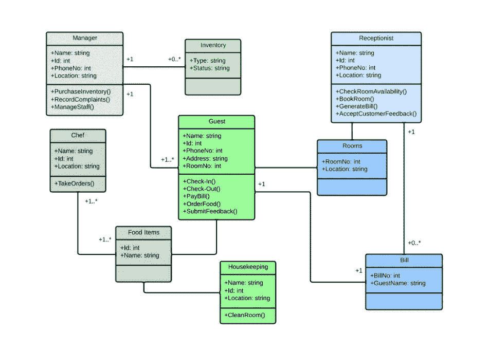

# 面向对象编程的基础

> 原文：<https://blog.devgenius.io/fundamentals-of-object-oriented-programming-oop-3b68dcc2d179?source=collection_archive---------3----------------------->

克里斯里德在 [Unsplash](https://unsplash.com?utm_source=medium&utm_medium=referral) 上的照片

面向对象编程的基本概念文章。基础、构成和行为。

# 编程范例

编程范式可以理解为构建程序和解决问题的思维模式。编程范式基本上是一个框架，包含一组要遵循的规则、概念和行为。

目前，有多种编程范例，其中最流行的是面向对象编程和函数式编程。强调几乎所有最流行的编程语言都是多范式的，也就是说，它们支持现有的大部分范式。

# 面向对象编程(OOP)

面向对象编程是一种编程范例，它描述了基于对象的程序构造。OOP 基于这样的思想，即一切都是对象，就像现实世界中我们周围的一切都是对象一样。

一台电脑，一个人，或者空气**“一切都表现为一个物体”**。物体有区分它们的属性，比如颜色，高度，或者粗细，它们也有行为，基本上是这个物体能执行的动作，比如吃，唱，送等。

照片由[艾蒂安·布朗热](https://unsplash.com/@etienneblg?utm_source=medium&utm_medium=referral)在 [Unsplash](https://unsplash.com?utm_source=medium&utm_medium=referral) 拍摄

# 面向对象编程的支柱

对象编程的支柱基本上是管理这种范式的一组规则、标准和行为。

下面是对这些支柱的简要描述。

1.  **抽象**:是针对问题的上下文来表现重要信息的能力。这个支柱旨在抽象出我们需要解决的问题及其组成部分。
2.  **封装**:是决定将向其他实体公开的部分的能力。这个支柱旨在根据案例隐藏或发布属性或方法。
3.  **多态性**:是根据输入值或条件返回不同结果的能力。这个支柱旨在通过重载或重写方法来改变对象的行为。
4.  **继承**:是将自己的特性比如属性、方法从一个类转移到另一个类的能力。这个支柱指向现有代码的重用。

# 面向对象的基本概念

面向对象编程呈现了一系列工件的操作和部件之间的相互作用，下面是对它们每一个的简要描述:

1.  **类**:类是根据定义的模型创建对象的模板。一个类由属性和方法组成。
2.  **对象**:对象本身就是一个类的实例，也就是说，它是通过模型诞生的软件。
3.  **属性**:属性是区分一个物体与另一个物体的个体特征，它们决定了物体的外观、状态或其他品质。
4.  **方法**:方法是对象可以执行的动作的规范。
5.  **构造者**:构造者本身就是对象的制造者。构造函数接收创建指令，并为对象的属性赋值。构造函数基本上是一种在对象实例化时自动执行的方法。

# 面向对象的扩展概念

此外，还有其他面向对象的编程构件，它们添加了更多的工具，以便根据上下文在不同的情况下工作。强调这些工件并非在所有编程语言中都可用，它们的实现是以不同的方式完成的，甚至在某些情况下是模拟的。

*   **抽象类**:是继承和多态的类思想。在抽象类中，我们必须定义至少一个抽象方法，以便派生类继承和实现抽象方法。抽象类不能被实例化，只能被继承，每当我们定义一个抽象方法时，这个类必须是抽象的。
*   **抽象方法**:抽象方法给了我们引入方法声明的可能性，但不是它的定义。
*   **静态类**:主要是为了拥有不需要使用对象的功能而设计的类，也就是说，它的功能可以直接调用，而不需要实例化对象(一个明显的例子就是 Javascript 中的 Math)。静态类不能被继承或实例化。
*   **静态方法**:静态方法给了我们不需要实例化它的类就可以被调用的可能性。
*   **接口**:接口完成在代码中定义契约的功能。类必须满足和实现的接口形状定义。这些规则适用于方法和属性，具体取决于编程语言。

注意 🧐:查阅当前编程语言的文档，以便能够可视化这些概念之间的差异。一个接口或抽象类可能有不同的作用域。

# 什么时候使用面向对象编程？

如上所述，编程范例的使用取决于要解决的问题。但是多年来，业界已经将 OOP 用于某些类型的开发，比如游戏、框架开发和服务器端编程。强调一些编程语言，如 Java 或 C #是专注于这种范式的语言。这里有一些提及:

*   《我的世界》:在这种基于 Java 的范例下创作的游戏。
*   **Angular**:web 框架是基于 Typescript 用 OOP 编写的。
*   **Django** :后台框架是基于 Python 用 OOP 编写的。

# UML 类图

在软件工程中，UML 类图是描述基于面向对象的系统表示的静态结构图。

类图表示描述其组成部分(如类、属性、操作和对象之间的关系)的系统。

类图的作用之一是:

*   解决方案的分析。
*   系统文档。
*   组件和行为的可视化。

# 学习 OOP 的书籍

*   [Java OOP 做对了](https://www.amazon.es/Java-OOP-Done-Right-oriented/dp/1527284441/ref=sr_1_1?__mk_es_ES=%C3%85M%C3%85%C5%BD%C3%95%C3%91&crid=32EY0QDQZC7UR&keywords=OOP&qid=1664213815&qu=eyJxc2MiOiIxLjUzIiwicXNhIjoiMC4wMCIsInFzcCI6IjAuMDAifQ%3D%3D&s=books&sprefix=oop%2Cstripbooks%2C371&sr=1-1)
*   [面向对象的 Python 主 OOP](https://www.amazon.es/Object-Oriented-Python-Master-Building-Games/dp/1718502060/ref=sr_1_3?__mk_es_ES=%C3%85M%C3%85%C5%BD%C3%95%C3%91&keywords=OOP&qid=1664213882&qu=eyJxc2MiOiIxLjUzIiwicXNhIjoiMC4wMCIsInFzcCI6IjAuMDAifQ%3D%3D&s=books&sr=1-3)
*   [c++中的 OOP](https://www.amazon.es/OOP-C-Babar-Bilal/dp/B0B4X3YK7C/ref=sr_1_4?__mk_es_ES=%C3%85M%C3%85%C5%BD%C3%95%C3%91&keywords=OOP&qid=1664213922&qu=eyJxc2MiOiIxLjUzIiwicXNhIjoiMC4wMCIsInFzcCI6IjAuMDAifQ%3D%3D&s=books&sr=1-4)
*   [面向对象的 JavaScript](https://www.amazon.es/Object-Oriented-JavaScript-Third-Ved-Antani/dp/178588056X/ref=sr_1_3?__mk_es_ES=%C3%85M%C3%85%C5%BD%C3%95%C3%91&crid=1LQBOBMXH9YHK&keywords=OOP+javascript&qid=1664213957&qu=eyJxc2MiOiIxLjQ1IiwicXNhIjoiMC4wMCIsInFzcCI6IjAuMDAifQ%3D%3D&s=books&sprefix=oop+javascrip%2Cstripbooks%2C333&sr=1-3)

感谢你远道而来，如果你觉得这很有用，别忘了鼓掌👏。订阅以接收更多内容🔔。

如果你需要额外的帮助，请联系我🤠。

*   ✉️ [**给我发邮件**](mailto:dcortes.net@gmail.com)
*   🤝 [**在 LinkedIn 上联系我**](https://www.linkedin.com/in/dcortesnet/)
*   📮 [**在推特上联系我**](https://twitter.com/dcortes_net)

非常感谢您的阅读，我感谢您的时间。