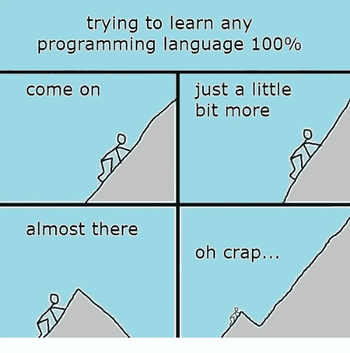

# 在实际代码库中发现有趣的代码片段和注释

> 原文：<https://blog.devgenius.io/funny-code-snippets-and-comments-found-in-actual-codebases-d8287f1d15cc?source=collection_archive---------4----------------------->

为了让气氛轻松一点，我从 Reddit、Quora 和互联网上的其他地方收集了一些有趣的片段。尽情享受吧！

让我知道哪一个是你最喜欢的，并请分享你发现的让你开怀大笑的片段！

如果你是新来的，喜欢这篇文章，在 Medium 上还有很多这样的文章。你可以注册阅读它们，每月只需 5 美元。

[**这里是无限制访问媒体上每一个内容的链接。**](https://amanda-m-johnson.medium.com/membership) 如果你用这个链接注册，我会赚一小笔钱，不需要你额外付费。