# 有趣的编程迷因会让你笑死

> 原文：<https://blog.devgenius.io/funny-programming-memes-that-will-make-you-die-laughing-1ccd8e139040?source=collection_archive---------0----------------------->

## 编笑话来点亮你的周五

阿曼达·索菲亚·佩伦兹在 [Unsplash](https://unsplash.com?utm_source=medium&utm_medium=referral) 上拍摄的照片

你可能已经听过很多次了，喝更好的咖啡可以让你一整天都很美好。但是，如果某件事给你带来了笑容，你当然可以说… **我感觉到了…或者我很喜欢…**

今天，我试图整理一些在互联网和脸书上发现的让我开心的笑话/迷因。

> 开始了…准备好改变你的心情…

# 通常发生在我周五工作并为客户做演示的时候…

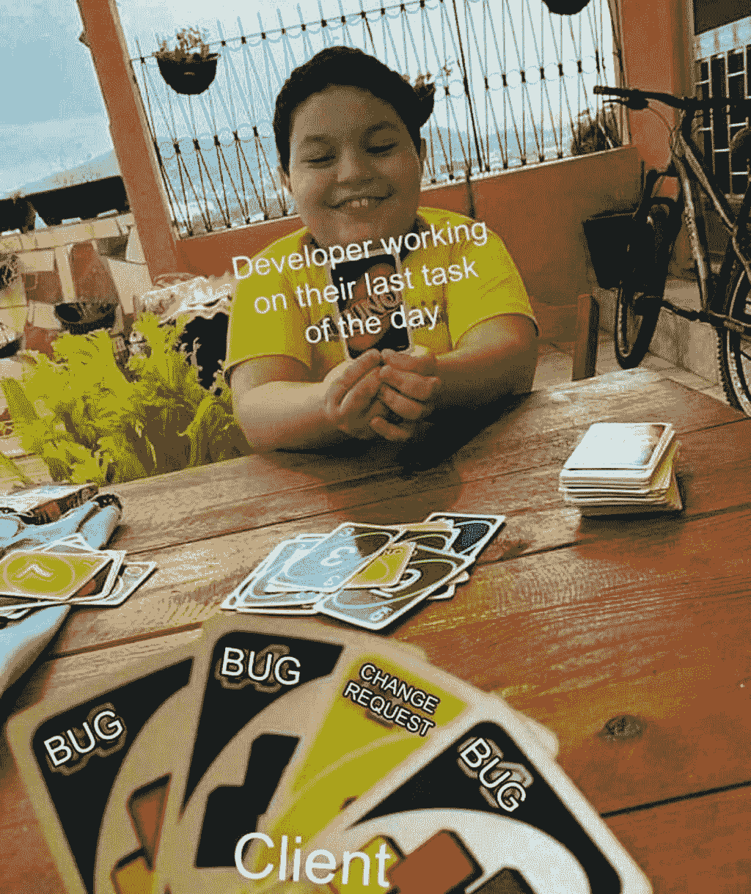

[https://www . Facebook . com/programmers create life/photos/a . 241809332534619/3750971258285058/](https://www.facebook.com/ProgrammersCreateLife/photos/a.241809332534619/3750971258285058/)

# 有时初级开发人员知道得更多…

[https://www . Facebook . com/dzone Inc/photos/a . 336758034711/10159280091324712](https://www.facebook.com/DZoneInc/photos/a.336758034711/10159280091324712)

# 我根据项目购买课程，当我按照这样的指示结束时…

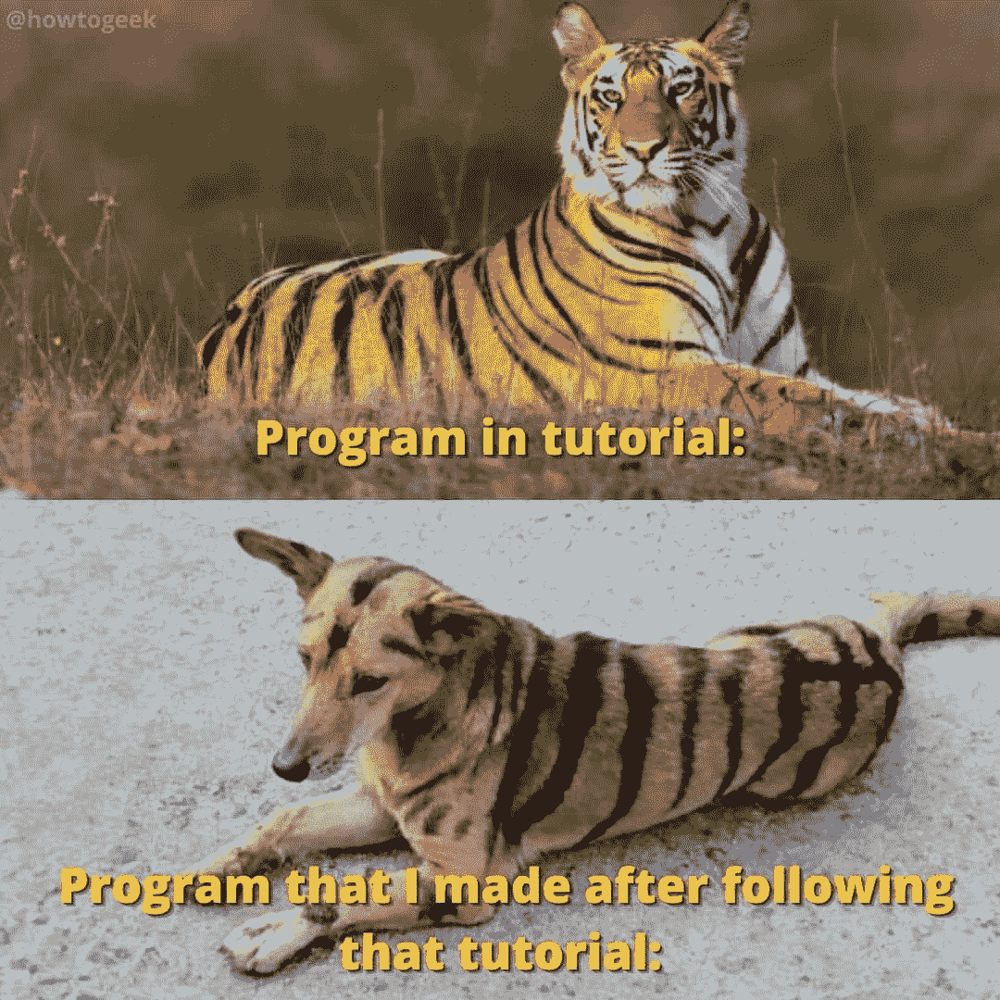

[https://www . Facebook . com/JavaScript js/photos/a . 1387402908063976/2172042662933326/](https://www.facebook.com/javascriptJS/photos/a.1387402908063976/2172042662933326/)

# 当我试图修复一个让事情变得更糟的小错误时…

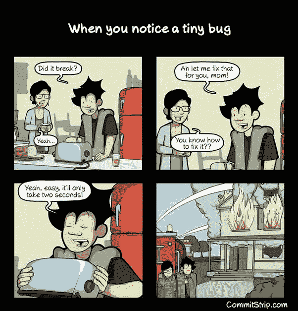

[https://www . quora . com/What-is-the-best-programming-comic-strips](https://www.quora.com/What-are-the-best-programming-comic-strips)

# 总有一些隐藏的错误..不要打扰他们…

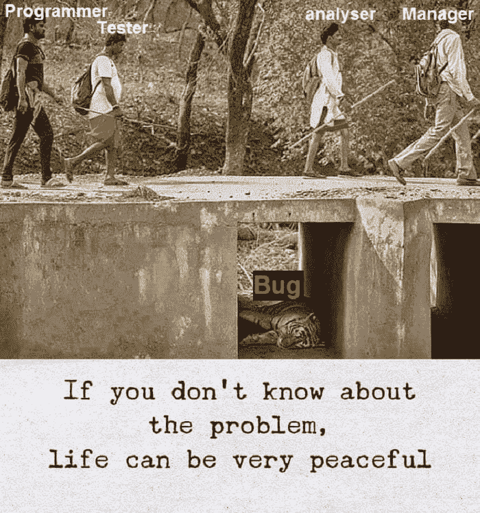

[https://www . Facebook . com/programmers create life/photos/a . 241809332534619/3817315068317343/](https://www.facebook.com/ProgrammersCreateLife/photos/a.241809332534619/3817315068317343/)

# 当我的教练问我最喜欢哪台机器时…

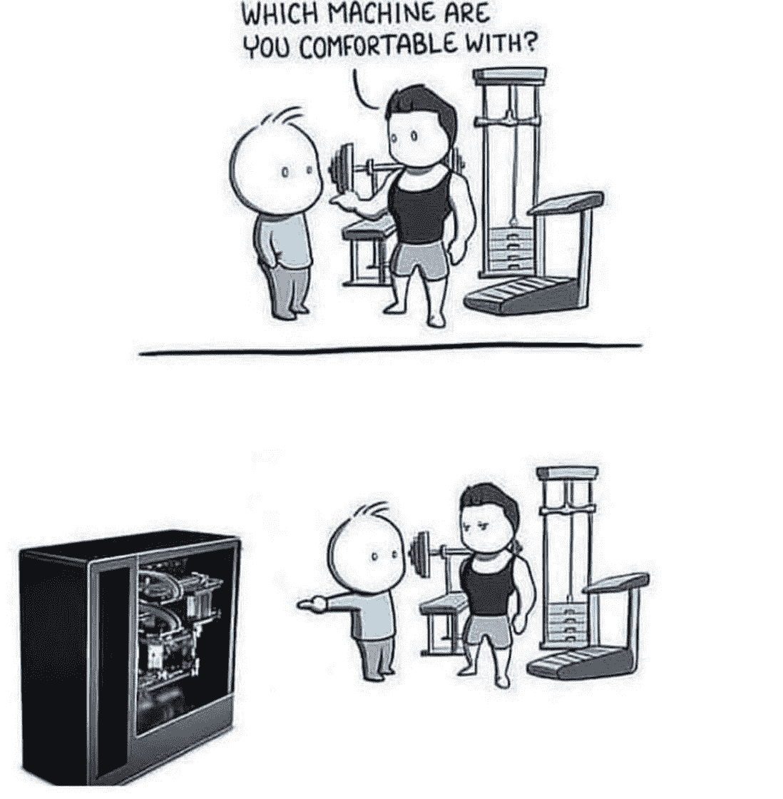

[https://www . Facebook . com/JavaScript js/photos/1833542923449970](https://www.facebook.com/javascriptJS/photos/1833542923449970)

# 星期五提前离开…

# 永远不要试图扰乱工作代码…

[https://www . Facebook . com/JavaScript js/photos/1602108066593458](https://www.facebook.com/javascriptJS/photos/1602108066593458)

# 随着太多框架的出现…

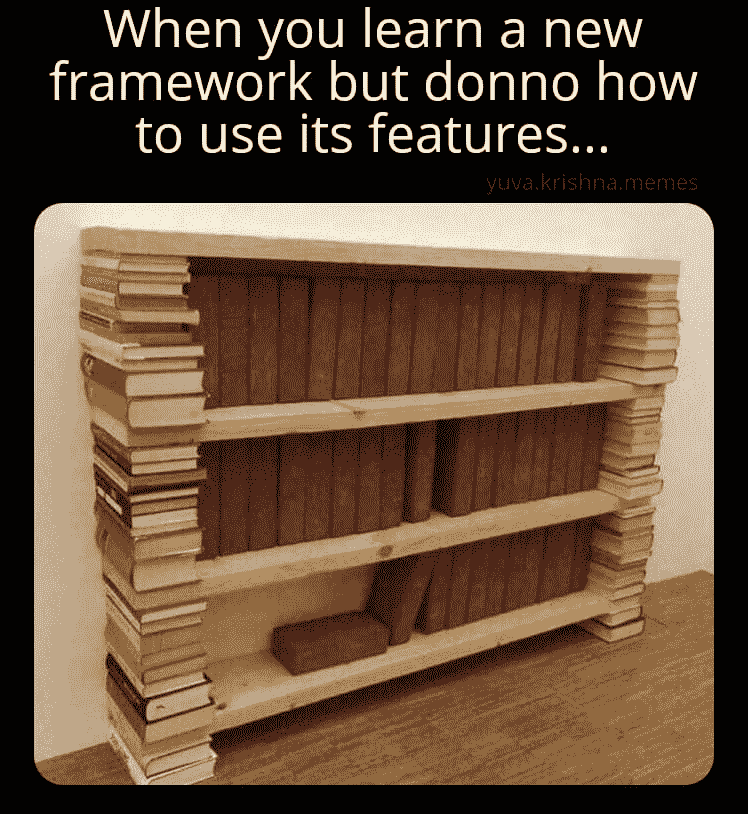

[https://www . Facebook . com/yuva . Krishna . memes/photos/a . 105527467815845/29995221702401/](https://www.facebook.com/yuva.krishna.memes/photos/a.105527467815845/299995221702401/)

# 当我的学长让我在代码中添加注释时…

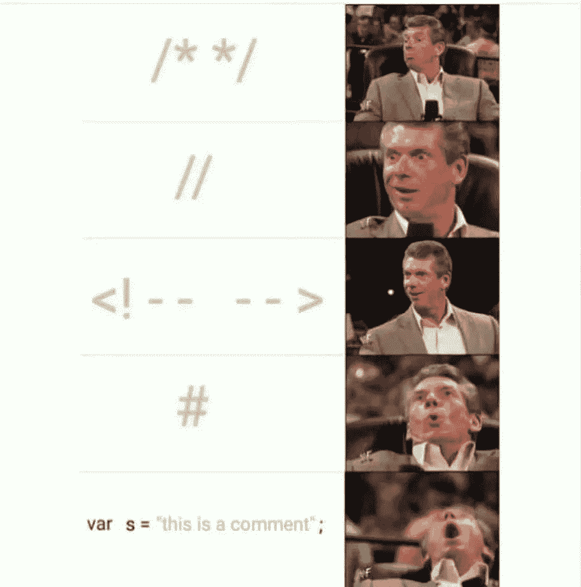

[https://www . Facebook . com/JavaScript js/photos/a . 1387402908063976/2170533493084243/](https://www.facebook.com/javascriptJS/photos/a.1387402908063976/2170533493084243/)

# 添加所有东西，这样它就能在自动工具中捕捉到…

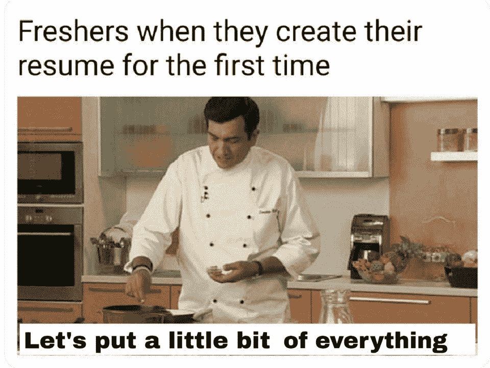

[https://www . Reddit . com/r/programmer humor/comments/mnbgz 1/knows _ every _ programming _ language/](https://www.reddit.com/r/ProgrammerHumor/comments/mnbgz1/knows_every_programming_language/)

# 我最好的敌人是…

[https://www.facebook.com/DZoneInc/photos/10158920521754712](https://www.facebook.com/DZoneInc/photos/10158920521754712)

# 奖励时间:

# 什么是递归？一个简单的答案。

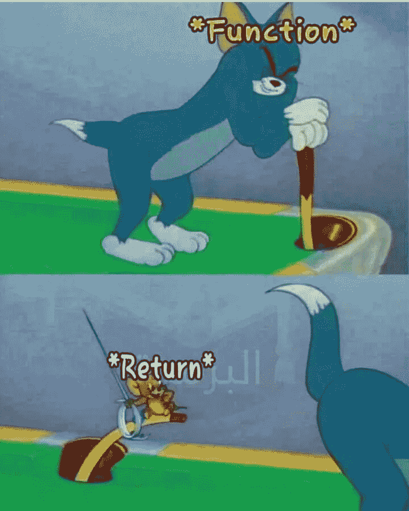

[https://devrant . com/rants/1052316/this-is-how-recursive-functions-works](https://devrant.com/rants/1052316/this-is-how-recursive-functions-works)

# 其他人做的吗？

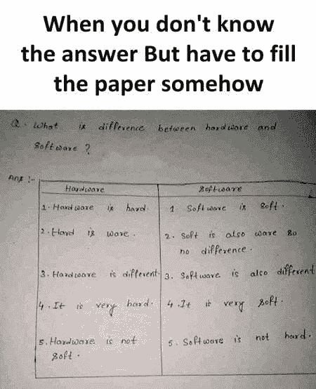

[https://www.facebook.com/photo/?fbid=2626573337649221&set = GM . 2879879672279583](https://www.facebook.com/photo/?fbid=2626573337649221&set=gm.2879879672279583)

# 这是讽刺吗？是的…哈哈

[https://www . Facebook . com/yuva . Krishna . memes/photos/a . 105527467815845/374844090884180/](https://www.facebook.com/yuva.krishna.memes/photos/a.105527467815845/374844090884180/)

# 一切皆有可能…什么都没有定义…一个晚上有几个小时？

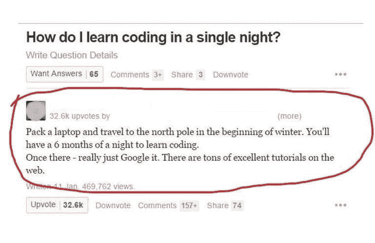

[https://www . Facebook . com/yuva . Krishna . memes/photos/a . 105527467815845/374439034258019/](https://www.facebook.com/yuva.krishna.memes/photos/a.105527467815845/374439034258019/)

# 我做了一些有用的事情，现在我可以把它添加到我的简历中

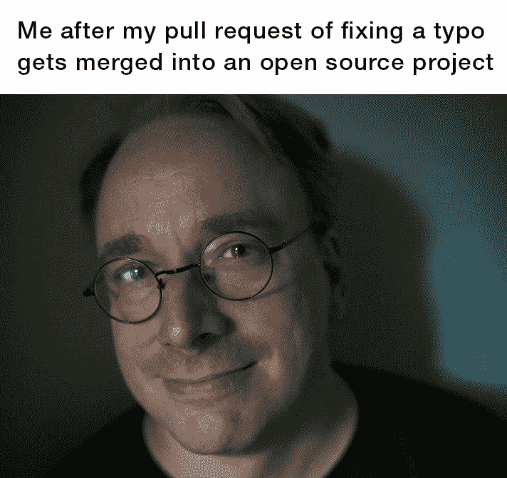

[https://www . Facebook . com/jokesvala/photos/a . 2330223400336101/6283529831672085/](https://www.facebook.com/jokesvala/photos/a.2330223400336101/6283529831672085/)

# 哇…这种感觉…

[https://www.facebook.com/photo/?fbid=10165386371885383&set = GM . 837026157016641](https://www.facebook.com/photo/?fbid=10165386371885383&set=gm.837026157016641)

# 在 StackOverflow 上有人帮了你之后，世界是如此美好…

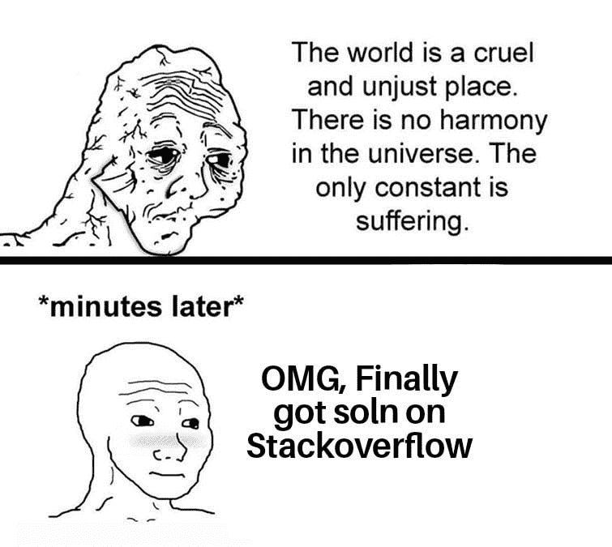

[https://www . Facebook . com/jokesvala/photos/a . 2330223400336101/6283493258342409/](https://www.facebook.com/jokesvala/photos/a.2330223400336101/6283493258342409/)

# 上传文件的物理方式是什么？

[https://www . Facebook . com/septa tec/photos/a . 3294457633926346/4250075005031266/](https://www.facebook.com/Septatec/photos/a.3294457633926346/4250075005031266/)

# 嗯…希望不会发生在任何人身上…如果是这样，这篇文章会对你有很大帮助…

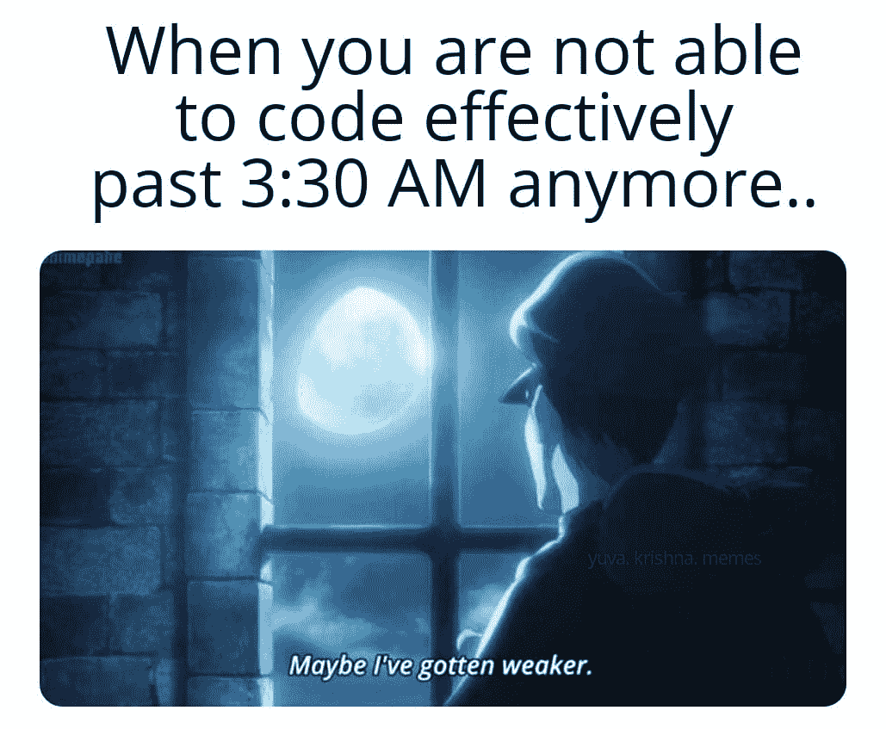

[https://www . Facebook . com/yuva . Krishna . memes/photos/a . 105527467815845/374823690886220/](https://www.facebook.com/yuva.krishna.memes/photos/a.105527467815845/374823690886220/)

# 谁干的？

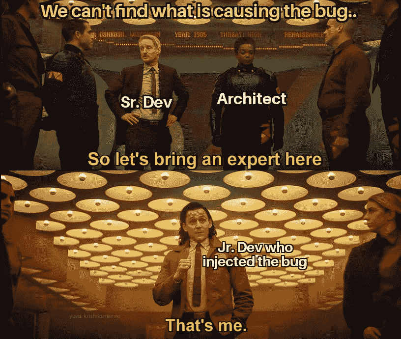

[https://www . Facebook . com/yuva . Krishna . memes/photos/a . 105527467815845/373596757675580/](https://www.facebook.com/yuva.krishna.memes/photos/a.105527467815845/373596757675580/)

# 调试就是以这样一种方式挤进去，缺陷会自己被注意到…

[https://www . Facebook . com/yuva . Krishna . memes/photos/a . 105527467815845/373561211012468/](https://www.facebook.com/yuva.krishna.memes/photos/a.105527467815845/373561211012468/)

> 希望你喜欢它…如果是这样，请让我在评论中知道，这样我就可以为你想出更多更有趣的剂量…

# 你错过了以前的搞笑炸弹吗？看看这里，爆发你的快乐…

 [## 25 个以上的 StackOverflow 编程迷因，所有开发人员都可以涉及到

### 编程幽默可以通过刷新你的情绪来减轻你的压力

javascript.plainenglish.io](https://javascript.plainenglish.io/25-more-stackoverflow-programming-jokes-that-all-devs-can-relate-to-ebc2f9c11ca3)  [## 11 个能让你心情愉快的编程迷因

### 2021 年最佳编程迷因

javascript.plainenglish.io](https://javascript.plainenglish.io/11-programming-memes-that-will-lighten-up-your-mood-e165be3513ea)  [## 2021 年最佳编程幽默汇编

### 编程迷因可以减轻你的压力

blog.devgenius.io](/best-programming-humor-compilations-2021-623473bfb0d)  [## 有趣的编程迷因会让你笑死

### 编笑话来点亮你的周五

blog.devgenius.io](/funny-programming-memes-that-will-make-you-die-laughing-1ccd8e139040)