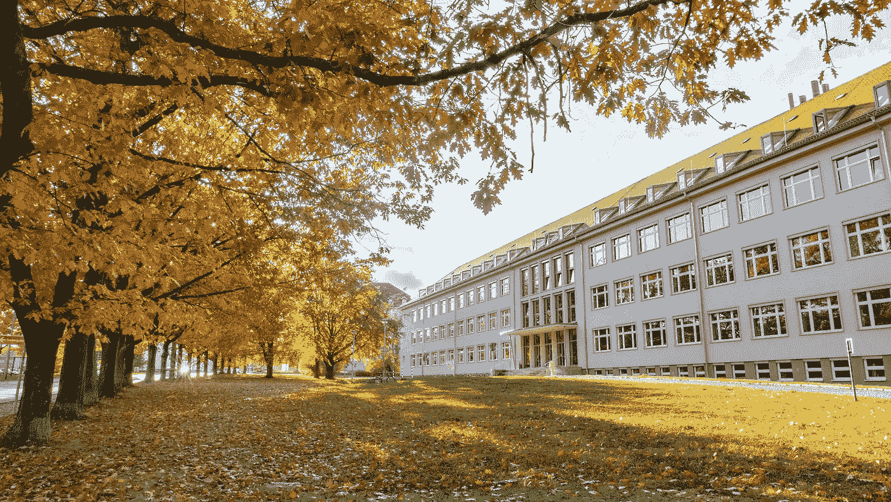

# 继续教育:书还是什么？

> 原文：<https://blog.devgenius.io/further-education-moocs-or-master-s-1d5d29e27f36?source=collection_archive---------7----------------------->

## 为你的生活做点什么

照片由 [Unsplash](https://unsplash.com/s/photos/studying-abroad?utm_source=unsplash&utm_medium=referral&utm_content=creditCopyText) 上的 sanga Rima Roman Selia 拍摄

许多人抱着培养新技能的想法。他们对日常活动和当前的工作感到厌倦。他们拖延，享受太多，渴望下一次晋升。有时候，他们所受的教育根本不够有竞争力。

那还是可以的。你有潜力。

# 所以让我告诉你:对你个人成长最好的投资之一是**教育**。

> 你可能上过大学，也可能有一份体面的工作，但你必须明白，教育并没有到此为止。说真的。

就像你开车去保养、阅读新闻、购买新鲜食品和去健身房一样，你也必须保持精神健康。

你必须阅读。你必须学习。你必须学习。你必须教育自己保持相关性，拓宽自己的思维方式。

常见的方式有两种。1)一种是传统的获取学位的方式。2)另一种是利用所谓的海量开放在线课程，简称:MOOC 的。他们现在真的很流行。

在这篇文章中，我们阐述了这两种选择，并分析了它们的利弊。

# 1.回到大学:硕士还是 MBA

这是一个简单的选择。

你付了学费，所有的内容都会以简洁、结构化和互动的方式传递给你。

没有说的是你遇到的人的数量，你交的朋友，与助教和教员的讨论，以及你必须学会一起工作的小组项目，尽管来自不同的背景和文化。

走出你的舒适区是个人和职业成长的关键，也是学位课程必须提供的宝贵经历。

不幸的是，大多数硕士课程费用很高。

你还得照顾生活费用，毕业后你最终会负债累累。此外还有机会成本，即你不工作所损失的金钱。

你收入的很大一部分将用于偿还贷款和利息，除非你是极少数父母富有的人之一。

但是如果你最终在一个经济更好的国家，你会很快摆脱债务，很快开始储蓄。如果你住在同一个地方，也更容易找到工作。你更有可能在求职中得到回应，因为你已经用你的新学位在那个环境中证明了自己。

# 2.利用 MOOC 进行自学

这是一个困难的选择。

MOOC 包含大量的测验和实践作业。但是，我始终赞成 MOOC 的。如果你已经很有资格，他们真的很有帮助，因为你所缺少的是真正的技能。你已经具备的解决问题的能力。

**在这种情况下，两年制硕士学位就显得有些多余了。**

这一点在软件行业尤为重要，因为新工具像苍蝇一样来来去去。有了 MOOC，你可以简单地注册一门课程，增长你的知识。这些课程也往往便宜很多，但平心而论，我必须承认，费用因你接受的教育平台和证书而异。它可以高达 30000 美元，但也可以完全免费。

有了 MOOC，如果课程不适合你，你可以毫无愧疚地选择退出。与计划在一个新的国家呆上两年相比，通过 MOOC 进行自学更容易实现，也更容易融入你的生活。

**我的观点:放手去做吧！**

一些帮助您入门的门户网站:

*   [Coursera](https://www.coursera.org/)
*   [领英学习](https://www.linkedin.com/learning/)
*   [可汗学院](https://www.khanacademy.org/)

我希望你喜欢阅读这篇文章。更多此类内容，保持联系！