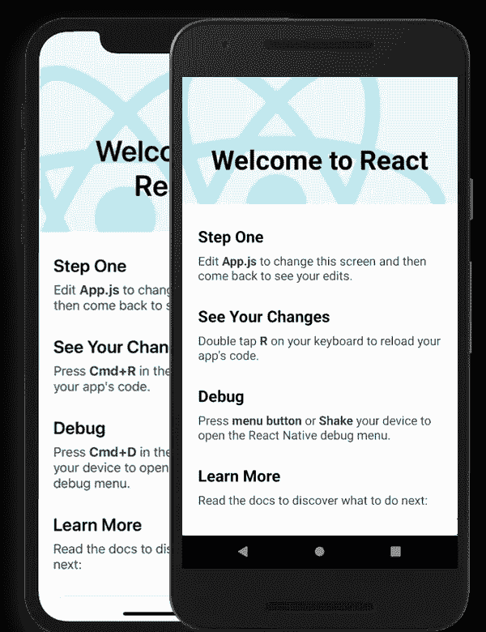

# 2021 年的移动应用开发

> 原文：<https://blog.devgenius.io/future-mobile-app-development-6ac77fe3a54c?source=collection_archive---------7----------------------->

在当今时代，无论你是去购物、听歌还是预约医生，我们都希望通过应用程序来完成所有工作，人们喜欢通过网站来完成所有工作的时间不多了，如果你能开发一个移动应用程序，那么你在这个移动应用程序开发人员社会中是受欢迎的，如果你想知道如何开发应用程序，那么我可以为你提供很多。

# 1.使用 Flutter 的 Android 和 iOS 原生应用

Flutter 是 Google 创建的开源 UI 软件开发工具包。它用于从单一代码库为 Android、iOS、Linux、Mac、Windows、Google Fuchsia 和 web 开发应用程序。

这是成为优秀应用程序开发者的一个非常简单的方法，通过这种方法，你可以创建网页设计风格的完整应用程序。不仅如此，还有许多预制的东西，你只需要做更多的细节

 [## 镖包

### Pub 是 Dart 编程语言的包管理器，包含可重用的库和 Flutter 包…

公共开发](https://pub.dev/) 

> 你如何开始？

1.  *学习飞镖语言*

Dart 是一种开源的通用编程语言。它最初是由 Google 开发的，后来被 ECMA 批准为标准，它更像是一种 c 语言。

 [## Dart 编程语言

### 使用专门针对用户界面创建需求的编程语言进行开发，反复进行更改…

dart.dev](https://dart.dev/) 

*2。HTML，CSS(基本)*

因为 flutter 使用了一种 web 开发风格，这就是为什么你应该有一些关于 HTML、CSS 的先验知识，因为它是基于标签的，在 flutter 中，一切都像你的顶部导航栏、页脚等组件

 [## HTML 教程

### 组织良好，易于理解的网站建设教程，有很多如何使用 HTML，CSS，JavaScript 的例子…

www.w3schools.com](https://www.w3schools.com/html/)  [## W3。CSS 主页

### 组织良好，易于理解的网站建设教程，有很多如何使用 HTML，CSS，JavaScript 的例子…

www.w3schools.com](https://www.w3schools.com/w3css/defaulT.asp) 

*3。颤动*

如果你已经读了这么多，那么恭喜你，因为你应该通过阅读 Flutter 文档来制作自己的应用程序的时候到了。

 [## 安装

### 安装 Flutter 并开始使用。可供 Windows、macOS、Linux 和 Chrome OS 操作系统下载。

颤振. dev](https://flutter.dev/docs/get-started/install) 

flutter 中的一些基础 app

 [## GittyAjay/DiceeFlutter

github.com](https://github.com/GittyAjay/DiceeFlutter)  [## GittyAjay/魔法球

github.com](https://github.com/GittyAjay/Magic-ball)  [## 吉他/钢琴

github.com](https://github.com/GittyAjay/playranjan)  [## GittyAjay/名片

github.com](https://github.com/GittyAjay/BuisnessCard) 

# 2.使用 React 为 Android 和 iOS 创建原生应用

它在 JavaScript 上工作，所以如果你知道 JavaScript，那么这个旅程对你来说会很容易，同时，如果你知道 HTML CSS，那么你可以在必要时创建一个 React Native 应用程序，因为 React Native 来自 React web framework。这是我们做的一个网站，如果你不知道也不用担心，你也可以和 react native app development 一起阅读。

许多大型公司已经开始使用 react native 进行应用开发，如沃尔玛、UberEats、彭博、Discord、F8、Discovery VR 等。

与 flutter 相比，React native 更可取，因为 96%的代码库在 android 和 iOS 应用程序之间共享，并且 react native 的 UI 开发时间比 native 更快。

> 你如何开始？

1.  超文本标记语言
2.  半铸钢ˌ钢性铸铁(Cast Semi-Steel)
3.  Java 脚本

 [## JavaScript 教程

### JavaScript 是世界上最流行的编程语言。JavaScript 是网络的编程语言…

www.w3schools.com](https://www.w3schools.com/js/default.asp) 

1.  反应

 [## 开始行动-做出反应

### 用于构建用户界面的 JavaScript 库

reactjs.org](https://reactjs.org/docs/getting-started.html) 

1.  反应自然

 [## 介绍反应自然

### 欢迎来到 React Native 之旅的起点！如果您正在寻找环境设置说明，他们已经…

反应性发展](https://reactnative.dev/docs/getting-started) 

React-native 中的一些基本应用程序

 [## GittyAjay/React _ Native _ Ecommerce _ App

github.com](https://github.com/GittyAjay/React_Native_Ecommerce_App) 

# 下一步是什么

本文探讨了如何开始应用程序开发，但是您也可以浏览各种文档以了解更多细节。我们希望您能和我们一起探索更多不同的移动开发内容。