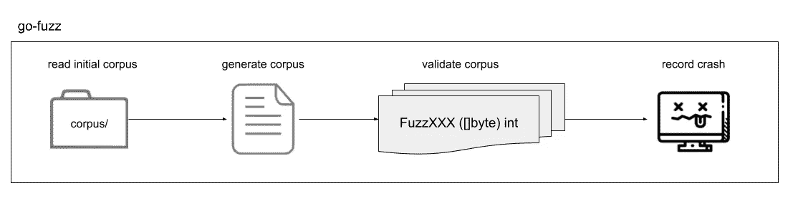

# 用 Golang 进行模糊测试

> 原文：<https://blog.devgenius.io/fuzzing-tests-with-golang-b3d5433bb9ef?source=collection_archive---------5----------------------->


[http://networkbit.ch/golang-fuzzing/](http://networkbit.ch/golang-fuzzing/)

模糊化是一种自动化测试，它不断操纵测试程序的输入，以发现代码可能易受影响的问题，如*混乱、错误或数据竞争*。这些半随机数据突变可以发现现有单元测试可能遗漏的新代码覆盖，以及可能未被检测到的边缘错误。

模糊者通常可以找到单元测试遗漏的 bug，因为单元测试只包含开发人员输入的值，所以估计这些值会产生错误。这个程序已经被恐慌、失败的断言、无限循环等等所困扰。fuzzing 不是使用一个小的、预定义的手动创建的输入集(像单元测试)，而是不断地用新的案例测试代码，以努力锻炼有问题的软件的所有方面。

```
// Test function for Unit testing
TestCalculateHighest(t *testing.T){}// Fuzz function for fuzzing testing
FuzzTestHTTPHandler(f *testing.F) {}
```

Fuzzing 的重点不是取代传统的测试，而是通过随机迭代被测代码的输入值来补充它们。Fuzzing 对于发现安全漏洞和弱点特别有价值，因为它可能会达到人们经常忽略的极端。



模糊测试流程。([https://medium . com/a-journey-with-go/go-fuzz-testing-in-go-deb 36 ABC 971 f](https://medium.com/a-journey-with-go/go-fuzz-testing-in-go-deb36abc971f))

## **起毛材料**

```
**func** FuzzIsPalindrome(f *****testing**.**F) {
     f**.**Add("kayak")                          // seed corpus
     f**.**Fuzz(**func**(t *****testing**.**T, str **string**) { // fuzz target
          t1 **:=** IsPalindrome(str)            // func that be tested
          t2 **:=** reverse(str) **==** str          // check to tested func
          **if** t1 **!=** t2 {
             t**.**Fail()
          }
     })
}
```

`Seed Corpus`，你应该认为是样本数据。这是模糊器将使用的数据，并改变为尝试的新输入。种子应该尽可能地反映函数的输入应该是什么样子，以便从模糊测试中获得最佳结果。

添加种子是由接受以下数据类型的`f.Add()`完成的。

*   字符串，[]字节，符文
*   int，int8，int16，int32，int64
*   uint，uint8，unit16，uint32，uint64
*   浮动 32，浮动 64
*   弯曲件

您可以添加许多样本数据条目，只需确保样本种子与您的函数输入参数的顺序相同。

是时候介绍`Fuzz Target`了。**模糊目标**是为每个种子或生成的语料库条目执行的函数。开始模糊化时，`f.Fuzz()`功能作为输入给出。这个函数是`fuzz target`，它应该检查错误，并触发函数我们 fuzzing 准备数据。Fuzz 的输入函数必须接受`testing.T`作为第一个参数，随后是添加到语料库的输入数据类型 ***，顺序与*** 相同。

起毛和常规测试有点不同。 ***默认行为是一直运行，直到出现错误*** ，因此您应该取消模糊器或等到出现错误。还有第三个选项，在设定时间后通过添加`-fuzztime`标志取消。所以跑 10 秒钟你会跑。

```
go test --fuzz=Fuzz -fuzztime=10s
```

当模糊化过程中出现错误时，它将取消失败的输入参数，并将其写入文件。例如:`testdata\fuzz\NameOfYourFuzz\inputID`。
该文件指出哪个输入字符串导致了错误(`string(“Ó”)`):

```
$ cat testdata/fuzz/FuzzIsPalindrome/b102348c25c69890607f026bc3186f5faf9de089188791a75c97daf5fdd10caa
go test fuzz v1
string("Ó")
$
```

通过使用`t.Skip(“skip reason”)`，你可以跳过不正确的情况，这在模糊时会很有用。

```
**func** FuzzIsPalindrome(f *****testing**.**F) {
     f**.**Add("kayak")
     f**.**Fuzz(**func**(t *****testing**.**T, str **string**) {
          t1, err **:=** IsPalindrome(str)
          if errors.Is(err, ErrNotAnythingImpossible) {
             t.Skip("Only correct requests are intresting")  
          } t2 **:=** reverse(str) **==** str
          **if** t1 **!=** t2 {
             t**.**Fail()
          }
     })
}
```

这可能没有意义，它只是用来向`t.skip()`展示它是写在我们的示例代码上的。

可以根据失败的模糊测试的结果编写一个新的单元测试，这个新的`unit test`可以用来调试模糊测试发现的问题，并为`Continuous integration(CI)`强化它们。

起毛是有效的。go-fuzz 已经在 Go `stdlib`中发现了 ***200+个 bug，当时 Go*`stdlib`已经很成熟，由非常有经验的开发者编写，并在生产中使用多年。Fuzzing 已在 Chrome** 中发现***15000+bug；1***FFMpeg 库中 500+bug***；还有成千上万的。一般来说，fuzzing 会在第一次应用的代码中发现错误。***

## 逐步模糊化

1.  ***定义 fuzz arguments:*** 你至少需要给出一个`fuzzing argument`，否则`go fuzzing`无法生成测试代码，所以即使我们没有好的输入，也需要定义一个对结果有影响的`fuzzing argument`。
2.  ***如何编写 fuzzing 目标:*** 这一步重点是编写一个可验证的`fuzzing target`，根据给定的`fuzzing arguments`编写测试代码，生成数据来验证结果的正确性。
3.  ***失败案例如何打印输入:*** 如果我们能把输入打印出来，形成一个简单的测试用例，那么我们就可以直接调试了。
4.  ***编写一个新的测试用例:*** 基于失败案例的输出，我们应该修正代码，并用那个失败案例再次测试。

## 结论

*   模糊化适用于 Go 基本数据类型。
*   Fuzzing 对于检测我们看不到或预测不到的错误很有用，即使你的常规测试有很好的覆盖率。
*   可以基于以下方面来检测故障:错误、混乱、要检查的辅助函数、函数返回值的属性等。
*   Fuzzing 产生测试数据文件，这些文件由测试获得，并且将成为您的源代码的一部分，以防止将来的回归。
*   模糊化是不确定的。但是美妙之处在于它帮助你丰富你的确定性测试。

## 作者

奥莰·奥扎欣

领英—【https://www.linkedin.com/in/okan%C3%B6z%C5%9Fahin/ 

电子邮件—okan.ozsahin@innology.com

## 资源

 [## 设计草稿:一级模糊化

### 作者:凯蒂·霍克曼·golang.org/s/draft-fuzzing-design 这是最初的设计草稿，不是正式的围棋提议…

go.googlesource.com](https://go.googlesource.com/proposal/+/master/design/draft-fuzzing.md) [](https://go.dev/doc/fuzz/#suggestions) [## Go Fuzzing-Go 编程语言

### 从 Go 1.18 开始，Go 在其标准工具链中支持模糊化。OSS-模糊支持本地 Go 模糊测试。尝试…

go.dev](https://go.dev/doc/fuzz/#suggestions) [](https://go.dev/doc/tutorial/fuzz) [## 教程:fuzzing 入门——Go 编程语言

### 本教程介绍了围棋模糊化的基础知识。使用 fuzzing，随机数据会针对您的测试运行，以尝试…

go.dev](https://go.dev/doc/tutorial/fuzz) [](https://towardsdatascience.com/fuzzing-tests-in-go-96eb08b7694d) [## 围棋模糊测试

### 模糊化是一种自动为函数生成输入值来查找 bug 的技术

towardsdatascience.com](https://towardsdatascience.com/fuzzing-tests-in-go-96eb08b7694d) [](https://faun.pub/best-practices-for-go-fuzzing-in-go-1-18-84eab46b70d8) [## 我在 Go fuzzing 上的最佳实践

### 作为程序员，我们经常希望我们的代码没有 bug！但事实是无 bug 只能被反证，不能…

faun.pub](https://faun.pub/best-practices-for-go-fuzzing-in-go-1-18-84eab46b70d8)