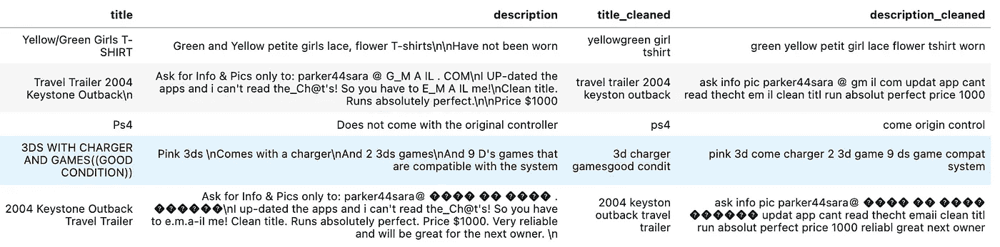

# 单词列表的模糊匹配熊猫列

> 原文：<https://blog.devgenius.io/fuzzy-match-pandas-column-to-list-of-words-d88e648c1aa0?source=collection_archive---------1----------------------->

模糊的模糊的是一只熊

# 很明显，我会用一张熊的照片来体现我使用模糊的蟒蛇皮的事实。嗯。

T 本文的目的是快速展示你如何获取一列字符串(不是列表，如果你愿意的话，只是类似标题或描述的字符串),并将每个标题/描述(右)中每个字符串的每个单词与一个字符串列表进行比较，得到一个模糊的匹配分数(并且只过滤高分)。

# 第一步

不要像我一样。

好吧，开玩笑的。我实际上很有逻辑，我只是倾向于构建绝对最快的解决方案，无论多么可扩展，都有可能完成一项任务。

长话短说，反正没人会读这些段落——这是假设你像我一样，点击 python Medium 的文章来弄清楚如何编写代码。

***进口一些东西**

可能不需要所有这些，但是我经常重复使用这些导入，我不在乎是否有未使用的库。

# 第二步

创建手动模糊匹配函数。完全透明，我没有写这个，我不在乎它到底在做什么，只要有好的结果，这是有的，尤其是当你过滤出较低的分数，那么我很好。不一定要完美。告诉你的老板，看着他们抓狂。但然后告诉他们“如果你愿意，你可以代替我，但我怀疑你会找到一个好斗的人”。选择权在你手中——愿机会永远对你有利。

*   *在本文中，我实际上并没有使用这些函数，但是我会在某个时候更新这个程序的 github 存储库，这样就很好了。*

# 第三步

收集一些数据。

很明显，我正在从 gcp 中提取数据，并创建一个表格，其中包括某种列表，以及标题、描述等。看起来像这样:

# 第四步

干净的数据，我的意思是应用词干(删除像“ed”或“ing”这样的词的结尾)，删除像“or is”或“a b/c”这样的终止词，它们是不必要的，没有人关心它们与什么其他词匹配，删除像特殊字符这样的标点符号(我变懒了，没有删除 emjois——但这是可以做到的)，规范大小写等。

结果如下所示:

一直往前走

# 第五步

创建一些单词列表，并潜在地观察我们是否能立即识别出包含该列表中某个项目的行。

遗憾的是，我没有在数据中找到任何容易找到的内容，但结果如下:

# 步骤 6

有趣的是——对每个标题中的每个单词和列表中的每个单词应用一个模糊的模糊处理函数，得到一个分数，将匹配项和分数存储在一个列中，并过滤掉分数不够高(或者根本没有匹配项)的行

*   *这可能需要一点时间来运行(给定我的实例约束，每 10k 行需要 10 分钟，但你的可能与我的不同)*
*   *请记住，我切换到了一个不同的 df (df1) b/c，我只是想在我的数据样本(10k 行)上运行它*
*   *此外，我删除了我使用的列表中的大部分单词——而不是试图泄露商品。列出你自己的清单*

结果看起来像这样:

标题为`fuzzy_words`的最右栏包含匹配单词和所述匹配单词的分数。

> *结束*

# 希望这对你有所帮助，并为你节省一些时间。如果你觉得我有帮助，给我一些密码:

> ***XRP 钱包****:rmdg 3 ju 8 pgyvh 29 elpwadua 74 cpw w6 fxns*
> 
> ***XRP 目的地标签*** *: 1328520722*
> 
> ***BNB:****bnb 10 ta 04 ldj 2 xlf 9m 59 gsmdsxk 8 AE 45 k5mzf 6 maqw*
> 
> ***BTC 钱包****:3k 2 wujcrcbsbiplrffaestjva 5 qubzvr*
> 
> ***ETH 钱包****:0x e 7 ede 8 b 7 ef 4289356d 5579 f 0 C4 e 00 BFF 36 b 28 BDF*
> 
> ***Venmo:@ Max-Bade***

> 我不到 30 分钟就写完了这篇文章。你听到了。

**欢呼**