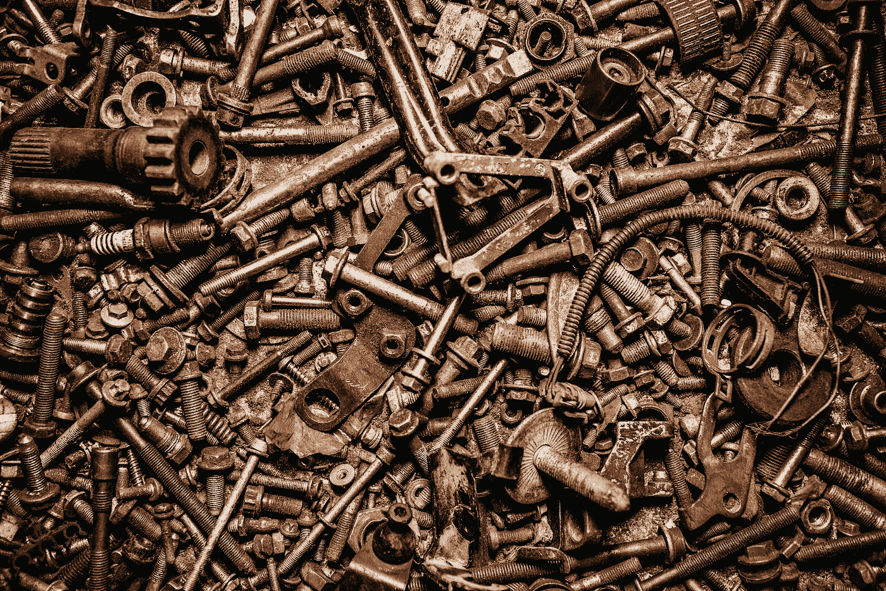
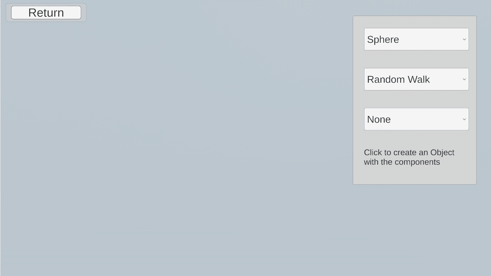

# 基于组件模式的游戏设计

> 原文：<https://blog.devgenius.io/game-design-with-component-pattern-2e79c9a62221?source=collection_archive---------6----------------------->

## 如何创建数字游戏对象的属性

这是游戏设计与编程模式系列的第三篇文章，着眼于编程的游戏设计方面。试试 [*中的例题实验互动补充*](https://ovenfresh.itch.io/a-game-designers-thoughts-on-programming-patterns) *！*

游戏对象的基本积木| Unsplash: @jonathanborba

**是什么格局？**

在面向对象编程中，继承是如何减少重复代码和实现子类对象的主要部分。继承说，如果 A 从 B 继承，那么对象 A 就是对象 B。当我们有长的继承链时，这可能会变得混乱，其中 A 是 B，B 是 C，C 是 D，等等。组件模式通过将类的属性转化为自身的整体对象来解决这个问题。这些可以是值、方法等。在我们的例子中，A **有一个** B、C 和 D。对象 B、C 和 D 以及它们的相关属性成为名义组件。

这种模式很普遍。像 Unity 这样的流行游戏开发引擎将组件的思想嵌入到他们的框架中。因此，即使它不是一个游戏设计工具，它也是当代游戏开发实践的必要组成部分。

**我如何使用它**

UI 让我们选择将哪些组件合并到单个对象中。

在组件实验中，我创建了一个场景，在这个场景中，用户可以点击鼠标来创建带有可定制组件的对象实例。单击屏幕上的任意位置，系统会在该位置生成一个新对象，该对象包含从 UI 框中选择的组件。“对象 A”是广义的“已创建对象”,它的所有相关属性都是组件，您可以在框中进行选择。在该框中，可以选择网格类型、移动行为和装饰组件。我挑选的两个装饰是色调变换的随机颜色和脉动的随机尺寸。这些选项中的每一个都作为在屏幕上创建对象的不同组件来实现。只需定制组件即可！每一个被创建的对象最终都会消失，因为有一个生命周期组件会倒计时直到它消失。

**设计印象**

在这里，组件生命周期的整个概念包含在一个类描述中。它通过设计使自己保持独立。

当被认为是类似的属性时，组件可以是任何东西，从输入控制器、人工智能行为、变色模式，甚至是形状和大小。“属性”这个词几乎让人觉得太小了，因为组件可以宽泛地涵盖几个属性。当考虑数字实体的构造时，组件模式提供了一种结构来考虑这些实体所具有的不同方面。使用这种结构使人们能够组织如何设计实体本身，为它们提供整洁的可编程筒仓。也就是说，属性是对象设计和系统实现的核心概念，所以组件模式对于游戏设计系统也是至关重要的。

**前进**

使用组件结构，每一个新类都像是一个小对象世界的新构建块。我的特定实现并不复杂，但是我能够快速地制作不同的组件并混合和匹配它们。该模式将属性从实体的固有部分中分离出来，让它们成为实体所拥有的东西。组件创造了一种与数字游戏设计属性交互的组合方式。易用性激发了我作为设计师的创造力，感觉就像是我在模拟原型中做的实验。

**往期:** [**轻量级**](https://medium.com/dev-genius/game-design-with-programming-patterns-flyweight-6914f1cc4772)

**接下来:** [**观察者**](https://medium.com/dev-genius/game-design-with-observer-pattern-3368561f40f5)

**代码**:[https://github.com/jasonzli/game-programming-study](https://github.com/jasonzli/game-programming-study)

**参考:**游戏编程模式， *Nystrom，Robert 2014*[*http://gameprogrammingpatterns.com/*](http://gameprogrammingpatterns.com/command.html)