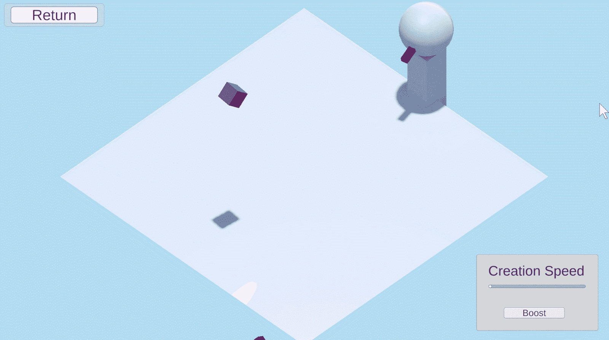

# 观察者模式的游戏设计

> 原文：<https://blog.devgenius.io/game-design-with-observer-pattern-3368561f40f5?source=collection_archive---------7----------------------->

## 让对象相互交流和响应

这是游戏设计与编程模式系列的第四篇文章，着眼于编程的游戏设计方面。试试 [*中的例题实验互动补充*](https://ovenfresh.itch.io/a-game-designers-thoughts-on-programming-patterns) *！*

保持警惕|[@恶作剧 _ 企鹅](https://unsplash.com/@mischievous_penguins)

# **是什么格局？**

观察者模式是一个主体可以向它的许多观察者发出信号的关系。从直觉上来说，是主体呼唤它的观察者来回应，而不是观察者独立于主体而行动。两个对象之间的这种流动关系是观察者模式的关键。事件、MVC 和消息系统都是观察者模式的不同实现。对于任何对象响应和相应动作对系统至关重要的设计来说，模式都是必不可少的。

# **我如何使用它**

塔台试图保持对飞机的关注

我在这里的场景是一座塔，看着落下的立方体砸向一个平面。在塔上，一个指针指向下落的立方体与平面相交的点。主体是知道何时被相交的平面。塔和速度 UI 元素都是观察者。一个目标，两个观察者。当下落的立方体穿过飞机时，飞机就会触发信号。那个信号告诉塔看那个交叉点，并告诉立方体的创建速度降低。通过点击按钮可以提高创建速度，该按钮也有自己的可点击事件(一个完全独立的主体-观察者关系)。当然，因为交集随着掉落的立方体数量增加，速度必然会降到最低。响应降低了事件发生的频率。这是一个自我管理的反馈循环。

# **设计印象**

飞机把这个组件实现为一个被观看的主体。C#操作使得编写代码变得轻松。

在设计游戏系统时，设计师通常会概述系统的对象、属性、内部关系和周围环境[1]。由于其主体和观察者的加强，观察者模式非常适合这些系统的内部关系。观察者模式在主体和观察者(系统的对象)之间创建了一种偶然的关系。这是 if-then 类逻辑更具体化的实现。这种模式将定义诸如“当你通过 go 时获得 200 美元”或者甚至诸如“玩家被发现，进入警戒模式”之类的事情的关系编纂成法。

# **前进**

作为偶然性的一种体现，观察者模式是游戏设计工具箱的重要组成部分。它很容易将组件和命令结合起来，作为构建数字游戏的基础工具。因为它定义了对象之间的关系，所以对于理解如何以数字方式实现规则有很大的用处。例如，我们经常看到基于游戏状态的赢/输条件或特殊规则发挥作用，而这正是观察者应该做的。为了跟踪比分，足球网可以是一个主题，它告诉其观察者(如比分)根据该事件进行改变。或者在赛跑中，终点线是一个告诉观众谁越过了终点线的主题。就这样继续下去，无论我们在哪里找到一个偶然性，一个规则，我们都会为观察者模式找到一个位置。

1.  关于系统从*游戏规则*，第 55 页，萨伦和齐默尔曼

**先前:** [**组件**](https://medium.com/@jasonzhenli/game-design-with-component-pattern-2e79c9a62221)

**接下来:** [**原型**](https://medium.com/dev-genius/game-design-with-prototype-pattern-d9a839814ef0)

**代码**:[https://github.com/jasonzli/game-programming-study](https://github.com/jasonzli/game-programming-study)

**参考:**游戏编程模式， *Nystrom，Robert 2014*[*http://gameprogrammingpatterns.com/observer.html*](http://gameprogrammingpatterns.com/command.html)