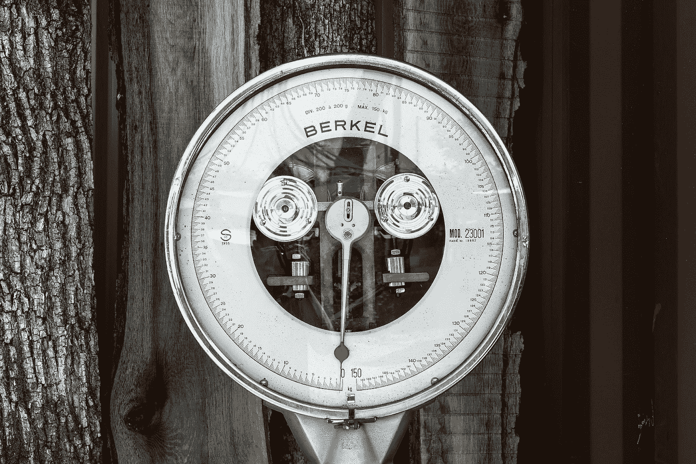
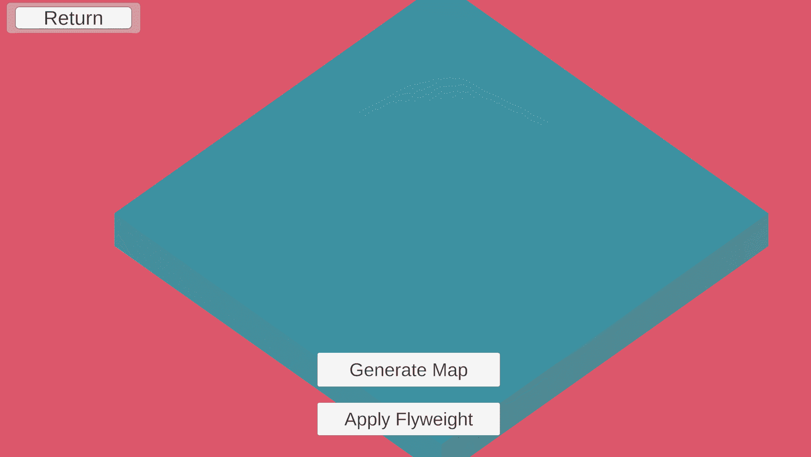

# 基于轻量级模式的游戏设计

> 原文：<https://blog.devgenius.io/game-design-with-programming-patterns-flyweight-6914f1cc4772?source=collection_archive---------12----------------------->

## 数字游戏素材

> 这是游戏设计与编程模式系列的第二篇文章，着眼于编程的游戏设计方面。这个系列的互动部分可以在这里找到:【https://ovenfresh.itch.io/design-with-patterns】T2

只是没什么分量。Unsplash @ lamoune

# 是什么格局？

Flyweight 模式是一种数据组织模式，其中一组共享数据存储在一个对象中。其他对象在需要时会引用这一段数据。Flyweight 减少了重复，通过改变一组数据来改变一堆对象变得更加容易。这对于一组静态的数据属性特别有用。这是一种节省内存的模式，有助于组织对象属性，因为这些属性一旦创建就不会更改。

# 我如何使用它

从 flyweight 对象获取其属性的立方体平面图

Flyweight 创建共享属性，因此它适用于对象具有内在属性的情况。这里，一个“地形”生成工具创建了一个地形对象的底图。每个对象指的是一个共享数据对象。点击“应用”按钮告诉立方体使用它们的 Flyweight 属性进行组装。颜色、高度和类型等属性都存储在三个 Flyweight 对象之一中。当应用时，它创建三种不同类型的地形，即使任何给定的立方体只引用回 Flyweights。内存节省来自于在 Flyweight 上保留这些属性，保持总的内存成本不变。

# 设计印象

实际上保存在我的 Flyweight 中的数据

Flyweight 引入了内在和外在属性的概念，即共享和唯一的属性。存储在 flyweight 对象中的数据可以被认为是那个东西的固有属性。材料属性、调色板和对话线等都是 flyweight 数据的可行候选对象。一张扑克牌的纹理、大小和重量在一副牌中的所有牌之间共享，并且适合作为轻量级数据。然而，卡在谁的手中将是外在的和唯一的数据。通过这种方式，flyweight 创造了一种数字材料，有助于区分一个东西是什么以及它的独特之处。它几乎就像一个数字材料。

# 前进

在设计和实现之间，这种模式严重依赖于实现。Flyweight 是一种内存效率模式。它有助于加强一致性，而不是创造实验。当你开始为一个游戏设计几个对象时，flyweight 模式很自然地将它们组织成明确定义的类型。这使得 flyweight 在设计修改中比在原型开发中更有价值。应用这种模式，游戏的数据可以很好地组织成轻量级的，为重新访问和改进现有的工作留下了坚实的清晰的基础。

**先前:**[命令 ](https://medium.com/dev-genius/a-game-designers-thoughts-on-programming-patterns-command-pattern-4f6329f9b30d)

**接下来:** [**组件**](https://medium.com/@jasonzhenli/game-design-with-component-pattern-2e79c9a62221)

**代码**:[https://github.com/jasonzli/game-programming-study](https://github.com/jasonzli/game-programming-study)

**参考:**游戏编程模式， *Nystrom，Robert 2014*[【http://gameprogrammingpatterns.com/flyweight.html】T21](http://gameprogrammingpatterns.com/flyweight.html)