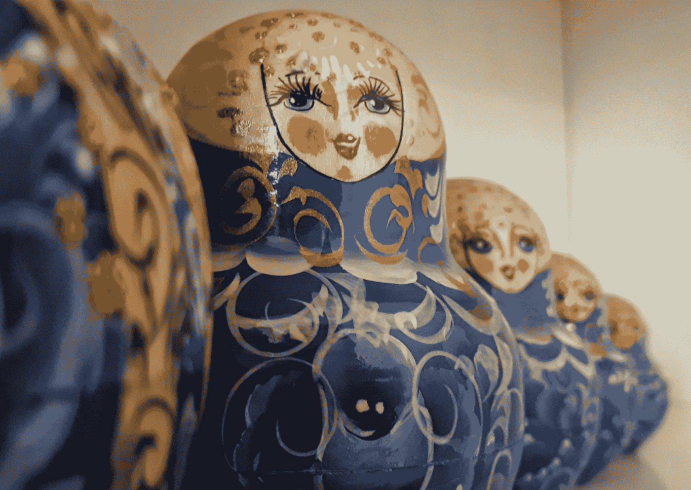
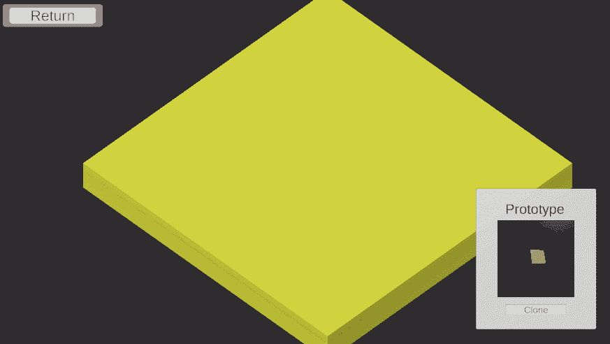

# 原型模式的游戏设计

> 原文：<https://blog.devgenius.io/game-design-with-prototype-pattern-d9a839814ef0?source=collection_archive---------3----------------------->

## 从一粒种子开始，培养你的游戏对象

*这是游戏设计与编程模式系列的第 5 篇文章，着眼于编程的游戏设计方面。试试* [*中的例题实验互动补充*](https://ovenfresh.itch.io/a-game-designers-thoughts-on-programming-patterns) *！*

Iza Gawrych 在 [Unsplash](https://unsplash.com?utm_source=medium&utm_medium=referral) 上拍摄的照片

# **是什么格局？**

原型模式允许对象创建自身的副本。这个新的克隆对象的创建使用现有对象作为名义原型。当在代码中创建原型模式时，克隆功能可以产生对象的精确到修改到默认版本之间的任何东西。原型模式的关键是对象产生自身新实例的能力。因此，原型模式经常被用于对象工厂，在那里根据需要生成基本对象的实例。

# **我如何使用它**

立方体利用物理学来移动，以获得一些视觉上的兴趣，过一段时间后它们就会消失。

在这个场景中，我倾向于这种模式的工厂性质。原型立方体的克隆功能将比例、旋转和材质属性复制到屏幕中央新创建的立方体中。右边的界面块显示了原型立方体，按钮在中间创建了六个克隆体。从单击按钮的那一刻起，克隆就复制了原型的精确颜色和比例属性。原型的组件会随着时间的推移而改变属性，而立方体的克隆体只具有属性，而不具有组件。在这个设置中，我可以观察原型变成特定的颜色和大小，然后克隆它的那个版本。

# **设计印象**

PrototypeCube 负责它如何产生自己的克隆

在其最基本的形式中，原型模式为对象本身提供了类似工厂的行为。原型物体成为它们自己的生产工厂，用它们自己作为蓝图。从这些蓝图中产生的对象使我们能够创建相关的对象，而无需定义全新的对象。这些作品更像是后代，而不是 100%的复制品。从这个角度来看，将原型视为种子而非工厂可能更有用。从任何一个种子原型，我们通过克隆生长出下一个对象，它的属性与父对象的属性相匹配或发生了变异。这些下游变化可用于在数字对象中产生多样性。

# **前进**

Prototype 能够单独有效地复制数字对象，这将使它成为数字游戏的一个有价值的工具，在数字游戏中，对象复制是司空见惯的。正是这种在程序上使数字内容多样化的能力将其提升到了一个更高的水平。它对于创建一系列物体是不可或缺的:一系列经过不同改装的汽车，或者一个不断进化的魔法生物，它在改变后会改变其物理属性。原型模式在这些生成场景中最为成功。当一切都是手工定制的时候，在数字游戏的内容中加入变化会很快失去控制。因此，将原型模式视为定制产生对象差异的系统的一种方式，让我们设计师专注于指定培养多样性作为其游戏功能的系统。

**往期:** [**观察者**](https://medium.com/dev-genius/game-design-with-observer-pattern-3368561f40f5)

**接下来:** [**单例**](https://medium.com/dev-genius/game-design-with-singleton-pattern-21685f7a43bb)

**代码**:[https://github.com/jasonzli/game-programming-study](https://github.com/jasonzli/game-programming-study)

**参考:**游戏编程模式， *Nystrom，Robert 2014*[*http://gameprogrammingpatterns.com/prototype.html*](http://gameprogrammingpatterns.com/command.html)