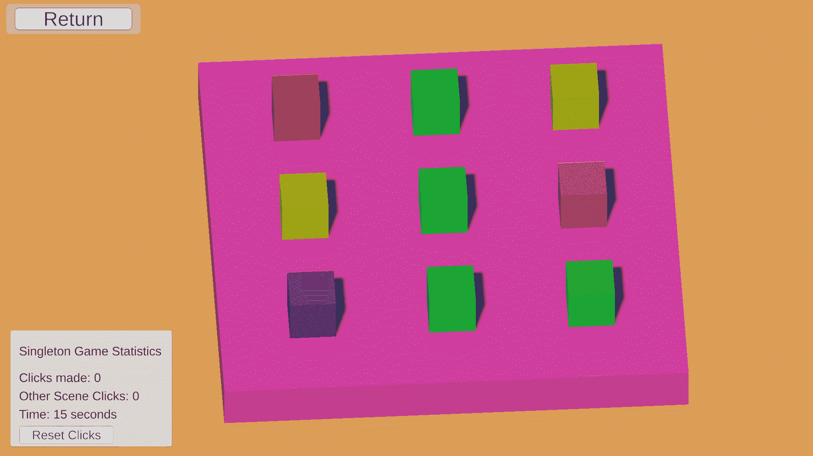

# 单例模式的游戏设计

> 原文：<https://blog.devgenius.io/game-design-with-singleton-pattern-21685f7a43bb?source=collection_archive---------4----------------------->

## 只能有一个，所以要让它有价值

这是游戏设计与编程模式系列的第 6 篇文章，着眼于编程的游戏设计方面。试试 [*中的例题实验互动补充*](https://ovenfresh.itch.io/a-game-designers-thoughts-on-programming-patterns) *！*

查尔斯·德鲁维奥在 [Unsplash](https://unsplash.com?utm_source=medium&utm_medium=referral) 上拍摄的照片

# **是什么格局？**

单例模式对象有两个属性:它们被限制为自身的一个实例，并提供对自身方法和数据的全局访问。一旦创建，对单例对象的任何后续引用都将是那个对象——它从不创建多个实例。此外，程序的任何其他部分都可以使用该对象，因为它是全局可访问的。Singleton 的开放性让它可以在程序的其余部分提供数据和服务。结果，仓促应用的单例产生的问题比它们解决的问题更多，导致单例拥有的信息或行为比合理的多。当需要单一的唯一性和访问时，通过仔细考虑来避免产生不必要的问题。

# **我如何使用它**

singleton 将在左下角的 UI 中跟踪场景内外的点击。|点击场景中的立方体使其跳跃

作为一个统计追踪者，独生子女的本质对我来说最有意义。通过进入 singleton 场景，创建了一个相当简单的 stat 跟踪 singleton 实例。它计算场景内外的鼠标点击次数，以及应用程序运行的总秒数。可以通过底部的按钮告诉单例用户重置点击计数，并在重置后继续跟踪。一旦单例场景被加载，对象将继续跟踪点击和时间。将这些统计信息存储在 singleton 中可以保持它们的持久性和全局性。

# **设计印象**

在 Unity 中创建单例很容易。决定何时创建一个是困难的

单例是为我们游戏的其他部分提供可靠的工具和信息的最好地方。将单例的焦点缩小到点击或计时等元数据，可以让它在游戏空间之外操作，同时仍然连接到游戏空间内的对象。Singleton 可以保存对与其自身相关的服务或方法的引用，并试图防止其他对象过于依赖它。这是避免糟糕的单例场景的基本原则，在这种场景中，它们与其他对象和系统纠缠不清。

# **前进**

单例对象应该被用来解决游戏进程中一致的和不变的需求，并且它们应该可靠地满足这些需求。它们最适合独立于特定游戏的系统。像游戏渲染、调试或统计跟踪系统这样的系统都告诉我们如何构建一个好的单例，也就是说，不包含任何关键的逻辑函数。相反，它们应该包含互补的过程和信息。保存对其他对象的引用、处理玩家输入或包含关于游戏的“通用”信息都是单例对象的良好候选对象。受限于外部领域，单例模式在实现细节中找到了自己的位置，而不是在实际的游戏设计中。

**往期:**[原型](https://medium.com/dev-genius/game-design-with-prototype-pattern-d9a839814ef0)

**接下来:** [**状态**](https://medium.com/dev-genius/game-design-with-state-pattern-2844e5f75ba4)

**代码**:[https://github.com/jasonzli/game-programming-study](https://github.com/jasonzli/game-programming-study)

**参考:**游戏编程模式， *Nystrom，Robert 2014*[*http://gameprogrammingpatterns.com/singleton.html*](http://gameprogrammingpatterns.com/command.html)