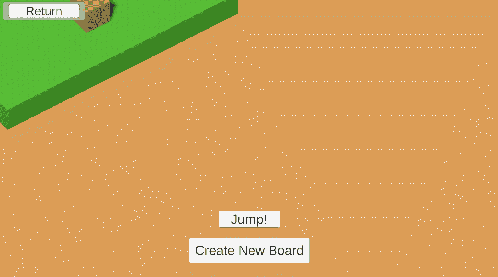

# 状态模式下的游戏设计

> 原文：<https://blog.devgenius.io/game-design-with-state-pattern-2844e5f75ba4?source=collection_archive---------2----------------------->

## 游戏的条件

这是游戏设计与编程模式系列的第 7 篇文章，着眼于编程的游戏设计方面。这个系列的互动部分可以在这里找到:[*【https://ovenfresh.itch.io/design-with-patterns】*](https://ovenfresh.itch.io/design-with-patterns)

瑞安·昆塔尔在 [Unsplash](https://unsplash.com?utm_source=medium&utm_medium=referral) 上的照片

**是什么格局？**

状态模式允许对象根据其内部条件或“状态”改变其内部行为。一个对象将有一个状态子对象来处理它的外部行为。状态模式通常(但不总是)由状态机的实现加入，状态机是管理状态子对象的另一种类型的对象。无论实现方法如何，该模式都允许对象在几种状态之间转换，同时保持单个对象的外观。一个状态可能正在接收输入，而另一个状态可能会忽略输入并执行动画。状态模式不是将这两种模式合并到一个对象中，而是将行为清晰地分离成更容易理解的状态，只关注单一的问题。

# 我如何使用它

整个“游戏”在这里由国家控制。它只在完成动画时接收输入。否则，它会忽略输入并执行一些设置或清理行为。

行为链是应用状态的直接方式之一。在场景中，立方体可以根据状态进行三部分跳跃序列。他们有空转、跳跃、旋转跳跃和扣篮的状态。每一次跳转输入都使立方体经历每一种状态。它也保持了它们的转换:一个立方体不能从跳跃到猛击，它必须先旋转跳跃。

游戏板本身也是国家管理的。它有设置、播放和退出状态。安装程序将电路板放入，打开立方体的输入处理，启用上面的跳转序列。退出关闭它们，并带走电路板。State 让我们在这里强调一个设计理念:“在我们玩之前，我们需要设置好游戏部件。”

# 设计印象

**根据要求，状态实现可以从简单到复杂**

一个成功的状态模式提供了行为发生的方式和原因的清晰性。然而，尽管国家在组织简单性方面有所收获，但实际的实现对于没有经验的编码人员来说可能是一个挑战，除了国家本身之外，还涉及到状态机的创建。此外，如果不全面了解状态之间的联系，创建转换可能会很困难。实现的复杂性与人们试图解决的问题的复杂性成正比。在实现模式时，强大的状态设计图是必不可少的。

# 前进

在代码之外，状态模式存在于整个游戏设计中。设计师经常将游戏条件称为游戏状态。甚至像国际象棋这样的游戏的基本阶段也可以这样描述:“开局”、“中局”、“残局”。了解状态模式使设计者能够将这些状态描述连接到游戏的实际编码形式中。直接对这些状态进行编码允许实现各种各样的游戏质量。它可以应用于游戏条件、行为系统、游戏输入的具体细节。状态在游戏编码过程的几乎每个部分都有一个家，尤其是在处理复杂的人类输入的部分。State 很容易解决我们设计的复杂性，揭示了数字游戏结构中不同元素之间的流动和影响。

**往期:** [**单胎**](https://medium.com/dev-genius/game-design-with-singleton-pattern-21685f7a43bb)

**代号**:[https://github.com/jasonzli/game-programming-study](https://github.com/jasonzli/game-programming-study)

**参考:**游戏编程模式， *Nystrom，Robert 2014*[*http://gameprogrammingpatterns.com/state.html*](http://gameprogrammingpatterns.com/state.html)