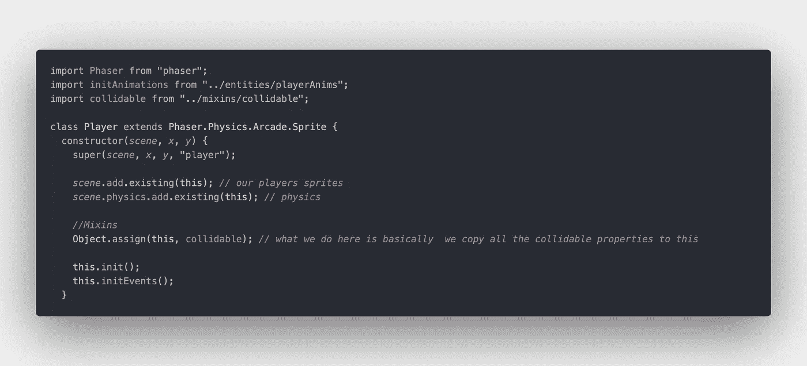

# 游戏开发之旅— II

> 原文：<https://blog.devgenius.io/game-dev-journey-ii-d45d15f4cec9?source=collection_archive---------12----------------------->

大家好，这比我预期的要快一点，但我想快速更新一下我的游戏开发之旅的现状。我现在正走在一条路上，当我从未来回顾过去的时候，我想记住我当时的做法。

# 有什么新鲜事？

事实上，我没有太多关于我的思维方式的重大更新，我只是有一些更新，升级和见解可以与你们分享。

我目前正在跟随一个教程系列，在一些其他流行程序的帮助下深入到一个 2d 平台游戏中。例如，我们目前正在使用 tile 来创建 tilemap，将 tile 映射为数组的概念看起来非常优雅和酷，我甚至不知道在这一领域还有什么其他常见的做法。也许这是最常见的方式，但无论哪种方式，我都喜欢我们此刻创建世界的方式是多么简单和有编程效率。我喜欢学习 Tiled 的另一个原因是，它被广泛使用，并且在寻找关于该软件的资源时没有困难。界面真的很棒，软件也很容易上手。到目前为止，我遇到的一个问题是导出 tilemaps 的方式，在较新版本的软件中，一个属性被替换为其他内容，因此我没有花时间解决这个问题，而是将软件降级到旧版本。当我总结了以上所有的优点，我将使用 Aseprite 来创建精灵，这部分课程真的很吸引我。

目前我喜欢 Phaser 的另一点是，它允许用户做很多很多面向对象的 JS，它大大减少了将时间花在游戏开发而不是严肃的事情上的遗憾。我的意思是，这可能也是关于我跟随的导师，他解释甚至最轻微的细节和项目可能发生的问题，有时故意创建和删除错误，以展示如何容易面对错误。为工作的每个不同参与者使用单独的类为大多数情况提供了一个可靠的和最健壮的自动完成，我说大多数情况是因为我目睹了一些自动完成不能很好地工作的情况，我没有特别的模式可以与这些类型的故障联系起来，但是它们会不时地发生，如果你不知道你在做什么，这可能会花费一些时间。

下面是我的 Player.js 文件中的一个小例子:

我的意思是，当我考虑到我写的所有代码都将在浏览器上运行，从一开始就遵循一些体面的做法，从长远来看，这确实是有益的。

是的，我知道如果我想在性能方面取得一些重要的结果，我应该继续前进，用普通的 js 做所有的事情，但是我真的对那种研磨不感兴趣，我不认为我有那种耐心只用普通的 JS 来创造一些美丽的东西。如果我有足够的时间，我绝对会考虑这种方法，但由于这只是一个爱好，选择这样的道路对我来说是一种奢侈，非常昂贵。

# 其他东西

由于我已经离开游戏世界有一段时间了，我开始关注那些谈论我即将进入的领域的最佳实践的人。除了音乐创作之外，我正在努力关注相关领域的各种内容，我也不打算在短期内关注这部分内容。

一些成功游戏的故事也吸引了我，因为成功总是隐藏在哪怕是最微小的细节中，看到注重细节的工作和坚持不懈的努力随着时间的推移可以产生一些不错的结果真是太棒了。我将在另一篇文章中详细介绍我在学习过程中使用的所有额外的非技术资源。

非常感谢大家抽出时间，我真的不希望看到这个帖子得到很多的看法和阅读，但它可以是一个很好的东西，在未来看起来就像我上面已经提到的，如果我能在这个过程中帮助 1 或 2 个人，那就是一个胜利。

下次见，保重:)

*最初发表于*[*【https://blog.akbuluteren.com】*](https://blog.akbuluteren.com/blog/game-dev-journey-ii)*。*

在 https://margin.io/[查看更多信息](https://margin.io/)