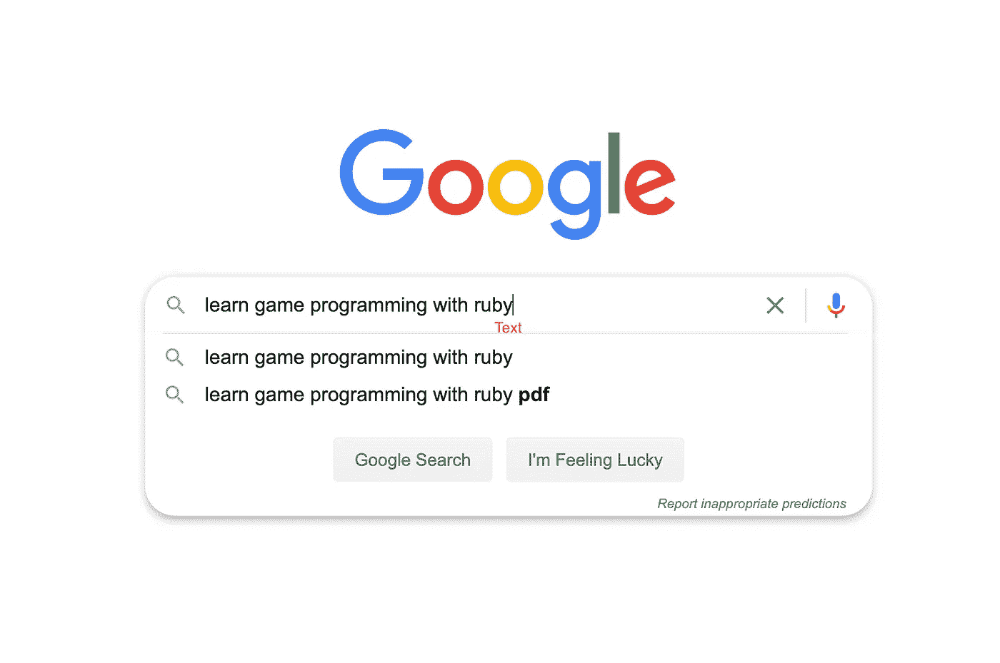
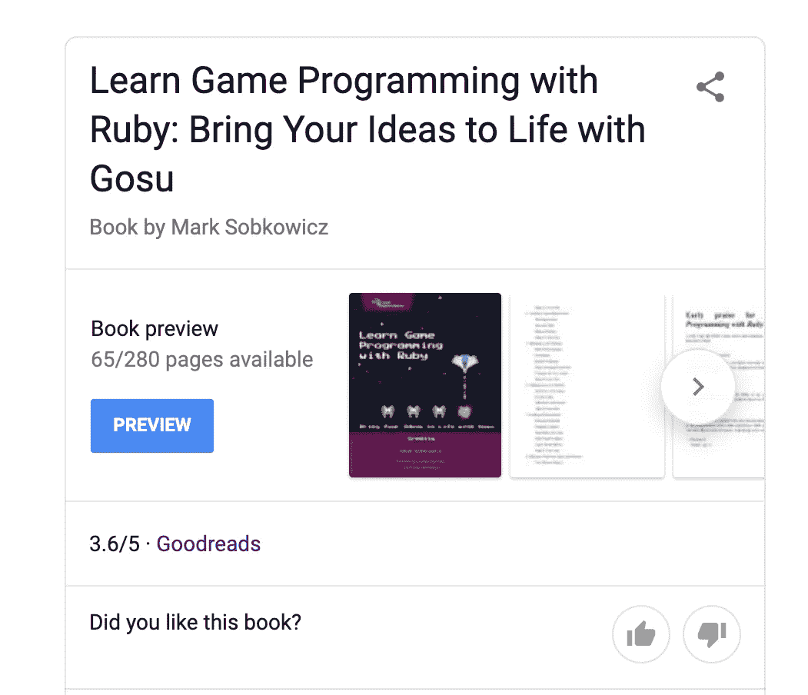
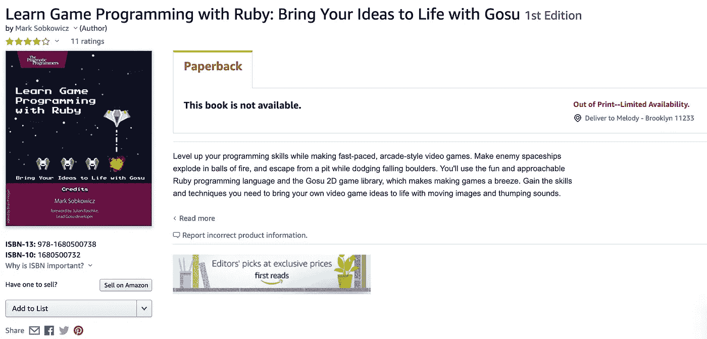

# 使用 Gosu 在 Ruby 中开发游戏

> 原文：<https://blog.devgenius.io/game-development-in-ruby-using-gosu-6a16beca3128?source=collection_archive---------16----------------------->

## 第 1 部分:我应该烦恼吗？


约书亚·富勒在 [Unsplash](https://unsplash.com?utm_source=medium&utm_medium=referral) 上拍摄的照片

不出所料，发展会带来很多挑战。尽管我通过辅修计算机科学，用 Python 为物理实验室分析数据，以及现在在 Flatiron 的任期，对开发进行了公认的短暂尝试，但我只能看到冰山一角。更不令人惊讶的是，游戏开发尤其以特别难啃而闻名，尤其是独自一人。人们很容易高估一个人的成就:不是每个人都能成为 T4·托比·福克斯。我打算通过这个博客系列(是的，我打算把它做成一个系列)来探索制作游戏的最初步骤，并分享过程中的每一滴血、汗和泪。

# 第一部分:我应该烦恼吗？

我听到你在问，有没有人希望进入游戏开发领域，沉浸在网络开发软件工程中？嗯，每个人都必须从某个地方开始，对我来说，我的起点是几乎不知道如何编码。不出所料，游戏开发是一种复杂的野兽，即使是最有经验的开发人员也会陷入困境。那么，我，一个仅仅是发展中的新手，还有什么希望去征服这头野兽呢？嗯，令人惊讶的是，在我很多很多分钟的研究中(在这里插入笑声),似乎我还有希望。

第一步:保持简单，笨蛋

如果你想做游戏:去做游戏吧！第一步是不要计划你的大型多人在线角色扮演游戏的课程。这是…学习如何编码。当涉及到任何复杂的软件时，对语言的熟悉程度会持续很长时间，当学习一门语言时，你不会一开始就做 [Overwatch](https://playoverwatch.com/en-us/) ，你会开始做井字游戏(或者如果你特别有野心的话，下象棋)。然而，即使是如此“小”的东西(你会惊讶于如此简单的东西会变得如此复杂)，知道如何首先编码也是有帮助的。正如有人在 Reddit 上雄辩地指出的:

> 劣质代码就是劣质代码。如果你是一个不遵循标准/实践/好的代码风格的差劲的 web 开发人员，那么你也将是一个不遵循好的标准/实践/好的代码风格的差劲的游戏开发人员…你知道吗？[【1】](https://www.reddit.com/r/gamedev/comments/52cr1i/has_anyone_here_successfully_made_the_jump_from/d7jaxmn?utm_source=share&utm_medium=web2x)

如果你根本不知道如何编码，那么从简单、易读、易懂的语言开始会有所帮助。学习游戏编程基础有什么语言比 python-*咳*我是说 RUBY 更好？正好有用 Ruby 学习游戏编程的资源。让我们从一个简单的谷歌搜索开始。



如何谷歌搜索:步骤 1

第二步:寻找资源！

好了，我们走吧！



看起来这可能是一个很好的资源！

哇！第一个结果，这很容易。让我们看看是否能在某个地方找到它。



哦哦

…哦。看起来这将比我们想象的要多花一点时间，因为我们仍然处于封锁状态，所以我不能去当地书店四处搜寻，我肯定不会提倡在某个黑色旗帜下飞行，所以这条线索现在就没有了，直到我以后想尝试 e-bay 或类似的东西。

哦！记得看过一个 2014 年 LA Ruby 大会的主题演讲视频，讲的是用 Ruby 写游戏。(这是一个很棒的演讲，顺便说一句，我真的推荐你在这里查看一下)看起来他有一个博客，在那里他稍微多谈了一下这个话题[【2】](https://blowmage.com/2015/04/17/writing-games-ruby)，并推荐了托马斯·瓦拉内卡斯写的一本书，书名是*用 Ruby 开发游戏:对于那些以写代码为生的人来说，*，你可以在这里找到或者，令人惊讶的是免费(合法)阅读[这里](https://leanpub.com/developing-games-with-ruby/read)。我们到了，从某个具体的地方开始。

第三步:最终开始

封面设置的前几个部分非常广泛，为图像编辑器和开源艺术库提供了建议，以制作他想要的小型概念证明。我们要做的第一件事是先睹为快 Gosu 宝石的能力！让我们看一下第一本书的例子:

```
1 require 'gosu'
 2 
 3 class GameWindow < Gosu::Window
 4   def initialize(width=320, height=240, fullscreen=false)
 5     super
 6     self.caption = 'Hello'
 7     @message = Gosu::Image.from_text(
 8       self, 'Hello, World!', Gosu.default_font_name, 30)
 9   end
10 
11   def draw
12     @message.draw(10, 10, 0)
13   end
14 end
15 
16 window = GameWindow.new
17 window.show
```

显然，我们需要我们的宝石。然后我们有 GameWindow 类，它继承自 Gosu::Window，我们在初始化中使用 super 来继承父类的宽度、高度和全屏属性。这样，我们默认一个 320x240 的窗口，我们给它一个标题 Hello(出现在窗口顶部的文本，在 x 和最小化按钮旁边)。然后，我们使用 Gosu::Image 方法创建自己的实例变量@message。from _ text[【3】](https://www.rubydoc.info/github/gosu/gosu/master/Gosu/Image#from_text-class_method)带文字“Hello World！”

好吧，让我们运行这个，看看会发生什么^.^

成功！我们现在有一个向我们问好的小窗口了！

第四步:保持冷静，做游戏

很难看出这一点，但 Gosu 是一个真正强大的库，能够玩有趣而简单的游戏。下面我会链接一些用 Ruby 和 Gosu 制作的示例游戏的 repos！

坦克岛:[https://github.com/spajus/tank_island](https://github.com/spajus/tank_island)

小鬼:【https://github.com/blowmage/littlebrat】T2

红宝石霍普:【https://github.com/blowmage/rubyhop 

逃到 RubyConf:[https://github.com/blowmage/escape_to_rubyconf](https://github.com/blowmage/escape_to_rubyconf)

Gosu Showcase(人民 Gosu 游戏论坛):[https://www.libgosu.org/cgi-bin/mwf/board_show.pl?bid=2](https://www.libgosu.org/cgi-bin/mwf/board_show.pl?bid=2)