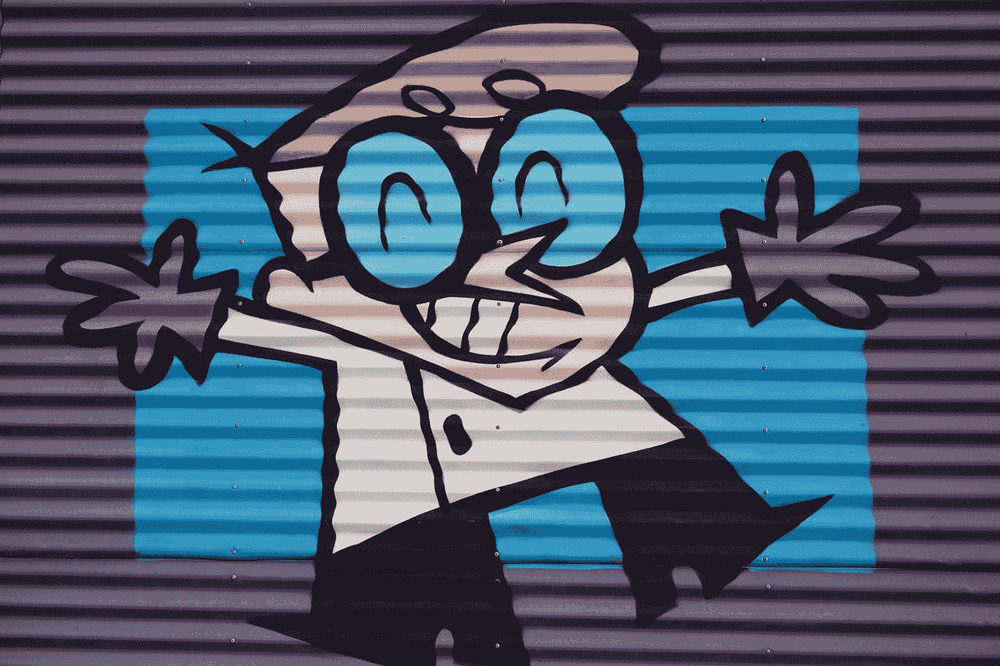

# 四人组设计模式

> 原文：<https://blog.devgenius.io/gang-of-four-design-patterns-8c85a80eac0a?source=collection_archive---------0----------------------->

道格·马洛尼在 [Unsplash](https://unsplash.com?utm_source=medium&utm_medium=referral) 上的照片

25 年前，由 23 种设计模式组成的标志性计算机科学书籍“[设计模式:可重用面向对象软件的元素](https://www.amazon.com/gp/product/0201633612/ref=as_li_tl?ie=UTF8&camp=1789&creative=390957&creativeASIN=0201633612&linkCode=as2&tag=triatcraft-20&linkId=XRGUDJCGWC6AJNZM)”首次出版。这本书的四位作者:埃里希·伽马、理查德·赫尔姆、拉尔夫·约翰逊和约翰·维里西德斯，后来被称为“四人组”。

## 什么是设计模式？

设计模式是软件设计中常见重复问题的优雅解决方案。设计模式告诉我们应该如何构造我们的类，以及这些类应该如何相互交流。

四人帮的设计模式分为三类:

*   创建模式提供了创建对象的不同方法。
*   结构模式提供了这些对象之间的关系。
*   行为模式提供了这些对象如何交互或通信。

# 创造性的设计模式

*   抽象工厂:允许在不指定具体类型的情况下创建对象。
*   生成器:用于创建复杂对象。
*   工厂方法:创建对象，而不指定要创建的确切类。
*   原型:从现有对象创建新对象。
*   Singleton:确保只创建一个对象实例。

# 结构设计模式

*   适配器:通过在一个现有的类周围包装一个接口，允许两个不兼容的类一起工作。
*   桥:将抽象解耦，这样两个类可以独立变化。
*   复合:将一组对象合并成一个对象。
*   Decorator:允许在运行时动态扩展对象的行为。
*   Facade:为更复杂的底层对象提供简单的接口。
*   Flyweight:降低复杂对象模型的成本。
*   代理:为底层对象提供占位符接口，以控制访问、降低成本或降低复杂性。

# 行为设计模式

*   责任链:将命令委托给一系列处理对象。
*   命令:创建封装动作和参数的对象。
*   解释器:实现一种专门的语言。
*   迭代器:顺序访问对象的元素，而不暴露其底层表示。
*   Mediator:允许类之间的松散耦合，因为它是唯一一个详细了解它们的方法的类。
*   Memento:提供将对象恢复到其先前状态的能力。
*   Observer:是一种发布/订阅模式，允许许多观察者对象看到一个事件。
*   状态:允许对象在其内部状态改变时改变其行为。
*   策略:允许在运行时动态选择一系列算法中的一个。
*   模板方法:将算法的框架定义为一个抽象类，允许它的子类提供具体的行为。
*   Visitor:通过将方法的层次结构移到一个对象中，将算法从对象结构中分离出来。

理解各种设计模式以及我们为什么使用它们在低级软件设计中是极其重要的。此外，没有关于设计模式的讨论，任何技术面试都是不完整的。在以后的文章中，我们将详细讨论每个设计模式以及它们是如何实现的。敬请关注。快乐学习！👐