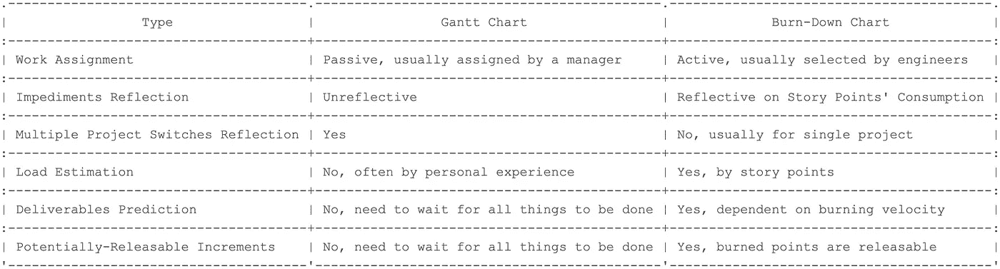
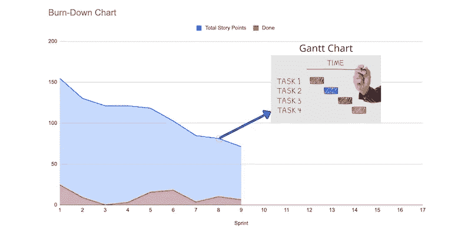

# 甘特图与燃尽图:与产品负责人争吵后的反思

> 原文：<https://blog.devgenius.io/gantt-chart-v-s-burn-down-chart-introspection-after-a-quarrel-with-our-product-owner-c51076486cfa?source=collection_archive---------8----------------------->

# 激烈的争论

两周前，我和我们的产品负责人就我们之间任务管理的差异发生了争论。作为一个 Scrum 大师，我认为一个产品负责人应该同情一线执行者；尽可能防止上下文切换的发生，以消除消耗。

例如，我指导 Scrum 团队采用燃尽图而不是甘特图来反映潜在的可释放增量或应该尽快消除的隐藏障碍。所有的项目都需要在吉拉董事会上管理，以寻求成员之间足够的透明度。

然而，我们的产品负责人却不这么认为。他指责我没有对多个项目的全球视野，因为每天都有许多变化，所以我们必须将我们的目标与利益相关者保持一致。甘特图帮助他与其他经理协商资源，并将人力资源分配到相关项目，以推动项目的进行。

我对这种观点感到震惊，好像一线执行者只是某种用来完成某些目标的“工具”，而不关心进一步细化的中间过程。感觉就像你把钱投资到股票上，然后你期望利润会自动产生…

首席技术官暂时中止了我们的辩论。嗯，事实上我只是希望产品负责人可以采用燃尽图作为传统甘特图的替代，这有助于他更好地发现隐藏的块，而不是被缓慢的进度所困扰。

# 利弊—甘特图与燃尽图

在我早期的想法中，我对瀑布管理非常不满，因为软件开发本质上不是建造一座房子，所以我们不应该利用像 [WBS](https://www.projectmanager.com/guides/work-breakdown-structure) 这样不适应可变需求的东西来安排工程师之间的工作流。

在与我们的产品负责人辩论之后，我试图检查我的思维是否走到了某个极端，消除了传统管理工件的所有优点。因此，我调查了一个[视频](https://www.scrum.org/resources/gantt-charts-vs-burn-down-charts)，从我的角度做了一个简单的比较，试图提取他们各自的优点和缺点。

甘特图和燃尽图

在传统的项目管理中，我们习惯于被分配任务，因为我们认为一个项目经理应该负责在执行者之间谈判任务，这反过来导致许多工程师对他们的工作很被动。相反，我们鼓励工程师加入 sprint plannings 谈论行动计划，估计故事点，建立 sprint 目标并自行选择积压工作，这是积极的。

最重要的是，甘特图不能真实地反映项目目标是否有障碍。你在图表上看到的是某人在一段时间内被分配了一项任务。因此，项目经理应该主动咨询工程师是否受阻，这需要花费他们大量的时间。否则，你应该期望被指派的工程师积极地经常报告他们的进展。燃尽图可以反映故事点消费中是否存在隐藏的任务，以便产品经理可以快速做出反应以消除风险。

当你面对多个项目的进度时，甘特图是一个很好的工具，可以显示一个人是否承受着超负荷的项目，这样项目经理就可以通过协商外部资源来缓解这种情况，而燃尽图通常适用于单个项目。我不建议将不同项目的积压工作选择到同一个烧毁图表中，因为它不能指示项目的真实速度以供进一步预测。

在估算 Scrum 中某人的工作量时，故事点的概念是一个突破。我们把它作为衡量一个人承受的负荷的标准。尽管如此，在甘特图中我们无法评估一个工程师在现实中做了多少工作，更不用说在工作流程中可能会有隐藏的条形图。

就交货预测而言，燃尽图优于甘特图，因为前者利用燃烧速度来预测最后期限，而后者通常根据非逻辑的经验来预测交货日期。如果你进一步要求人们解释他们做出这种预测的逻辑，他们通常不能告诉你更多，因为我们的感觉并不精确，而且总是有许多因素影响最终结果。

最后，我们可以确定，当一个故事点被烧毁时，一个潜在的可释放的增量被创建，它被显示在一个烧毁的图表上。但是在甘特图中不会出现同样的情况，因为单个任务的完成并不意味着整个工作都可以发布。它可能缺少集成、测试或其他使其工作的依赖项目。

# 达成妥协

在首席技术官的帮助下，我们双方最终达成了更好的妥协，澄清了我们想法之间的利弊。事实上，我并不否认甘特图的优势，但我觉得我们之间的管理风格完全不同。产品负责人试图控制一切，而我主要关注保持协作的灵活性。

在有多个项目的环境中，我们的产品负责人最终接受了使用产品积压和烧毁图表来管理需求的意见。另一方面，我必须借助甘特图来适应多个项目的环境转换，以协商必要的人力资源或时间表。

在实践中，我们可以将这两种工件的优点吸收到项目管理中，同时放弃它们的缺点。通过甘特图避免工程师工作的上下文切换与通过燃尽图评估生产力一样重要。所以我们可以好好利用它们。

# 蔻驰杂音

在 sprint 回顾中，有 4 样东西需要回顾:关系、工具、过程和 DoD(完成的定义)。我敢打赌，大多数人可能会忽略第一条，因为他们认为指出与某人的不良合作是令人不快的。

然而，无知会带来更差的合作质量。因此，他们应该学会如何以积极的方式表达他们的抱怨。他们关心的通常不是与他们一起工作的人，而是导致不理想的工作氛围的东西，如不良的沟通，工作风格的冲突，不尊重的行为。

我必须指出这一点，因为我们之间的冲突肯定会影响到其他合作伙伴。勇气是 Scrum 的核心精神之一。

—

如果你认可我与你分享的价值，请做如下:
1。**鼓掌**文章
2。**订阅**我最新内容
3。**在其他平台关注**我了解更多信息
-IG:[@ ur _ Agile _ coach](https://www.instagram.com/ur_agile_coach/)
-播客(中文):[敏捷火箭](https://player.soundon.fm/p/7f7dc3df-d738-405c-8cf9-02157a92ec61)
- Youtube: [你的敏捷蔻驰](https://www.youtube.com/channel/UCzD0wQmD1n4MuTKk-JocACA)
- LinkedIn: [吴宗祥](https://www.linkedin.com/in/tsung-hsiang-wu-8542409b/)

如果您需要咨询或其他形式的合作，请发送邮件至:【urscrummaster@gmail.com】