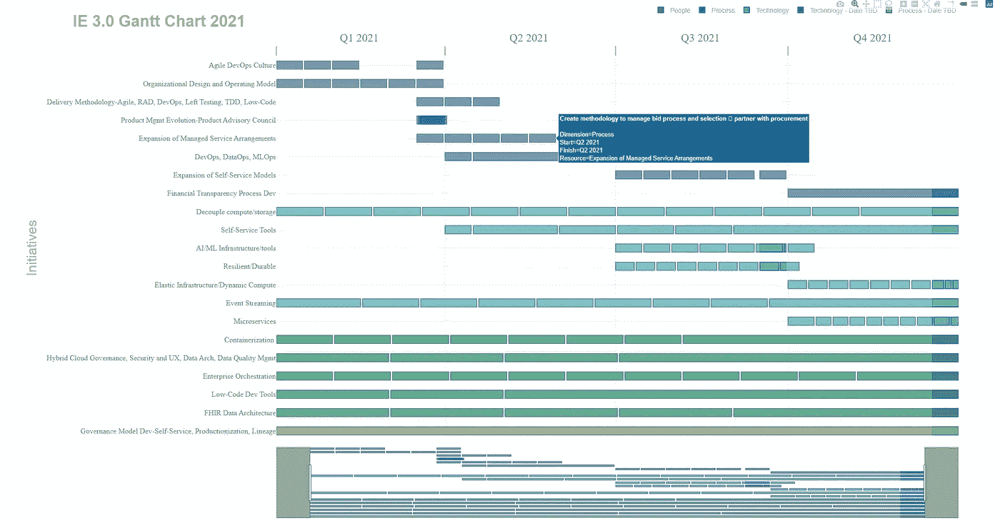
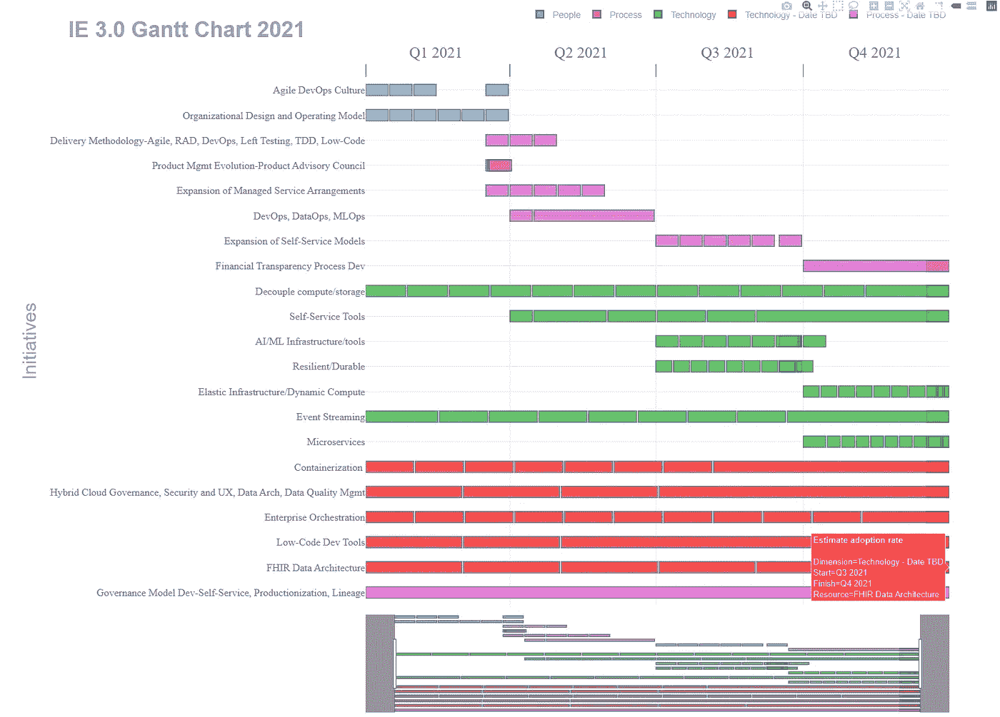
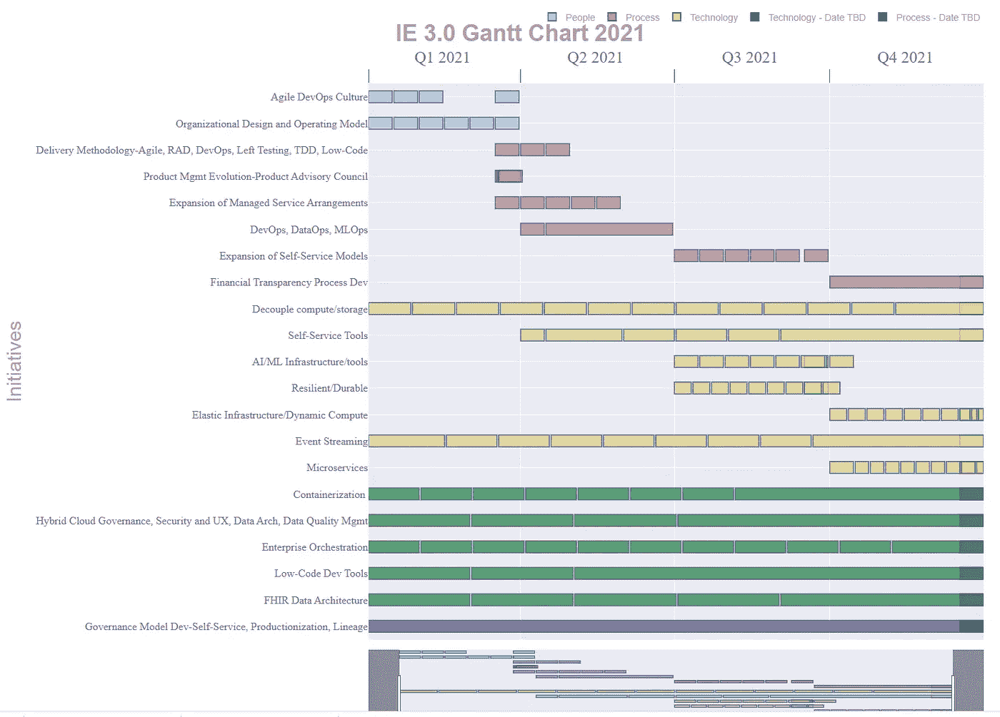
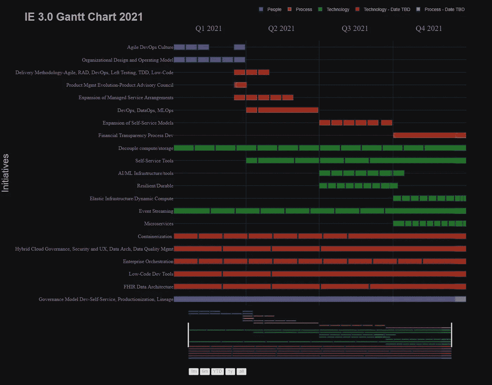
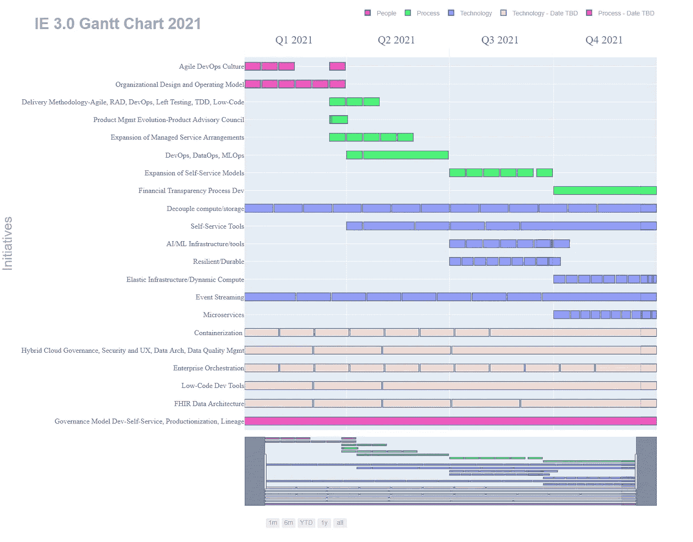

# 用 Python 和 Plotly 制作甘特图

> 原文：<https://blog.devgenius.io/gantt-charts-in-python-with-plotly-e7213f932f1e?source=collection_archive---------0----------------------->



# 目标

我不会给你上甘特图的课。创建它们是为了显示较大计划的单个任务/项目的进展。

由于这真的不是一个令人印象深刻的图表，人们可能不会从中获得太多，我张贴这个的唯一原因是因为许多这些神秘的数字参数相当模糊；很难找到关于其中一些的信息——没有太多的例子。把这个放到网上，因为我想这将会节省一些人在试图修改诸如刻度大小或 xaxis 标签格式时的时间/麻烦。

**提示季度格式不容易找到。基本上就是个黑。*

# 密码

*完整代码在我的 [github](https://github.com/maxwellbade/plotly_gantt_chart) 上。我去掉了类别顺序，因为我需要把上面的图表排列得井井有条，而把那个参数留在这里，就像给代码示例添加了一个小故事，所以我把它去掉了。但是电子表格和 jupyter 笔记本在我的 github 里，如果你想要这个的话。

```
import pandas as pd
import plotly.express as px
import plotly.figure_factory as ff
import plotly.graph_objs as go
import chart_studio
import chart_studio.plotly as py 
import chart_studio.tools as tlsdf = pd.read_csv('gantt_chart_new.csv',encoding='latin1')
df['Start'] = df['Start'].astype('datetime64')
df['Finish'] = df['Finish'].astype('datetime64')
# print(df.dtypes)
# print(df.head())colors = {'Technology' : 'rgb(30,144,255)'
          , 'Technology - Date TBD' : 'rgb(211,211,211)'
          , 'People' : 'rgb(95,158,160)'
          , 'Process' : 'rgb(0,0,128)'
          , 'Process - Date TBD' : 'rgb(211,211,210)'}

orders = list(df['Task'])fig = px.timeline(df
                  , x_start="Start"
                  , x_end="Finish"
                  , y="Resource"
                  , hover_name="Task"
#                   , facet_col="Dimension"
#                   , facet_col_wrap=40
#                   , facet_col_spacing=.99
#                   , color_discrete_sequence=['green']*len(df)
                  , color_discrete_sequence=px.colors.qualitative.Prism
                  , opacity=.7
#                   , text="Task"
                  , range_x=None
                  , range_y=None
                  , template='plotly_white'
                  , height=1200
#                   , width=1500
                  , color='Dimension'
                  , title ="<b>IE 3.0 Gantt Chart 2021</b>"
#                   , color=colors
                 )fig.update_layout(
    bargap=0.5
    ,bargroupgap=0.1
    ,xaxis_range=[df.Start.min(), df.Finish.max()]
    ,xaxis = dict(
        showgrid=True
        ,rangeslider_visible=True
        ,side ="top"
        ,tickmode = 'array'
        ,dtick="M1"
        ,tickformat="Q%q %Y \n"
        ,ticklabelmode="period"        
        ,ticks="outside"
        ,tickson="boundaries"
        ,tickwidth=.1
        ,layer='below traces'
        ,ticklen=20
        ,tickfont=dict(
            family='Old Standard TT, serif',size=24,color='gray')
        ,rangeselector=dict(
            buttons=list([
                dict(count=1, label="1m", step="month", stepmode="backward"),
                dict(count=6, label="6m", step="month", stepmode="backward"),
                dict(count=1, label="YTD", step="year", stepmode="todate"),
                dict(count=1, label="1y", step="year", stepmode="backward"),
                dict(step="all")
            ])
            ,x=.37
            ,y=-.05
            ,font=dict(
                family="Arial",
                size=14,
                color="darkgray"
    )))

    ,yaxis = dict(
        title= ""
        ,autorange="reversed"
        ,automargin=True
#         ,anchor="free"
        ,ticklen=10
        ,showgrid=True
        ,showticklabels=True
        ,tickfont=dict(
            family='Old Standard TT, serif', size=16, color='gray'))

    ,legend=dict(
        orientation="h"
        ,yanchor="bottom"
        ,y=1.1
        ,title=""
        ,xanchor="right"
        ,x=1
        ,font=dict(
            family="Arial"
            ,size=14
            ,color="darkgray"))
)fig.update_traces( #marker_color='rgb(158,202,225)'
                   marker_line_color='rgb(8,48,107)'
                  , marker_line_width=1.5, opacity=0.95)fig.update_layout(
    title="<b>IE 3.0 Gantt Chart 2021</b>",
    xaxis_title="",
#     margin_l=400,
    yaxis_title="Initiatives",
#     legend_title="Dimension: ",
    font=dict(
        family="Arial",
        size=24,
        color="darkgray"
    )
)# fig.show()
fig.write_html("C:/Users/maxwell.bade/Downloads/ie_3_gantt.html")
go.FigureWidget(fig)
```

# 修改颜色序列

`template`和`color_discrete_sequence`是改变图表外观/感觉的两种方式/参数。还有一些方法——如果需要，您当然可以手动更改条形图的颜色，但是下面是一些关于颜色的想法。

使用`dark24`颜色序列:



通过`seaborn`模板使用`safe`颜色序列:



使用带有`D3`颜色序列的`plotly_dark`模板



使用`plotly`默认模板和`Light24`颜色序列:



## 感谢阅读。

**最大值**