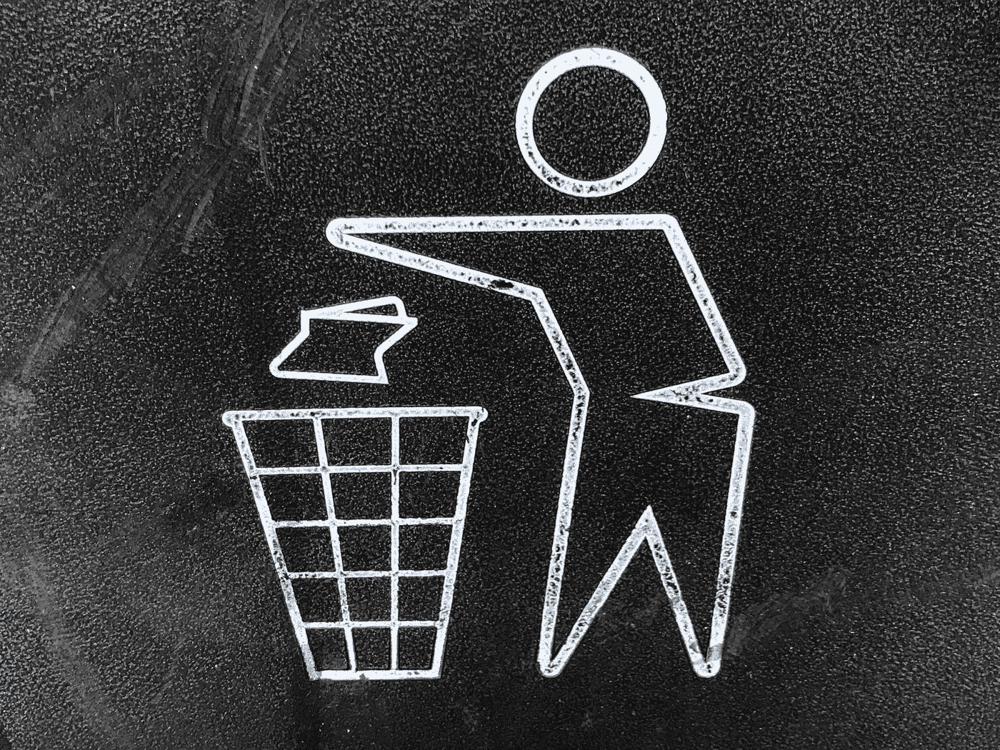

# 垃圾收集:现代编程语言的无名英雄

> 原文：<https://blog.devgenius.io/garbage-collection-the-unsung-hero-of-modern-programming-languages-496f79574ea8?source=collection_archive---------12----------------------->

照片由[陈嘉里](https://unsplash.com/@gary_at_unsplash?utm_source=medium&utm_medium=referral)在 [Unsplash](https://unsplash.com?utm_source=medium&utm_medium=referral) 上拍摄

在许多编程语言中，垃圾收集是一个极其重要的部分(并且经常被低估)。它处理对象的空间分配和释放的基本问题，以前这些都是由 dev(咳咳 C)显式完成的。

在本文中，我们将回顾垃圾识别和删除中使用的一种常见算法，并且我们将讨论垃圾收集过程中的一些关键部分。

垃圾收集可以被认为是两个组件，**识别**和**压缩**，我们可以通过启发式和并发性来优化这两个组件。

## 识别

大多数垃圾收集识别算法都是基于一种称为三色标记的 DFS 图遍历方式。该算法确定从根节点开始的路径不能到达哪些节点。同时，该算法有一个有用的特性，即如果进程暂停，并且在暂停期间添加了新节点，该算法也可以运行(这允许该算法并发运行，因此在 GC 执行其工作时，您的应用程序不需要暂停)。

**算法**

1.  将根节点变为灰色，并将其添加到堆栈中
2.  从堆栈中弹出顶部节点
3.  将与当前节点直接相邻的所有白色节点添加到队列中，并将它们涂成灰色
4.  将节点涂成黑色。如果堆栈不为空，转到步骤 2，否则转到步骤 5
5.  移除所有白色节点

这个垃圾收集算法将对连接到根节点的节点进行 DFS，以获得所有连接的节点(也称为活动对象)。但是我们为什么要给它们上色呢？这就是并发性出现的地方。假设我们已经完全处理了 A，它现在是黑色的，意味着我们将不再处理它，但是如果我们随后从 A 中添加一个新节点(A 有一个对新节点的引用)，那么新节点将被丢弃，因为它将是白色的，没有机会变成灰色。该算法有一个特殊的警告，即你不能从黑色到白色，中间必须总是有灰色。因此，当我们添加这个新节点时，我们会注意到它的父节点是黑色的，并将其颜色设置为灰色(防止删除)。

下面是一个关于识别和删除如何工作的玩具示例，通过连接、节点数量以及算法的停止和开始来更好地理解这个过程。

## 压紧

既然我们已经识别并清除了一些垃圾，我们就需要谈谈压缩。我们需要压缩对象的原因是因为对象在计算机中的存储方式(连续的内存块)。当我们在垃圾收集期间移除未使用的内存时，我们可能会释放空间，但是活动对象的定位不会是最佳的。

例如，假设我们有 1GB 的内存，我们将 4 张照片加载到内存中(每张 250MB)。

*   0–250 MB 的照片 1
*   250–500 MB 的照片 2
*   500–750 MB 的照片 3
*   750–1GB 的照片 4

现在假设照片 2 和 4 被标记为垃圾收集，那么我们有 500MB 的空闲存储空间。我们现在有另一张 500MB 的照片，但是我们不能把它放在内存中，因为我们没有 500MB 的连续部分。这就是为什么我们的垃圾收集算法必须在清理后重新组织对象(通常将相似的老化对象分组在一起)。

## 最优化:世代假说

垃圾收集最好的启发之一是世代假设(对象的生命周期是双模式的，要么很长，要么很短)。

从直觉上讲，大多数对象要么是长期存在的实例状态变量，要么是在 for 循环或 helper 函数中使用的临时变量。分代假设告诉 use，这些较新的对象具有非常高的死亡率，因此应该更频繁地监视垃圾清理，而较旧的对象可以更偶尔地监视。这样我们可以避免在垃圾识别阶段迭代整个对象图。这也是为什么当我们压缩内存时，对象通常是根据活动时间来分组的。

这是许多现代编程语言中垃圾收集工作方式的简要概述。如果你喜欢我的内容，请务必关注我的最新帖子，并查看我的一些旧作品。