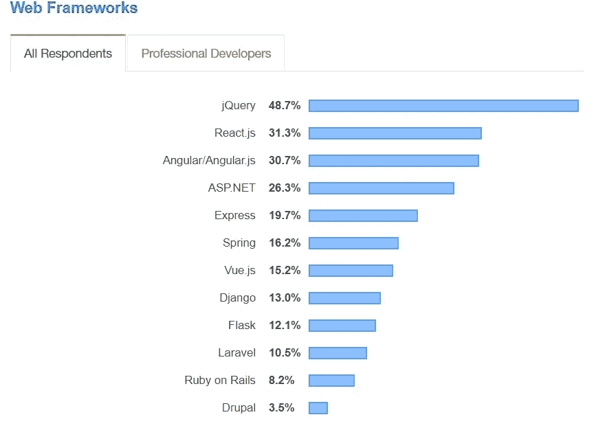

# Garod Ajemian 关于 React.js:世界上使用最多的框架

> 原文：<https://blog.devgenius.io/garod-ajemian-about-react-js-worlds-most-used-framework-91c8c628941d?source=collection_archive---------16----------------------->

据[Statista 2021 年报告](https://www.statista.com/statistics/1124699/worldwide-developer-survey-most-used-frameworks-web/)显示，全球 40.14%的软件开发者和软件开发公司使用 React JavaScript 框架。根据同一来源，截至 2021 年，JavaScript 在世界上最常用的编程语言[中排名第一。](https://www.coderiders.am/blog/top-5-programming-languages-that-will-define-coding)

同时，根据[开发者经济](https://www.developernation.net/blog/infographic-programming-languages-adoption-trends-2020/)的数据，世界上 53%的软件开发者偶尔或经常使用 JavaScript。

正如我们所见，随着 JavaScript 编程语言在过去几年的流行，它的框架 React.js 正在超越软件开发行业。各行各业越来越多的公司决定雇佣 React.js 开发人员。全球 31.3%的专业人士目前使用 React.js 作为他们最常用的框架。React 开发人员的数量正在增加，而越来越多需要定制软件解决方案的软件开发公司或企业开始将 React.js 纳入其产品的主要技术堆栈中。他们从受欢迎的技术中心雇佣软件工程师，选择软件外包或优秀的模型或组建内部团队。

像网飞、PayPal、易贝和 Airbnb 这样的行业巨头雇佣 React.js 开发人员来开发可扩展且易于维护的软件解决方案。

我们在 [CodeRiders](https://www.coderiders.am/) 软件外包公司基于我们客户的需求、过去的经验和市场调查做了一个小小的探索。我们都相信 React.js 将在未来几年统治国际 IT 行业。

我们还决定对我们的前端开发人员之一 Garod Ajemian 进行一次简短的采访。Garod 是一名年轻的软件开发人员，他热爱编程，学习新技术，从事复杂的项目，并与来自不同国家和文化背景的客户交流。他一直在用 JavaScript、React.js 和 Vue.js 从事多个项目。

加洛德将讲述:

●他作为软件开发人员(前端开发人员)的经历，

●他在最受欢迎的软件外包目的地或技术中心之一(亚美尼亚)的经历，

React.js 的优缺点，

●他对软件开发未来的看法。

你好，加洛德。感谢您花时间分享您作为软件开发人员的知识和经验。首先，请代表你自己。

*   我是黎巴嫩亚美尼亚人。我在贝鲁特出生和长大，大部分时间在黎巴嫩度过。所以，我在多元文化的环境中长大。回到学校，我最喜欢的科目是数学和物理。更不用说我从第一天起就痴迷于技术。高中毕业后，我有两个专业，计算机科学和机械工程。最后，我决定继续学习计算机科学，因为我计划搬到亚美尼亚的埃里温。我学的是软件开发，在贝鲁特做了一段时间前端开发，然后搬到了埃里温。

- **你决定成为一名软件开发人员，亚美尼亚和你有什么关系？**

-亚美尼亚是南高加索地区的一个小国。许多人不太了解亚美尼亚，因为它很小。然而，随着年龄的增长，我听到越来越多的人认识到我的历史故乡是一个非常著名的技术中心。这是一次非常激动人心的经历。我很高兴听到人们谈论亚美尼亚。同样令人印象深刻的是，一个小国能够如此成功地在国际信息产业中找到自己的位置。我们正在谈论这样的巨人，如美国、加拿大、澳大利亚、新西兰、中国、印度、欧洲和亚洲国家、南非、拉丁美洲国家等。这些国家的软件开发商总数超过了亚美尼亚的总人口(250 万人)，但亚美尼亚与这些国家并驾齐驱。这真是太棒了。因此，我将自己对计算机科学的热情和居住在我的故土的梦想结合起来，做出了一个看似完美的决定，成为一名软件开发人员，并搬到了亚美尼亚。

两年前我搬到了埃里温。一安顿下来，我就开始在招聘网站上搜索前端软件开发员的工作。有一天，我还决定寻找亚美尼亚排名前 10 的软件开发公司。我就是这样遇到 CodeRiders 的。尽管他们没有职位空缺，我还是寄出了我的作品集和简历，因为我觉得我会和团队相处得很好。他们很快回复了我的邮件，并安排了对我的采访。我与 CodeRiders 的首席执行官和业务发展总监进行了交谈。我当时只专攻前端开发，所以他们建议有一个试用期，期间他们也会教我后端开发。我当即同意加入团队，两个月后，我正式成为一名 CodeRider。

- **让我们谈谈 CodeRiders。你喜欢 CodeRiders 的什么，你是怎么知道你会和团队相处的？**

我在联系 CodeRiders 之前做了一些调查。我查看了他们的社交媒体，看到了团队活动和图片，查看了他们的网站，并阅读了他们的一些文章。我们一生中都至少有过一次这种直觉，对吗？当你确定某样东西适合你时，那就是你的风格。这就是发生在我身上的事，我没有错。从一开始，当他们联系我进行在线面试时，我就知道这会成功。当我们开始交谈时，我注意到他们不想雇用只做他/她的工作的软件开发人员。他们对我的经历和知识真的很感兴趣，并试图找出我们可以互相帮助的方法。

从第一天开始，我就觉得我加入了一个新的家庭。这里的人们互相关心，总是乐于助人。另一方面是信任。CodeRiders 把员工当成大家庭的一员，然后给他们自由。这是一个惊人的技术。确实有效。员工的工作时间很灵活，可以在任何方便的地方工作，工作质量不会受到影响。所以，首先，[团队精神](https://www.coderiders.am/blog/5-powerful-facts-about-team-spirit-in-software-companies)，家庭般的氛围，信任，然后是自由和灵活性。

- **你目前专注于哪些软件开发技术，你特别喜欢它们的哪些方面？**

*   我目前专注于前端开发，这是一个应用程序的设计和功能的开发。至于技术，我主要使用 React.js 和 Vue.js，我最喜欢它们的地方是它们使用基于组件的开发，这有助于加速和方便整个[软件开发生命周期(SDLC)](https://www.coderiders.am/blog/what-is-software-development-lifecycle-stages-and-importance) 。基于组件的开发是独立创建网站的每个部分，就像乐高积木一样在多个地方重用它们。

构建和实现健壮的产品对我来说是一个巨大的“必须”。这是我职业生涯哲学的一部分。我对使用 React.js 感到很满意，尤其是在重用组件的时候。我不必为特定功能创建新组件。相反，我可以使用现有的组件，并专注于该组件的可重用性。这是惊人的，因为它节省了大量的时间。我不必从头再来。同时，我可以在处理多个项目时保持一致性。

我们都知道，所有企业，无论其规模、行业和目标如何，都希望快速取得成效。除了交付无错误的代码，您还应该按时满足客户。有了 React.js，可以在给定的预算内按时完成项目。我认为，除了简单、易于学习、用户友好、组件和可重用性之外，这也在它的流行中发挥了作用。此外，当您使用 Vue.js 时，软件开发过程会更快、更简单，因为它使用模板。它非常适合简单的项目和小应用程序，当复杂性增加时，最好选择“反应”。所以，我明白了为什么 React.js 已经成为世界上最常用的框架。

- **软件开发的未来是什么，哪些技术将统治信息技术行业？**

-总体而言，软件开发是未来。我认为科技世界永远不会停止增长。至于技术，我不能告诉你哪些技术将统治信息技术行业，因为每一两年，我们都会得到一些新技术。但有一点我可以向你保证，在接下来的几十年里，JavaScript (JS)将继续是前端开发中最常用的编程语言。我相信它甚至可能在机器学习和数据分析方面与 Python“竞争”。它无处不在，存在于多个领域，例如:

前端开发，

后端开发，

移动应用开发([混合和本地移动应用开发](https://www.coderiders.am/blog/reasons-to-choose-hybrid-mobile-app-development-over-native))，

使用 Angular.js、React.js 和 Vue.js 进行 PWA(渐进式网络应用程序)开发。

- **我们已经讨论了 React.js 现在如此受欢迎的原因。但是，总而言之，您能列举一下 React.js 的一些优点和缺点吗？**

这些是 reactor . js 框架的主要优点和缺点，我想所有的 reactor . js 开发人员都知道:

**反应式 JS 的优势:**

软件开发人员很容易学习和理解，因为它有很好的培训资源和多种教程。当您知道 JavaScript 时，学习起来特别容易和快速，

React.js 有一套方便的工具，

由于其可重用的组件，开发速度很快，

React.js 管理一个处理 HTML、XML 或 XHTML 的虚拟 DOM。

在本地工具的帮助下易于测试，

reactor . js 支持构建机器可读代码，同时，使用 reactor . js 可以很容易地创建动态 web 应用程序，

搜索引擎优化友好。

**反应式 JS 的缺点:**

仅涵盖应用程序的前端开发，

使用 JSX，它是 HTML 和 JS 的结合。

- **您认为使用 React.js 技术会给哪些项目带来好处？**

-虽然 React.js 应用程序可以在放大各种搜索引擎导航的服务器上运行，但我认为 React JS 的最佳用途是创建内容管理网站，因为这类网站不需要 SEO 友好性。内容管理系统雇佣 React.js 开发人员也是出于这个原因。SEO 是搜索引擎优化，它帮助你的网站出现在用户的搜索中。如果你喜欢 SEO，也就是说你想开发一个电子商务网站，你需要使用 Next JS，一个解决 SEO 问题的 React 框架。

- **你能描述一下你目前在 CodeRiders 软件开发公司的项目吗？**

-我目前在一家投资网站工作。客户来自德国。我做前端开发，用的是 Vue JS，也是 JavaScript 框架。我的主要职责是创建新页面，并为它们编写自动化测试。我们在开发过程中使用 Scrum 方法，这是一套让你的开发过程更好的规则或实践。

- **你如何处理与客户的远程沟通？**

Slack 和 Google Meet 促进了开发者和客户之间的交流。我们还每天与开发人员开会，快速地相互通报我们工作的进程。我们使用敏捷方法，这对于没有固定[工作范围](https://www.coderiders.am/white-papers/how-to-write-a-solid-scope-of-work)的项目来说非常方便。

 [## 如何撰写可靠的工作范围| code riders 白皮书

### 里面是什么？

www.coderiders.am](https://www.coderiders.am/white-papers/how-to-write-a-solid-scope-of-work) 

你能谈谈你在 CodeRiders 的日常工作以及你和队友的关系吗？

-正如我前面提到的，我们的工作时间非常灵活。我更喜欢在办公室工作，因为在办公室我有很多方法来放松心情。例如，如果我被困在一个问题上，我会快速休息一下，享受玩台球、婴儿足或游戏机的乐趣。还有，我的队友总是乐于助人。我之前也提到过，我和我的团队感觉就像一家人。这是因为我们不仅一起工作，我们还一起策划公司活动。

- **你一直以来最喜欢的项目是哪个，为什么？**

我一直最喜欢的项目是我目前的项目，因为我有了更多的责任，也学到了很多新东西。比如我从零开始自己开发所有的页面，再加上学会了写自动化测试。

- **为了未来，你最有兴趣学习哪些技术？**

-作为软件开发人员，学习新技术是我们必须的，因为这个行业每天都在发展，你应该随时保持自己的更新，以便与它一起成长。目前，我正在学习 web3.0 和 solidity，这是将加密货币世界融入软件开发的技术。

-**Garod，感谢你分享你作为软件开发人员的经验以及你对当前 IT 行业的了解。**

此外，最后一句话，所有这些优势使 React.js 成为世界上最常用的框架，雇佣 React.js 开发人员也非常实惠。

在受欢迎的软件外包目的地或技术中心，如亚美尼亚，React.js 普通开发人员的时薪在 30-80 美元之间，取决于开发人员的资历。而世界各地的总体情况却大不相同。例如，基于一个国家的 React 软件工程师的平均年薪是[如下](https://www.payscale.com/research/US/Skill=React.js/Salary):

●瑞士:127.011 美元

●美国:92.232 美元

●英国:78.528 美元

订阅我们的每月时事通讯，阅读更多类似的文章。

*要了解更多关于 CodeRiders 服务或解决方案的信息，我们建议通过将您的问题发送给我们***与我们的业务开发团队取得联系。**

* [## 软件开发公司-联系我们| CodeRiders

### 让我们谈谈您在定制软件开发、网页开发和设计、软件外包方面的业务需求…

www.coderiders.am](https://www.coderiders.am/contact-us)*