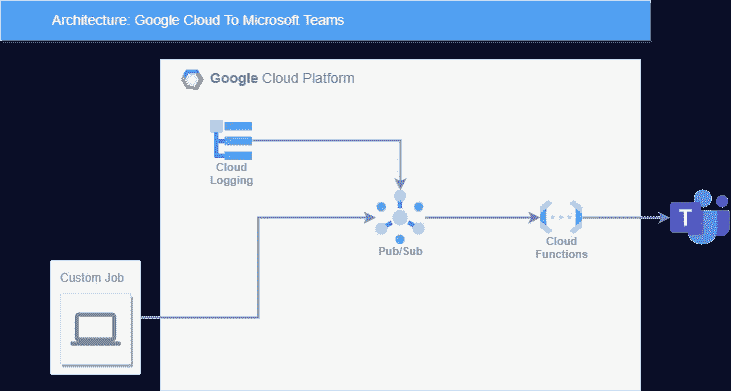
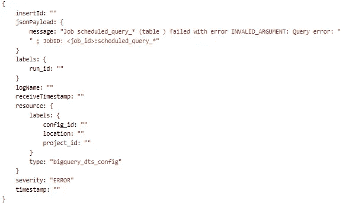
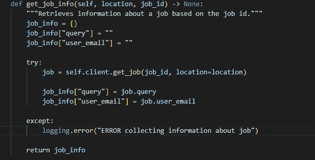
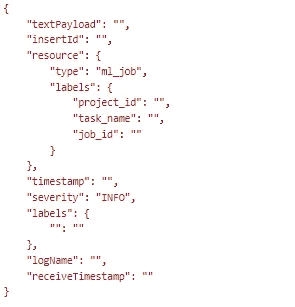
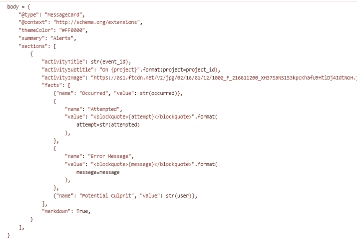
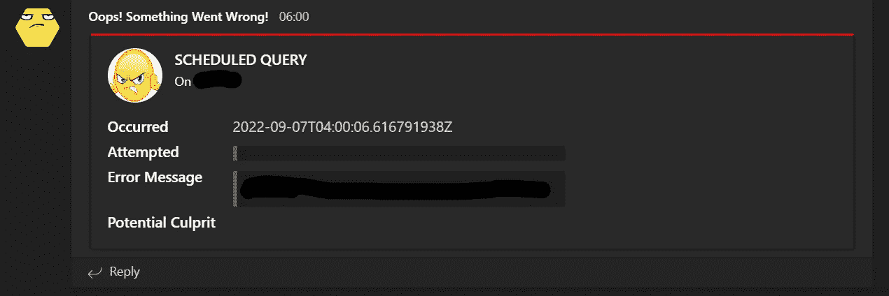

# GCP |警报！告诉微软团队你在 GCP 的工作失败了

> 原文：<https://blog.devgenius.io/gcp-alert-tell-microsoft-teams-your-gcp-job-failed-35d3f3d04b53?source=collection_archive---------7----------------------->

如果计划查询、计划笔记本或任何自定义作业失败，可以使用以下系统提醒团队成员。

概述在作业失败时通过 Microsoft 团队向团队成员发出警报的流程的图表

# 概要

错误消息从接收器作业(日志路由器)或自定义作业发送到发布/订阅主题，然后发布/订阅主题将消息发送到云函数，云函数将对消息进行处理并将其传递到团队通道。

# 把所有的放在一起

在自定义作业的情况下，您希望发送警报(例如，发出数字不平衡、未返回数据、引发异常等信号。)设置一个定制的模板来格式化消息(警报)是最理想的。通过这种方式，团队成员知道他们应该在将消息发布到云发布/订阅主题之前对其进行格式化。

例如，由于我使用日志路由器接收错误日志，这些日志通常格式化如下:

{
资源:{
类型:<日志 _ 类型>
}
错误 _ 消息:……
}

对于**自定义作业**警报，以 json 消息的形式发送更有意义，该消息的结构如上，log_type 设置为“custom_job_alert”或类似的内容。然后检查云函数中的条件，并适当地处理消息。

对于预定的查询和预定的笔记本，我在**云日志**中使用日志路由器来创建一个接收作业，将特定的错误日志接收到一个发布/订阅主题。日志路由器中的日志查询如下所示:

日志路由器包含过滤器

resource . type = " big query _ dts _ config "和 severity="ERROR "返回在计划查询失败后立即创建的日志。这很方便，特别是如果预定查询在服务帐户下运行，并且不能像 BigQuery 允许的那样通过电子邮件通知实际用户。

resource.type="ml_job "和 severity="INFO "和 textPayload="Job Failed。"然后会返回 Vertex AI 平台上失败的作业。在我们的案例中，我们监控失败的预定笔记本电脑，它们在 Vertex AI 平台下运行。“INFO”严重性的原因是，根据观察，当作业失败时，它似乎是唯一生成的单一日志。如果将 severity 设置为“error ”,那么有许多错误日志会令人头疼。

当谈到该管道的**发布/订阅主题**时，它的主要功能是充当等待(和监听)错误消息的天线，以便传递错误消息进行处理。在设置日志路由器将日志接收到该主题后，接收作业使用的服务帐户需要作为主体添加到该发布/订阅主题中。否则，发布/订阅将不会收到消息。

最后，当消息到达**云函数**进行处理时，它首先被解码。之后，我将继续检查资源。键入并相应地处理日志。计划笔记本和计划查询的日志没有太多相似之处。对于包含过滤器(即日志路由器中的查询)，这些是返回的日志类型的示例。

计划查询错误日志的示例

处理该日志时，您可以使用错误消息中的时间戳和 job_id。使用这个 job_id，您可以提取额外的信息，比如调度作业的用户或服务帐户，甚至是用户试图使用 BigQuery API 运行的查询。

所以大致是这样的:

关于如何使用 BigQuery API 获取更多作业信息的片段(更多信息请参考[文档](https://cloud.google.com/bigquery/docs/managing-jobs#python_1))

然后是计划笔记本的日志:

预定笔记本错误日志示例

使用上面的日志，获取 job_id 要容易得多。因为这是一个“ml_job ”,所以使用 aiplatform API 来提取关于该作业的更多信息是理想的。在这种情况下，它被视为自定义作业，因此代码如下所示:

关于如何使用 aiplatform API 获取更多作业信息的片段(更多信息请参考[文档](https://cloud.google.com/python/docs/reference/aiplatform/latest/google.cloud.aiplatform_v1.services.job_service.JobServiceClient))

您可以轻松地在发送到团队频道的警报中挑选您想要包含的信息。

为了实际发送消息，我采用了 webhook 方法。在**中，团队**创建了一个单独的通道，并添加了一个 webhook 连接器。这是通过点击频道旁边的三个点，导航到连接器，然后搜索“传入的 Webhooks”来完成的。设置网页挂钩并复制给定的聊天室网址。

这个 url 是发布消息的终点。这个端点将一个模板作为数据参数。这是一个示例模板(点击了解更多关于团队、webhooks 和其他酷模板的信息):

片段连接器消息模板

然后，使用 Python 的“请求”库将该模板发布到聊天室的 url，如下所示:

requests . post(URL = self . chat _ URL，data=json.dumps(body)，headers = { " Content-Type ":" application/JSON " })

然后产生一个团队消息，看起来像这样:

使用上述模板的团队中的通知示例

维奥拉。一个警报系统，如果计划的查询或计划的笔记本使用云日志失败，该系统会进行检测。此外，为用户可能希望收到警报的其他检查和平衡发送自定义警报。