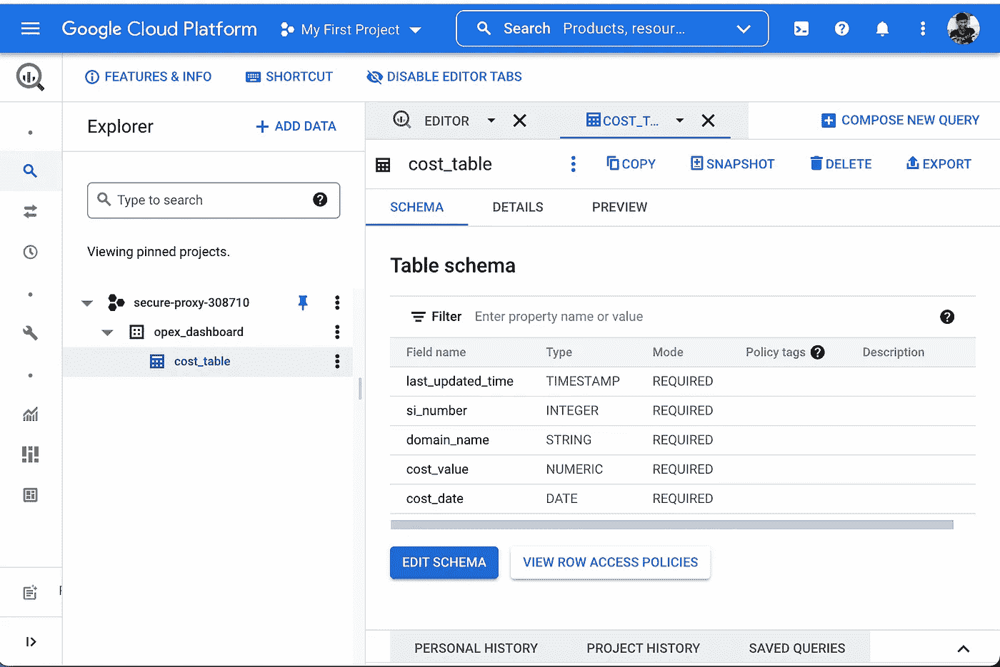
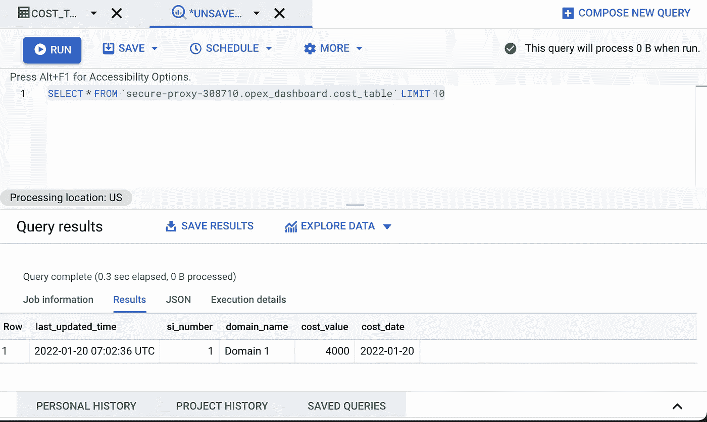

# GCP 大查询——编写我的第一个 Python 连接器

> 原文：<https://blog.devgenius.io/gcp-big-query-writing-my-first-python-connector-1140b022b88a?source=collection_archive---------10----------------------->

这篇博客是我们从零开始讨论**云**概念的系列文章的一部分，面向的是入门知识有限的读者。这篇文章属于*初级*系列，因为它涉及到理解 [**大型查询**](https://cloud.google.com/bigquery) 数据库对于仓储和业务分析需求的工作。

云系列中的一些早期博客如下。

[**云上治理 Azure**](/how-to-automate-cloud-governance-on-azure-f392bd971f2f)[**AWS-安全-自动化**](https://medium.com/r?url=https%3A%2F%2Fblog.devgenius.io%2Fcustom-docker-bridge-networks-how-to-run-containers-b8d40c51bab2)[**自定义 Docker 桥接网络**](/custom-docker-bridge-networks-how-to-run-containers-b8d40c51bab2)


# **什么是 GCP 大查询？**

作为一个完全托管的无服务器企业数据库，Big Query 是满足客户数据仓库/分析需求的一站式解决方案。它既有云控制台，也有查询命令行工具接口，还提供大多数通用语言的 SDK，如 Java、Python 等，用于编程访问。

它具有标准的 SQL 支持，可以创建表并使用标准查询从表中查询数据。然而，这种可水平伸缩的数据库完全是 GCP 本地的，不属于具有原子事务支持的数据库。

# **项目、数据集、表格。**

**项目**是所有大型查询数据集/数据驻留的超级父容器。一个 GCP 帐户可以通过角色和权限控制多个项目的访问。

**数据集**是表的逻辑分组，类似于 RDMS 术语中的传统数据库。它根据初始化期间创建数据的区域来控制数据的物理位置。在大查询中，来自多个云位置的表不能连接在一起进行查询操作。

**表**是类似关系实体的数据容器，如*客户、产品等*。它以行和列的形式存储数据；列定义通过数据库模式来维护。可以在空表上创建数据库模式，也可以在表中加载示例数据后填充数据库模式。



**大查询云控制台视图**

在上面的例子中，

*secure-proxy-308710* 为项目，
OPEX _ dashboard 为数据集，
*cost_table* 为右侧字段为 schema 的表格。

# 简单的大型查询操作

## **前置要求**

**Gcloud Cli**

从[https://cloud.google.com/sdk/docs/install](https://cloud.google.com/sdk/docs/install)安装档案。
运行以下命令

```
./google-cloud-sdk/install.sh
```

**Python 库**

```
pip install google-cloud-bigquery
```

从 *gcloud* cli 工具中，运行以下命令登录并设置父项目。

```
**Login** gcloud auth application-default login**Configuring a Project**
gcloud config set project PROJECT_ID
```

## **列出项目中的所有数据集。**

以下代码片段用于遍历 GCP 帐户默认项目中的所有可用数据集。

## **创建数据集**

为了从头开始创建一个新的数据集，在下面的模块中将**数据集**的名称作为 *dataset_id* 进行传递。

## **创建带有模式的表格**

要创建具有预定义模式的空表，需要两个属性，完整的表名(例如**secure-proxy-308710 . OPEX _ dashboard . cost _ table**)作为 *table_id* ，以及存储数据所需的列的模式。

在下面的例子中，模式由**整数、字符串、数字、数据**数据类型组成，将*多云支出*数据集中存储到一个大的查询表中。

## **向表格中添加行。**

使用大查询 SDK 中的 *client.insert_rows()* 操作，可以使用上面定义的模式将行形式的数据插入到表中。

## 查询数据

**使用云控制台**

在查询编辑器中，键入选择查询以获取操作所需的数据。



**从云端控制台查询数据**

**使用 Python SDK。**

**输出**

```
The query data:Row((datetime.datetime(2022, 1, 20, 7, 2, 36, tzinfo=datetime.timezone.utc), 1, 'Domain 1', Decimal('4000'), datetime.date(2022, 1, 20)), {'last_updated_time': 0, 'si_number': 1, 'domain_name': 2, 'cost_value': 3, 'cost_date': 4})
```

## 额外资源

[](https://github.com/amit894/copex-dashboards) [## GitHub-Amit 894/copex-Dashboards:跟踪 AWS/Azure/GCP 成本的仪表板

### 此时您不能执行该操作。您已使用另一个标签页或窗口登录。您已在另一个选项卡中注销，或者…

github.com](https://github.com/amit894/copex-dashboards) 

*如需反馈，请留言至****Amit[dot]894[at]Gmail[dot]com****或联系*[*https://about.me/amit_raj*](https://about.me/amit_raj)*的任何链接。*